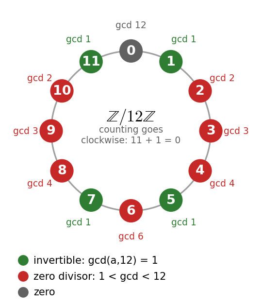
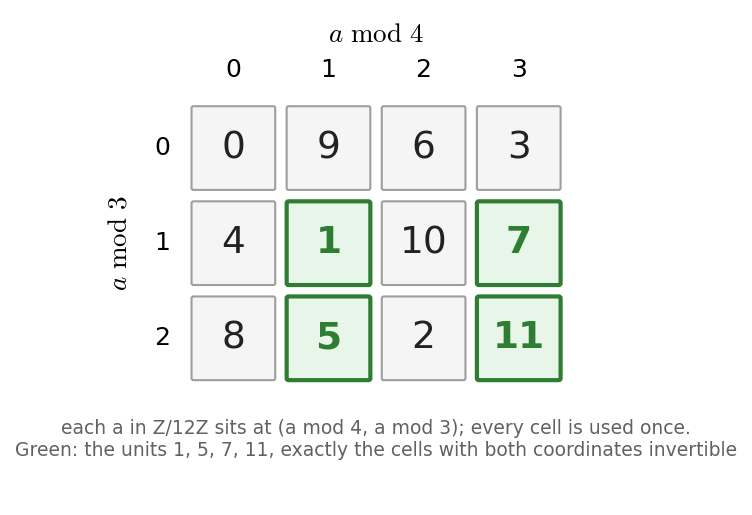
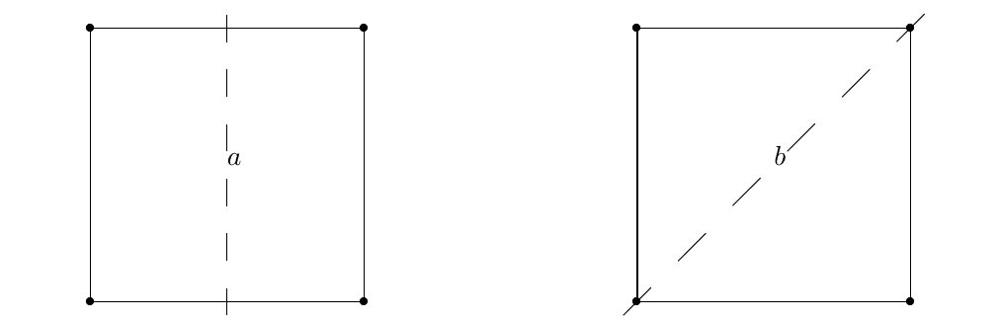
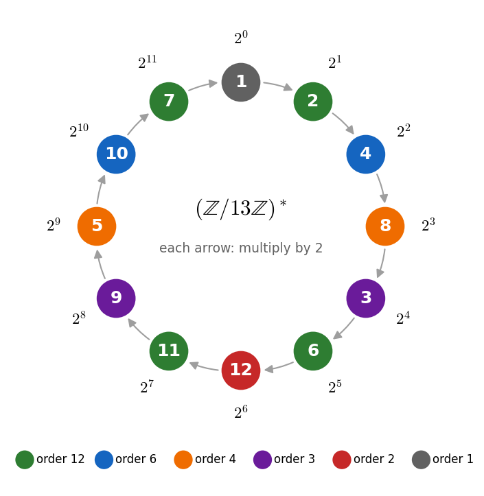
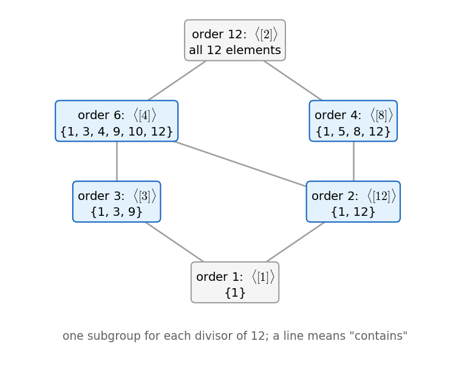
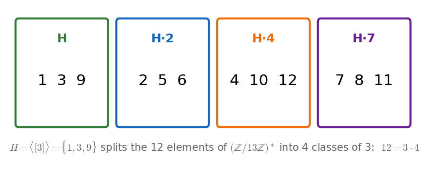
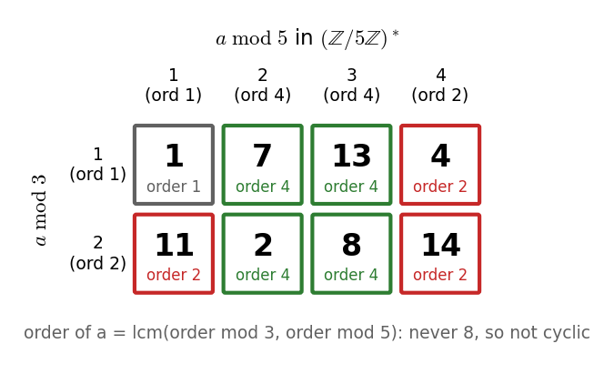

# Cryptography: summary

Based on the lecture notes by J. van Bon. The numbering follows the notes, so you can
compare the two side by side. Every proof follows the same steps as the notes; where a step
is not obvious, there is an extra explanation or a worked example.

**Progress:** sections 1.1 to 1.4 are covered; the rest of the syllabus is still to do.

The notes have almost no pictures. The diagrams marked *Not in the notes* were drawn for this summary, to visualize the examples of the notes.

## Contents

1. Algebra
   - [1.1 Basic notions](#11-basic-notions)
   - [1.2 The ring Z/mZ](#12-the-ring-zmz)
   - [1.3 Direct products and homomorphisms](#13-direct-products-and-homomorphisms)
   - [1.4 Groups](#14-groups)
   - 1.5 Polynomial rings _(to do)_
   - 1.6 Finite fields _(to do)_
   - 1.7 Linear algebra revisited _(to do)_
   - 1.8 Prime numbers _(to do)_
2. Cryptography
   - 2.1 Basic notions _(to do)_
   - 2.2 AES _(to do)_
   - 2.3 RSA _(to do)_
   - 2.4 ElGamal _(to do)_
   - 2.5 Elliptic curves _(to do)_
3. [Cheat sheet](#cheat-sheet)

---

# 1. Algebra

The first part builds, one step at a time, the tools needed for the cryptosystems of part 2.
Sections 1.1 to 1.3 lead to one goal: understanding which elements are invertible modulo $n$,
and how many there are. This is exactly what RSA relies on.

## 1.1 Basic notions

### Binary operations

A **binary operation** on a set $X$ is a map $\ast : X \times X \to X$: it takes two elements of $X$ and
returns one element of $X$. We write $a \ast b$ for the result. It is

- **associative** if $a \ast (b \ast c) = (a \ast b) \ast c$ for all $a, b, c \in X$;
- **commutative** if $a \ast b = b \ast a$ for all $a, b \in X$.

Addition and multiplication on $\mathbb{Z}$, $\mathbb{Q}$ and $\mathbb{R}$ are both associative and commutative.
Two examples where commutativity fails:

- **Composition of functions.** On the set of functions $f : A \to A$, $(f \circ g)(a) = f(g(a))$ is associative,
  but in general $f \circ g \neq g \circ f$. For instance, on $\mathbb{R}$ with $f(x) = x + 1$ and $g(x) = 2x$:
  $f(g(x)) = 2x + 1$, while $g(f(x)) = 2x + 2$.
- **Matrix product.** On $M_n(\mathbb{R})$, the $n \times n$ real matrices, the product is associative
  but not commutative when $n \ge 2$. The sum of matrices is both.

### Semigroups and monoids

A **semigroup** $(H, \ast)$ is a set with an *associative* binary operation. It is commutative if $\ast$ is,
and finite if $H$ is finite.

Examples: $(\mathbb{Z}, +)$, $(\mathbb{Z}, \cdot)$, $(M_n(\mathbb{R}), +)$, $(M_n(\mathbb{R}), \cdot)$, and
$(n\mathbb{Z}, +)$, $(n\mathbb{Z}, \cdot)$, where $n\mathbb{Z} = \lbrace na : a \in \mathbb{Z} \rbrace$ are the multiples of $n$.

An element $e \in H$ is **neutral** if $a \ast e = e \ast a = a$ for every $a \in H$.
If $\ast$ is commutative, checking $a \ast e = a$ is enough, because then $e \ast a = a \ast e = a$ too.

| Semigroup | Neutral element |
|---|---|
| $(\mathbb{Z}, +)$ | $0$ |
| $(\mathbb{Z}, \cdot)$ | $1$ |
| $(M_n(\mathbb{R}), +)$ | the zero matrix $0_n$ |
| $(M_n(\mathbb{R}), \cdot)$ | the identity matrix $I_n$ |
| $(n\mathbb{Z}, +)$ | $0$ |
| $(n\mathbb{Z}, \cdot)$ with $n \ge 2$ | none |

*Why does $(n\mathbb{Z}, \cdot)$ have no neutral element?* Take $n = 2$. A neutral $e$ would need $e \cdot 2 = 2$,
so $e = 1$. But $1$ is not even, so $1 \notin 2\mathbb{Z}$.

**Lemma 1.1.1.** A semigroup has at most one neutral element.

*Proof.* Let $e_1$ and $e_2$ both be neutral. Compute $e_1 \ast e_2$ in two ways:
since $e_2$ is neutral, $e_1 \ast e_2 = e_1$; since $e_1$ is neutral, $e_1 \ast e_2 = e_2$. So $e_1 = e_2$. ∎

A **monoid** $(H, \ast, e)$ is a semigroup with neutral element $e$. When there is no ambiguity we just write $H$.
Examples: $(\mathbb{Z}, +, 0)$ and $(\mathbb{Z}, \cdot, 1)$ are commutative monoids;
$(M_n(\mathbb{R}), \cdot, I_n)$ is a non-commutative monoid for $n \ge 2$.

### Invertible elements

In a monoid $(H, \ast, e)$, an element $a$ is **invertible** if there is $b \in H$ with $a \ast b = b \ast a = e$.

| Monoid | Invertible elements |
|---|---|
| $(\mathbb{R}, +, 0)$ | all ($a$ has inverse $-a$) |
| $(\mathbb{R}, \cdot, 1)$ | all except $0$ ($a$ has inverse $1/a$) |
| $(\mathbb{Z}, +, 0)$ | all |
| $(\mathbb{Z}, \cdot, 1)$ | only $1$ and $-1$ (for example $1/2 \notin \mathbb{Z}$) |
| $(M_n(\mathbb{R}), \cdot, I_n)$ | the invertible matrices (determinant $\neq 0$) |

**Lemma 1.1.2 (cancellation law).** Let $a$ be invertible. If $a \ast b = a \ast c$, then $b = c$.

*Proof.* Let $u$ be such that $a \ast u = u \ast a = e$. Then

$$b = e \ast b = (u \ast a) \ast b = u \ast (a \ast b) = u \ast (a \ast c) = (u \ast a) \ast c = e \ast c = c.$$

The idea is to "multiply by $u$ on the left" on both sides; associativity lets us move the brackets. ∎

> [!WARNING]
> The hypothesis "$a$ invertible" is essential. Modulo 30: $5 \cdot 6 = 30 \equiv 0$ and $5 \cdot 12 = 60 \equiv 0$,
> so $5 \cdot 6 \equiv 5 \cdot 12$. Yet $6 \not\equiv 12$: we cannot cancel the 5, because 5 has no inverse modulo 30.

**Lemma 1.1.3.** An invertible element has exactly one inverse.

*Proof.* Let $b_1$ and $b_2$ both be inverses of $a$. Then $a \ast b_1 = e = a \ast b_2$.
Since $a$ is invertible, the cancellation law gives $b_1 = b_2$. ∎

So we can speak of *the* inverse of $a$, written $a^{-1}$.

**Lemma 1.1.4.** In a monoid $(H, \ast, e)$, for $a, b \in H$:

1. $e$ is invertible;
2. if $a$ and $b$ are invertible, then $a \ast b$ is invertible, with inverse $b^{-1} \ast a^{-1}$;
3. if $a$ is invertible, then $a^{-1}$ is invertible, with inverse $a$;
4. the set $H^\ast = \lbrace a \in H : a \text{ invertible} \rbrace$, with the same operation, is a monoid in which every element is invertible.

*Proof.*

1. $e \ast e = e$, so $e$ is its own inverse: $e^{-1} = e$.
2. We check that $b^{-1} \ast a^{-1}$ works as an inverse, on both sides, moving brackets with associativity:

   $$(a \ast b) \ast (b^{-1} \ast a^{-1}) = a \ast (b \ast b^{-1}) \ast a^{-1} = a \ast e \ast a^{-1} = a \ast a^{-1} = e,$$

   $$(b^{-1} \ast a^{-1}) \ast (a \ast b) = b^{-1} \ast (a^{-1} \ast a) \ast b = b^{-1} \ast e \ast b = b^{-1} \ast b = e.$$

   The order is reversed, like putting on socks and then shoes: to undo it, you take off the shoes first.
   With matrices, $(AB)^{-1} = B^{-1}A^{-1}$, and in general $A^{-1}B^{-1}$ would be wrong.
3. The equalities $a \ast a^{-1} = e$ and $a^{-1} \ast a = e$ say that $a$ is an inverse of $a^{-1}$. So $(a^{-1})^{-1} = a$.
4. We need three things.
   - $\ast$ is an operation *on $H^\ast$*: if $u, v \in H^\ast$, then $u \ast v \in H^\ast$ by point 2.
   - The neutral element belongs to $H^\ast$: by point 1.
   - Every $u \in H^\ast$ is invertible *inside* $H^\ast$: its inverse $u^{-1}$ is in $H^\ast$ by point 3. ∎

A **group** is a monoid in which every element is invertible; a commutative group is also called **Abelian**.

- $(\mathbb{Z}, +, 0)$ is an Abelian group; $(\mathbb{Z}, \cdot, 1)$ is not a group (2 has no inverse).
- By point 4 above, **for any monoid $H$, $(H^\ast, \ast, e)$ is a group.**
- $(M_n(\mathbb{R})^\ast, \cdot, I_n)$, the invertible matrices, is a non-Abelian group for $n \ge 2$.
- $\mathbb{Z}^\ast = \lbrace 1, -1 \rbrace$ is an Abelian group with 2 elements. Its multiplication table:

| $\cdot$ | $1$ | $-1$ |
|---|---|---|
| $1$ | $1$ | $-1$ |
| $-1$ | $-1$ | $1$ |

### Rings

A **ring** $(R, +, \cdot)$ is a set with two binary operations such that

- $(R, +)$ is an Abelian group;
- $(R, \cdot)$ is a semigroup;
- **distributivity** holds on both sides: $u(v + w) = uv + uw$ and $(u + v)w = uw + vw$.

The ring is **commutative** if $\cdot$ is commutative, and it is a **ring with identity** if $(R, \cdot)$ has a neutral element.

| Ring | Commutative | Identity |
|---|---|---|
| $\mathbb{Z}$, $\mathbb{R}$ | yes | yes ($1$) |
| $M_n(\mathbb{R})$, $n \ge 2$ | no | yes ($I_n$) |
| $6\mathbb{Z}$ | yes | no (same reason as $2\mathbb{Z}$ above) |

Notation in a ring:

- $0$ is the neutral element of $+$ (the **zero**); $-u$ is the inverse of $u$ for $+$ (the **opposite**);
- $1$ is the neutral element of $\cdot$ (the **identity**), if it exists;
- "invertible" always refers to **multiplication**, and $u^{-1}$ is the multiplicative inverse;
- $R^\ast = \lbrace u \in R : u \text{ invertible} \rbrace$. By Lemma 1.1.4, $(R^\ast, \cdot, 1)$ is a group.

**Lemma 1.1.5.** In a ring with identity, for all $a, b$:

1. $a \cdot 0 = 0 \cdot a = 0$;
2. $a \cdot (-b) = -(a \cdot b) = (-a) \cdot b$;
3. $(-a) \cdot (-b) = a \cdot b$;
4. $(-1) \cdot a = -a$.

These are the familiar rules of arithmetic. The point is that they follow from the axioms alone,
so they hold in *every* ring, including $\mathbb{Z}/m\mathbb{Z}$ and matrix rings.

*Proof.* Remember that $(R, +, 0)$ is a commutative group, so the cancellation law holds for $+$.

1. Since $0 + 0 = 0$, distributivity gives $a \cdot 0 + a \cdot 0 = a \cdot (0 + 0) = a \cdot 0 = a \cdot 0 + 0$.
   Cancelling $a \cdot 0$ on the left of both sides (cancellation law for $+$): $a \cdot 0 = 0$. The same works for $0 \cdot a$.
2. By point 1, $a \cdot (b + (-b)) = a \cdot 0 = 0$. By distributivity the left side is $a \cdot b + a \cdot (-b)$.
   So $a \cdot b + a \cdot (-b) = 0$: this says that $a \cdot (-b)$ is the opposite of $a \cdot b$, that is $a \cdot (-b) = -(a \cdot b)$.
   In the same way, $(-a) \cdot b = -(a \cdot b)$.
3. Apply point 2 twice: $(-a) \cdot (-b) = -((-a) \cdot b) = -(-(a \cdot b))$.
   The opposite of the opposite of $x$ is $x$ itself (Lemma 1.1.4, point 3, applied to $+$). So $(-a) \cdot (-b) = a \cdot b$.
4. $a + (-1) \cdot a = 1 \cdot a + (-1) \cdot a = (1 + (-1)) \cdot a = 0 \cdot a = 0$.
   So $(-1) \cdot a$ is the opposite of $a$. ∎

**Remark (is $1 \neq 0$?).** The axioms do not say so. If $1 = 0$, then for every $u$:
$u = u \cdot 1 = u \cdot 0 = 0$ (using point 1). So $R = \lbrace 0 \rbrace$, the trivial ring with a single element.
This is why the definition of a field explicitly requires $1 \neq 0$.

From now on, the course mainly deals with **commutative rings with identity**.

### Zero divisors

Let $R$ be a commutative ring with identity. An element $a$ is a **zero divisor** if $a \neq 0$ and
there is $b \neq 0$ with $a \cdot b = 0$.

In $\mathbb{R}$ and $\mathbb{Z}$ there are no zero divisors (a product of nonzero numbers is never zero).
In $\mathbb{Z}/12\mathbb{Z}$ there are: $3 \cdot 4 = 12 \equiv 0$, with $3 \not\equiv 0$ and $4 \not\equiv 0$.

**Lemma 1.1.6.** A zero divisor is never invertible.

*Proof.* Let $a$ be a zero divisor, with $b \neq 0$ and $a \cdot b = 0$. Suppose $a$ has an inverse $a^{-1}$. Then

$$0 = a^{-1} \cdot 0 = a^{-1} \cdot (a \cdot b) = (a^{-1} \cdot a) \cdot b = 1 \cdot b = b,$$

which contradicts $b \neq 0$. ∎

The converse is false in $\mathbb{Z}$: $2$ is neither invertible nor a zero divisor.
In a **finite** ring, though, there is no third option:

**Theorem 1.1.7.** Let $R$ be a finite commutative ring with identity, and $a \in R$ with $a \neq 0$.
Then $a$ is invertible or a zero divisor.

*Proof.* Let $n = \lvert R \rvert$, and write $a^s$ for $a \cdot a \cdots a$ ($s$ times), with $a^0 = 1$.

**Step 1: two powers coincide.** The list $1, a, a^2, \dots, a^n$ has $n + 1$ entries, all in $R$, which has only $n$ elements.
By the pigeonhole principle, two of them are equal: $a^i = a^j$ for some $0 \le i < j \le n$.
Let $r$ be the **smallest** exponent for which this happens, so $a^r = a^{r+d}$ for some $d > 0$.

**Step 2: a product equal to zero.** From $a^{r+d} = a^r$ we get $a^{r+d} - a^r = 0$, and factoring out $a^r$:

$$a^r \cdot (a^d - 1) = 0.$$

**Step 3a: if $r = 0$, then $a$ is invertible.** Then $a^r = 1$, and the equation becomes $a^d - 1 = 0$, that is $a^d = 1$.
Since $d > 0$ we can write $a^d = a \cdot a^{d-1}$, so $a \cdot a^{d-1} = 1$: the inverse of $a$ is $a^{d-1}$.

**Step 3b: if $r > 0$, then $a$ is a zero divisor.** Because $r$ is the smallest exponent where a repetition starts,
the powers one step earlier are still different: $a^{r-1} \neq a^{r-1+d}$. So

$$a^{r-1} \cdot (a^d - 1) = a^{r-1+d} - a^{r-1} \neq 0.$$

Multiplying this nonzero element by $a$ gives $a \cdot a^{r-1}(a^d - 1) = a^r(a^d - 1) = 0$ (Step 2).
So $a$ times a nonzero element is $0$: $a$ is a zero divisor, with $b = a^{r-1}(a^d - 1)$. ∎

> [!NOTE]
> **Two examples in $\mathbb{Z}/12\mathbb{Z}$.**
>
> - $a = 5$: the powers are $1, 5, 25 \equiv 1$. The first repetition is $a^0 = a^2$, so $r = 0$ and $d = 2$.
>   By Step 3a, $5^2 = 1$ and the inverse of 5 is $5^{d-1} = 5$. Indeed $5 \cdot 5 = 25 \equiv 1$.
> - $a = 2$: the powers are $1, 2, 4, 8, 16 \equiv 4$. The first repetition is $a^2 = a^4$, so $r = 2$ and $d = 2$.
>   By Step 3b, $b = a^{r-1}(a^d - 1) = 2 \cdot (4 - 1) = 6 \neq 0$, and $a \cdot b = 2 \cdot 6 = 12 \equiv 0$.
>   So 2 is a zero divisor.

### Fields

A **field** is a commutative ring with identity in which $1 \neq 0$ and every element different from $0$ is invertible.
$\mathbb{Q}$, $\mathbb{R}$ and $\mathbb{C}$ are fields; $\mathbb{Z}$ is not (2 is not invertible).
By Lemma 1.1.6, a field has no zero divisors.

---

## 1.2 The ring Z/mZ

### Congruences and residue classes

Fix $m \ge 2$. For $a, b \in \mathbb{Z}$, we say $a$ is **congruent to $b$ modulo $m$**, written $a \equiv b \pmod m$,
if $m$ divides $a - b$. For example $17 \equiv 5 \pmod{12}$, because $17 - 5 = 12$.

Congruence is an equivalence relation. The class of $a$, called its **residue class** modulo $m$, is

$$[a]_m = \lbrace b \in \mathbb{Z} : b \equiv a \pmod m \rbrace = \lbrace a + km : k \in \mathbb{Z} \rbrace.$$

For example $[5]_{12} = \lbrace \dots, -7, 5, 17, 29, \dots \rbrace$. Any element of a class is a
**representative** of it: $[5]_{12} = [17]_{12} = [-7]_{12}$.
The set of all classes is $\mathbb{Z}/m\mathbb{Z} = \lbrace [a]_m : a \in \mathbb{Z} \rbrace$. For example
$\mathbb{Z}/2\mathbb{Z} = \lbrace [0]_2, [1]_2 \rbrace$ and $\mathbb{Z}/3\mathbb{Z} = \lbrace [0]_3, [1]_3, [2]_3 \rbrace$.
In general $\mathbb{Z}/m\mathbb{Z}$ has $m$ elements, $[0]_m, \dots, [m-1]_m$ (the possible remainders of division by $m$).

**Lemma 1.2.1.** If $a \equiv c$ and $b \equiv d \pmod m$, then $ab \equiv cd$ and $a + b \equiv c + d \pmod m$.
The notes leave the proof as an exercise: see [Exercise 1](exercises/algebra.md#exercise-1).

*Why this matters.* We want to define $[a]_m + [b]_m = [a + b]_m$ and $[a]_m \cdot [b]_m = [ab]_m$.
A class has many representatives, so we must be sure the result does not depend on which ones we pick.
Example modulo 12: $[5] = [17]$ and $[3] = [15]$. Using $5$ and $3$: $5 \cdot 3 = 15$, so the product is $[15] = [3]$.
Using $17$ and $15$: $17 \cdot 15 = 255 = 21 \cdot 12 + 3$, so the product is again $[3]$. Lemma 1.2.1 guarantees this always happens:
the operations are **well defined**.

Both operations are associative and commutative, $[0]_m$ is neutral for $+$ and $(\mathbb{Z}/m\mathbb{Z}, +, [0]_m)$ is an Abelian group,
$[1]_m$ is neutral for $\cdot$, and distributivity holds (all of these are inherited from $\mathbb{Z}$). So:

> $(\mathbb{Z}/m\mathbb{Z}, +, \cdot)$ is a **commutative ring with identity**.

### Invertible elements and zero divisors

This is the key result of the section: it tells us, just from a gcd, what kind of element $[a]_m$ is.

**Lemma 1.2.2.** Let $a \in \mathbb{Z}$. In $\mathbb{Z}/m\mathbb{Z}$:

1. $[a]_m = [0]_m$ if and only if $\gcd(a, m) = m$;
2. $[a]_m$ is a zero divisor if and only if $1 < \gcd(a, m) < m$;
3. $[a]_m$ is invertible if and only if $\gcd(a, m) = 1$.

*Proof.* Let $d = \gcd(a, m)$; since $d$ divides $m$, we have $1 \le d \le m$.

**Point 1.** $d = m$ means that $m$ divides $a$, which means $a \equiv 0$, that is $[a]_m = [0]_m$.

**Point 2, "if".** Assume $[a]_m \neq [0]_m$, so $d < m$. Since $d$ divides both $a$ and $m$, write $a = a_1 d$ and $m = m_1 d$. Then

$$[a]_m [m_1]_m = [a m_1]_m = [a_1 d m_1]_m = [a_1 m]_m = [0]_m,$$

because $d m_1 = m$ and $a_1 m$ is a multiple of $m$. If $d > 1$, then $m_1 = m/d$ satisfies $0 < m_1 < m$, so $[m_1]_m \neq [0]_m$.
So $[a]_m$ times a nonzero class gives zero: $[a]_m$ is a zero divisor.

*Example:* $a = 8$, $m = 12$. Then $d = 4$, $a_1 = 2$, $m_1 = 3$, and $[8][3] = [24] = [0]$ in $\mathbb{Z}/12\mathbb{Z}$.

**Point 2, "only if".** Assume $[a]_m$ is a zero divisor: there is $[b]_m \neq [0]_m$ with $[ab]_m = [0]_m$, so $m$ divides $ab$.
If we had $d = 1$, then $a$ and $m$ would be coprime, and $m$ would have to divide $b$:
since $m$ shares no factor with $a$, all of $m$ must be "absorbed" by $b$ (for example, if $12 \mid 5b$, then $12 \mid b$).
That means $[b]_m = [0]_m$, a contradiction. So $d > 1$ (and $d < m$ because $[a]_m \neq [0]_m$).

**Point 3.** $\mathbb{Z}/m\mathbb{Z}$ is a finite ring, so by Theorem 1.1.7 every nonzero element is invertible or a zero divisor,
and never both (Lemma 1.1.6). So $[a]_m$ is **not** invertible exactly when it is $[0]_m$ (point 1: $d = m$) or a zero divisor
(point 2: $1 < d < m$), that is, when $d \neq 1$. Hence $[a]_m$ is invertible if and only if $d = 1$. ∎

*Not in the notes: the 12 classes of $\mathbb{Z}/12\mathbb{Z}$ on a clock, colored by Lemma 1.2.2. The gcd with 12 decides everything.*

**Example: $\mathbb{Z}/5\mathbb{Z}$ and $\mathbb{Z}/12\mathbb{Z}$.**

In $\mathbb{Z}/5\mathbb{Z}$, every $a \in \lbrace 1, 2, 3, 4 \rbrace$ has $\gcd(a, 5) = 1$, so $(\mathbb{Z}/5\mathbb{Z})^\ast = \lbrace 1, 2, 3, 4 \rbrace$
and $\mathbb{Z}/5\mathbb{Z}$ is a field. Multiplication table of $(\mathbb{Z}/5\mathbb{Z})^\ast$:

| $\cdot$ | 1 | 2 | 3 | 4 |
|---|---|---|---|---|
| **1** | 1 | 2 | 3 | 4 |
| **2** | 2 | 4 | 1 | 3 |
| **3** | 3 | 1 | 4 | 2 |
| **4** | 4 | 3 | 2 | 1 |

In $\mathbb{Z}/12\mathbb{Z}$, only $1, 5, 7, 11$ are coprime to 12, so $(\mathbb{Z}/12\mathbb{Z})^\ast = \lbrace 1, 5, 7, 11 \rbrace$ and $\mathbb{Z}/12\mathbb{Z}$ is not a field:

| $\cdot$ | 1 | 5 | 7 | 11 |
|---|---|---|---|---|
| **1** | 1 | 5 | 7 | 11 |
| **5** | 5 | 1 | 11 | 7 |
| **7** | 7 | 11 | 1 | 5 |
| **11** | 11 | 7 | 5 | 1 |

Both groups have 4 elements, but they are **really different**: look at the diagonals.
In $(\mathbb{Z}/12\mathbb{Z})^\ast$ every element squares to 1; in $(\mathbb{Z}/5\mathbb{Z})^\ast$ we have $2^2 = 4 \neq 1$.

**Lemma 1.2.3.** $\mathbb{Z}/m\mathbb{Z}$ is a field if and only if $m$ is prime.

*Proof.* If $m$ is prime, every $[a]_m \neq [0]_m$ has $\gcd(a, m) = 1$ (the only divisors of $m$ are 1 and $m$, and $m \nmid a$).
So by Lemma 1.2.2 every nonzero class is invertible, and $\mathbb{Z}/m\mathbb{Z}$ is a field.

If $m$ is not prime, write $m = ab$ with $0 < a, b < m$ (for example $12 = 3 \cdot 4$). Then $[a]_m \neq [0]_m$ and $[b]_m \neq [0]_m$,
but $[a]_m [b]_m = [ab]_m = [m]_m = [0]_m$. So $[a]_m$ is a zero divisor, hence not invertible (Lemma 1.1.6), and $\mathbb{Z}/m\mathbb{Z}$ is not a field. ∎

> [!TIP]
> **Computing inverses in practice.** Lemma 1.2.2 says *when* $[a]_m$ is invertible, not how to find the inverse.
> For the exercises, use the extended Euclidean algorithm to find $x, y$ with $ax + my = 1$; then $[a]_m^{-1} = [x]_m$.
> Worked examples in [Exercise 4](exercises/algebra.md#exercise-4).

### Euler's φ function

We now want to count the invertible elements of $\mathbb{Z}/m\mathbb{Z}$.

**Lemma 1.2.4.** For $m \ge 2$, the number of invertible elements of $\mathbb{Z}/m\mathbb{Z}$ is the number of $a$ with $1 \le a < m$ and $\gcd(a, m) = 1$.

*Proof.* Every nonzero class is $[a]_m$ for exactly one $a$ with $1 \le a < m$ (its remainder),
and by Lemma 1.2.2 it is invertible if and only if $\gcd(a, m) = 1$. ∎

**Definition.** For $n \ge 1$, **Euler's φ function** $\varphi(n)$ is the number of elements of $\lbrace 1, 2, \dots, n \rbrace$ coprime to $n$.
Note $\varphi(1) = 1$, since $\gcd(1, 1) = 1$.

Example: for $n = 12$, the numbers in $\lbrace 1, \dots, 12 \rbrace$ coprime to 12 are $1, 5, 7, 11$, so $\varphi(12) = 4$.

**Lemma 1.2.5.** For $n \ge 2$, $\varphi(n) = \lvert (\mathbb{Z}/n\mathbb{Z})^\ast \rvert$.

*Proof.* The only difference between the two counts is the number $n$ itself, which is in $\lbrace 1, \dots, n \rbrace$ but not in $\lbrace 1, \dots, n - 1 \rbrace$.
Since $\gcd(n, n) = n \neq 1$, it is not counted anyway. So the two counts agree, and Lemma 1.2.4 concludes. ∎

**Theorem 1.2.6.** For $n \ge 2$:

$$n = \sum_{d \mid n} \varphi(d),$$

where the sum runs over all positive divisors $d$ of $n$.

*Proof.* Let $V = \lbrace 1, 2, \dots, n \rbrace$. For each $d$ with $1 \le d \le n$, let

$$V_d = \lbrace v \in V : \gcd(v, n) = d \rbrace,$$

the numbers whose gcd with $n$ is exactly $d$. Every $v \in V$ has exactly one gcd with $n$, so it lies in exactly one $V_d$:
the sets $V_d$ form a **partition** of $V$ (they are disjoint and cover $V$). Hence

$$n = \lvert V \rvert = \lvert V_1 \rvert + \lvert V_2 \rvert + \dots + \lvert V_n \rvert.$$

Now we compute each $\lvert V_d \rvert$.

- If $d$ does not divide $n$, then $V_d = \emptyset$: a gcd with $n$ always divides $n$. These terms contribute 0.
- If $d$ divides $n$: $\gcd(v, n) = d$ means $v = v'd$ for some $v'$ with $1 \le v' \le n/d$, and $\gcd(v', n/d) = 1$
  (after dividing $v$ and $n$ by their gcd $d$, nothing is left in common). So the elements of $V_d$ correspond to the numbers
  in $\lbrace 1, \dots, n/d \rbrace$ coprime to $n/d$, and $\lvert V_d \rvert = \varphi(n/d)$.

Therefore

$$n = \sum_{d \mid n} \lvert V_d \rvert = \sum_{d \mid n} \varphi\!\left(\frac{n}{d}\right) = \sum_{d \mid n} \varphi(d).$$

The last equality holds because as $d$ runs over the divisors of $n$, so does $n/d$ (in reverse order):
for $n = 12$, the divisors $1, 2, 3, 4, 6, 12$ give $n/d = 12, 6, 4, 3, 2, 1$, the same numbers. So the two sums have the same terms. ∎

> [!NOTE]
> **The partition for $n = 12$.**
>
> | $d$ | $V_d$ (numbers in $1..12$ with $\gcd(v, 12) = d$) | $\lvert V_d \rvert$ | $\varphi(12/d)$ |
> |---|---|---|---|
> | 1 | 1, 5, 7, 11 | 4 | $\varphi(12) = 4$ |
> | 2 | 2, 10 | 2 | $\varphi(6) = 2$ |
> | 3 | 3, 9 | 2 | $\varphi(4) = 2$ |
> | 4 | 4, 8 | 2 | $\varphi(3) = 2$ |
> | 6 | 6 | 1 | $\varphi(2) = 1$ |
> | 12 | 12 | 1 | $\varphi(1) = 1$ |
>
> Total: $4 + 2 + 2 + 2 + 1 + 1 = 12$. For instance, $V_2 = \lbrace 2, 10 \rbrace = \lbrace 2 \cdot 1, 2 \cdot 5 \rbrace$, and $1, 5$ are exactly the numbers up to 6 coprime to 6.

**Lemma 1.2.7 (recursive formula).** For $n \ge 2$:

$$\varphi(n) = n - \sum_{d \mid n,\ d \neq n} \varphi(d).$$

*Proof.* Take Theorem 1.2.6 and move all terms except $\varphi(n)$ to the other side. ∎

This computes $\varphi(n)$ from the values on smaller divisors:
$\varphi(2) = 2 - \varphi(1) = 1$, $\varphi(3) = 3 - \varphi(1) = 2$, $\varphi(4) = 4 - \varphi(2) - \varphi(1) = 2$,
$\varphi(5) = 5 - \varphi(1) = 4$, $\varphi(6) = 6 - \varphi(3) - \varphi(2) - \varphi(1) = 2$.

**Lemma 1.2.8.** For $p$ prime and $k \ge 1$: $\varphi(p^k) = (p - 1)\,p^{k-1}$.

*Proof.* The divisors of $p^k$ are only $1, p, p^2, \dots, p^k$. So for $a \in \lbrace 1, \dots, p^k \rbrace$,
$\gcd(a, p^k) \neq 1$ happens exactly when the gcd is $p^l$ with $l \ge 1$, that is, when $p$ divides $a$.
The multiples of $p$ up to $p^k$ are $p, 2p, \dots, p^{k-1} \cdot p$: there are $p^{k-1}$ of them. So

$$\varphi(p^k) = p^k - p^{k-1} = (p - 1)\,p^{k-1}.$$

∎

*Example:* $p = 3$, $k = 2$. In $\lbrace 1, \dots, 9 \rbrace$ the multiples of 3 are $3, 6, 9$, that is $3^1 = 3$ numbers.
So $\varphi(9) = 9 - 3 = 6$: indeed $1, 2, 4, 5, 7, 8$ are coprime to 9.

| $n$ | 1 | 2 | 3 | 4 | 5 | 6 | 7 | 8 | 9 | 10 | 11 | 12 |
|---|---|---|---|---|---|---|---|---|---|---|---|---|
| $\varphi(n)$ | 1 | 1 | 2 | 2 | 4 | 2 | 6 | 4 | 6 | 4 | 10 | 4 |

---

## 1.3 Direct products and homomorphisms

### Direct products

Let $R_1, R_2, \dots, R_n$ be rings with identity, with $1 \neq 0$. The **direct product** $R_1 \times R_2 \times \dots \times R_n$
is the set of tuples $(r_1, \dots, r_n)$ with $r_i \in R_i$, with operations done **component by component**:

$$(r_1, \dots, r_n) + (s_1, \dots, s_n) = (r_1 + s_1, \dots, r_n + s_n), \qquad (r_1, \dots, r_n) \cdot (s_1, \dots, s_n) = (r_1 s_1, \dots, r_n s_n),$$

where in position $i$ we use the operations of $R_i$.

Every ring axiom holds because it holds in each component. The zero is $(0, \dots, 0)$, the identity is $(1, \dots, 1)$,
so the product is a ring with identity; it is commutative if and only if all the $R_i$ are.

*Example:* in $\mathbb{Z}/4\mathbb{Z} \times \mathbb{Z}/3\mathbb{Z}$, $(3, 2) + (2, 2) = (5, 4) = (1, 1)$ and $(3, 2) \cdot (2, 2) = (6, 4) = (2, 1)$,
where the first component is computed modulo 4 and the second modulo 3.

> **Notation.** From now on, the operation of a group $G$ is written as multiplication $\cdot$, and its neutral element as $1$ (the **identity**), unless stated otherwise.

The **direct product of groups** $G_1 \times \dots \times G_n$ is defined the same way, with component-wise multiplication.
It is a group: $(1, \dots, 1)$ is neutral, and the inverse of $(g_1, \dots, g_n)$ is $(g_1^{-1}, \dots, g_n^{-1})$,
since multiplying them gives $(g_1 g_1^{-1}, \dots, g_n g_n^{-1}) = (1, \dots, 1)$ in both orders.

**Example: $\mathbb{Z}/4\mathbb{Z} \times \mathbb{Z}/3\mathbb{Z}$.** It is a commutative ring with $4 \cdot 3 = 12$ elements.
With $(\mathbb{Z}/4\mathbb{Z})^\ast = \lbrace 1, 3 \rbrace$ and $(\mathbb{Z}/3\mathbb{Z})^\ast = \lbrace 1, 2 \rbrace$:

- zero element: $(0, 0)$;
- invertible elements (4): $(1, 1)$, $(1, 2)$, $(3, 1)$, $(3, 2)$;
- zero divisors (7): $(0, 1)$, $(0, 2)$, $(1, 0)$, $(2, 0)$, $(3, 0)$, $(2, 1)$, $(2, 2)$.

Call $a = (1, 1)$, $b = (1, 2)$, $c = (3, 1)$, $d = (3, 2)$. The group of invertible elements has this table:

| $\cdot$ | $a$ | $b$ | $c$ | $d$ |
|---|---|---|---|---|
| $a$ | $a$ | $b$ | $c$ | $d$ |
| $b$ | $b$ | $a$ | $d$ | $c$ |
| $c$ | $c$ | $d$ | $a$ | $b$ |
| $d$ | $d$ | $c$ | $b$ | $a$ |

Every element squares to $a = (1, 1)$, the identity, just like in $(\mathbb{Z}/12\mathbb{Z})^\ast$. This is not a coincidence (see the CRT below).

**Lemma 1.3.1.** Let $R_1, \dots, R_n$ be commutative rings with identity and $1 \neq 0$, and let $(r_1, \dots, r_n) \neq (0, \dots, 0)$. Then $(r_1, \dots, r_n)$

1. is a zero divisor if and only if some component $r_i$ is $0$ or a zero divisor;
2. is invertible if and only if every component $r_i$ is invertible ($r_i \in R_i^\ast$ for all $i$).

*Proof.*

**Point 1, "only if".** Suppose $(r_1, \dots, r_n)(s_1, \dots, s_n) = (0, \dots, 0)$ with $(s_1, \dots, s_n) \neq (0, \dots, 0)$.
Component by component, $r_i s_i = 0$ for every $i$. Since the tuple $s$ is not zero, some $s_j \neq 0$.
Then $r_j s_j = 0$ with $s_j \neq 0$: either $r_j = 0$, or $r_j \neq 0$ and then it is a zero divisor.

**Point 1, "if".** Suppose $r_i$ is $0$ or a zero divisor for some $i$. Build a tuple $s$ as follows:

- in position $i$: if $r_i = 0$, put $s_i = 1$; if $r_i$ is a zero divisor, put an $s_i \neq 0$ with $r_i s_i = 0$;
- in every other position $j \neq i$: put $s_j = 0$.

Then $s \neq (0, \dots, 0)$ (position $i$ is nonzero), and $r \cdot s = (0, \dots, 0)$: position $i$ gives $r_i s_i = 0$ by construction,
the others give $r_j \cdot 0 = 0$. So $r$ is a zero divisor.

*Example:* $(2, 1)$ in $\mathbb{Z}/4\mathbb{Z} \times \mathbb{Z}/3\mathbb{Z}$. The first component 2 is a zero divisor ($2 \cdot 2 = 4 \equiv 0$), so take $s = (2, 0)$:
$(2, 1)(2, 0) = (4, 0) = (0, 0)$. And for $(0, 1)$, take $s = (1, 0)$: $(0, 1)(1, 0) = (0, 0)$.

**Point 2.** $(r_1, \dots, r_n)$ is invertible if and only if some $(s_1, \dots, s_n)$ gives $(r_1 s_1, \dots, r_n s_n) = (1, \dots, 1)$,
that is $r_i s_i = 1$ for every $i$. This happens if and only if each $r_i$ has an inverse $s_i$ in $R_i$. ∎

### Homomorphisms

A **homomorphism** is a map that respects the operations: it does not matter whether you operate first and then apply the map, or the other way round.

**Definition (rings).** Let $R, S$ be rings with identity. A ring homomorphism $\psi : R \to S$ satisfies

1. $\psi(1) = 1$ and $\psi(0) = 0$;
2. $\psi(r_1 + r_2) = \psi(r_1) + \psi(r_2)$ for all $r_1, r_2 \in R$;
3. $\psi(r_1 \cdot r_2) = \psi(r_1) \cdot \psi(r_2)$ for all $r_1, r_2 \in R$.

It is an **isomorphism** if it is also bijective.

*Example:* for $m \ge 2$, reduction modulo $m$, $\mathbb{Z} \to \mathbb{Z}/m\mathbb{Z}$, $a \mapsto [a]_m$, is a ring homomorphism:
by definition of the operations, $[a + b]_m = [a]_m + [b]_m$ and $[ab]_m = [a]_m [b]_m$. It is not an isomorphism (it is not injective: $0$ and $m$ both go to $[0]_m$).

**Lemma 1.3.2.** If $\psi : R \to S$ is a ring isomorphism, then $\psi^{-1} : S \to R$ is a ring isomorphism too.

*Proof.* $\psi^{-1}$ exists and is bijective because $\psi$ is bijective; and $\psi^{-1}(1) = 1$, $\psi^{-1}(0) = 0$ because $\psi(1) = 1$, $\psi(0) = 0$.
It remains to show that $\psi^{-1}$ respects $+$ and $\cdot$.

We cannot compute $\psi^{-1}$ directly, so the trick is: **apply $\psi$ to both sides and use that $\psi$ is injective.**
Let $s_1, s_2 \in S$. We want $\psi^{-1}(s_1 + s_2) = \psi^{-1}(s_1) + \psi^{-1}(s_2)$. Apply $\psi$ to each side:

- left: $\psi(\psi^{-1}(s_1 + s_2)) = s_1 + s_2$;
- right: $\psi(\psi^{-1}(s_1) + \psi^{-1}(s_2)) = \psi(\psi^{-1}(s_1)) + \psi(\psi^{-1}(s_2)) = s_1 + s_2$, using that $\psi$ respects $+$.

Both sides have the same image under $\psi$. Since $\psi$ is injective, they are equal.
The same argument with $\cdot$ in place of $+$ shows $\psi^{-1}(s_1 s_2) = \psi^{-1}(s_1)\,\psi^{-1}(s_2)$. ∎

**Lemma 1.3.3.** Let $\psi : R \to S$ be a ring homomorphism. If $r \in R$ is invertible, then $\psi(r)$ is invertible and $\psi(r)^{-1} = \psi(r^{-1})$.

*Proof.* $\psi(r)\,\psi(r^{-1}) = \psi(r r^{-1}) = \psi(1) = 1$, and in the same way $\psi(r^{-1})\,\psi(r) = 1$.
So $\psi(r^{-1})$ is the inverse of $\psi(r)$. ∎

> [!NOTE]
> **Example: $p : \mathbb{Z}/21\mathbb{Z} \to \mathbb{Z}/7\mathbb{Z}$, $[a]_{21} \mapsto [a]_7$.**
> This map is well defined: if $a \equiv b \pmod{21}$, then $21 \mid a - b$, so also $7 \mid a - b$. It is a homomorphism.
>
> - **Invertible elements go to invertible elements.** $[5]_{21}$ is invertible with inverse $[17]_{21}$ ($5 \cdot 17 = 85 = 4 \cdot 21 + 1$).
>   It maps to $[5]_7$, whose inverse is $[3]_7$ ($5 \cdot 3 = 15 = 2 \cdot 7 + 1$). As Lemma 1.3.3 predicts, $p([17]_{21}) = [17]_7 = [3]_7$.
> - **Zero divisors do *not* necessarily go to zero divisors.** $[3]_{21}$ and $[7]_{21}$ are zero divisors ($3 \cdot 7 = 21 \equiv 0$),
>   but $p([3]_{21}) = [3]_7$ is invertible and $p([7]_{21}) = [0]_7$ is zero: neither is a zero divisor.

**Definition (groups).** Let $G, H$ be groups. A group homomorphism $\psi : G \to H$ satisfies

1. $\psi(1) = 1$;
2. $\psi(g_1 g_2) = \psi(g_1)\,\psi(g_2)$ for all $g_1, g_2 \in G$.

It is an **isomorphism** if it is also bijective.

**Lemma 1.3.4.** Let $\psi : G \to H$ be a group homomorphism. Then $\psi(g)^{-1} = \psi(g^{-1})$ for every $g \in G$,
and if $\psi$ is an isomorphism, then $\psi^{-1}$ is an isomorphism too.
The notes leave the proof as an exercise: see [Exercise 2](exercises/algebra.md#exercise-2).
It follows the same pattern as Lemmas 1.3.3 and 1.3.2.

**Lemma 1.3.5.** Let $\psi : R \to S$ be a ring homomorphism. Restricting it to the invertible elements gives a group homomorphism
$\psi|_{R^\ast} : R^\ast \to S^\ast$. If $\psi$ is a ring isomorphism, then $\psi|_{R^\ast}$ is a group isomorphism.

*Proof.* By Lemma 1.3.3, $\psi$ maps invertible elements to invertible elements: $\psi(R^\ast) \subseteq S^\ast$.
So $\psi|_{R^\ast}$ really lands in $S^\ast$, and it respects multiplication because $\psi$ does: it is a group homomorphism.

Now let $\psi$ be an isomorphism. By Lemma 1.3.2, $\psi^{-1}$ is a homomorphism too, so by the same argument $\psi^{-1}(S^\ast) \subseteq R^\ast$.
Applying $\psi$ to this inclusion:

$$S^\ast = \psi(\psi^{-1}(S^\ast)) \subseteq \psi(R^\ast) \subseteq S^\ast.$$

The chain starts and ends with $S^\ast$, so all the inclusions are equalities: $\psi(R^\ast) = S^\ast$.
So $\psi|_{R^\ast}$ is surjective onto $S^\ast$; it is injective because $\psi$ is. Hence it is a bijection, that is, a group isomorphism. ∎

**Definition.** Two rings $R, S$ are **isomorphic**, written $R \cong S$, if there is a ring isomorphism between them.
The same for groups: $G \cong H$. Isomorphic structures are "the same up to renaming the elements".

**Lemma 1.3.6.** Let $R_1, \dots, R_n$ be commutative rings with identity and $1 \neq 0$. Then

$$(R_1 \times \dots \times R_n)^\ast \cong R_1^\ast \times \dots \times R_n^\ast.$$

*Proof.* By Lemma 1.3.1 (point 2), the two sides contain exactly the same tuples: those with every component invertible.
So the map $(r_1, \dots, r_n) \mapsto (r_1, \dots, r_n)$ is well defined and bijective, and it respects multiplication
(which is component-wise on both sides). It is an isomorphism. ∎

*Example:* $(\mathbb{Z}/4\mathbb{Z} \times \mathbb{Z}/3\mathbb{Z})^\ast = \lbrace 1, 3 \rbrace \times \lbrace 1, 2 \rbrace$, the 4 elements $a, b, c, d$ found above.

### Chinese remainder theorem

**Theorem 1.3.7 (Chinese remainder theorem, CRT).** Let $m_1, \dots, m_n$ be positive integers, pairwise coprime
(every two of them have gcd 1), and let $m = m_1 m_2 \cdots m_n$. Then the map

$$\mathbb{Z}/m\mathbb{Z} \to \mathbb{Z}/m_1\mathbb{Z} \times \dots \times \mathbb{Z}/m_n\mathbb{Z}, \qquad [a]_m \mapsto ([a]_{m_1}, \dots, [a]_{m_n})$$

is a ring isomorphism.

In words: knowing $a$ modulo $m$ is **the same information** as knowing $a$ modulo each $m_i$.

*Proof.*

- **Well defined.** The image must not depend on the representative. If $a \equiv b \pmod m$, then $m \mid a - b$;
  since each $m_i$ divides $m$, also $m_i \mid a - b$, so $a \equiv b \pmod{m_i}$ for every $i$.
- **Homomorphism.** Straightforward: reducing modulo each $m_i$ respects sums and products, and $[1]_m \mapsto ([1], \dots, [1])$, $[0]_m \mapsto ([0], \dots, [0])$.
- **Surjective.** This is the Chinese remainder theorem in its modular-arithmetic version (the one about systems of congruences):
  for any choice of $a_1, \dots, a_n$ there is an integer $a$ with $a \equiv a_i \pmod{m_i}$ for every $i$.
  So every tuple $([a_1], \dots, [a_n])$ is the image of some $[a]_m$.
- **Injective.** Both sets are finite with the same number of elements, $m = m_1 \cdots m_n$.
  A surjective map between finite sets of the same size is also injective. ∎

> [!NOTE]
> **The CRT for $12 = 4 \cdot 3$.** Here is the whole map $\mathbb{Z}/12\mathbb{Z} \to \mathbb{Z}/4\mathbb{Z} \times \mathbb{Z}/3\mathbb{Z}$:
>
> | $a$ | 0 | 1 | 2 | 3 | 4 | 5 | 6 | 7 | 8 | 9 | 10 | 11 |
> |---|---|---|---|---|---|---|---|---|---|---|---|---|
> | $a \bmod 4$ | 0 | 1 | 2 | 3 | 0 | 1 | 2 | 3 | 0 | 1 | 2 | 3 |
> | $a \bmod 3$ | 0 | 1 | 2 | 0 | 1 | 2 | 0 | 1 | 2 | 0 | 1 | 2 |
>
> 
>
> *Not in the notes: the same map as a grid, each $a$ placed at $(a \bmod 4, a \bmod 3)$.*
>
> All 12 pairs appear exactly once: the map is a bijection. The units $1, 5, 7, 11$ of $\mathbb{Z}/12\mathbb{Z}$ go to
> $(1, 1), (1, 2), (3, 1), (3, 2)$, exactly the units $a, b, c, d$ of the product found earlier.
>
> It fails without coprimality: for $4 = 2 \cdot 2$, the map $\mathbb{Z}/4\mathbb{Z} \to \mathbb{Z}/2\mathbb{Z} \times \mathbb{Z}/2\mathbb{Z}$
> sends both $0$ and $2$ to $(0, 0)$, so it is not injective.

**Remark.** Since $\mathbb{Z}/12\mathbb{Z} \cong \mathbb{Z}/4\mathbb{Z} \times \mathbb{Z}/3\mathbb{Z}$, Lemma 1.3.5 gives
$(\mathbb{Z}/12\mathbb{Z})^\ast \cong (\mathbb{Z}/4\mathbb{Z} \times \mathbb{Z}/3\mathbb{Z})^\ast$, and by Lemma 1.3.6 this is
$(\mathbb{Z}/4\mathbb{Z})^\ast \times (\mathbb{Z}/3\mathbb{Z})^\ast$. This explains why both tables above have every element squaring to the identity.

**Lemma 1.3.8.** Let $m_1, \dots, m_n$ be pairwise coprime and $m = m_1 \cdots m_n$. Then

$$(\mathbb{Z}/m\mathbb{Z})^\ast \cong (\mathbb{Z}/m_1\mathbb{Z})^\ast \times \dots \times (\mathbb{Z}/m_n\mathbb{Z})^\ast, \qquad \text{and in particular} \qquad \varphi(m) = \varphi(m_1) \cdots \varphi(m_n).$$

*Proof.* The same chain as in the remark, in general:

1. by the CRT, $\mathbb{Z}/m\mathbb{Z} \cong \mathbb{Z}/m_1\mathbb{Z} \times \dots \times \mathbb{Z}/m_n\mathbb{Z}$;
2. by Lemma 1.3.5, the groups of invertible elements are isomorphic: $(\mathbb{Z}/m\mathbb{Z})^\ast \cong (\mathbb{Z}/m_1\mathbb{Z} \times \dots \times \mathbb{Z}/m_n\mathbb{Z})^\ast$;
3. by Lemma 1.3.6, the right side is $\cong (\mathbb{Z}/m_1\mathbb{Z})^\ast \times \dots \times (\mathbb{Z}/m_n\mathbb{Z})^\ast$.

Isomorphic groups have the same number of elements, and a product of sets has as many elements as the product of their sizes. So
$\lvert (\mathbb{Z}/m\mathbb{Z})^\ast \rvert = \lvert (\mathbb{Z}/m_1\mathbb{Z})^\ast \rvert \cdots \lvert (\mathbb{Z}/m_n\mathbb{Z})^\ast \rvert$,
which by Lemma 1.2.5 reads $\varphi(m) = \varphi(m_1) \cdots \varphi(m_n)$. ∎

*Example:* $\varphi(12) = \varphi(4)\,\varphi(3) = 2 \cdot 2 = 4$. But careful: $\varphi(4) \neq \varphi(2)\,\varphi(2) = 1$, because 2 and 2 are not coprime.

**Corollary 1.3.9.** Let $m = p_1^{e_1} p_2^{e_2} \cdots p_r^{e_r}$ be the prime factorization of $m$ (distinct primes $p_i$, exponents $e_i \ge 1$). Then

$$\varphi(m) = p_1^{e_1 - 1}(p_1 - 1)\; p_2^{e_2 - 1}(p_2 - 1) \cdots p_r^{e_r - 1}(p_r - 1) = m \left(1 - \frac{1}{p_1}\right)\left(1 - \frac{1}{p_2}\right) \cdots \left(1 - \frac{1}{p_r}\right).$$

*Proof.* Powers of distinct primes are pairwise coprime, so Lemma 1.3.8 gives $\varphi(m) = \varphi(p_1^{e_1}) \cdots \varphi(p_r^{e_r})$.
By Lemma 1.2.8, $\varphi(p_i^{e_i}) = p_i^{e_i - 1}(p_i - 1)$, which gives the first formula.
For the second, write each factor as $p_i^{e_i - 1}(p_i - 1) = p_i^{e_i}\left(1 - \frac{1}{p_i}\right)$, and note that the product of the $p_i^{e_i}$ is $m$. ∎

*Example:* $100 = 2^2 \cdot 5^2$, so $\varphi(100) = \varphi(2^2)\,\varphi(5^2) = (2 \cdot 1) \cdot (5 \cdot 4) = 40$.
With the second formula: $100 \cdot \frac{1}{2} \cdot \frac{4}{5} = 40$.

Note that the formula **needs the factorization of $m$**.

> [!NOTE]
> **Why this matters for RSA.** For $n = pq$ with $p, q$ distinct primes, $\varphi(n) = (p - 1)(q - 1)$ is easy to compute
> if you know $p$ and $q$. If you only know $n$, no efficient way to compute $\varphi(n)$ is known, because it would require factoring $n$.
> This asymmetry is what RSA (section 2.3) is built on.

---

## 1.4 Groups

Throughout this section $G$ is a group, its operation is written $\cdot$ and its neutral element, the **identity**, is written $1$.

Up to now we counted the invertible elements modulo $m$. This section studies how they **behave under repeated multiplication**:
which powers give back 1, and whether a single element generates all the others. These are exactly the questions behind
Diffie-Hellman, ElGamal and RSA in part 2.

### Order of a group, first examples

**Definition.** The **order** of $G$, written $\lvert G \rvert$, is the number of elements of $G$. The group is **finite** or **infinite** accordingly.

- $(\mathbb{Z}, +, 0)$ is an infinite Abelian group.
- $(\mathbb{Z}/m\mathbb{Z}, +, 0)$, $m \ge 2$, is a finite Abelian group of order $m$.
- $((\mathbb{Z}/m\mathbb{Z})^\ast, \cdot, 1)$, $m \ge 2$, is a finite Abelian group of order $\varphi(m)$.

**Automorphism groups.** Let $\Gamma$ be a simple graph and $G$ the set of its automorphisms (the bijections of the vertices that preserve the edges).
With composition $\circ$ and the identity map, $(G, \circ, id)$ is a group, the **automorphism group** of $\Gamma$.

*Example: the dihedral group.* The automorphism group of an $n$-gon is the **dihedral group** $D_{2n}$, with $2n$ elements.
For the square ($n = 4$), let $a$ be the reflection in the vertical axis and $b$ the reflection in a diagonal:

*From the notes.*

Then $D_8 = \lbrace 1, a, b, ab, ba, aba, bab, abab \rbrace$, with $a^2 = b^2 = (ab)^4 = 1$: four reflections $\lbrace a, b, aba, bab \rbrace$
and four rotations $\lbrace 1, ab, ba, abab \rbrace$.

> [!TIP]
> **Not in the notes: why $ab$ is a rotation.** Two reflections applied one after the other keep the orientation of the square (the vertices are still
> in the same clockwise order), so the result is a rotation. The two axes meet at an angle of 45°, and composing reflections in axes at angle $\theta$ gives a
> rotation by $2\theta = 90°$. A rotation by 90° must be done 4 times to get back: that is $(ab)^4 = 1$. And $ab \neq ba$ (they are the rotations by
> $+90°$ and $-90°$), so $D_8$ is **not Abelian**.

**The symmetric group.** The group of all permutations (bijections) of a set $\Omega$ of size $n$, with composition, is the **symmetric group**
$S_n$ or $\mathrm{Sym}(\Omega)$. It has $n!$ elements. For $n \ge 3$ it is not Abelian: with $\Omega = \lbrace 1, \dots, n \rbrace$, let $a$ swap 1 and 2,
and $b$ swap 2 and 3 (all other points fixed). Then

$$ba: \ 1 \mapsto 3,\ 2 \mapsto 1,\ 3 \mapsto 2, \qquad ab: \ 1 \mapsto 2,\ 2 \mapsto 3,\ 3 \mapsto 1,$$

so $ab \neq ba$.

> [!NOTE]
> **Not in the notes: reading $ba$.** As with functions, $ba$ means "first $a$, then $b$": $(ba)(x) = b(a(x))$.
> Track 1: $a$ sends it to 2, then $b$ sends 2 to 3, so $ba: 1 \mapsto 3$. Track 2: $a$ gives 1, $b$ fixes 1, so $2 \mapsto 1$. Track 3: $a$ fixes it, $b$ gives 2, so $3 \mapsto 2$.

### Powers and the order of an element

**Definition.** For $g \in G$ and $n \in \mathbb{Z}$:

$$g^n = \begin{cases} g \cdot g \cdots g \ (n \text{ times}) & n > 0 \\ 1 & n = 0 \\ g^{-1} \cdot g^{-1} \cdots g^{-1} \ (\lvert n \rvert \text{ times}) & n < 0 \end{cases}$$

The usual rules hold: $g^{-1} \cdot g = g^0 = 1$, $(g^n)^{-1} = (g^{-1})^n = g^{-n}$, $g^n g^m = g^{n+m}$ and $(g^n)^m = g^{nm}$.

> [!TIP]
> **Not in the notes: additive notation.** In $(\mathbb{Z}/m\mathbb{Z}, +, 0)$ the operation is $+$, so "$g^n$" means $g + g + \dots + g$, that is $n g$.
> For example in $\mathbb{Z}/12\mathbb{Z}$, "$[5]^3$" is $[15] = [3]$. Keep this in mind in the examples with $\mathbb{Z}/12\mathbb{Z}$ below.

**Definition.** If some positive $n$ gives $g^n = 1$, the smallest such $n$ is the **order** of $g$, written $o(g)$. Otherwise $g$ has **infinite order**.

*Examples.*

- In $(\mathbb{Z}, +, 0)$, the element 1 has infinite order: $1 + 1 + \dots + 1 = n \neq 0$.
- In $(\mathbb{Z}/12\mathbb{Z})^\ast$, $[5]_{12}$ has order 2: $[5] \neq [1]$ and $[5]^2 = [25] = [1]$.
- In $(\mathbb{Z}/5\mathbb{Z})^\ast$: $o([1]) = 1$; $o([2]) = 4$ since $2, 4, 8 \equiv 3, 16 \equiv 1$; $o([3]) = 4$ since $3, 9 \equiv 4, 27 \equiv 2, 81 \equiv 1$;
  $o([4]) = 2$ since $4^2 = 16 \equiv 1$.

**Lemma 1.4.1.** In a finite group every element has finite order, and $o(g) \le \lvert G \rvert$.

*Proof.* Let $\lvert G \rvert = n$ and consider the $n + 1$ elements $g, g^2, \dots, g^n, g^{n+1}$. They all lie in $G$, which has only $n$ elements, so by the
**pigeonhole principle** two of them coincide: $g^i = g^j$ with $1 \le i < j \le n + 1$. Multiplying by $g^{-i}$ gives $g^{j-i} = 1$, with $1 \le j - i \le n$.
So some positive power at most $n$ is 1. ∎

**Lemma 1.4.2.** Let $o(g) = n$. Then

1. $1, g, \dots, g^{n-1}$ are distinct;
2. $o(g) = 1$ if and only if $g = 1$;
3. $o(g) = 2$ if and only if $g \neq 1$ and $g = g^{-1}$;
4. $o(g) = o(g^{-1})$.

*Proof.*

1. If $g^i = g^j$ with $0 \le i < j \le n - 1$, then $g^{j-i} = 1$ with $1 \le j - i \le n - 1$, a positive power smaller than $n$: this contradicts $o(g) = n$.
2. $o(g) = 1$ means $g^1 = 1$.
3. $o(g) = 2$ means $g^1 \neq 1$ and $g^2 = 1$. Multiplying $g^2 = 1$ by $g^{-1}$ gives $g = g^{-1}$, and conversely.
4. From $g^n = 1$: $1 = 1^{-1} = (g^n)^{-1} = (g^{-1})^n$, so $o(g^{-1}) \le o(g)$. Now $g^{-1}$ also has finite order, and the same argument applied to it
   gives $o((g^{-1})^{-1}) \le o(g^{-1})$, that is $o(g) \le o(g^{-1})$. Together, $o(g) = o(g^{-1})$. ∎

*Example.* In $(\mathbb{Z}/5\mathbb{Z})^\ast$ the orders are $1, 4, 4, 2$ for $[1], [2], [3], [4]$. The inverse of $[2]$ must also have order 4 (point 4),
and it is not $[2]$ itself (point 3: $[2]$ does not have order 2), so it must be $[3]$. Check: $2 \cdot 3 = 6 \equiv 1$.

**Lemma 1.4.3.** Let $g$ have finite order. Then $g^m = 1$ if and only if $o(g) \mid m$.

*Proof.* Let $n = o(g)$. Suppose $g^m = 1$. Divide $m$ by $n$: $m = nq + r$ with $0 \le r < n$. Then

$$1 = g^m = g^{nq + r} = (g^n)^q g^r = 1^q g^r = g^r.$$

Since $r < n$ and $n$ is the *smallest* positive exponent giving 1, $r$ cannot be positive: $r = 0$, so $n \mid m$.
Conversely, if $m = kn$, then $g^m = (g^n)^k = 1^k = 1$. ∎

**Corollary 1.4.4.** $g^k = g^l$ if and only if $k \equiv l \pmod{o(g)}$.

*Proof.* $g^k = g^l \iff g^{k-l} = 1 \iff o(g) \mid k - l \iff k \equiv l \pmod{o(g)}$. ∎

In words: **exponents of $g$ live in $\mathbb{Z}/o(g)\mathbb{Z}$**. This is the reason why, in RSA, exponents are computed modulo $\varphi(n)$.

*Example: $o([2]_{13})$ in $(\mathbb{Z}/13\mathbb{Z})^\ast$.* We have $2^{12} \equiv 1 \pmod{13}$, so the order divides 12 (Lemma 1.4.3). But $2^6 = 64 \equiv -1$,
so it does not divide 6, and $2^4 = 16 \equiv 3$, so it does not divide 4. The divisors of 12 that divide neither 6 nor 4 are only 12: $o([2]_{13}) = 12$.

*Example: the orders in $(\mathbb{Z}/12\mathbb{Z}, +, 0)$.* Here $g = [a]_{12}$ and $g^n = [na]_{12}$. So $g^n = 0$ iff $12 \mid na$, iff $\frac{12}{\gcd(a,12)} \mid n \frac{a}{\gcd(a,12)}$,
iff $\frac{12}{\gcd(a,12)} \mid n$ (the two fractions are coprime). Hence $o([a]_{12}) = \frac{12}{\gcd(a, 12)}$:

| Element | 0 | 1 | 2 | 3 | 4 | 5 | 6 | 7 | 8 | 9 | 10 | 11 |
|---|---|---|---|---|---|---|---|---|---|---|---|---|
| Order | 1 | 12 | 6 | 4 | 3 | 12 | 2 | 12 | 3 | 4 | 6 | 12 |

*Why "$\frac{12}{d} \mid n\frac{a}{d}$ implies $\frac{12}{d} \mid n$"*: $\frac{12}{d}$ and $\frac{a}{d}$ have no common factor (dividing by the gcd removes all of them),
so every factor of $\frac{12}{d}$ must be in $n$. It is the same argument as in Lemma 1.2.2.

**Lemma 1.4.5.** Let $g$ have finite order. Then $o(g^m) = \dfrac{o(g)}{\gcd(o(g), m)}$.

*Proof.* Let $n = o(g)$, $k = o(g^m)$, $d = \gcd(n, m)$. First,

$$(g^m)^{n/d} = g^{nm/d} = (g^n)^{m/d} = 1^{m/d} = 1,$$

so by Lemma 1.4.3, $k \mid \frac{n}{d}$. Second, $1 = (g^m)^k = g^{mk}$, so $n \mid mk$; dividing by $d$, $\frac{n}{d} \mid k\frac{m}{d}$. Since $\frac{n}{d}$ and $\frac{m}{d}$ are coprime,
$\frac{n}{d} \mid k$. Two positive numbers that divide each other are equal: $k = \frac{n}{d}$. ∎

*Example.* In $(\mathbb{Z}/13\mathbb{Z})^\ast$, $[2]$ has order 12, and the group has order 12 too, so the 12 powers $[2]^0, \dots, [2]^{11}$ are all the elements
(they are distinct by Lemma 1.4.2). The lemma gives every order at once: $o([2]^k) = \frac{12}{\gcd(12, k)}$.

| $k$ | 12 | 1 | 4 | 2 | 9 | 5 | 11 | 3 | 8 | 10 | 7 | 6 |
|---|---|---|---|---|---|---|---|---|---|---|---|---|
| $[2]^k$ | 1 | 2 | 3 | 4 | 5 | 6 | 7 | 8 | 9 | 10 | 11 | 12 |
| $o([2]^k)$ | 1 | 12 | 3 | 6 | 4 | 12 | 12 | 4 | 3 | 6 | 12 | 2 |

*Not in the notes: the powers of 2 go round all 12 elements before returning to 1. The color is the order, $12/\gcd(12,k)$.*

**Another way: an isomorphism.** The map $f : (\mathbb{Z}/12\mathbb{Z}, +, 0) \to ((\mathbb{Z}/13\mathbb{Z})^\ast, \cdot, 1)$, $[a]_{12} \mapsto [2]_{13}^a$, is well defined
because $[2]_{13}^{12} = [1]_{13}$ (Corollary 1.4.4: exponents only matter modulo 12). It sends $[0]_{12} \mapsto [1]_{13}$ and

$$f([a]_{12} + [b]_{12}) = [2]_{13}^{a+b} = [2]_{13}^a \cdot [2]_{13}^b = f([a]_{12}) \cdot f([b]_{12}),$$

so it is a homomorphism. It is surjective because $o([2]_{13}) = 12$, and both groups have 12 elements, so it is also injective: an **isomorphism**.
Compare the table of orders in $\mathbb{Z}/12\mathbb{Z}$ above with this one: $[2]^k$ has the same order as $k$ in $\mathbb{Z}/12\mathbb{Z}$.

> [!NOTE]
> **Not in the notes: the discrete logarithm.** The isomorphism $f$ turns addition of exponents into multiplication. Going forward is easy
> ($a \mapsto 2^a \bmod 13$, fast even for huge numbers with square-and-multiply). Going back, "given $y$, find $a$ with $2^a \equiv y$", is the **discrete logarithm**.
> For groups with hundreds of digits no efficient method is known: this one-way behavior is the basis of Diffie-Hellman and ElGamal (section 2.4).

**Lemma 1.4.6.** Let $\psi : G \to H$ be a homomorphism and $g$ of finite order. Then $o(\psi(g)) \mid o(g)$; if $\psi$ is an isomorphism, $o(\psi(g)) = o(g)$.

*Proof.* Let $n = o(g)$. Then $1 = \psi(1) = \psi(g^n) = \psi(g)^n$, so $\psi(g)$ has finite order dividing $n$ (Lemma 1.4.3). If $\psi$ is an isomorphism,
apply the same argument to $\psi^{-1}$ (a homomorphism by Lemma 1.3.4) and $h = \psi(g)$: $o(g) = o(\psi^{-1}(h)) \mid o(h) = o(\psi(g))$.
Each divides the other, so they are equal. ∎

### Subgroups and cyclic groups

**Definition.** A subset $H \subseteq G$ is a **subgroup** if $(H, \cdot)$ is a group with the restricted operation.

**Lemma 1.4.7.** $H$ is a subgroup of $G$ if and only if

1. $h_1, h_2 \in H \Rightarrow h_1 h_2 \in H$;
2. $1 \in H$;
3. $h \in H \Rightarrow h^{-1} \in H$.

*Proof.* If $H$ is a subgroup, (1) and (3) clearly hold. For (2): $H$ has a neutral element $e$; for any $h \in H$, $e \cdot h = h = 1 \cdot h$, and by the
cancellation law in $G$, $e = 1$. So $1 \in H$. Conversely, (1) makes $(H, \cdot)$ a semigroup (associativity is inherited from $G$), (2) makes it a monoid,
and (3) a group. ∎

**Definition.** The **subgroup generated by $g$** is $\langle g \rangle = \lbrace g^k : k \in \mathbb{Z} \rbrace$.

It is a subgroup: $g^k g^l = g^{k+l}$, $1 = g^0$, $(g^k)^{-1} = g^{-k}$. If $o(g) = n$, then $g^i = g^{n+i}$, so $\langle g \rangle = \lbrace 1, g, \dots, g^{n-1} \rbrace$,
a group of order $n$. So **$o(g) = \lvert \langle g \rangle \rvert$**.

*Example.* In $(\mathbb{Z}/13\mathbb{Z})^\ast$: $\langle [2] \rangle$ is the whole group; $\langle [4] \rangle = \lbrace 1, 4, 3, 12, 9, 10 \rbrace$ has order 6;
$\langle [8] \rangle = \lbrace 1, 8, 12, 5 \rbrace$ has order 4.

*Not in the notes: all the subgroups of $(\mathbb{Z}/13\mathbb{Z})^\ast$. A line means that the upper subgroup contains the lower one.*

**Definition.** $g$ is a **generator** of $G$ if $\langle g \rangle = G$. A group with a generator is **cyclic**.

**Lemma 1.4.8.** A finite group $G$ is cyclic if and only if it has an element of order $\lvert G \rvert$.

*Proof.* $o(g) = \lvert \langle g \rangle \rvert$, and $\langle g \rangle \subseteq G$. So $\langle g \rangle = G$ exactly when $o(g) = \lvert G \rvert$. ∎

*Examples.*

- $(\mathbb{Z}, +, 0)$ is cyclic, with generators 1 and $-1$.
- $(\mathbb{Z}/m\mathbb{Z}, +, 0)$ is cyclic of order $m$; its generators are the $[a]_m$ with $\gcd(a, m) = 1$, because $[a]_m = [1]_m^a$ has order $\frac{m}{\gcd(m, a)}$ (Lemma 1.4.5).
- $(\mathbb{Z}/13\mathbb{Z})^\ast$ is cyclic; its generators are the 4 elements of order 12.
- $(\mathbb{Z}/5\mathbb{Z})^\ast$ is cyclic of order 4; its generators are the 2 elements of order 4, $[2]$ and $[3]$.
- $(\mathbb{Z}/12\mathbb{Z})^\ast$ is **not** cyclic: it has order $\varphi(12) = 4$, but all its elements have order 1 or 2.

**Lemma 1.4.9.** A finite cyclic group $G$ has exactly $\varphi(\lvert G \rvert)$ generators.

*Proof.* Let $g$ be a generator, so $G = \lbrace g^k : 1 \le k \le \lvert G \rvert \rbrace$. The element $g^k$ is a generator iff $o(g^k) = \lvert G \rvert$. By Lemma 1.4.5,
$o(g^k) = \frac{\lvert G \rvert}{\gcd(k, \lvert G \rvert)}$, which equals $\lvert G \rvert$ iff $\gcd(k, \lvert G \rvert) = 1$. The number of such $k$ in $\lbrace 1, \dots, \lvert G \rvert \rbrace$
is $\varphi(\lvert G \rvert)$ by definition. ∎

*Example.* $(\mathbb{Z}/13\mathbb{Z})^\ast$ has $\varphi(12) = 4$ generators: $[2]^k$ with $k \in \lbrace 1, 5, 7, 11 \rbrace$, that is $[2], [6], [11], [7]$.

### Lagrange's theorem

**Theorem 1.4.10 (Lagrange).** If $G$ is finite and $H$ is a subgroup of $G$, then $\lvert H \rvert$ divides $\lvert G \rvert$.

*Proof.* Define on $G$ the relation $a \sim b$ if $ab^{-1} \in H$.

**It is an equivalence relation.** Reflexive: $aa^{-1} = 1 \in H$. Symmetric: if $ab^{-1} \in H$, then its inverse $ba^{-1} = (ab^{-1})^{-1} \in H$.
Transitive: if $ab^{-1} \in H$ and $bc^{-1} \in H$, then their product $ab^{-1}bc^{-1} = ac^{-1} \in H$. (Each step uses one property of Lemma 1.4.7.)

**The class of $a$ is $[a] = \lbrace ha : h \in H \rbrace$.** If $g = ha$, then $ag^{-1} = a a^{-1} h^{-1} = h^{-1} \in H$, so $g \in [a]$.
If $g \in [a]$, then $ag^{-1} = h$ for some $h \in H$, so $g = h^{-1}a$, which has the form $h'a$.

**Every class has $\lvert H \rvert$ elements**, because $h_1 a = h_2 a$ implies $h_1 = h_2$ (cancel $a$). The classes form a partition of $G$; if there are $X$ of them,
$\lvert H \rvert \cdot X = \lvert G \rvert$. So $\lvert H \rvert$ divides $\lvert G \rvert$. ∎

The number $\frac{\lvert G \rvert}{\lvert H \rvert}$ is the **index** of $H$ in $G$.

*Not in the notes: for $H = \langle [3] \rangle$, the classes $Ha$ are 4 disjoint sets of 3 elements each, covering the whole group. The index is 4.*

**Lemma 1.4.11.** Let $G$ be finite and $g \in G$. Then

1. $o(g)$ divides $\lvert G \rvert$;
2. $g^{\lvert G \rvert} = 1$;
3. $g^{-1} = g^{\lvert G \rvert - 1}$.

*Proof.* $o(g) = \lvert \langle g \rangle \rvert$ and $\langle g \rangle$ is a subgroup, so (1) is Lagrange. Then (2) follows from Lemma 1.4.3, and multiplying (2) by $g^{-1}$ gives (3). ∎

> [!TIP]
> **Not in the notes: point 3 as an algorithm.** It gives inverses without the extended Euclidean algorithm. In $(\mathbb{Z}/13\mathbb{Z})^\ast$:
> $[5]^{-1} = [5]^{11}$. Squaring: $5^2 = 25 \equiv 12 \equiv -1$, so $5^4 \equiv 1$, and $5^{11} = 5^{8} \cdot 5^{2} \cdot 5 \equiv 1 \cdot (-1) \cdot 5 = -5 \equiv 8$.
> Check: $5 \cdot 8 = 40 = 3 \cdot 13 + 1$.

*Example.* In $(\mathbb{Z}/13\mathbb{Z})^\ast$ (order 12) the possible orders are $1, 2, 3, 4, 6, 12$. In $(\mathbb{Z}/12\mathbb{Z})^\ast$ and $(\mathbb{Z}/5\mathbb{Z})^\ast$ (order 4)
they are $1, 2, 4$. But in $(\mathbb{Z}/12\mathbb{Z})^\ast$ nothing has order 4: **the converse of Lagrange is false**, a divisor of $\lvert G \rvert$ need not be the order of an element.

**Theorem 1.4.12 (Euler).** If $m \ge 2$ and $\gcd(a, m) = 1$, then $a^{\varphi(m)} \equiv 1 \pmod m$.

*Proof.* $[a]_m$ is invertible, so it lies in $(\mathbb{Z}/m\mathbb{Z})^\ast$, a group of order $\varphi(m)$. By Lemma 1.4.11 (2), $[a]_m^{\varphi(m)} = [1]_m$. ∎

**Theorem 1.4.13 (Fermat).** If $p$ is prime and $p \nmid a$, then $a^{p-1} \equiv 1 \pmod p$.

*Proof.* $p \nmid a$ is the same as $\gcd(a, p) = 1$, and $\varphi(p) = p - 1$. Apply Euler. ∎

> [!NOTE]
> **Not in the notes: using Fermat to reduce exponents.** $3^{100} \bmod 7$: since $3^6 \equiv 1$ and $100 = 6 \cdot 16 + 4$,
> $3^{100} = (3^6)^{16} \cdot 3^4 \equiv 3^4 = 81 \equiv 4 \pmod 7$. And the step that makes RSA work: if $ed \equiv 1 \pmod{\varphi(n)}$, then
> $(x^e)^d = x^{1 + k\varphi(n)} = x \cdot (x^{\varphi(n)})^k \equiv x \pmod n$ for $x$ coprime to $n$ (section 2.3).

### Orders in products

*Example: $(\mathbb{Z}/15\mathbb{Z})^\ast$ by hand.* $\varphi(15) = \varphi(3)\varphi(5) = 8$, and $(\mathbb{Z}/15\mathbb{Z})^\ast = \lbrace 1, 2, 4, 7, 8, 11, 13, 14 \rbrace$.
A non-identity element has order 2, 4 or 8.

- $2^2 = 4 \neq 1$, $2^4 = 16 \equiv 1$: $o(2) = 4$. Hence (Lemma 1.4.5) $o(4) = o(2^2) = 2$ and $o(8) = o(2^3) = 4$.
- $7^2 = 49 \equiv 4$, $7^4 \equiv 4^2 \equiv 1$: $o(7) = 4$. Hence $o(13) = o(7^3) = 4$ (since $7^3 = 343 = 22 \cdot 15 + 13$).
- $11^2 = (-4)^2 = 16 \equiv 1$: $o(11) = 2$. $14^2 = (-1)^2 = 1$: $o(14) = 2$.

No element has order 8, so $(\mathbb{Z}/15\mathbb{Z})^\ast$ is **not cyclic**.

**Lemma 1.4.14.** For finite groups $G, H$ and $(g, h) \in G \times H$: $o((g, h)) = \mathrm{lcm}(o(g), o(h))$.

*Proof.* Let $n = o((g, h))$. Then $(g^n, h^n) = (1, 1)$, so $o(g) \mid n$ and $o(h) \mid n$, hence $\mathrm{lcm}(o(g), o(h)) \mid n$. On the other hand, with $L = \mathrm{lcm}(o(g), o(h))$,
both $o(g)$ and $o(h)$ divide $L$, so $(g, h)^L = (g^L, h^L) = (1, 1)$ and $n \mid L$. So $n = L$. ∎

*The same example with the lemma.* $\mathbb{Z}/15\mathbb{Z} \cong \mathbb{Z}/3\mathbb{Z} \times \mathbb{Z}/5\mathbb{Z}$ (CRT), so $(\mathbb{Z}/15\mathbb{Z})^\ast \cong (\mathbb{Z}/3\mathbb{Z})^\ast \times (\mathbb{Z}/5\mathbb{Z})^\ast$
(Lemma 1.3.8). In $(\mathbb{Z}/3\mathbb{Z})^\ast = \lbrace 1, 2 \rbrace$, $o(2) = 2$. In $(\mathbb{Z}/5\mathbb{Z})^\ast$, $o(2) = o(3) = 4$ and $o(4) = 2$. The order of a pair is the lcm:

| $(\mathbb{Z}/3)^\ast \times (\mathbb{Z}/5)^\ast$ | (1,1) | (1,2) | (1,3) | (1,4) | (2,1) | (2,2) | (2,3) | (2,4) |
|---|---|---|---|---|---|---|---|---|
| Order | 1 | 4 | 4 | 2 | 2 | 4 | 4 | 2 |
| $(\mathbb{Z}/15\mathbb{Z})^\ast$ | 1 | 7 | 13 | 4 | 11 | 2 | 8 | 14 |

*Not in the notes: the same table as a grid. The largest possible lcm is lcm(2, 4) = 4 < 8.*

**More examples on cyclicity.**

- $(\mathbb{Z}/8\mathbb{Z})^\ast = \lbrace 1, 3, 5, 7 \rbrace$ has order 4, but $3^2 = 9$, $5^2 = 25$, $7^2 = 49$ are all $\equiv 1$: every non-identity element has order 2. Not cyclic.
- $(\mathbb{Z}/27\mathbb{Z})^\ast$ has order $\varphi(27) = 18 = 3^2 \cdot 2$, so orders are among $1, 2, 3, 6, 9, 18$. For $[2]$: $2^2 = 4$, $2^3 = 8$, $2^6 = 64 \equiv 10$, $2^9 = 512 \equiv 26$.
  The order is not 1, 2, 3, 6 or 9, so it is 18, and the group is **cyclic**.
- $(\mathbb{Z}/64\mathbb{Z})^\ast$ has order $\varphi(64) = 32 = 2^5$. If it were cyclic, it would have $\varphi(32) = 16$ elements of order 32, and the other 16 would have order dividing 16.
  Take $[3]$: $3^2 = 9$, $3^4 = 81 \equiv 17$, $3^8 \equiv 17^2 = 289 \equiv 33$, $3^{16} \equiv 33^2 = 1089 \equiv 1$. So $o([3]) = 16$ and $\langle [3] \rangle$ has 16 elements:

  | $k$ | 1 | 2 | 3 | 4 | 5 | 6 | 7 | 8 | 9 | 10 | 11 | 12 | 13 | 14 | 15 | 16 |
  |---|---|---|---|---|---|---|---|---|---|---|---|---|---|---|---|---|
  | $3^k \bmod 64$ | 3 | 9 | 27 | 17 | 51 | 25 | 11 | 33 | 35 | 41 | 59 | 49 | 19 | 57 | 43 | 1 |

  If the group were cyclic, those 16 would be exactly the elements of order dividing 16 (a cyclic group of order 32 has exactly 16 of them), so every element **outside**
  $\langle [3] \rangle$ would have order 32. But $[5] \notin \langle [3] \rangle$, and $5^2 = 25 = 3^6$, which has order $\frac{16}{\gcd(16, 6)} = 8$; so $o([5]) \le 16$ (in fact 16). **Not cyclic.**

### Computing the order of an element

For large groups we cannot try all powers. The trick of the $\mathbb{Z}/13$ example scales: **test $g^{\lvert G \rvert / p}$ for the primes $p$ dividing $\lvert G \rvert$**.

*Example: $[2]$ in $(\mathbb{Z}/61\mathbb{Z})^\ast$*, of order $60 = 2^2 \cdot 3 \cdot 5$. We know $2^{60} \equiv 1$. With a computer: $2^{60/2} = 2^{30} \equiv 60$, $2^{60/3} = 2^{20} \equiv 47$,
$2^{60/5} = 2^{12} \equiv 9$, none equal to 1. So $o([2])$ divides 60 but none of $30, 20, 12$: it is 60, and $[2]$ is a generator.

*Example: $[2]$ in $(\mathbb{Z}/97\mathbb{Z})^\ast$*, of order $96 = 2^5 \cdot 3$. With a computer: $2^{48} \equiv 1$, but $2^{24} \equiv 96$; and $2^{32} \equiv 35$.
So the order divides 48 but not 24 nor 32: it is 48.

> [!TIP]
> **Not in the notes: why "divides 48 but not 24 nor 32" forces 48.** The divisors of 48 are $1, 2, 3, 4, 6, 8, 12, 16, 24, 48$. All of them except 48 divide 24 or 16,
> and 16 divides 32. So the only candidate left is 48. In general: removing a factor $p$ from the order means landing on a divisor of $\lvert G \rvert / p$.

**Lemma 1.4.15.** Let $\lvert G \rvert = p_1^{a_1} \cdots p_n^{a_n}$ with distinct primes $p_i$ and $a_i \ge 1$, and $g \in G$. For each $i$, let $b_i$ be the largest integer
such that $g^{\lvert G \rvert / p_i^{b_i}} = 1$. Then

$$o(g) = \frac{\lvert G \rvert}{p_1^{b_1} p_2^{b_2} \cdots p_n^{b_n}}.$$

*Proof.* Let $X = \frac{\lvert G \rvert}{p_1^{b_1} \cdots p_n^{b_n}}$. Since $g^{\lvert G \rvert} = 1$, each $b_i \ge 0$.

**$o(g)$ divides $X$.** For each $i$, $g^{\lvert G \rvert / p_i^{b_i}} = 1$, so $o(g)$ divides $\frac{\lvert G \rvert}{p_i^{b_i}} = p_1^{a_1} \cdots p_i^{a_i - b_i} \cdots p_n^{a_n}$.
Dividing all of these, $o(g)$ divides their gcd, which is $p_1^{a_1 - b_1} \cdots p_n^{a_n - b_n} = X$.

**$o(g) = X$.** Suppose not. Since $g^X = 1$ (because $o(g) \mid X$), $X = a \cdot o(g)$ with $a > 1$. Some prime $p_i$ divides $a$, so $\frac{X}{p_i} = \frac{a}{p_i} o(g)$ is
still a multiple of $o(g)$, and $g^{X / p_i} = 1$. But

$$\frac{X}{p_i} = \frac{\lvert G \rvert}{p_1^{b_1} \cdots p_i^{b_i + 1} \cdots p_n^{b_n}}$$

divides $\frac{\lvert G \rvert}{p_i^{b_i + 1}}$, so $g^{\lvert G \rvert / p_i^{b_i + 1}} = 1$ too, contradicting the choice of $b_i$ as the largest. So $o(g) = X$. ∎

**The algorithm in practice.** For each prime $p_i$, keep dividing the exponent by $p_i$ while the power is still 1; $b_i$ counts how many divisions succeeded.

*Example: $(\mathbb{Z}/385\mathbb{Z})^\ast$.* $385 = 5 \cdot 7 \cdot 11$, so the group has order $\varphi(385) = 4 \cdot 6 \cdot 10 = 240 = 2^4 \cdot 3 \cdot 5$, which has $5 \cdot 2 \cdot 2 = 20$ divisors.
Order of $[2]$ (we know $2^{240} \equiv 1$):

- prime 2: $2^{240/2} \equiv 1$, $2^{240/4} \equiv 1$, $2^{240/8} \equiv 309$: so $b_1 = 2$;
- prime 3: $2^{240/3} \equiv 221$: $b_2 = 0$;
- prime 5: $2^{240/5} \equiv 36$: $b_3 = 0$.

So $o([2]) = \frac{240}{2^2 \cdot 3^0 \cdot 5^0} = 60$. Then $[8] = [2]^3$ has order $\frac{60}{\gcd(60, 3)} = 20$ (Lemma 1.4.5). The algorithm confirms it:
for 2, $8^{120} \equiv 1$, $8^{60} \equiv 1$, $8^{30} \equiv 309$, so $b_1 = 2$; for 3, $8^{80} \equiv 1$, and the exponent of 3 in 240 is only 1, so $b_2 = 1$ and we stop;
for 5, $8^{48} \equiv 71$, so $b_3 = 0$. Hence $o([8]) = \frac{240}{2^2 \cdot 3} = 20$.

**Remark.** If $\lvert G \rvert = p_1^{a_1} \cdots p_n^{a_n}$, it has $(a_1 + 1) \cdots (a_n + 1)$ divisors, but the algorithm needs at most $a_1 + \dots + a_n$ steps. The catch: it requires the
**factorization of $\lvert G \rvert$**.

**Lemma 1.4.16.** Let $n = \lvert G \rvert$ and $g \in G$. If $g^{n/p} \neq 1$ for every prime $p \mid n$, then $G$ is cyclic and $g$ is a generator.

*Proof.* In Lemma 1.4.15 all $b_i = 0$, so $o(g) = n$. ∎

This is the test used above for $[2]$ in $(\mathbb{Z}/61\mathbb{Z})^\ast$. It is how generators are found in practice: pick a random $g$ and check $g^{n/p} \neq 1$ for each prime $p \mid n$.

### When is $(\mathbb{Z}/m\mathbb{Z})^\ast$ cyclic?

**Lemma 1.4.17.** Every $m \ge 2$ falls in (at least) one of these cases:

1. $m = m_1 m_2$ with $m_1, m_2 \ge 3$ and $\gcd(m_1, m_2) = 1$;
2. $m = 2p^n$ with $p$ an odd prime, $n \ge 1$;
3. $m = p^n$ with $p$ an odd prime, $n \ge 1$;
4. $m = 2^n$, $n \ge 1$.

*Proof.* Write $m = p_1^{a_1} \cdots p_n^{a_n}$ with $p_1 < \dots < p_n$. If there is one prime ($n = 1$), we are in case 3 or 4. If there are two primes, $a_1 = 1$ and $p_1 = 2$,
then $m = 2p_2^{a_2}$: case 2. If there are two primes and $a_1 > 1$ or $p_1 > 2$, take $m_1 = p_1^{a_1}$, $m_2 = p_2^{a_2}$, both at least 3: case 1.
If there are three or more primes, take $m_1 = p_1^{a_1} p_2^{a_2}$ and $m_2 = p_3^{a_3} \cdots p_n^{a_n}$: case 1. ∎

**Theorem 1.4.18.** Let $m \ge 2$.

1. If $m = m_1 m_2$ with $m_1, m_2 \ge 3$ coprime, $(\mathbb{Z}/m\mathbb{Z})^\ast$ is **not** cyclic.
2. If $m = 2p^n$ ($p$ odd prime), it is cyclic.
3. If $m = p^n$ ($p$ odd prime), it is cyclic.
4. If $m = 2^n$, it is cyclic if and only if $n = 1, 2$.

The notes state it without proof.

> [!TIP]
> **Not in the notes: why case 1 is not cyclic.** $(\mathbb{Z}/m\mathbb{Z})^\ast \cong (\mathbb{Z}/m_1\mathbb{Z})^\ast \times (\mathbb{Z}/m_2\mathbb{Z})^\ast$. For $k \ge 3$, $\varphi(k)$ is even,
> so both factors have even order and each contains $-1 \neq 1$ of order 2. By Lemma 1.4.14 every element has order at most $\mathrm{lcm}(\varphi(m_1), \varphi(m_2))$,
> which is smaller than $\varphi(m_1)\varphi(m_2)$ because both numbers are even (their gcd is at least 2). So no element reaches the order of the group.
> This covers $(\mathbb{Z}/12\mathbb{Z})^\ast$ ($12 = 4 \cdot 3$) and $(\mathbb{Z}/15\mathbb{Z})^\ast$ ($15 = 3 \cdot 5$); case 4 covers $(\mathbb{Z}/8\mathbb{Z})^\ast$ and $(\mathbb{Z}/64\mathbb{Z})^\ast$;
> case 3 covers $(\mathbb{Z}/27\mathbb{Z})^\ast$.

**Counting elements of each order: $(\mathbb{Z}/75\mathbb{Z})^\ast$.** $75 = 3 \cdot 5^2$, so the order is $\varphi(75) = 2 \cdot 20 = 40$ and
$(\mathbb{Z}/75\mathbb{Z})^\ast \cong (\mathbb{Z}/3\mathbb{Z})^\ast \times (\mathbb{Z}/25\mathbb{Z})^\ast$, both cyclic (case 3), of orders 2 and 20.

In $(\mathbb{Z}/25\mathbb{Z})^\ast = \lbrace g, g^2, \dots, g^{20} \rbrace$ ($g$ a generator), $o(g^k) = \frac{20}{\gcd(k, 20)}$. For example, $o(g^k) = 10$ iff $\gcd(k, 20) = 2$,
iff $k = 2k'$ with $1 \le k' \le 10$ and $\gcd(k', 10) = 1$: there are $\varphi(10) = 4$ such $k'$. The same reasoning for every divisor gives:

| $(\mathbb{Z}/3\mathbb{Z})^\ast$: order $a$ | 1 | 2 |
|---|---|---|
| elements of order $a$ | 1 | 1 |

| $(\mathbb{Z}/25\mathbb{Z})^\ast$: order $a$ | 1 | 2 | 4 | 5 | 10 | 20 |
|---|---|---|---|---|---|---|
| elements of order $a$ | 1 | 1 | 2 | 4 | 4 | 8 |

> In a cyclic group, for each divisor $a$ of the order there are exactly $\varphi(a)$ elements of order $a$, and exactly $a$ elements whose order divides $a$.

Combining with Lemma 1.4.14 (the order of a pair is the lcm):

| $(\mathbb{Z}/75\mathbb{Z})^\ast$: order $a$ | 1 | 2 | 4 | 5 | 8 | 10 | 20 | 40 |
|---|---|---|---|---|---|---|---|---|
| elements of order $a$ | 1 | 3 | 4 | 4 | 0 | 12 | 16 | 0 |

No element of order 40: not cyclic, as case 1 of Theorem 1.4.18 predicts ($75 = 3 \cdot 25$).

> [!NOTE]
> **Not in the notes: where the numbers come from.** Pair an element of order $x$ in $(\mathbb{Z}/3)^\ast$ with one of order $y$ in $(\mathbb{Z}/25)^\ast$; the pair has order $\mathrm{lcm}(x, y)$.
> Order 10: $(1, 10)$ gives $1 \cdot 4$, $(2, 10)$ gives $1 \cdot 4$, $(2, 5)$ gives $1 \cdot 4$: total 12. Order 2: $(2, 1)$, $(1, 2)$, $(2, 2)$: total 3.
> Order 20: $(1, 20)$ and $(2, 20)$ give $8 + 8 = 16$. Order 4: $(1, 4)$ and $(2, 4)$ give $2 + 2 = 4$. The counts add up to $1 + 3 + 4 + 4 + 12 + 16 = 40$.

Practice: [Exercises 11 to 16](exercises/algebra.md#exercise-11).

---

# Cheat sheet

- Semigroup → monoid → group, and ring → commutative ring with identity → field: each step adds one requirement.
- The invertible elements of a monoid (or of a ring) form a group: $H^\ast$, $R^\ast$.
- $(ab)^{-1} = b^{-1}a^{-1}$. Cancellation only works for invertible elements.
- Zero divisors are never invertible. In a **finite** ring, every nonzero element is one or the other.
- $[a]_m$ is invertible $\iff \gcd(a, m) = 1$; it is a zero divisor $\iff 1 < \gcd(a, m) < m$.
- $\mathbb{Z}/m\mathbb{Z}$ is a field $\iff m$ is prime.
- $\varphi(n) = \lvert (\mathbb{Z}/n\mathbb{Z})^\ast \rvert$; $\sum_{d \mid n} \varphi(d) = n$; $\varphi(p^k) = (p-1)p^{k-1}$.
- Homomorphisms preserve invertible elements, not zero divisors.
- CRT: $\mathbb{Z}/m\mathbb{Z} \cong \mathbb{Z}/m_1\mathbb{Z} \times \dots \times \mathbb{Z}/m_n\mathbb{Z}$ for pairwise coprime $m_i$; hence $\varphi$ is multiplicative on coprime factors.
- $\varphi(m) = m \prod_{p \mid m} (1 - 1/p)$, which requires the factorization of $m$.
- **Order** $o(g)$: smallest $n > 0$ with $g^n = 1$. $g^m = 1 \iff o(g) \mid m$; exponents live modulo $o(g)$; $o(g^m) = o(g)/\gcd(o(g), m)$.
- $o(g) = \lvert \langle g \rangle \rvert$. **Lagrange**: $\lvert H \rvert$ divides $\lvert G \rvert$, so $o(g) \mid \lvert G \rvert$ and $g^{\lvert G \rvert} = 1$, $g^{-1} = g^{\lvert G \rvert - 1}$. The converse is false.
- **Euler**: $a^{\varphi(m)} \equiv 1 \pmod m$ if $\gcd(a, m) = 1$. **Fermat**: $a^{p-1} \equiv 1 \pmod p$ if $p \nmid a$.
- Cyclic $\iff$ some element has order $\lvert G \rvert$; a cyclic group has $\varphi(\lvert G \rvert)$ generators and $\varphi(a)$ elements of each order $a \mid \lvert G \rvert$.
- In a product, $o((g, h)) = \mathrm{lcm}(o(g), o(h))$.
- Order in practice: for each prime $p \mid \lvert G \rvert$, divide the exponent by $p$ while the power stays 1 (Lemma 1.4.15). $g$ is a generator iff $g^{\lvert G \rvert / p} \neq 1$ for all primes $p \mid \lvert G \rvert$.
- $(\mathbb{Z}/m\mathbb{Z})^\ast$ is cyclic exactly for $m = 2, 4, p^n, 2p^n$ ($p$ odd prime).
