# Deep Learning: summary

Based on the course material: the introductory lecture on machine learning (with the notebook `ML_metrics.ipynb`),
the slides of lessons 1 to 15, the readings shared for some lessons, and the notebooks in the course sources.
The sections follow the order of the lectures; each section says which lesson it covers.

Explanations and examples that are not in the slides are marked **Not in the slides**. Figures marked
*From the slides* are taken from the lecturer's material.

**Progress:** all the material shared so far is covered (introduction and lessons 1 to 15). Nothing said in class beyond the slides is included yet.

## Contents

1. [Introduction to machine learning](#1-introduction-to-machine-learning)
   - [1.1 What is machine learning](#11-what-is-machine-learning)
   - [1.2 Data and types of problems](#12-data-and-types-of-problems)
   - [1.3 Regression](#13-regression)
   - [1.4 Training error, test error and the bias-variance tradeoff](#14-training-error-test-error-and-the-bias-variance-tradeoff)
   - [1.5 Classification and evaluation metrics](#15-classification-and-evaluation-metrics)
   - [1.6 k-Nearest Neighbors](#16-k-nearest-neighbors)
   - [1.7 Classification trees and random forest](#17-classification-trees-and-random-forest)
   - [1.8 Unsupervised learning and k-means](#18-unsupervised-learning-and-k-means)
2. [Neural networks: the basic ingredients](#2-neural-networks-the-basic-ingredients)
   - [2.1 From biological neurons to the perceptron](#21-from-biological-neurons-to-the-perceptron)
   - [2.2 The graph](#22-the-graph)
   - [2.3 The loss function](#23-the-loss-function)
   - [2.4 The optimizer](#24-the-optimizer)
   - [2.5 Backpropagation](#25-backpropagation)
   - [2.6 Initialization](#26-initialization)
3. [Classification with Keras](#3-classification-with-keras)
   - [3.1 Binary classification: IMDb reviews](#31-binary-classification-imdb-reviews)
   - [3.2 Multi-class classification: Reuters newswires](#32-multi-class-classification-reuters-newswires)
   - [3.3 Regression: Boston housing prices](#33-regression-boston-housing-prices)
4. [Overfitting and regularization](#4-overfitting-and-regularization)
   - [4.1 Reduce the network size](#41-reduce-the-network-size)
   - [4.2 Weight regularization](#42-weight-regularization)
   - [4.3 Dropout](#43-dropout)
5. [Convolutional networks](#5-convolutional-networks)
   - [5.1 Why fully connected networks are not enough for images](#51-why-fully-connected-networks-are-not-enough-for-images)
   - [5.2 Convolution](#52-convolution)
   - [5.3 Pooling](#53-pooling)
   - [5.4 Convolution in general](#54-convolution-in-general)
   - [5.5 Example: CIFAR-10](#55-example-cifar-10)
6. [Pre-trained convnets and advanced Keras](#6-pre-trained-convnets-and-advanced-keras)
   - [6.1 VGG-16](#61-vgg-16)
   - [6.2 Transfer learning](#62-transfer-learning)
   - [6.3 Functional API and subclassing](#63-functional-api-and-subclassing)
7. [Autoencoders](#7-autoencoders)
   - [7.1 What an autoencoder is](#71-what-an-autoencoder-is)
   - [7.2 Regularized autoencoders](#72-regularized-autoencoders)
   - [7.3 Variational autoencoders (VAE)](#73-variational-autoencoders-vae)
8. [Building blocks: batch normalization, transposed convolution, leaky ReLU](#8-building-blocks-batch-normalization-transposed-convolution-leaky-relu)
   - [8.1 Batch normalization](#81-batch-normalization)
   - [8.2 Transposed convolution](#82-transposed-convolution)
   - [8.3 ReLU and its variants](#83-relu-and-its-variants)
9. [U-Net and image segmentation](#9-u-net-and-image-segmentation)
   - [9.1 The problem: medical image segmentation](#91-the-problem-medical-image-segmentation)
   - [9.2 U-Net](#92-u-net)
   - [9.3 Regularization and other uses](#93-regularization-and-other-uses)
10. [Generative adversarial networks: GANs, pix2pix, CycleGAN](#10-generative-adversarial-networks-gans-pix2pix-cyclegan)
   - [10.1 Generative modeling](#101-generative-modeling)
   - [10.2 GANs](#102-gans)
   - [10.3 Conditional GANs and pix2pix](#103-conditional-gans-and-pix2pix)
   - [10.4 CycleGAN](#104-cyclegan)
11. [Time series and recurrent networks](#11-time-series-and-recurrent-networks)
   - [11.1 Recurrent neural networks](#111-recurrent-neural-networks)
   - [11.2 Backpropagation through time and the vanishing gradient](#112-backpropagation-through-time-and-the-vanishing-gradient)
   - [11.3 LSTM](#113-lstm)
   - [11.4 GRU](#114-gru)
   - [11.5 Example: stock price prediction](#115-example-stock-price-prediction)
   - [11.6 Recurrent architectures](#116-recurrent-architectures)
12. [Word embeddings](#12-word-embeddings)
   - [12.1 Why word representations](#121-why-word-representations)
   - [12.2 One-hot vectors and distributional semantics](#122-one-hot-vectors-and-distributional-semantics)
   - [12.3 Count-based methods](#123-count-based-methods)
   - [12.4 Word2Vec](#124-word2vec)
   - [12.5 GloVe](#125-glove)
   - [12.6 Evaluation and analysis](#126-evaluation-and-analysis)
13. [Language modeling](#13-language-modeling)
   - [13.1 What a language model is](#131-what-a-language-model-is)
   - [13.2 N-gram language models](#132-n-gram-language-models)
   - [13.3 Neural language models](#133-neural-language-models)
   - [13.4 Generation strategies](#134-generation-strategies)
   - [13.5 Evaluation: perplexity](#135-evaluation-perplexity)
   - [13.6 Practical tricks and analysis](#136-practical-tricks-and-analysis)
14. [Sequence to sequence, attention and the Transformer](#14-sequence-to-sequence-attention-and-the-transformer)
   - [14.1 Sequence to sequence](#141-sequence-to-sequence)
   - [14.2 Attention](#142-attention)
   - [14.3 The Transformer](#143-the-transformer)
   - [14.4 Analysis](#144-analysis)
15. [Machine learning with graphs](#15-machine-learning-with-graphs)
   - [15.1 Why graphs](#151-why-graphs)
   - [15.2 Node embeddings](#152-node-embeddings)
   - [15.3 Graph neural networks](#153-graph-neural-networks)
   - [15.4 A general GNN layer](#154-a-general-gnn-layer)
   - [15.5 Stacking layers: over-smoothing and skip connections](#155-stacking-layers-over-smoothing-and-skip-connections)
   - [15.6 Prediction heads, training and evaluation](#156-prediction-heads-training-and-evaluation)
16. [Diffusion models and generative inverse design](#16-diffusion-models-and-generative-inverse-design)
   - [16.1 Diffusion models](#161-diffusion-models)
   - [16.2 GIDnets: generative inverse design](#162-gidnets-generative-inverse-design)
17. [Cheat sheet](#cheat-sheet)

---

# 1. Introduction to machine learning

## 1.1 What is machine learning

The lecture follows one running example: a dataset of 30 people with their **education** (years of study),
**work experience**, **sex** and current **income** (gross annual salary, "RAL", in thousands of euros).

*The question:* can we predict a person's income from their education? In other words, is there an association
between education and income? Plotting income against years of education, the points roughly follow an increasing line.

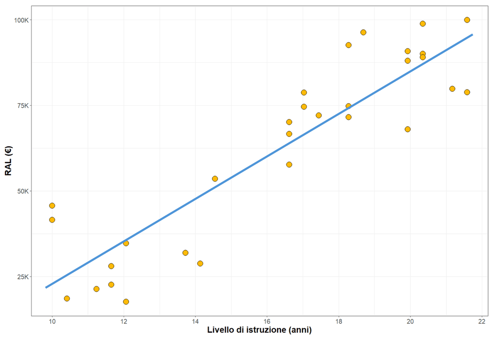
*From the slides.*

We model the association between an input variable $X$ and an output variable $Y$ as

$$Y = f(X) + \varepsilon$$

where $f$ is an **unknown function** and $\varepsilon$ is a **random error**. Once we have an estimate of $f$, we use it to
**predict** $Y$ for new values of $X$. With the line estimated in the slides, 16 years of education give a predicted income
of about 60.2 (thousand euros), 19 years give about 79.4.

> [!NOTE]
> **Not in the slides: why the error term.** Two people with the same education do not earn the same: income also depends
> on things we did not measure (job, city, luck). $\varepsilon$ collects all of this. So even the true $f$ cannot predict $Y$ exactly:
> it predicts the *average* income for a given education.

**Two definitions of machine learning.**

- *Task, performance, experience* (Mitchell): a program **learns** from experience $E$, with respect to a class of tasks $T$ and a
  performance measure $P$, if its performance on $T$, measured by $P$, improves with experience $E$.
  Example, learning to play chess: $T$ = playing chess, $P$ = percentage of games won, $E$ = practice games against itself.
- *Wikipedia*: machine learning is a set of AI techniques for developing algorithms that **learn from data**, **generalize** to unseen data,
  and perform tasks **without explicit instructions**.

The difference from traditional programming, with the pizza picture of the slides: in traditional programming you give the computer
the ingredients **and the recipe**, and it makes the pizza. In machine learning you give it the ingredients **and the pizza**,
and it **figures out the recipe**.

**Applications:** medical diagnosis and prognosis, market trend forecasting, credit risk assessment, failure prediction, spam detection,
product and content recommendations, traffic forecasting. The slides also list many uses in public administration across Europe
(for example document sorting, border control, chatbots, cybersecurity).

**Why machine learning?**

- **Flexible modeling:** no need for strong assumptions such as linearity; nonparametric models capture complex nonlinear relationships.
- **Big data:** very large datasets with many variables.
- **Unstructured data:** images, text, audio.
- **Continuous adaptation:** models can be updated with new data without redesigning them.
- **Better predictive performance** in many tasks.

**Hierarchy:** Artificial Intelligence ⊃ Machine Learning ⊃ Neural Networks ⊃ Deep Learning. Inside machine learning,
**supervised** methods include linear/logistic regression, SVM, XGBoost, k-nearest neighbors, random forest and decision trees;
**unsupervised** methods include PCA, k-means and hierarchical clustering.

## 1.2 Data and types of problems

**Types of data.**

- **Qualitative** (categorical) variables: on a **nominal** scale (categories with no order, e.g. sex) or an **ordinal** scale (ordered categories).
- **Quantitative** (numeric) variables: on an **interval** scale or a **ratio** scale.

> [!TIP]
> **Not in the slides: examples of the four scales.**
> Nominal: blood type, sex. Ordinal: education level (primary < high school < degree), a 1 to 5 star rating.
> Interval: temperature in °C (differences make sense, but 20 °C is not "twice as hot" as 10 °C, because 0 is not "no temperature").
> Ratio: income, weight, years of experience (there is a true zero, so 40k is twice 20k).

**Naming the variables.** In the income dataset:

- $X_1, X_2, X_3$ (education, experience, sex) are the **predictors**: also called features, independent variables, **input**;
- $Y$ (income) is the **response**: also called label, target, dependent variable, **output**.

**Three kinds of problems.**

| Problem | When | Family |
|---|---|---|
| **Regression** | $Y$ is **quantitative** (e.g. income in euros) | supervised |
| **Classification** | $Y$ is **qualitative** (e.g. income class: below or above 50k) | supervised |
| **Clustering** | there is **no $Y$**, and we look for homogeneous groups of observations | unsupervised |

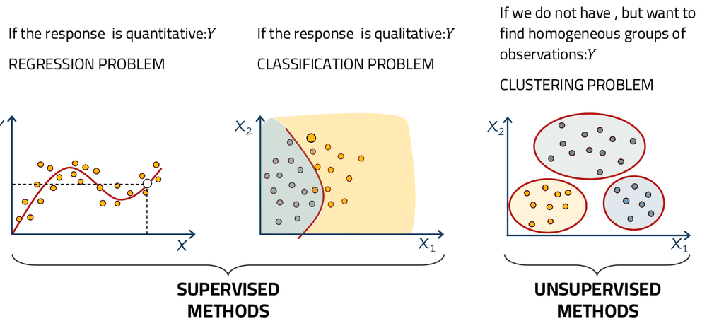
*From the slides.*

**Supervised learning** trains an algorithm on a **labeled** dataset (each example comes with the correct output) to learn the relationship
between inputs and output, with the goal of **predicting the output for unseen data**.

## 1.3 Regression

### Simple linear regression

The simplest way to predict a quantitative $Y$ from a single predictor $X$ is to assume an approximately **linear** relationship:

$$y = \beta_0 + \beta_1 x$$

- $\beta_0$ is the **intercept**: where the line crosses the $y$ axis;
- $\beta_1$ is the **slope**: how much $y$ changes when $x$ increases by 1.

The estimated line is written $\hat{y} = \hat{\beta}_0 + \hat{\beta}_1 x$ (the hat means "estimated from data").
Many lines are possible: which one is best?

### The least squares method

Choose the line that **minimizes the sum of the squared vertical distances** between the points and the line:

$$\min \sum_{i=1}^{n} (y_i - \hat{y}_i)^2$$


*From the slides: each dashed segment is a residual $y_i - \hat{y}_i$.*

On the income data this gives

$$\text{RAL} = -41.92 + 6.39 \times \text{Education}$$

> [!NOTE]
> **Not in the slides: reading the result.** Each extra year of education is associated with about **6.39 thousand euros** more income.
> For 16 years: $-41.92 + 6.39 \cdot 16 = 60.32$, close to the 60.2 shown on the prediction slide (the difference is rounding of the coefficients).
> The intercept $-41.92$ would be the income with 0 years of education: it has no real meaning, because no one in the data is near 0.
> *Why squares?* Squaring makes all distances positive, so errors above and below the line do not cancel out, and it penalizes large errors more.

### Performance measures for regression

$$\text{MAE} = \frac{1}{n}\sum_{i=1}^{n} \lvert y_i - \hat{y}_i \rvert \qquad \text{MSE} = \frac{1}{n}\sum_{i=1}^{n} (y_i - \hat{y}_i)^2 \qquad \text{RMSE} = \sqrt{\text{MSE}}$$

The notebook `ML_metrics.ipynb` compares them:

| Metric | Penalizes large errors | Sensitive to outliers | Unit | Use it when |
|---|---|---|---|---|
| **MAE** | no | low | same as the target | all errors matter equally |
| **MSE** | yes, strongly | high | squared | large deviations are critical; also smooth, so good for optimization |
| **RMSE** | yes | high | same as the target | large errors matter, but you want an interpretable number |

*Example from the notebook:* true house prices 200k, 250k, 300k; predictions 210k, 245k, 280k. Errors: 10, 5, 20.

$$\text{MAE} = \frac{10 + 5 + 20}{3} \approx 11.7\text{k} \qquad \text{MSE} = \frac{100 + 25 + 400}{3} = 175 \qquad \text{RMSE} = \sqrt{175} \approx 13.23\text{k}$$

Note how the single error of 20 contributes 400 out of 525 to the MSE: squaring makes large errors dominate.

### Multiple linear regression

Adding work experience as a second predictor, the model becomes a **plane** instead of a line:

$$\text{RAL} = -50.1 + 5.9 \times \text{Education} + 0.17 \times \text{Experience}$$

> [!NOTE]
> **Not in the slides.** With two predictors, each coefficient is the effect of one variable **keeping the other fixed**.
> The education coefficient drops from 6.39 to 5.9: part of what looked like the effect of education was actually due to experience.

## 1.4 Training error, test error and the bias-variance tradeoff

### The problem

- Least squares is designed to reduce the MSE **on the training data**, the data we are looking at.
- What we really care about is how the model performs on **new data**, the **test set**.
- The method with the lowest **training** MSE is **not guaranteed** to have the lowest **test** MSE.

### Train/test approach

To find the model (for example, the set of variables) with the lowest test error:

1. randomly **split** the data into a **training set** and a **validation set** (called test set in the pictures);
2. build the candidate models on the training set;
3. compute each model's error on the validation set, and **pick the one with the lowest error**.

- **Advantages:** simple and easy to implement.
- **Disadvantages:** the validation error can **vary a lot** depending on which observations end up in which set; and only part of the data is used
  to fit the model, while statistical methods tend to perform worse with fewer observations.

### Flexibility

- The **more flexible** a method is, the **lower its training error**: it can follow the training points very closely.
- Flexible methods can produce a wider range of shapes for $f$ than restrictive methods like linear regression.
- **Less flexible methods are easier to interpret**: we must balance flexibility and interpretability.
- But a flexible method can have a **higher test error** than a simple one.

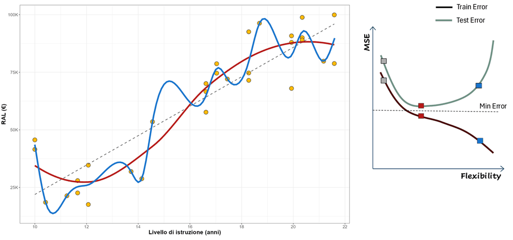
*From the slides: the dashed line is linear (low flexibility), the red curve is moderately flexible, the blue curve is very flexible.
On the right, the training MSE keeps decreasing with flexibility, while the test MSE decreases and then grows again.*

> [!NOTE]
> **Not in the slides: reading the picture.** The blue curve passes almost through every training point, so its training error is tiny.
> But it wiggles to chase individual points, including their random error $\varepsilon$: on new people it will predict badly.
> The red curve captures the general shape without chasing the noise, and has the lowest test error.

### Bias and variance

Two competing forces govern the choice of the method.

- **Bias** is the error introduced by representing a very complex real phenomenon with a much **simpler model**.
  Linear regression assumes a linear relationship; a real relationship is unlikely to be exactly linear, so some bias is present.
  **A more flexible method generally has less bias.**
- **Variance** describes how much the estimate of $f$ would **change with a different training set**: it relates to the model's ability to generalize.
  **A more flexible method generally has higher variance.**

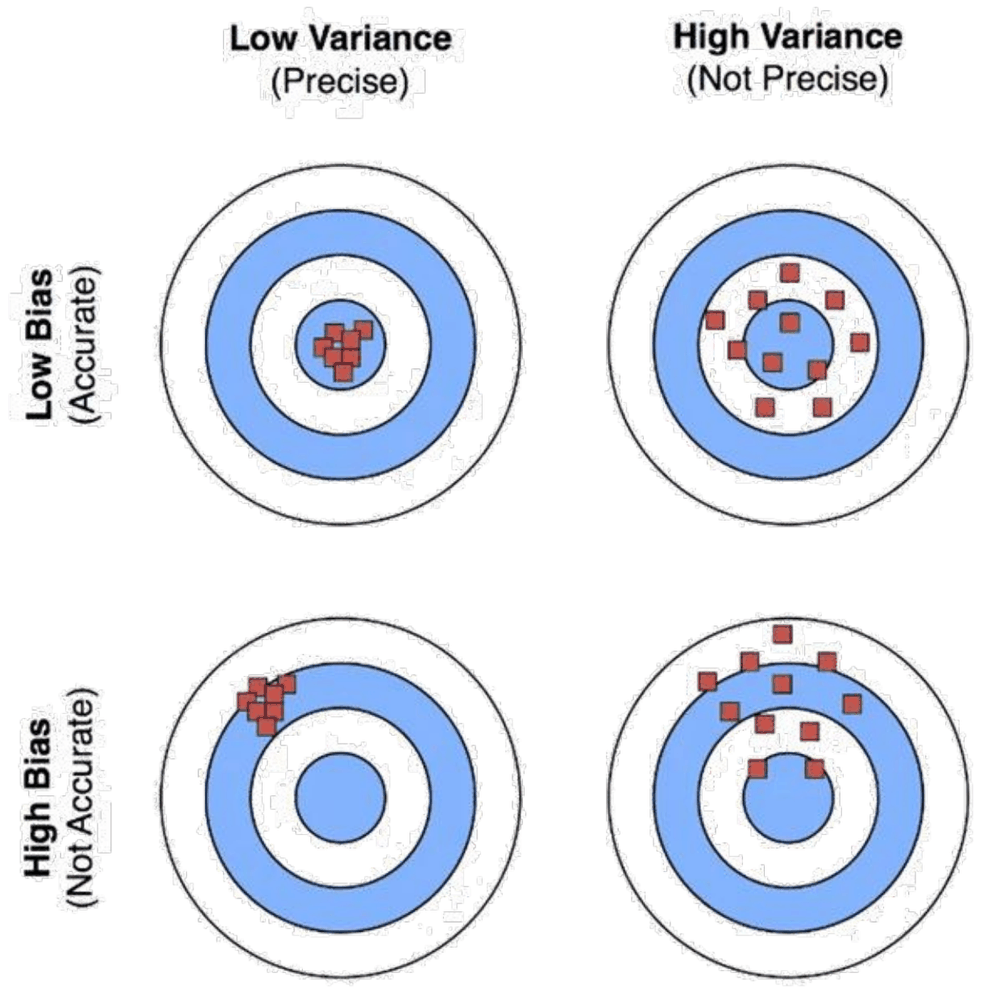
*From the slides: low bias = shots centered on the bullseye (accurate); low variance = shots close together (precise).*

**The key illustration.** As model complexity grows, the training error keeps decreasing; the test error first decreases (bias falls),
then increases again (variance grows). When the test error rises while the training error keeps falling, the model is **overfitting**.


*From the slides.*

> [!TIP]
> **Not in the slides: overfitting and underfitting in one sentence each.**
> **Underfitting** (left side, high bias): the model is too simple and is wrong on training and test data alike.
> **Overfitting** (right side, high variance): the model has memorized the training data, noise included, and does not generalize.

## 1.5 Classification and evaluation metrics

### Error rate

For a classification problem, the simplest measure is the **error rate** on $m$ items:

$$\text{Error rate} = \frac{1}{m}\sum_{i=1}^{m} I(y_i \neq \hat{y}_i)$$

where $I(\cdot)$ is 1 if the condition is true and 0 otherwise. So the error rate is the **fraction of misclassified items**.

Evaluating a classifier means checking how well it **generalizes**: this requires examining the problem and the factors that affect evaluation,
and choosing **suitable metrics**, with a justification.

### Confusion matrix

Applying the classifier to the test set lets us compare **predicted** and **actual** classes. For binary classification there are four cases:

- **TP** (true positives): actually positive, predicted positive;
- **TN** (true negatives): actually negative, predicted negative;
- **FP** (false positives): actually negative, predicted positive, a *false alarm*;
- **FN** (false negatives): actually positive, predicted negative, a *miss*.

|  | **Predicted positive** | **Predicted negative** |
|---|---|---|
| **Actually positive** | TP | FN |
| **Actually negative** | FP | TN |

> [!WARNING]
> **Not in the slides: check the confusion matrix slide.** In the slide, the cell "actual positive, predicted negative" is labeled
> *False Positives* and the cell "actual negative, predicted positive" is labeled *False Negatives*. With the usual definitions they are swapped:
> a positive predicted as negative is a **false negative**. The table above uses the usual definitions, which are also the ones of the notebook.

### Metrics

$$\text{Accuracy} = \frac{TP + TN}{TP + TN + FP + FN} \qquad \text{Error rate} = 1 - \text{Accuracy}$$

$$\text{Precision} = \frac{TP}{TP + FP} \qquad \text{Recall} = \frac{TP}{TP + FN} \qquad F_1 = 2 \cdot \frac{\text{Precision} \cdot \text{Recall}}{\text{Precision} + \text{Recall}}$$

- **Accuracy:** fraction of correct predictions among all observations.
- **Precision:** of all the items **predicted** positive, how many really are. It focuses on avoiding false alarms.
- **Recall** (sensitivity): of all the items that **really are** positive, how many we found. It focuses on catching every positive.
- **F1:** the harmonic mean of precision and recall; it is low if either of the two is low.

> [!WARNING]
> **Not in the slides: check the precision slide.** Its formula $TP/(TP+FP)$ is correct, but the sentence below it
> ("among all actual positive observations") describes **recall**. Precision is computed among the **predicted** positives.

**Why accuracy can mislead** (notebook): with 95 normal emails and 5 spam, a model that always answers "not spam" has 95% accuracy,
but catches no spam at all. With **imbalanced classes**, look at precision, recall and F1.

| Metric | Focus | Ignores | Best for |
|---|---|---|---|
| Accuracy | overall correctness | class imbalance | balanced datasets |
| Precision | quality of positive predictions | false negatives | when false positives are costly |
| Recall | capturing the positives | false positives | when false negatives are costly |
| F1 | balance of precision and recall | true negatives | imbalanced datasets |

The notebook's rule of thumb: prioritize **precision** when false alarms are costly (e.g. spam filtering: don't lose good emails),
**recall** when missing a positive is costly (e.g. disease screening: catch every sick person).

**More than two classes.** Precision, recall and F1 can be averaged in three ways:

- **macro**: compute the metric for each class, then take the plain average (all classes count the same);
- **weighted**: average weighted by the number of samples in each class;
- **micro**: sum TP, FP and FN over all classes, then compute the metric once.

**ROC curve and AUC** (notebook). A classifier often outputs a probability, and a **threshold** decides the class. For every threshold we get a point with

$$\text{FPR} = \frac{FP}{FP + TN} \ \text{(x axis)} \qquad \text{TPR} = \text{Recall} = \frac{TP}{TP + FN} \ \text{(y axis)}$$

and joining the points gives the **ROC curve**. A perfect classifier reaches the top-left corner (TPR = 1, FPR = 0); a random one lies on the diagonal.
The **AUC** (area under the curve) summarizes it: 0.5 = random, 1 = perfect. It does not depend on the threshold and it compares models even with
imbalanced classes, but it does not tell you what happens at the specific threshold you will use. For highly imbalanced data, the notebook suggests
the **precision-recall curve** instead.

> [!NOTE]
> **Not in the notebook text, but in its code.** In the last cell, the scores are generated at random (`np.random.rand`), while the realistic
> scores are commented out under `#CORRECT ONE`. With random scores the ROC curve stays close to the diagonal, with AUC around 0.5:
> a practical demonstration of what a useless classifier looks like. Switching to the commented scores gives a curve close to the top-left corner.

### Bayes error rate

The **Bayes error rate** is the lowest error rate achievable if the true probability distribution of the data were known exactly.
No classifier can do better on test data. In real problems it cannot be computed exactly.

> [!TIP]
> **Not in the slides: why it is not zero.** Two people with the same education and experience can fall in different income classes.
> For such inputs, even knowing the exact probabilities, the best possible guess is sometimes wrong. The Bayes error is this unavoidable part.

## 1.6 k-Nearest Neighbors

**k-NN** is a flexible way to approximate the Bayes classifier. To classify a point $x$:

1. find the $k$ **nearest** points to $x$ in the training data;
2. look at their classes $Y$: predict the **majority** class among them.

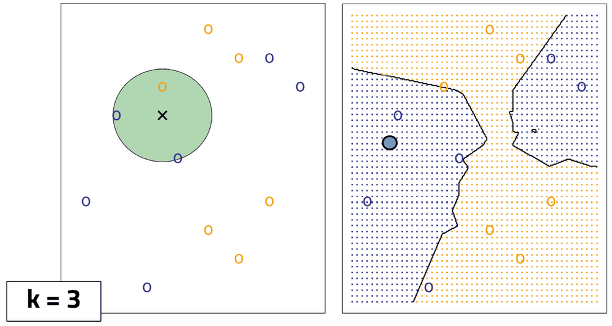
*From the slides: with $k = 3$, the cross has 2 blue and 1 orange neighbors, so it is classified blue.*

**The parameter $k$** is a **hyperparameter**: it is not learned from the data, we choose it, and it controls the flexibility.
**The smaller $k$, the more flexible the method.** With $k = 65$ on the income data, the boundary between the classes is almost a straight line.

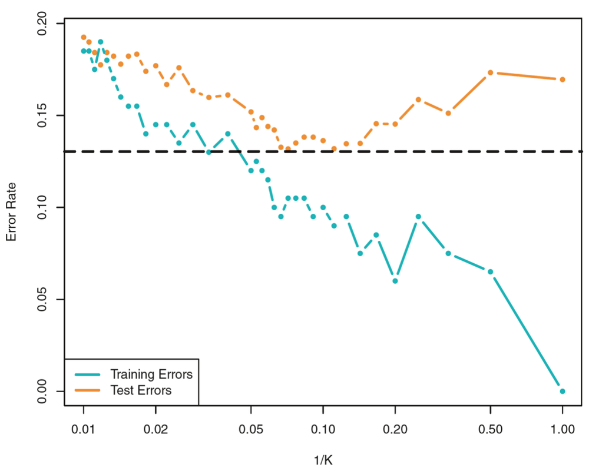
*From the slides: moving right, $1/k$ grows, so $k$ decreases and flexibility increases. The training error keeps decreasing (with $k = 1$ it is 0);
the test error first decreases and then rises again.*

> [!NOTE]
> **Not in the slides: why $k = 1$ has zero training error.** Each training point's nearest neighbor is itself, so it is always "predicted" correctly.
> This is the extreme case of overfitting: the boundary goes around every single point, noise included.

## 1.7 Classification trees and random forest

### Classification trees

A tree has a **root node** (the only node with no parent), **internal nodes** (subgroups that are split further),
branches labeled with a **threshold on a variable** used to split the parent node, and **leaf nodes**, each giving a **predicted class**.

**CART** (Classification And Regression Trees) represents classification rules as a **hierarchical, sequential structure**.
The rules divide the items into subgroups, each labeled with the predicted class. The algorithm **repeatedly splits** the observations
to get subgroups **as homogeneous as possible** with respect to the response variable.

*Example from the slides:* income in three classes (0 to 39.9k, 40 to 60k, over 60k) from education and experience.


*From the slides.*


*From the slides.*

Reading the tree as rules:

- IF Education ≥ 15 THEN income > 60k;
- IF Education < 15 AND Experience ≥ 11 THEN 40 to 60k;
- IF Education < 13 AND Experience < 11 THEN 0 to 39k;
- IF 13 ≤ Education < 15 AND Experience < 11: 0 to 39k if Experience ≥ 4.5, 40 to 60k if Experience < 4.5.

> [!NOTE]
> **Not in the slides: the last rule.** The branch with less experience predicts the *higher* class. The tree does not "know" what makes sense:
> it just follows the data in that region. This is also a hint of how a deep tree can fit peculiarities of the training data.

**Tree complexity.** Splitting until every subgroup is pure predicts well on the training set but **overfits**: the tree becomes too large or deep.
**Pruning** algorithms reduce a deep tree to a smaller subtree; how much to prune is set by a **cost hyperparameter** $C$.

| Pros | Cons |
|---|---|
| Very easy to explain, even easier than linear regression | Generally lower predictive accuracy than other methods |
| Some consider them closer to human decision making | **Unstable**: a small change in the data can produce a very different tree |
| Easy to visualize and interpret for non-experts, especially when small | |
| Handle qualitative predictors easily | |

### Random forest

**Step 1**, repeated $n$ times:

- draw a **bootstrap sample** $D_j$ from the original dataset, and a random **subset of $i$ attributes**, with $i < n$ (typically $i \approx \sqrt{n}$, where $n$ is the number of attributes);
- build a classification tree on this sample and record it.

Each tree may be the same as or different from the others, and for each observation each tree predicts a class.

**Step 2**: for each observation, the forest predicts the class chosen **most often** by the trees (**majority vote**).

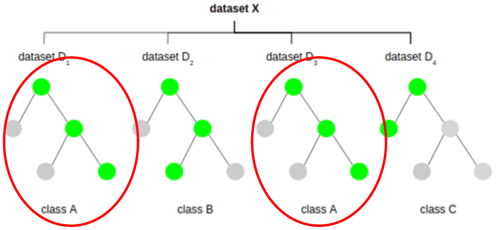
*From the slides: two trees vote A, one B, one C, so the forest predicts A.*

> [!TIP]
> **Not in the slides.** A **bootstrap sample** is obtained by drawing observations from the dataset **with replacement**, as many as the original size:
> some observations appear twice or more, others not at all. Different samples and different attribute subsets make the trees different from each other,
> and averaging many different trees reduces the instability of a single tree. Note that the slides use the letter $n$ both for the number of attributes
> and for the number of trees.

| Pros | Cons |
|---|---|
| Generally high accuracy | Requires more computing power |
| Efficient on large datasets | Less interpretable than a single tree |
| Estimates which variables matter for classification | |
| Unlike some models, it does not overfit as the number of features grows | |

## 1.8 Unsupervised learning and k-means

**Unsupervised learning** analyzes and groups **unlabeled** data: the algorithms find hidden patterns or groups without human intervention.
It is useful for exploratory analysis, cross-selling and customer segmentation.

We only have features $X_1, \dots, X_p$ measured on $n$ observations, and **no response $Y$**: we are not trying to predict, but to discover interesting patterns.
Can we visualize the data informatively? Are there groups among variables or observations? Are there outliers?

**Clustering** covers the techniques that find **subgroups (clusters)** in a dataset: observations in the same group should be **similar**, observations in different
groups **different**. In other words, distances **within** clusters are minimized and distances **between** clusters are maximized.
This requires defining what "similar" means, which often depends on knowledge of the data and its domain (customers, voters, documents, films).

**Distance metrics.** The slides show several: Euclidean, Manhattan, Chebyshev, Minkowski, cosine, Haversine, Hamming, Jaccard, Sørensen-Dice, Dynamic Time Warping.

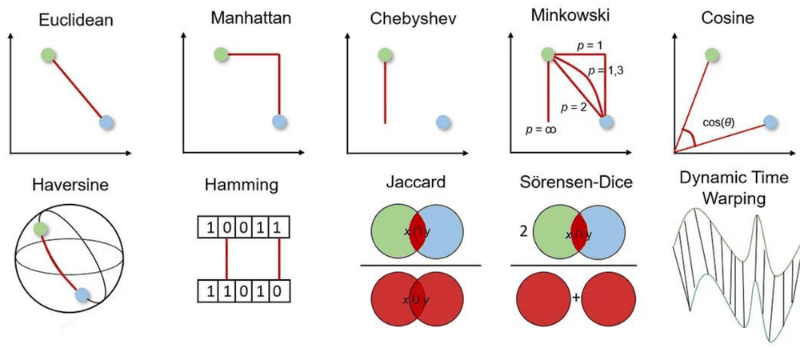
*From the slides.*

> [!TIP]
> **Not in the slides: the most common ones, for points $x = (1, 2)$ and $y = (4, 6)$.**
> **Euclidean** (straight line): $\sqrt{(4-1)^2 + (6-2)^2} = \sqrt{9 + 16} = 5$.
> **Manhattan** (moving only along the axes, like city blocks): $\lvert 4-1 \rvert + \lvert 6-2 \rvert = 7$.
> **Chebyshev** (the largest difference along one axis): $\max(3, 4) = 4$.
> **Minkowski** generalizes them: $\left(\sum \lvert x_i - y_i \rvert^p\right)^{1/p}$ is Manhattan for $p = 1$, Euclidean for $p = 2$, Chebyshev for $p \to \infty$.
> **Hamming** counts the positions where two strings differ: 10011 and 11010 differ in 2 positions.

### k-means

**k-means** divides the observations into a **predetermined number $K$** of clusters, so that each observation belongs to exactly one cluster
and clusters do not overlap. The algorithm:

1. **Initialization:** randomly choose $k$ initial **centroids** (cluster centers).
2. **Assignment:** for each point, compute its distance (usually Euclidean) from each centroid, and assign it to the **nearest** one.
3. **Update:** recompute each centroid as the **mean** of the points assigned to it.
4. **Iteration:** repeat assignment and update until the assignments stop changing.

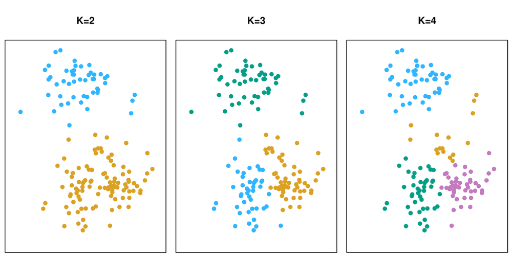
*From the slides: the result depends on the chosen $K$.*

On the income data, k-means with 3 clusters finds groups based on education and experience. Comparing them with the real income classes,
they are similar but not identical: clustering never saw the income, it only grouped people who look alike.

> [!NOTE]
> **Not in the slides: a tiny example in one dimension.** Points 1, 2, 3, 10, 11, 12 with $K = 2$ and initial centroids 1 and 2.
> *Assignment:* 1 goes to centroid 1; all the others are closer to 2. *Update:* centroids become 1 and $(2+3+10+11+12)/5 = 7.6$.
> *Assignment:* 1, 2, 3 are closer to 1 than to 7.6 (3 is at distance 2 from 1 and 4.6 from 7.6); 10, 11, 12 go to 7.6.
> *Update:* centroids become 2 and 11. *Assignment:* nothing changes, so the algorithm stops with clusters {1, 2, 3} and {10, 11, 12}.
> Since the start is random, different initial centroids can lead to different final clusters.

**Conclusions of the lecture.** Machine learning offers flexible modeling (nonlinear relationships), handles large volumes of unstructured data,
and gives better predictions with continuous adaptation. The challenges are managing the bias-variance tradeoff, the risk of overfitting (hence the importance
of training and test validation), and the difficulty of interpreting sophisticated models.

---

# 2. Neural networks: the basic ingredients

## 2.1 From biological neurons to the perceptron

A **biological neuron** receives signals through its **dendrites** (inputs $x_1, \dots, x_n$), processes them in the **cell body**, and sends a signal along the
**axon** to the **axon terminals**, which pass it to other neurons (outputs $y_1, \dots, y_m$).

**McCulloch and Pitts (1943)** proposed the first mathematical model: binary inputs $x_i \in \lbrace 0, 1 \rbrace$, a function $g$ that aggregates them,
a function $f$ that decides the output $y \in \lbrace 0, 1 \rbrace$. It works with **Boolean logic**.

**Rosenblatt's perceptron (1957)** adds a **weight** $w_i$ to each input and a **bias** $b$:

$$h(x \mid w, b) = h\left(\sum_{i=1}^{I} w_i x_i - b\right) = h\left(\sum_{i=0}^{I} w_i x_i\right) = \text{sign}(w^T x)$$

The second form hides the bias inside the weights: add a fake input $x_0 = 1$ with weight $w_0 = -b$.


*From the slides.*

**Geometric meaning.** $h(x) = \text{sign}(w_0 + w_1 x_1 + \dots + w_I x_I)$. The points where the argument is zero, $w_0 + w^T x = 0$, form a **line** in 2D
(a hyperplane in general): the perceptron answers +1 on one side and -1 on the other. So **a perceptron is a linear classifier**.

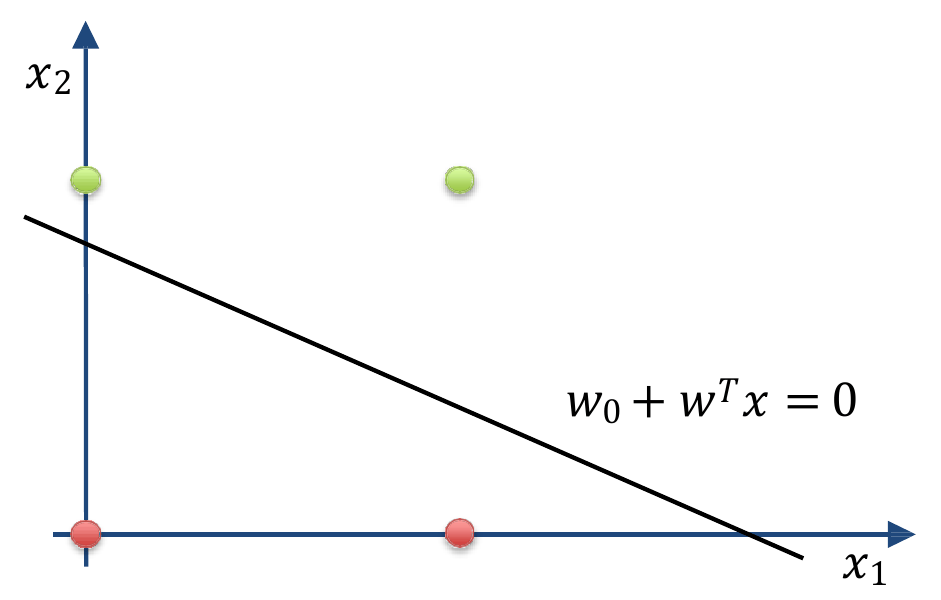
*From the slides.*

> [!NOTE]
> **Not in the slides: a numeric example.** With $w_0 = -1$, $w_1 = 1$, $w_2 = 1$: the point $(0, 0)$ gives $\text{sign}(-1) = -1$,
> the point $(1, 1)$ gives $\text{sign}(1) = +1$. The boundary is the line $x_1 + x_2 = 1$.

### Activation functions beyond "sign"

| Name | Formula | Output range |
|---|---|---|
| Linear | $g(a) = a$ | any real number |
| Sigmoid (logistic) | $g(a) = \dfrac{1}{1 + e^{-a}}$ | from 0 to 1 |
| Tanh | $g(a) = \dfrac{e^{a} - e^{-a}}{e^{a} + e^{-a}}$ | from -1 to 1 |

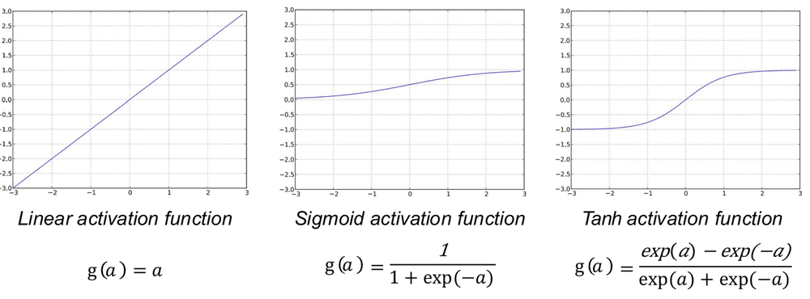
*From the slides.*

> [!TIP]
> **Not in the slides: why sigmoid instead of sign.** Sign jumps from -1 to +1, so its derivative is 0 everywhere (and undefined at 0):
> gradient descent (section 2.4) would get no information on how to change the weights. The sigmoid is a smooth version of the step:
> close to 0 for very negative inputs, close to 1 for very positive ones, and 0.5 at 0. For example $g(0) = 0.5$, $g(10) \approx 0.99995$, $g(-10) \approx 0.00005$.

> [!TIP]
> **Not in the slides: why the activation must be non-linear.** With the linear activation $g(a) = a$, a layer computes $W_1 x + b_1$, and a second layer on top
> computes $W_2(W_1 x + b_1) + b_2 = (W_2 W_1)\,x + (W_2 b_1 + b_2)$: again a single linear function. However many linear layers we stack,
> the network stays equivalent to one layer, so it can only draw straight boundaries. Non-linear activations are what make depth useful,
> as the XOR example below shows.

### Representing Boolean functions

**AND** with a sigmoid neuron: $h(x) = g(-30 + 20 x_1 + 20 x_2)$.

| $x_1$ | $x_2$ | $h(x)$ |
|---|---|---|
| 0 | 0 | $g(-30) \approx 0$ |
| 0 | 1 | $g(-10) \approx 0$ |
| 1 | 0 | $g(-10) \approx 0$ |
| 1 | 1 | $g(10) \approx 1$ |

The bias $-30$ is so negative that only both inputs together (20 + 20 = 40) can push the sum above 0.

Other functions, with the weights written as (bias; weight of $x_1$; weight of $x_2$):

| Function | Weights | Why it works (not in the slides) |
|---|---|---|
| **OR** | (-10; +20; +20) | one active input is enough: $-10 + 20 = 10 > 0$ |
| **NOT** $x_1$ | (+10; -20) | input 0 gives $g(10) \approx 1$, input 1 gives $g(-10) \approx 0$ |
| **(NOT $x_1$) AND (NOT $x_2$)** | (+10; -20; -20) | only $(0, 0)$ keeps the sum positive |

### The XOR problem

**The perceptron cannot learn regions that do not have linear boundaries** (Minsky and Papert, *Perceptrons*, 1969).
XOR is +1 when exactly one input is 1: the points $(0, 1)$ and $(1, 0)$ are in one class, $(0, 0)$ and $(1, 1)$ in the other.
No single line separates them.


*From the slides.*

> [!NOTE]
> **Not in the slides: why no line works.** Suppose $w_0 + w_1 x_1 + w_2 x_2$ is positive on $(0,1)$ and $(1,0)$ and negative on $(0,0)$ and $(1,1)$.
> From the first two: $w_0 + w_2 > 0$ and $w_0 + w_1 > 0$; adding them, $2w_0 + w_1 + w_2 > 0$.
> From the other two: $w_0 < 0$ and $w_0 + w_1 + w_2 < 0$; adding them, $2w_0 + w_1 + w_2 < 0$. Contradiction.

### Non-linearity by adding layers

The solution is to **combine neurons in layers**. The slides use the identity

$$\text{NOT}(A \text{ XOR } B) = (A \text{ AND } B) \text{ OR } \big((\text{NOT } A) \text{ AND } (\text{NOT } B)\big)$$

A first layer computes AND (red) and (NOT $x_1$) AND (NOT $x_2$) (green); a second layer computes the OR (blue) of the two.


*From the slides.*

> [!NOTE]
> **Not in the slides: checking the network.** Call $a_1$ the AND neuron and $a_2$ the NOT/AND neuron; the output is $g(-10 + 20 a_1 + 20 a_2)$.
>
> | $x_1$ | $x_2$ | $a_1$ | $a_2$ | output |
> |---|---|---|---|---|
> | 0 | 0 | 0 | 1 | $g(10) \approx 1$ |
> | 0 | 1 | 0 | 0 | $g(-10) \approx 0$ |
> | 1 | 0 | 0 | 0 | $g(-10) \approx 0$ |
> | 1 | 1 | 1 | 0 | $g(10) \approx 1$ |
>
> The output is 1 exactly when the inputs are equal: it is NOT XOR. Flipping it (or swapping the classes) gives XOR itself.

**Representation power.** One neuron draws one line (a half-plane); a layer of neurons combines several lines into a convex region;
more layers can build arbitrary regions, even with holes or several separate pieces. Many internal layers: **deep learning**.


*From the slides.*

## 2.2 The graph

The lesson describes a neural network through **basic ingredients**: the graph, the loss function, the optimizer and the initialization.

$g = \lbrace N, E \rbrace$ is a **weighted, labeled, directed graph**.

- Each node $i \in N$ is a **neuron** (or perceptron), with two labels: a value $a_i$ called **activation**, and an **activation function** $f_i$,
  which applied to the activation gives the **output** $z_i$.
- Each edge $j \to i$ has a **weight** $w_{ji}$.
- Each node $i$ also has a special edge from a "ghost" node, whose weight is the **bias** $b_i$.

Each neuron is a **calculus unit**:

$$a_i = b_i + \sum_{j : j \to i \in E} w_{ji} z_j \qquad z_i = f_i(a_i)$$

Nodes come in three categories:

- **input nodes**: their value is set from outside;
- **hidden nodes**: they compute;
- **output nodes**: their value is given to the outside.

Connected neurons build the graph; nodes that share the same input are grouped into **layers**. The whole network computes one big expression of all the parameters:
this gives **very large flexibility**, and the network can be used to **approximate a given function F**.

*Example from the slides:* 2 inputs (nodes 1, 2), a hidden layer with nodes 3, 4, 5, and output node 6:

$$z_1 = x_1, \quad z_2 = x_2, \quad z_k = f_k\Big(b_k + \sum_j w_{jk} z_j\Big) \ (k = 3, 4, 5), \quad y = z_6 = f_6\Big(b_6 + \sum_j w_{j6} z_j\Big)$$

which, expanded, is

$$y = f_6\Big(b_6 + w_{5,6} f_5(b_5 + w_{1,5}x_1 + w_{2,5}x_2) + w_{4,6} f_4(b_4 + w_{1,4}x_1 + w_{2,4}x_2) + w_{3,6} f_3(b_3 + w_{1,3}x_1 + w_{2,3}x_2)\Big)$$

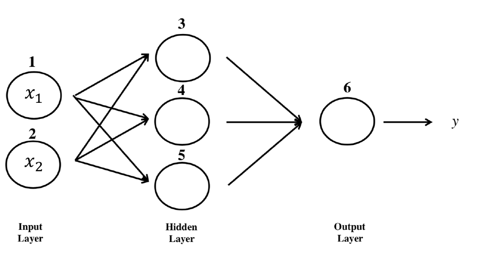
*From the slides.*

> [!NOTE]
> **Not in the slides: counting the parameters.** Nodes 3, 4, 5 have 2 weights and 1 bias each: 9 parameters. Node 6 has 3 weights and 1 bias: 4 parameters.
> The network has **13 parameters**, and learning means finding good values for all of them.

**Feedforward networks, compact notation.** For two consecutive layers $h$ (before) and $k$ (after), assuming all nodes of $k$ share the activation function $f_k$:

$$\vec{z}_k = f_k\big(\vec{b}_k + W_k \vec{z}_h\big)$$

where $\vec{b}_k$ holds the biases of layer $k$, $W_k$ is the matrix of the weights $w_{hk}$, and $\vec{z}_t$ holds the values of the nodes of layer $t$.

> [!TIP]
> **Not in the slides: shapes.** If $h$ has 2 nodes and $k$ has 3, then $\vec{z}_h$ has 2 entries, $W_k$ is a $3 \times 2$ matrix (one row per node of $k$),
> $W_k \vec{z}_h$ and $\vec{b}_k$ have 3 entries, and $f_k$ is applied to each entry.

## 2.3 The loss function

In neural networks the objective function is called **loss function**: it measures the error between the output produced by the network $g$ and the desired one.
The objective is

$$\underset{W, B}{\arg\min} \ \frac{1}{n} \sum_{i=1}^{n} \text{loss}\big[\vec{y}_i, g(\vec{x}_i \mid W, B)\big]$$

The weights $W$ and biases $B$ are **unknown a priori**; the **learning phase** looks for the "best" $W$ and $B$. "Best" is defined by an objective that expresses
the goals of the analysis: what is the network for, what is the input, what is the desired output, and **how far is the produced output from the desired one**.
In short: find $W$ and $B$ such that the network approximates the unknown function $F$.

**Losses for regression** (with $m$ outputs per example):

$$\text{MAE} = \frac{1}{n}\sum_{i=1}^{n} \lVert \vec{y}_i - g(\vec{x}_i \mid W, B) \rVert_1 = \frac{1}{n}\sum_{i=1}^{n}\sum_{j=1}^{m} \big\lvert y_{i,j} - g(\vec{x}_i \mid W, B)_j \big\rvert$$

$$\text{MSE} = \frac{1}{n}\sum_{i=1}^{n}\sum_{j=1}^{m} \big[y_{i,j} - g(\vec{x}_i \mid W, B)_j\big]^2$$

- **MAE** considers all errors equally, and **is not differentiable** (the absolute value has a corner at 0).
- **MSE** strongly penalizes big errors, is cautious with small ones, **suffers from outliers**, and is **smooth and differentiable**.

> [!NOTE]
> **Not in the slides: a notation detail.** The slide writes the MSE with the norm $\lVert \cdot \rVert_2$, but the double sum on the right is the **squared** norm
> $\lVert \cdot \rVert_2^2$ (no square root). The double sum is the one to remember.

**Smooth Absolute Error (SAE)** tries to merge the two: it behaves like the MSE for small errors (below 1) and like the MAE for large ones:

$$\text{SAE} = \begin{cases} \dfrac{1}{2n}\displaystyle\sum_{i=1}^{n} \lVert \vec{y}_i - g(\vec{x}_i \mid W, B) \rVert_2 & \text{if } \lVert \vec{y}_i - g(\vec{x}_i \mid W, B) \rVert_1 < 1 \\ -\dfrac{1}{2} + \dfrac{1}{n}\displaystyle\sum_{i=1}^{n} \lVert \vec{y}_i - g(\vec{x}_i \mid W, B) \rVert_1 & \text{otherwise} \end{cases}$$

> [!TIP]
> **Not in the slides: the idea, for one error $e$.** SAE is $e^2 / 2$ when $\lvert e \rvert < 1$ and $\lvert e \rvert - 1/2$ otherwise.
> At $\lvert e \rvert = 1$ both give $1/2$, so the two pieces join smoothly. Small errors are treated gently (quadratic), large errors do not explode (linear),
> so outliers weigh less than with the MSE. The same idea is known as Huber loss or Smooth L1 loss.

**Losses for classification.**

*Binary Cross Entropy*, for $y_i \in \lbrace 0, 1 \rbrace$ and an output $g(\vec{x}_i \mid W, B) \in [0, 1]$:

$$\text{BCE} = -\frac{1}{n}\sum_{i=1}^{n} \Big( y_i \ln g(\vec{x}_i \mid W, B) + (1 - y_i) \ln\big[1 - g(\vec{x}_i \mid W, B)\big] \Big)$$

*Categorical Cross Entropy*, for $K$ classes, with $y_{i,k} \in \lbrace 0, 1 \rbrace$ (1 only for the correct class) and outputs in $[0, 1]$:

$$\text{CCE} = -\frac{1}{n}\sum_{i=1}^{n}\sum_{k=1}^{K} y_{i,k} \ln g(\vec{x}_i \mid W, B)_k$$

> [!NOTE]
> **Not in the slides: how BCE behaves.** Only one of the two terms is active for each example. If $y = 1$ the loss is $-\ln p$, where $p$ is the predicted probability:
> $p = 0.9$ gives $0.105$, $p = 0.5$ gives $0.693$, $p = 0.01$ gives $4.6$. A confident wrong answer is punished very hard.
> If $y = 0$ the loss is $-\ln(1 - p)$, symmetric.
>
> *A detail:* the slide's BCE formula has a minus sign in front of the second term inside the sum. The usual formula, used above, has
> $-\big(y \ln p + (1-y) \ln(1-p)\big)$: both terms are negative logarithms, so both are losses.

> [!TIP]
> **Not in the slides: why not use the MSE for classification?** Two reasons.
> 1. **Confident mistakes.** With outputs in $[0, 1]$, the MSE of a single example is at most $(1 - 0)^2 = 1$, even when the network is 99.9% sure of the wrong answer.
>    The cross entropy grows without limit ($-\ln 0.001 \approx 6.9$), so an "arrogant" mistake pushes the weights much harder.
> 2. **Gradients.** A sigmoid output is flat near 0 and 1, so its derivative is tiny there. With the MSE, that small derivative multiplies the gradient
>    and learning stalls exactly when the network is badly wrong; the logarithm of the cross entropy cancels this flattening and keeps the gradient large.

## 2.4 The optimizer

**How do we solve the minimization problem?** In principle: compute the gradient of the loss, set it to zero, and check whether the solutions are minima, maxima or saddle points.
But with a lot of (noisy) data and parameters, an **analytical solution is hard** to find: we need an approximation, a heuristic, and typically we must be
**happy with a local minimum**.


*From the slides: starting from the red point and going downhill, we reach the local minimum, not the global one.*

### Gradient descent

Let $F(\bar{x})$ be a function of several variables, differentiable around a point $\bar{a}$. $F$ **decreases fastest** if, from $\bar{a}$, we move in the direction of the
**negative gradient**. The algorithm updates $\bar{a}$ until convergence:

$$\bar{a}^{\text{new}} = \bar{a}^{\text{old}} - \eta \nabla F(\bar{a}^{\text{old}})$$

The parameter $\eta$ is the **learning rate** and determines the behavior of the optimization. It is a **fixed point procedure**:

1. start from a random point;
2. compute the gradient at that point;
3. follow it to a point closer to the optimum;
4. repeat until convergence.

> [!NOTE]
> **Not in the slides: one step by hand.** $F(x) = x^2$, so $F'(x) = 2x$. Start at $x = 3$ with $\eta = 0.1$:
> $x \leftarrow 3 - 0.1 \cdot 6 = 2.4$, then $2.4 - 0.1 \cdot 4.8 = 1.92$, then $1.536$, and so on towards the minimum at 0.
> Each step multiplies $x$ by $1 - 2\eta = 0.8$.

**How the learning rate changes the behavior.** Take the loss $e(w) = \frac{1}{2} C w^2$, with $C$ a constant:

| Learning rate | Behavior |
|---|---|
| $\eta = 1/C$ | optimal: the minimum is reached in **one step** |
| $\eta < 1/C$ | slow, steady convergence |
| $1/C < \eta < 2/C$ | converges while **oscillating** around the minimum |
| $\eta > 2/C$ | **diverges**: each step goes farther away |

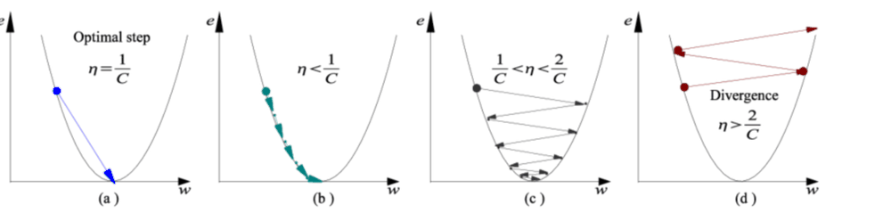
*From the slides.*

> [!TIP]
> **Not in the slides: where the thresholds come from.** $e'(w) = C w$, so one step gives $w \leftarrow w - \eta C w = (1 - \eta C)\, w$.
> Everything depends on the factor $1 - \eta C$:
> if $\eta = 1/C$ it is 0, so $w$ jumps to 0 at once; if $\eta < 1/C$ it is between 0 and 1, so $w$ shrinks keeping its sign;
> if $1/C < \eta < 2/C$ it is between -1 and 0, so $w$ flips sign each time while shrinking; if $\eta > 2/C$ its absolute value exceeds 1, so $w$ grows.

**Applied to a network.** With $[W, B]$ the concatenation of all unknown parameters and $t$ the current step:

$$[W, B]_{t+1} = [W, B]_t - \eta \frac{1}{n}\sum_{i=1}^{n} \nabla_{W,B} \text{loss}\big[\vec{y}_i, g(\vec{x}_i \mid W, B)\big]$$

**A typical rewriting** puts biases and weights in a single matrix: with $W_k^* = [\vec{b}_k \ W_k]$ and $\vec{z}_h^*$ equal to $\vec{z}_h$ with a 1 added on top,
we get $W_k^* \vec{z}_h^* = \vec{b}_k + W_k \vec{z}_h$ (the same trick as $x_0 = 1$ in the perceptron). The update becomes

$$W_{t+1}^* = W_t^* - \eta \frac{1}{n}\sum_{i=1}^{n} \nabla \text{loss}\big[\vec{y}_i, g(\vec{x}_i \mid W^*)\big]$$

**Computing derivatives.** Some losses are **singular** (not differentiable at some points, like the MAE at 0), but singularities are very few and the probability
of landing exactly on one is practically zero. In any case, the derivative can be **approximated numerically**:

$$\frac{d}{dx} f(x) = \lim_{h \to 0} \frac{f(x + h) - f(x)}{h} = \lim_{h \to 0} \frac{f(x + h) - f(x - h)}{2h}$$

### Stochastic gradient descent (SGD)

The update above averages the gradient over **all** $n$ examples before moving: slow. **SGD** speeds up convergence by updating the weights
**for each example** (or for each small **batch** of examples):

$$\forall i \in \lbrace 1, \dots, n \rbrace: \quad W_{t+1}^* = W_t^* - \eta \nabla l_i \qquad \text{with } l_i = \text{loss}\big[\vec{y}_i, g(\vec{x}_i \mid W^*)\big]$$

> [!TIP]
> **Not in the slides: epochs and batches.** An **epoch** is one full pass over the training set. With 15,000 examples and batches of 512,
> one epoch makes $\lceil 15000 / 512 \rceil = 30$ updates, instead of the single update of plain gradient descent.
>
> An analogy: to prepare an exam on a 1,000-page book, you can read the whole book before checking what you understood (plain gradient descent: slow, one correction),
> quiz yourself after every single line (SGD on one example: fast but chaotic, you keep changing direction), or quiz yourself after each chapter of 30 to 60 pages
> (**mini-batch**: frequent corrections based on an average, so more stable). Mini-batches are the usual choice, also because GPUs process a batch in parallel.

**Choosing the learning rate:** with a very high rate the loss explodes; with a high rate it drops fast and then stalls at a poor value;
with a low rate it decreases too slowly; a good rate decreases quickly and keeps improving.

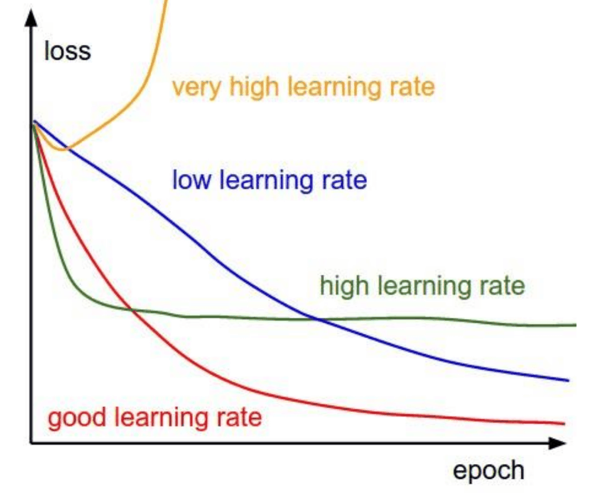
*From the slides (source: Stanford CS231n, image by Alec Radford).*

### Variants of SGD

**AdaGrad**

$$W_{t+1}^* = W_t^* - \frac{\eta}{\sqrt{\epsilon \cdot I + \text{diag}(\nabla l_i \cdot \nabla l_i^T)}} \nabla l_i$$

Weights that receive **large gradients** get their effective learning rate **reduced**; weights with **small or infrequent** updates get it **increased**.

> [!TIP]
> **Not in the slides.** $\text{diag}(\nabla l_i \cdot \nabla l_i^T)$ contains the square of each component of the gradient, so each weight gets its own
> learning rate, divided by the size of its gradient. $\epsilon$ is a tiny number that avoids dividing by zero. In the original algorithm,
> the squares are **accumulated over all past steps**, which is why the learning rate keeps shrinking over time.

**RMSprop**

$$\zeta_{t+1} = \alpha \cdot \zeta_t + (1 - \alpha) \cdot (\nabla l_i)^2 \qquad W_{t+1}^* = W_t^* - \frac{\eta}{\sqrt{\epsilon \cdot I + \zeta_{t+1}}} \nabla l_i$$

It adjusts AdaGrad via a decreasing learning rate: $\zeta$ is a **moving average** of the squared gradients.

> [!TIP]
> **Not in the slides: what a moving average does.** With $\alpha = 0.9$, the new $\zeta$ is 90% the old one and 10% the latest squared gradient.
> Recent gradients count more and old ones fade away, so, unlike AdaGrad's ever-growing sum, the learning rate does not shrink forever.

**Adam**

$$\zeta_{t+1} = \alpha \cdot \zeta_t + (1 - \alpha) \cdot (\nabla l_i)^2 \ \rightarrow \ \zeta_{t+1}^* = \frac{\zeta_{t+1}}{1 - \alpha^{t+1}}$$

$$m_{t+1} = \beta \cdot m_t + (1 - \beta) \cdot \nabla l_i \ \rightarrow \ m_{t+1}^* = \frac{m_{t+1}}{1 - \beta^{t+1}}$$

$$W_{t+1}^* = W_t^* - \frac{\eta \cdot m_{t+1}}{\sqrt{\epsilon \cdot I + \zeta_{t+1}}} \nabla l_i$$

It is **RMSprop with smoothing**: $m$ is a moving average of the gradients themselves. The update depends on the iteration as well as on the other parameters.

> [!NOTE]
> **Not in the slides: comparing with the original paper.** In Adam as published (Kingma and Ba, 2014), the update uses the corrected values
> and no extra gradient factor: $W_{t+1} = W_t - \eta \, m^*_{t+1} / \big(\sqrt{\zeta^*_{t+1}} + \epsilon\big)$. The moving average $m$ already plays the role of the gradient.
> The corrections $1/(1 - \alpha^{t+1})$ and $1/(1 - \beta^{t+1})$ fix the fact that $m$ and $\zeta$ start at 0: in the first steps they would be too small.
> Check with the lecturer which form is expected at the exam.

## 2.5 Backpropagation

Each layer $k \in \lbrace 1, \dots, K \rbrace$ has a weight matrix (biases included) $W_k^*$. The loss is a **composition** of functions, layer after layer:

$$\nabla \text{loss}\big(\vec{y}_i, g(\vec{x}_i \mid W^*)\big) = \nabla \text{loss}\Big(\vec{y}_i, f_K\big(W_K^* \cdot f_{K-1}\big(W_{K-1}^* \cdot f_{K-2}(W_{K-2}^* \cdot f_{K-3}(\dots))\big)\big)\Big)$$

By the **chain rule**, $\frac{d}{dx} f_1(f_2(x)) = f_1'(f_2(x)) \cdot f_2'(x)$, so the gradient is a **product** of derivatives, one per layer:

$$\nabla \text{loss} = \text{loss}'\big(\vec{y}_i, f_K(\dots)\big) \cdot f_K'\big(W_K^* \cdot f_{K-1}(\dots)\big) \cdot W_K^* \cdot f_{K-1}'\big(W_{K-1}^* \cdot f_{K-2}(\dots)\big) \cdot W_{K-1}^* \cdot f_{K-2}'(\dots) \cdots$$

**Distributing the gradient on the layers.** Each layer $k$ contributes to the gradient with

$$\delta_k \stackrel{\text{def}}{=} f_k'(\dots) \cdot W_{k+1}^* \cdot f_{k+1}'(\dots) \cdots W_K^* \cdot f_K'(\dots) \cdot \text{loss}'\big(\vec{y}_i, f_K(\dots)\big)$$

and the key observation is that each $\delta$ can be computed from the next one:

$$\delta_{k-1} = f_{k-1}'(\dots) \cdot W_k^* \cdot \delta_k$$

So each layer can be **updated backwards**, from the output to the input:

$$W_{k;t+1}^* = W_{k;t}^* - \eta \, \delta_k \cdot W_k^* \cdot f_{k-1}'(\dots)$$

> [!NOTE]
> **Not in the slides: why "back" propagation, with a tiny example.** Take a chain of two neurons with one weight each and no biases:
> $z_1 = f(w_1 x)$, $\hat{y} = f(w_2 z_1)$, and loss $L = (\hat{y} - y)^2$. By the chain rule:
>
> $$\frac{\partial L}{\partial w_2} = \underbrace{2(\hat{y} - y) \cdot f'(w_2 z_1)}_{\delta_2} \cdot z_1 \qquad \frac{\partial L}{\partial w_1} = \underbrace{\delta_2 \cdot w_2 \cdot f'(w_1 x)}_{\delta_1} \cdot x$$
>
> $\delta_1$ reuses $\delta_2$, already computed: $\delta_1 = f'(\dots) \cdot w_2 \cdot \delta_2$, exactly the recursion above. So we compute $\delta$ at the output first,
> then walk back one layer at a time, and every layer's gradient costs one multiplication more instead of redoing the whole chain.
> In this common textbook form, the gradient of a layer's weights is its $\delta$ times the **output of the previous layer** ($z_1$ for $w_2$, $x$ for $w_1$).

## 2.6 Initialization

Gradient descent needs an **initial value** for all weights and biases. Since it is a fixed point procedure that searches for an optimum, the **starting point is crucial**:
the initialization strategy can strongly change the network's behavior.

- **Zero initialization: a bad solution.** All nodes get the same initial gradient, so there is no diversification: the hidden nodes become **symmetric**.
- **Constant initialization** has the same problem.

> [!NOTE]
> **Not in the slides: why symmetry is a problem.** If two hidden neurons start with the same weights, they compute the same output, receive the same gradient,
> and get the same update, forever. They stay identical copies, so the network behaves as if it had a single neuron in that position.
> Random initialization "breaks the symmetry".

**Rationale for the scale of the weights:** with **very large** weights, activation functions with asymptotes (sigmoid, tanh) saturate and their gradient is practically 0,
so learning takes a very long time. With **very small** weights, the gradient also goes to 0, with the same result.

> [!TIP]
> **Not in the slides: saturation in numbers.** The derivative of the sigmoid is $g'(a) = g(a)\,(1 - g(a))$: at $a = 0$ it is $0.25$, at $a = 10$ it is about $0.00005$.
> Large weights produce large $a$, so the gradient that flows back through the neuron almost vanishes.

**Strategies.**

- **Simplest:** random weights, $W_k \sim \text{Uniform}$ or $W_k \sim N(0, I)$.
- **He et al. (2015):** $W_k = \epsilon \cdot \sqrt{2 / \lvert \to k \rvert}$ with $\epsilon \sim N(0, I)$, where $\lvert \to k \rvert$ is the number of incoming connections (**fan-in**).
- **Xavier (Glorot):** similar, using both the previous layer $h$ and the layer $k$:
  $W_k = \epsilon \cdot \sqrt{2 / (\lvert h \rvert + \lvert k \rvert)}$ with $\epsilon \sim N(0, I)$, or the variant $W_k = \epsilon \cdot \sqrt{6 / (\lvert h \rvert + \lvert k \rvert)}$ with $\epsilon \sim \text{Uniform}$.

> [!TIP]
> **Not in the slides: the idea behind the scaling.** A neuron sums its inputs times the weights: with more inputs, the sum grows. Dividing the weights by the square root
> of the number of inputs keeps the activations at a similar scale in every layer, far from both saturation and zero.
> Example: a layer with 100 inputs under He initialization uses standard deviation $\sqrt{2/100} \approx 0.14$.

---

# 3. Classification with Keras

Both examples come from François Chollet, *Deep Learning with Python*, chapter 3.

## 3.1 Binary classification: IMDb reviews

**The dataset.** 50,000 highly polarized movie reviews from the Internet Movie Database, 50% positive and 50% negative;
25,000 for training and 25,000 for testing, again half and half. It comes with Keras, already preprocessed: each review (a sequence of words)
is a sequence of integers, each integer standing for a word in a dictionary. **Goal:** predict whether a review is positive or negative.

**Loading.** `num_words=10000` keeps only the 10,000 most frequent words.

```python
from keras.datasets import imdb
(train_data, train_labels), (test_data, test_labels) = imdb.load_data(num_words=10000)
# train_data[0] -> [1, 14, 22, 16, ...]    train_labels[0] -> 1 (positive)
```

**Preprocessing.** A network needs inputs of fixed size, but reviews have different lengths. Each review becomes a vector of 10,000 zeros,
with a 1 at the position of every word it contains:

```python
import numpy as np

def vectorize_sequences(sequences, dimension=10000):
    results = np.zeros((len(sequences), dimension))  # all-zero matrix
    for i, sequence in enumerate(sequences):
        results[i, sequence] = 1.                    # 1 at the indices of the words
    return results

x_train = vectorize_sequences(train_data)
x_test = vectorize_sequences(test_data)
y_train = np.asarray(train_labels).astype('float32')
y_test = np.asarray(test_labels).astype('float32')
```

> [!TIP]
> **Not in the slides: an example of the encoding.** With a vocabulary of 6 words, the review $[1, 3, 3, 5]$ becomes $[0, 1, 0, 1, 0, 1]$.
> The vector says *which* words appear, not how many times nor in which order (this is often called multi-hot encoding).

**The network.** Two hidden layers of 16 units with ReLU, and one output unit with sigmoid, which gives a probability between 0 and 1:

```python
from keras import models, layers

model = models.Sequential()
model.add(layers.Dense(16, activation='relu', input_shape=(10000,)))
model.add(layers.Dense(16, activation='relu'))
model.add(layers.Dense(1, activation='sigmoid'))

model.compile(optimizer='rmsprop',
              loss='binary_crossentropy',
              metrics=['accuracy'])
```

`plot_model(model, show_shapes=True, show_layer_names=True)` draws the layers with their input and output shapes: (None, 10000) → (None, 16) → (None, 16) → (None, 1),
where `None` stands for the batch size, not fixed in advance.

> [!TIP]
> **Not in the slides.** **ReLU** is $\text{relu}(a) = \max(0, a)$: 0 for negative inputs, the input itself for positive ones. It does not saturate for positive values,
> unlike sigmoid and tanh (see section 2.6). A **Dense** layer connects each of its units to all units of the previous layer: it is the $\vec{z}_k = f_k(\vec{b}_k + W_k\vec{z}_h)$ of section 2.2.
> The first layer alone has $10000 \cdot 16 + 16 = 160{,}016$ parameters.

The strings `'rmsprop'`, `'binary_crossentropy'` and `'accuracy'` are shortcuts. To set parameters, for example the learning rate, pass objects instead:

```python
from keras import optimizers, losses, metrics

model.compile(optimizer=optimizers.RMSprop(lr=0.001),
              loss=losses.binary_crossentropy,
              metrics=[metrics.binary_accuracy])
```

**Validation set.** To **monitor** the network during training, set aside 10,000 of the 25,000 training reviews; the remaining 15,000 are used for training.
The test set is not touched.

```python
x_val, partial_x_train = x_train[:10000], x_train[10000:]
y_val, partial_y_train = y_train[:10000], y_train[10000:]

history = model.fit(partial_x_train, partial_y_train,
                    epochs=20, batch_size=512,
                    validation_data=(x_val, y_val))
```

`history.history` contains, for each epoch, the loss and the accuracy on the training and validation data, which are then plotted with matplotlib.


*From the slides.*


*From the slides.*

**Overfitting.** The training loss keeps decreasing and the training accuracy approaches 100%, but the validation loss is lowest around epoch 4 and then grows,
while the validation accuracy stops improving at about 88%. After a few epochs the network is learning the training reviews by heart.

> [!NOTE]
> **Not in the slides: the link with section 1.4.** This is the same picture as the training and test error against flexibility:
> here the "complexity" grows with the number of epochs, because the longer the network trains, the more closely it fits the training data.

**Early stopping.** Train a new network from scratch, on the whole training set, for only **4 epochs**, and evaluate it on the test set:

```python
model.fit(x_train, y_train, epochs=4, batch_size=512)
results = model.evaluate(x_test, y_test)   # [0.2918..., 0.8849...]
```

The result is a test loss of about 0.29 and a **test accuracy of about 88.5%**.

**Prediction.** `model.predict(x_test)` returns, for each review, the probability of being positive, for example 0.92, 0.87, 0.999, …, 0.46, 0.004, 0.80.
Values close to 1 or 0 are confident; values like 0.46 are uncertain.

## 3.2 Multi-class classification: Reuters newswires

**The dataset.** Short newswires published by Reuters in 1986, each with its topic: a simple, widely used toy dataset for text classification.
There are **46 topics**; some are more represented than others, but each has at least 10 training examples.

```python
from keras.datasets import reuters
(train_data, train_labels), (test_data, test_labels) = reuters.load_data(num_words=10000)
```

**Preprocessing.** The inputs are vectorized exactly as for IMDb. The labels are now integers from 0 to 45, turned into **one-hot** vectors of length 46:

```python
def to_one_hot(labels, dimension=46):
    results = np.zeros((len(labels), dimension))
    for i, label in enumerate(labels):
        results[i, label] = 1.
    return results

one_hot_train_labels = to_one_hot(train_labels)
one_hot_test_labels = to_one_hot(test_labels)

# Equivalent, with the Keras helper:
from keras.utils.np_utils import to_categorical
one_hot_train_labels = to_categorical(train_labels)
```

> [!TIP]
> **Not in the slides.** One-hot means "all zeros except a single 1": topic 3 becomes a vector of 46 entries with a 1 in position 3.
> It is the $y_{i,k}$ of the categorical cross entropy in section 2.3.

**Softmax.** The output layer must give a **probability for each of the 46 topics**, all adding up to 1. **Softmax** turns the raw scores (**logits**) $y_i$ into probabilities:

$$S(y_i) = \frac{e^{y_i}}{\sum_j e^{y_j}}$$

In the slides' example, the scores 2.0, 1.0, 0.1 become the probabilities 0.7, 0.2, 0.1.

> [!NOTE]
> **Not in the slides: the computation.** $e^{2} \approx 7.389$, $e^{1} \approx 2.718$, $e^{0.1} \approx 1.105$, with sum $11.212$.
> Dividing: $0.659$, $0.242$, $0.099$, which the slide rounds to 0.7, 0.2, 0.1. The exponential makes every value positive and amplifies the differences:
> the highest score takes most of the probability.

**The network.** Hidden layers of 64 units, larger than for IMDb. The output has 46 units with softmax, and the loss is the categorical cross entropy.

```python
model = models.Sequential()
model.add(layers.Dense(64, activation='relu', input_shape=(10000,)))
model.add(layers.Dense(64, activation='relu'))
model.add(layers.Dense(46, activation='softmax'))

model.compile(optimizer='rmsprop',
              loss='categorical_crossentropy',
              metrics=['accuracy'])
```

> [!TIP]
> **Not in the slides: why 64 units.** This is Chollet's motivation in the book. The last hidden layer must carry enough information to tell 46 classes apart;
> a 16-unit layer would be a bottleneck that loses information before reaching the output.

**Validation and training.** 1,000 examples are set aside for validation, then the network is trained for 20 epochs with batches of 512.

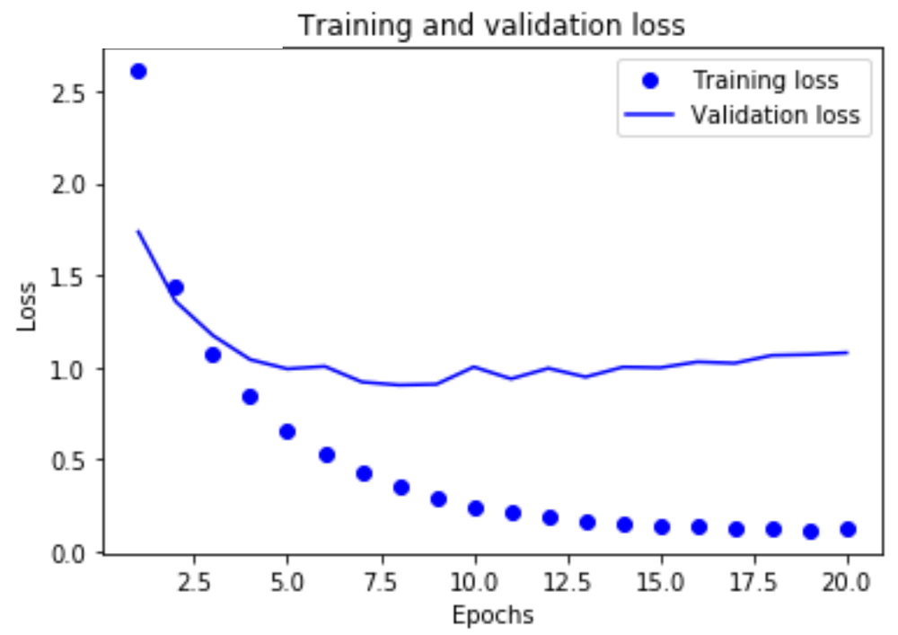
*From the slides.*

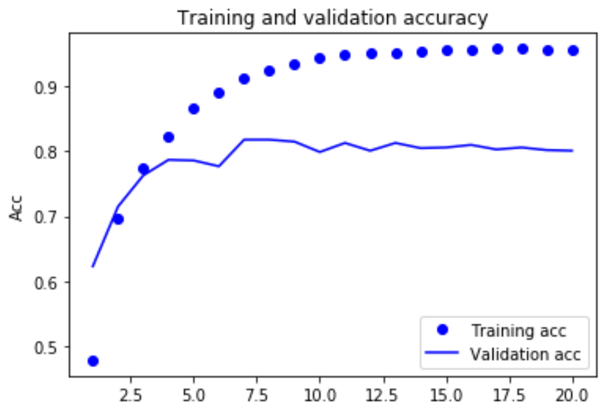
*From the slides.*

**Dealing with overfitting.** The validation loss is lowest around epoch 8 and the validation accuracy stops at about 80%, so the network is retrained for **8 epochs** and then evaluated on the test set.

**Different encoding of the labels.** Instead of one-hot vectors, keep the labels as **integers** and use `sparse_categorical_crossentropy`, which is the same loss written for integer labels:

```python
y_train = np.array(train_labels)
y_test = np.array(test_labels)
model.compile(optimizer='rmsprop',
              loss='sparse_categorical_crossentropy',
              metrics=['acc'])
```

> [!NOTE]
> **Not in the slides: current Keras.** The code of the slides uses an older Keras API. In recent versions, `lr=` is `learning_rate=`,
> `keras.utils.np_utils.to_categorical` is `keras.utils.to_categorical`, `keras.utils.vis_utils.plot_model` is `keras.utils.plot_model`,
> and the history keys are `'accuracy'` and `'val_accuracy'` instead of `'acc'` or `'binary_accuracy'`. If the code from the slides fails, start from these.


## 3.3 Regression: Boston housing prices

*Lesson 3. Example from François Chollet, Deep Learning with Python, chapter 3.*

**The dataset.** Predict the **median price of homes** in a Boston suburb in the mid-1970s, from 13 features of the suburb: crime rate, proportion of residential land,
of non-retail business, a dummy for bordering the Charles River, nitrogen oxides concentration, average number of rooms, proportion of old houses,
distance from employment centres, accessibility to highways, property-tax rate, pupil-teacher ratio, a demographic index, and the percentage of lower-status population.
The targets are prices in **thousands of dollars** (15.2, 42.3, 50.0, …).

**Two issues:**

- **very few data points:** 506 in total, 404 for training and 102 for testing;
- each feature has a **different scale** (a proportion between 0 and 1, a tax rate in the hundreds, a number of rooms around 6).

```python
from keras.datasets import boston_housing
(train_data, train_targets), (test_data, test_targets) = boston_housing.load_data()
```

### Normalization

Each feature is **centered around 0 with unit standard deviation**: subtract the mean and divide by the standard deviation.

```python
mean = train_data.mean(axis=0)
train_data -= mean
std = train_data.std(axis=0)
train_data /= std
test_data -= mean      # the test data uses the TRAINING mean and std
test_data /= std
```

**The mean and standard deviation used for the test data are computed on the training data.**

> [!NOTE]
> **Not in the slides: why the training statistics.** The test set stands for future data, which we don't have while training. Computing its mean and standard deviation
> would use information about the test set in the training pipeline (a form of *data leakage*), making the evaluation too optimistic. And in production a new house arrives alone:
> there is no "test set mean" to compute, only the one learned from training.
>
> *Why normalize at all:* with raw features, a tax rate of 300 would dominate a proportion of 0.2 in the weighted sums of the first layer, and gradient descent would need very
> different step sizes for different weights. After normalization all features have comparable ranges.

### The network

Two hidden layers of 64 units with ReLU, and an output layer with **a single unit and no activation**. The loss is the **MSE**; the metric monitored is the **MAE**.

```python
def build_model():
    # we need to instantiate the same model several times, so we use a function
    model = models.Sequential()
    model.add(layers.Dense(64, activation='relu', input_shape=(train_data.shape[1],)))
    model.add(layers.Dense(64, activation='relu'))
    model.add(layers.Dense(1))
    model.compile(optimizer='rmsprop', loss='mse', metrics=['mae'])
    return model
```

> [!TIP]
> **Not in the slides: why no activation at the output.** This is a **linear** output unit, the standard choice for scalar regression. A sigmoid would squeeze the output between 0 and 1,
> a ReLU would forbid negative values; with no activation the network can output any number. Compare with the classification heads of sections 3.1 and 3.2 (sigmoid, softmax).

### K-fold validation

With so few samples, a single validation split would be tiny (about 100 samples), and the validation score would depend a lot on **which** samples ended up in it: high variance.
The solution is **K-fold cross-validation**: split the data into $K$ partitions, train $K$ models, each validated on a different partition and trained on the others,
and take the **average** of the $K$ validation scores.

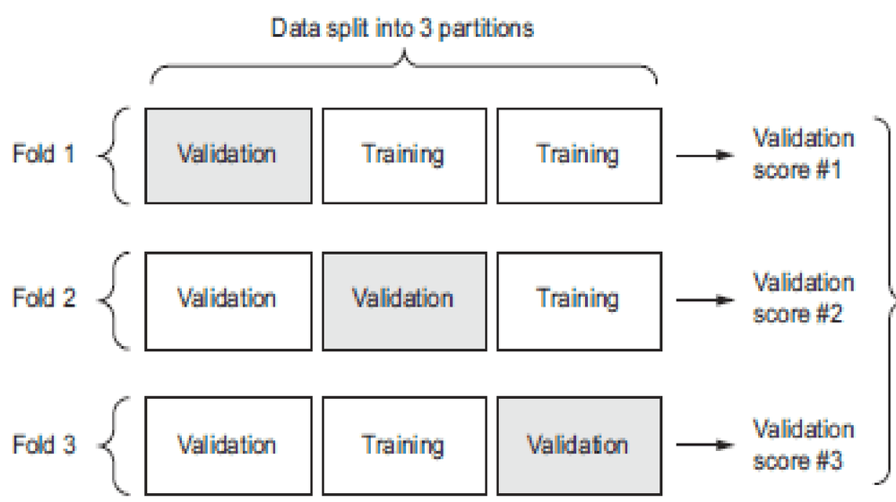
*From the slides.*

```python
k = 4
num_val_samples = len(train_data) // k
all_scores = []
for i in range(k):
    # validation data: partition i
    val_data = train_data[i * num_val_samples: (i + 1) * num_val_samples]
    val_targets = train_targets[i * num_val_samples: (i + 1) * num_val_samples]
    # training data: all the other partitions
    partial_train_data = np.concatenate(
        [train_data[:i * num_val_samples], train_data[(i + 1) * num_val_samples:]], axis=0)
    partial_train_targets = np.concatenate(
        [train_targets[:i * num_val_samples], train_targets[(i + 1) * num_val_samples:]], axis=0)
    model = build_model()                          # a new, untrained model for each fold
    model.fit(partial_train_data, partial_train_targets,
              epochs=num_epochs, batch_size=1, verbose=0)
    val_mse, val_mae = model.evaluate(val_data, val_targets, verbose=0)
    all_scores.append(val_mae)
```

**Results** with 100 epochs: the four validation MAEs are 2.13, 2.50, 2.57, 2.63.

> [!NOTE]
> **Not in the slides: reading the results.** With 404 samples and $K = 4$, each fold has 101 validation samples. The average MAE is $(2.13 + 2.50 + 2.57 + 2.63)/4 \approx 2.46$:
> since prices are in thousands of dollars, the model is off by about **$2,460** on average, on houses costing roughly $10,000 to $50,000.
> The scores range from 2.13 to 2.63 depending on the fold: exactly the variability that a single split would have hidden.

### Choosing the number of epochs

To see how the validation MAE evolves, save the history of each fold (training now for 500 epochs), average the curves over the folds, and plot them:

```python
all_mae_histories = []
for i in range(k):
    ...
    history = model.fit(partial_train_data, partial_train_targets,
                        validation_data=(val_data, val_targets),
                        epochs=num_epochs, batch_size=1, verbose=0)
    all_mae_histories.append(history.history['val_mean_absolute_error'])

average_mae_history = [np.mean([x[i] for x in all_mae_histories]) for i in range(num_epochs)]
```

The first points are much higher than the rest and squash the plot, so we **omit the first 10 data points**: the curve then shows that the validation MAE
**stops improving after about 80 epochs** and then gets worse: overfitting.

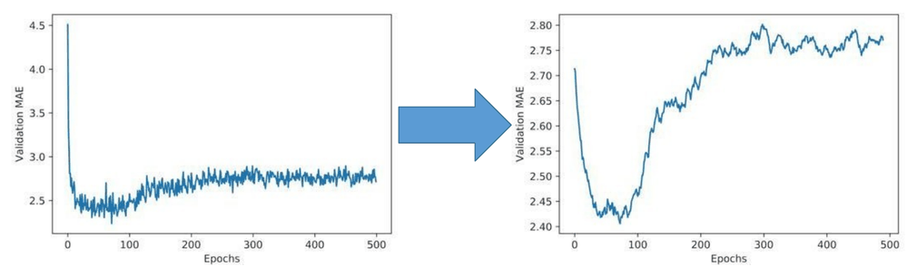
*From the slides.*

> [!NOTE]
> **Not in the slides: two details.** The slide saves `history.history['mean_absolute_error']`, which is the MAE on the *training* data; to plot the validation MAE, as the title says,
> `fit` must receive `validation_data` and the key is `'val_mean_absolute_error'` (in recent Keras, `'val_mae'`). This is how Chollet's book does it, and it is the version shown above.
>
> After choosing the number of epochs (about 80), the final model is trained **on all the training data** with that number of epochs and evaluated once on the test set.
> In the book this gives a test MAE of about 2.5, that is about $2,500.

---

# 4. Overfitting and regularization

*Lesson 3, second part.* As seen with IMDb, Reuters and Boston housing, after some epochs the validation loss starts to grow: the network is **overfitting**.
Besides stopping early (section 3.1), the slides show three techniques.

## 4.1 Reduce the network size

The simplest way to prevent overfitting is to **reduce the number of learnable parameters** (the network's *capacity*): a smaller network cannot memorize the training data as easily.
The slides compare the IMDb network (two layers of 16 units) with a smaller one: the smaller network starts overfitting **later**, and its validation loss grows **more slowly**.

```python
original_model = models.Sequential()
original_model.add(layers.Dense(16, activation='relu', input_shape=(10000,)))
original_model.add(layers.Dense(16, activation='relu'))
original_model.add(layers.Dense(1, activation='sigmoid'))
```

> [!NOTE]
> **Not in the slides: the smaller model.** The slide shows only the code of the original model. In Chollet's book, the smaller model is identical with **4 units** instead of 16 in the two hidden layers.
> Too small, though, and the network underfits (section 1.4): the right size is found by experimenting and watching the validation curves.

## 4.2 Weight regularization

Put constraints on the complexity of a network by forcing its **weights to take only small values**, which makes their distribution more "regular". This is done by adding to the loss
a cost for large weights:

$$\text{L1:}\quad \text{new loss} = \text{old loss} + \lambda \sum_i \lvert w_i \rvert \qquad\qquad \text{L2:}\quad \text{new loss} = \text{old loss} + \lambda \sum_i w_i^2$$

- **Why:** large weights make the model more sensitive to noise and variance in the data.
- **L2** tends to make **all weights small**.
- **L1** tends to make weights **sparse** (more of them exactly 0).

```python
from keras import regularizers

l2_model = models.Sequential()
l2_model.add(layers.Dense(8, kernel_regularizer=regularizers.l2(0.001),
                          activation='relu', input_shape=(10000,)))
l2_model.add(layers.Dense(8, kernel_regularizer=regularizers.l2(0.001), activation='relu'))
l2_model.add(layers.Dense(1, activation='sigmoid'))

regularizers.l1(0.001)                  # L1
regularizers.l1_l2(l1=0.001, l2=0.001)  # L1 and L2 at the same time
```

`l2(0.001)` means that every weight $w$ of the layer adds $0.001 \cdot w^2$ to the total loss. The penalty is added **only during training**.

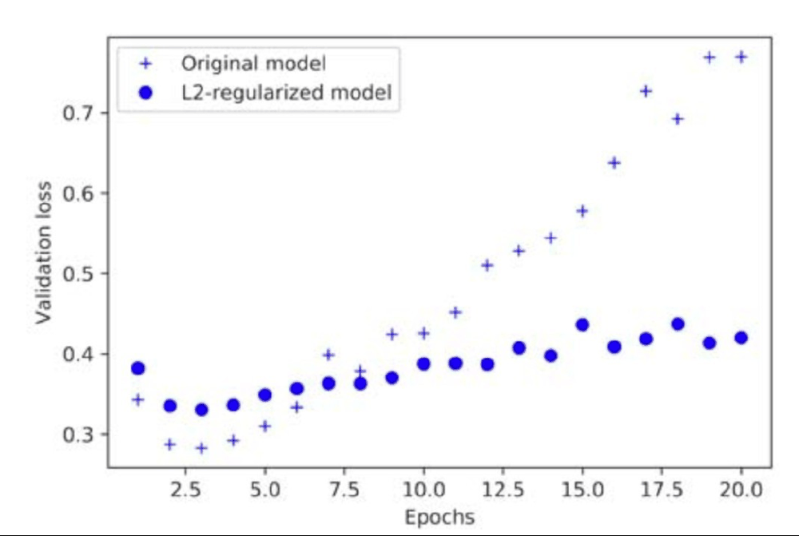
*From the slides: the L2-regularized model overfits much less.*

> [!NOTE]
> **Not in the slides: why L2 shrinks and L1 zeroes.** Look at the gradient of each penalty with respect to one weight.
> For L2, $\frac{\partial}{\partial w}\lambda w^2 = 2\lambda w$: the push towards 0 is **proportional to the weight**, strong for large weights and vanishing near 0, so weights become small but rarely exactly 0.
> For L1, $\frac{\partial}{\partial w}\lambda \lvert w \rvert = \pm\lambda$: a **constant** push towards 0, the same for a weight of 5 or 0.01, so small weights are driven all the way to 0.
> *In gradient descent terms (section 2.4):* L2 adds $-\eta \cdot 2\lambda w$ to each update, which is why it is also called **weight decay**: each step multiplies $w$ by $(1 - 2\eta\lambda)$.

## 4.3 Dropout

**Dropout**, applied to a layer, randomly "drops out" (sets to zero) a number of the layer's output features during training. Each time before the parameters are updated,
each neuron has probability $p$ of being dropped.

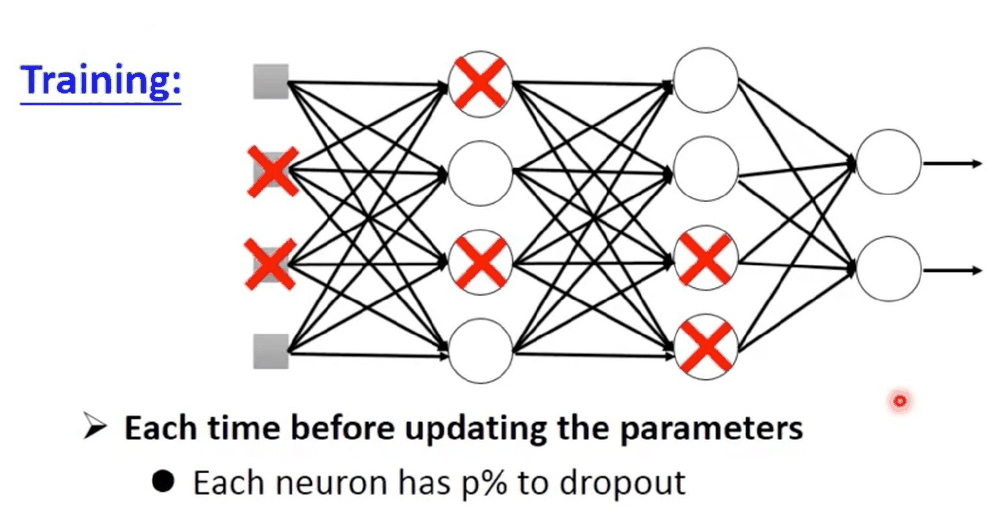
*From the slides.*

**At test time** no unit is dropped. To balance the fact that more units are active than during training, the outputs are scaled down: if the dropout rate during training is $p$,
the weights are multiplied by $(1 - p)$.

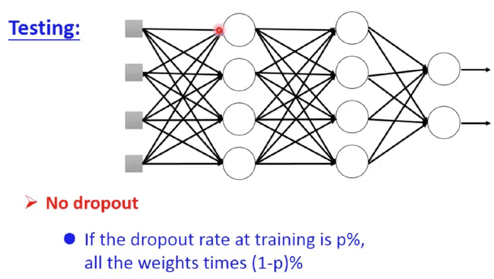
*From the slides.*

> [!WARNING]
> **Not in the slides: check the scaling factor.** The text of the slide says the outputs are scaled down "by a factor equal to the dropout rate", while the figure says "times $(1-p)$".
> The figure is right: the factor is the probability of **keeping** a unit. With $p = 0.5$ both give 0.5, which is probably why the text says so; with $p = 0.2$ the factor is $0.8$, not $0.2$.
>
> *Why:* with $p = 0.2$, during training a neuron in the next layer receives on average 80% of its inputs. At test time it receives all of them, so its input would be 25% larger than what it
> was trained on; multiplying by $0.8$ restores the same average. Keras actually does the opposite, equivalent thing (**inverted dropout**): it divides by $(1-p)$ during training and changes nothing at test time.

**Intuition.** Introducing noise in a layer's outputs breaks up **happenstance patterns** that are not significant (what Hinton calls "conspiracies"), which the network would otherwise memorize.

```python
dpt_model = models.Sequential()
dpt_model.add(layers.Dense(16, activation='relu', input_shape=(10000,)))
dpt_model.add(layers.Dropout(0.5))
dpt_model.add(layers.Dense(16, activation='relu'))
dpt_model.add(layers.Dropout(0.5))
dpt_model.add(layers.Dense(1, activation='sigmoid'))
```

`Dropout(0.5)` drops half of the outputs of the previous layer at each training step.

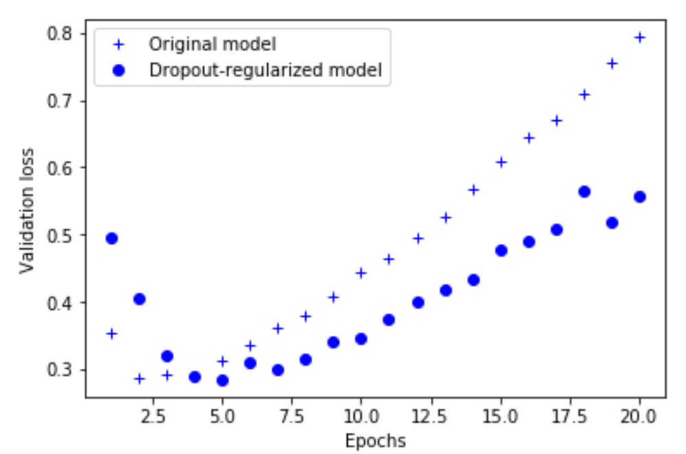
*From the slides.*

> [!TIP]
> **Not in the slides: an analogy.** Think of a team where one member does all the work while the others just watch. If that member is absent, the team fails. Dropout sends random team members home
> at every step: nobody can rely on a single colleague, so the knowledge gets spread across the whole team, which makes it more robust.

---

# 5. Convolutional networks

*Lesson 4.*

## 5.1 Why fully connected networks are not enough for images

In a **fully connected** (dense) network, each unit is connected to every unit of the previous layer:

$$a_i = \sum_{j \prec i} w_{i,j} z_j, \qquad z_i = f(a_i), \qquad \mathbf{a}^{(h+1)} = \mathbf{W}^{(h)} \mathbf{z}^{(h)}, \qquad \mathbf{z}^{(h+1)} = f\big(\mathbf{a}^{(h+1)}\big), \qquad \mathbf{z}^{(0)} = \mathbf{x}$$

This is the same notation as section 2.2, with $j \prec i$ meaning "unit $j$ comes before unit $i$".

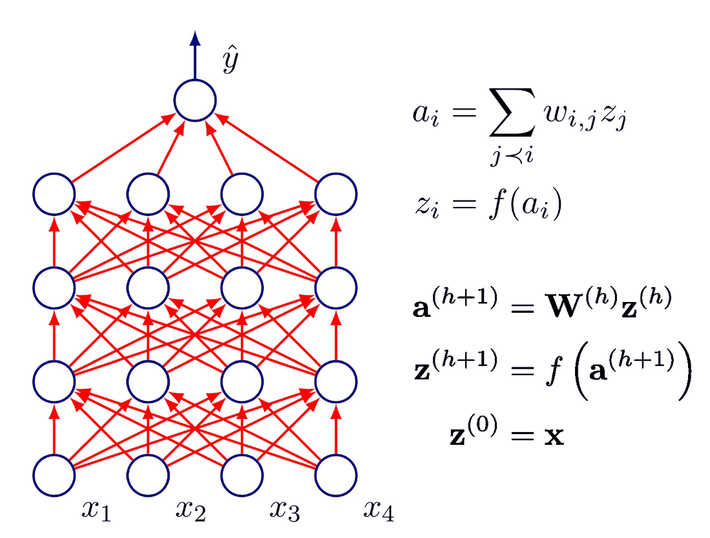
*From the slides.*

**Number of connections.** In the example each unit of a layer of 4 receives 4 inputs plus a bias: $5 \cdot 4$ connections per layer, plus $5$ for the output unit.
For a generic network with $k$ layers, where layer $h$ has $d_h$ units, the number of weights is

$$\sum_{h=1}^{k} d_h \cdot d_{h-1}$$

> [!NOTE]
> **Not in the slides: what this means for images.** A small $28 \times 28$ grayscale image has 784 inputs; a dense layer of 512 units on it already has $784 \cdot 512 + 512 = 401{,}920$ parameters.
> A $224 \times 224$ color image has $224 \cdot 224 \cdot 3 = 150{,}528$ inputs, and the same layer would need about 77 million parameters.
>
> *A detail on the count:* the slide writes four $(5 \cdot 4)$ terms plus 5, which is 85. In the figure I count the input plus **three** hidden layers of 4 units, which gives
> $3 \cdot (5 \cdot 4) + 5 = 65$. The reasoning is the same; check with the lecturer which figure the count refers to.

**Further issues with images.** Beyond the number of parameters, the "flat" approach (turning the image into a long vector) is not suited to learn:

- **spatial patterns:** in a vector, two pixels that are neighbors in the image are just two unrelated inputs;
- **spatial hierarchies:** images are built from small patterns (edges, corners) that combine into larger ones (eyes, ears) and then into objects (a cat).

How to identify such patterns, and how to generalize them (recognize an eye wherever it appears)?

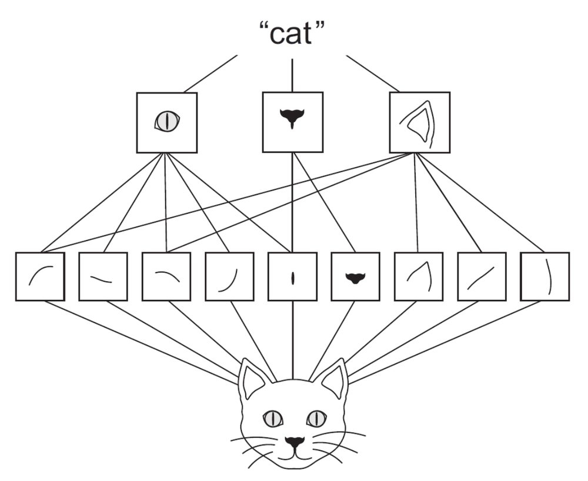
*From the slides.*

## 5.2 Convolution

A **convolution** slides a small matrix of weights, the **kernel** (or filter), over the image. At each position it computes the weighted sum of the pixels under the kernel,
$\mathbf{w}^T\mathbf{x}$, which becomes one value of the output, the **feature map**. The slides animate this position by position: first row, left to right, then the next row, and so on.

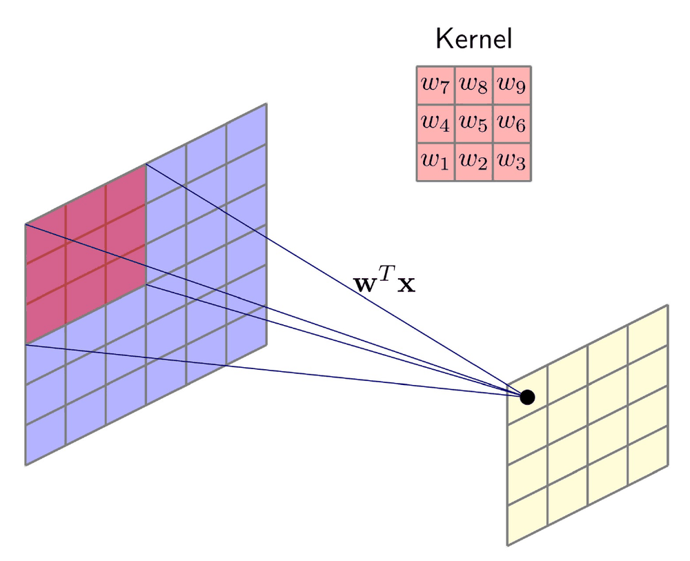
*From the slides.*

> [!NOTE]
> **Not in the slides: a convolution by hand.** A $4 \times 4$ image and a $3 \times 3$ kernel that detects vertical edges (bright on the left, dark on the right):
>
> $$\text{image} = \begin{bmatrix} 9 & 9 & 0 & 0 \\ 9 & 9 & 0 & 0 \\ 9 & 9 & 0 & 0 \\ 9 & 9 & 0 & 0 \end{bmatrix} \qquad \text{kernel} = \begin{bmatrix} 1 & 0 & -1 \\ 1 & 0 & -1 \\ 1 & 0 & -1 \end{bmatrix}$$
>
> Top-left position (rows 1-3, columns 1-3): $(9 + 9 + 9) \cdot 1 + (9+9+9) \cdot 0 + (0+0+0) \cdot (-1) = 27$.
> Top-right position (columns 2-4): $(9+9+9) \cdot 1 + 0 + 0 = 27$. Same for the second row, so the feature map is $\begin{bmatrix} 27 & 27 \\ 27 & 27 \end{bmatrix}$: high everywhere, because every
> window contains the edge. On a uniform image the result would be 0. The kernel **responds to its pattern**, wherever it is.

**What is the number of parameters?** Only the weights of the kernel, $3 \times 3 = 9$ (plus a bias), **whatever the size of the image**: the same kernel is used at every position.

### Why CNNs?

Convolution leverages four ideas:

- **Sparse interactions:** each output depends only on a small window of the input. Fewer parameters to store and fewer operations: $O(k \times n)$ instead of $O(m \times n)$,
  where $m$ is the number of inputs, $n$ the number of outputs and $k$ the size of the kernel ($k \ll m$).
- **Parameter sharing:** the same kernel is used throughout the input, so instead of learning a parameter for each location, only one set of parameters is learnt.
- **Equivariant representations:** if the input shifts, the output shifts in the same way (an eye moved 10 pixels to the right produces the same response, 10 pixels to the right).
- **Ability to work with inputs of variable size:** the kernel can slide over images of any size.

> [!TIP]
> **Not in the slides: the numbers behind sparse interactions.** For a $28 \times 28$ image with a $28 \times 28$ output: a dense layer needs $784 \times 784 = 614{,}656$ weights;
> a $3 \times 3$ convolution needs $9$ weights, and $784 \times 9 = 7{,}056$ multiplications. And the 9 weights are learned from every position of every image, so they get much more training signal.

### Padding

A convolution with a $3 \times 3$ kernel **shrinks the image by 2 pixels** along each dimension: on a $5 \times 5$ image there are only $3 \times 3$ positions where the kernel fits.
To avoid it, use **padding**: add an external border of appropriate width and height (usually of zeros), so that the kernel can be centered on every original pixel.

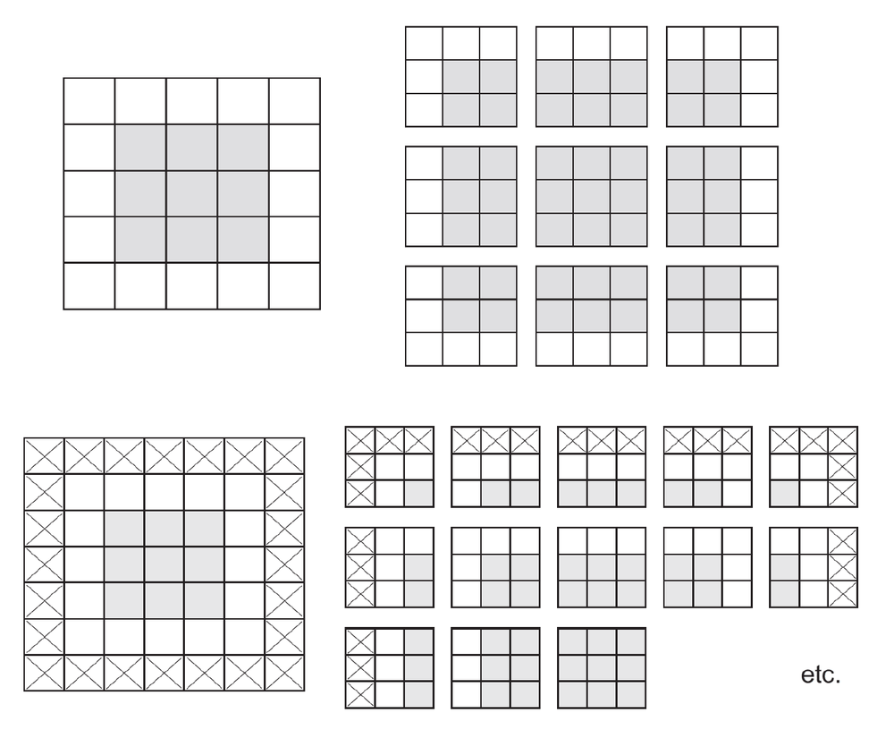
*From the slides.*

### Strides

The positions of the kernel don't have to be contiguous: the distance between two consecutive windows is the **stride**. With a stride of 2, the kernel jumps two pixels at a time,
and the output is about half as large in each dimension.

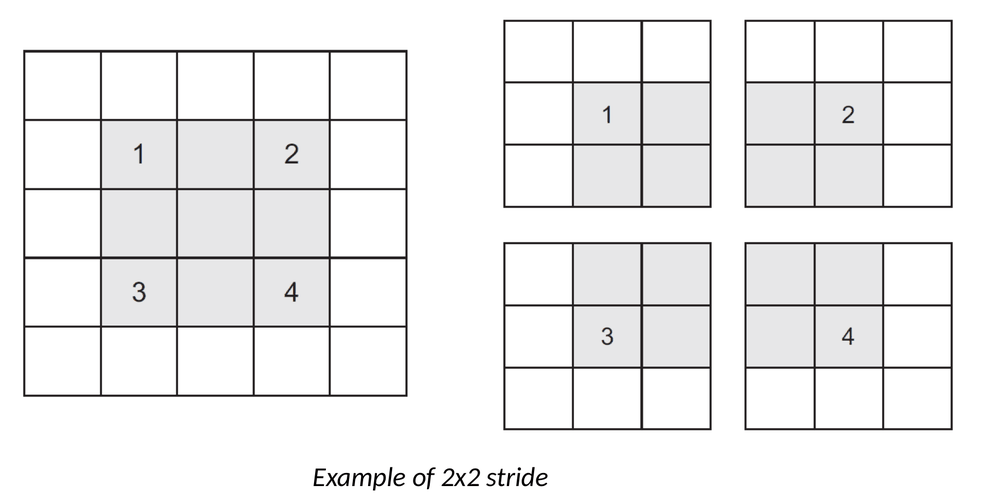
*From the slides.*

> [!TIP]
> **Not in the slides: the output size formula.** For an $n \times n$ input, a $k \times k$ kernel, padding $p$ and stride $s$, the output is $\left\lfloor \dfrac{n + 2p - k}{s} \right\rfloor + 1$ per side.
> Checks against the slides: $5 \times 5$, $k = 3$, no padding: $(5 - 3)/1 + 1 = 3$. With $p = 1$: $(5 + 2 - 3)/1 + 1 = 5$ (same size). With stride 2: $(5 - 3)/2 + 1 = 2$, the 4 windows of the figure.
> In Keras, `padding='valid'` means no padding, `padding='same'` means enough padding to keep the same size (with stride 1).

### Multiple filters

We can use **several kernels** on the same input, and **each kernel produces its own feature map**. Stacked together, the feature maps form the output volume; its depth is the number of filters.
Each kernel learns to detect a different feature (for example horizontal edges, vertical edges, textures).

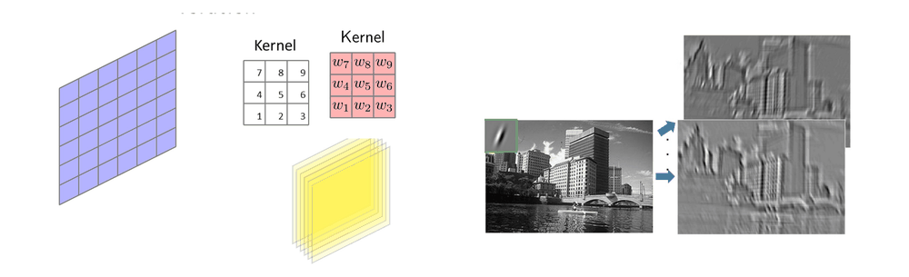
*From the slides.*

**Convolutional networks** are neural networks that use convolution in place of general matrix multiplication in at least one layer. The classic example is **LeNet** (LeCun, 1998),
for handwritten characters: convolutions and subsampling alternate, then fully connected layers produce the output.

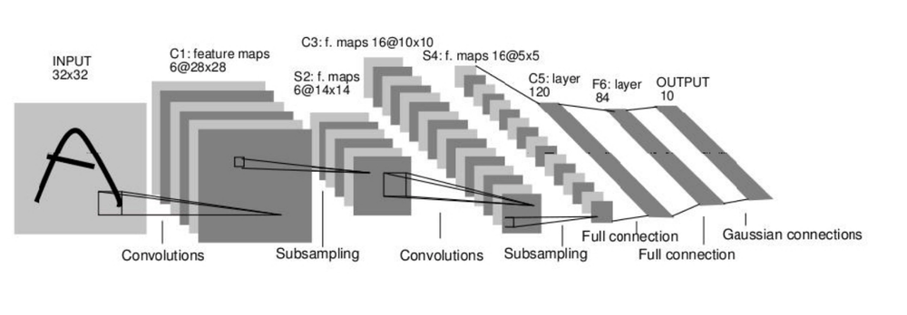
*From the slides.*

## 5.3 Pooling

**Pooling** downsamples a feature map by summarizing each window with a single value. **Max pooling** takes the **maximum** of each window, $\max\lbrace a_i \rbrace$:
with $2 \times 2$ windows and stride 2, a $4 \times 4$ feature map becomes $2 \times 2$.

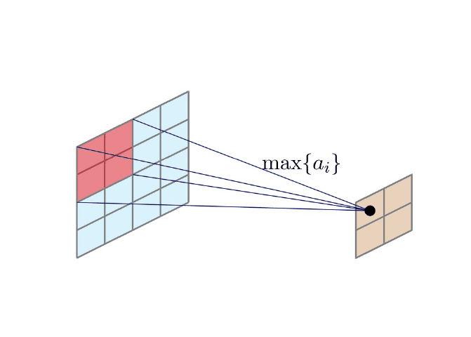
*From the slides.*

> [!NOTE]
> **Not in the slides: why pooling helps.**
>
> $$\begin{bmatrix} 1 & 3 & 2 & 0 \\ 5 & 2 & 1 & 1 \\ 0 & 1 & 4 & 6 \\ 2 & 0 & 3 & 1 \end{bmatrix} \xrightarrow{\ \text{max pool } 2\times2\ } \begin{bmatrix} 5 & 2 \\ 2 & 6 \end{bmatrix}$$
>
> It has **no parameters**. It reduces the size of the data (fewer computations in the next layers). It keeps the strongest response of each region, so a small shift of the feature
> inside a window doesn't change the output. And, as layers stack, each unit "sees" a larger part of the original image, which is what lets the network build the spatial hierarchy of section 5.1.

**A typical CNN** alternates blocks of CONV + RELU, POOL, and ends with fully connected (FC) layers that produce the class scores.

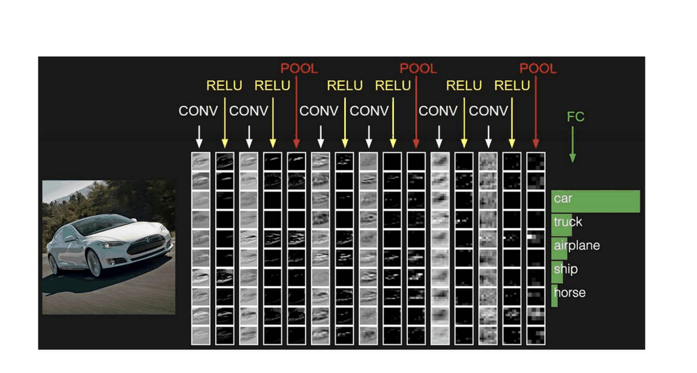
*From the slides.*

**Deep learning and convolution.** The results of the ImageNet challenge (top-5 classification error) show how deeper convolutional networks changed the field:

| Year | Model | Layers | Top-5 error |
|---|---|---|---|
| 2010 | shallow methods | | 28.2% |
| 2011 | shallow methods | | 25.8% |
| 2012 | AlexNet | 8 | 16.4% |
| 2013 | | 8 | 11.7% |
| 2014 | VGG | 19 | 7.3% |
| 2014 | GoogleNet | 22 | 6.7% |
| 2015 | ResNet | 152 | 3.57% |

> [!TIP]
> **Not in the slides: top-5 error.** The model proposes its 5 most likely classes out of 1,000; the answer counts as correct if the true class is among them.
> Humans score around 5% on this task, so by 2015 networks were at human level on it.

## 5.4 Convolution in general

Convolution is not only for 2-D grayscale images:

- it operates on **volumes**: an RGB image is an input of depth 3, and a kernel then spans all the channels (e.g. $3 \times 3 \times 3$);
- it operates on **1-D vectors** too (for example on sequences, see later lessons).

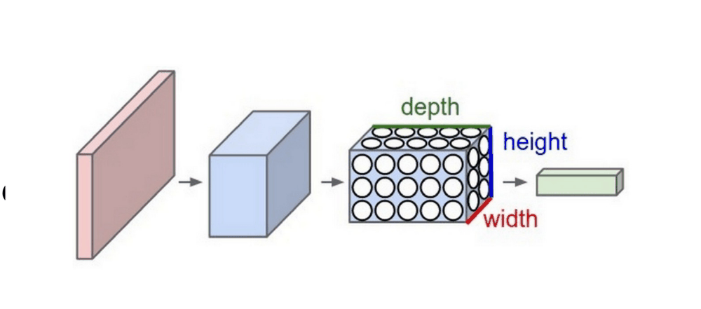
*From the slides.*

## 5.5 Example: CIFAR-10

**CIFAR-10** is a set of 60,000 color images of $32 \times 32$ pixels on 3 channels, in 10 classes (airplane, car, bird, cat, deer, dog, frog, horse, ship, truck): a **multiclass classification** problem.

```python
import tensorflow as tf
from tensorflow.keras import datasets, layers, models, optimizers

IMG_CHANNELS, IMG_ROWS, IMG_COLS = 3, 32, 32
BATCH_SIZE = 128
EPOCHS = 20
CLASSES = 10
VALIDATION_SPLIT = 0.2
OPTIM = tf.keras.optimizers.RMSprop()

def build(input_shape, classes):
    model = models.Sequential()
    model.add(layers.Convolution2D(32, (3, 3), activation='relu', padding='valid',   # 32 filters, 3x3 kernel,
                                   input_shape=input_shape))                         # no padding ('same' to pad)
    model.add(layers.MaxPooling2D(pool_size=(2, 2)))
    model.add(layers.Dropout(0.25))
    model.add(layers.Flatten())
    model.add(layers.Dense(512, activation='relu'))
    model.add(layers.Dropout(0.5))
    model.add(layers.Dense(classes, activation='softmax'))
    return model

(X_train, y_train), (X_test, y_test) = datasets.cifar10.load_data()
X_train, X_test = X_train / 255.0, X_test / 255.0            # pixels from [0, 255] to [0, 1]
y_train = tf.keras.utils.to_categorical(y_train, CLASSES)    # one-hot labels
y_test = tf.keras.utils.to_categorical(y_test, CLASSES)

model = build((IMG_ROWS, IMG_COLS, IMG_CHANNELS), CLASSES)
model.summary()

callbacks = [tf.keras.callbacks.TensorBoard(log_dir='./logs')]   # logs for TensorBoard
model.compile(loss='categorical_crossentropy', optimizer=OPTIM, metrics=['accuracy'])
model.fit(X_train, y_train, batch_size=BATCH_SIZE, epochs=EPOCHS,
          validation_split=VALIDATION_SPLIT, verbose=VERBOSE, callbacks=callbacks)
score = model.evaluate(X_test, y_test, batch_size=BATCH_SIZE, verbose=VERBOSE)
```

- `validation_split=0.2` sets aside the last 20% of the training data for validation, instead of slicing it by hand as in section 3.1.
- **TensorBoard** is a tool that reads the logs written during training and shows the loss and accuracy curves in the browser.

> [!NOTE]
> **Not in the slides: shapes and parameters of this network.**
>
> | Layer | Output shape | Parameters |
> |---|---|---|
> | Conv2D, 32 filters $3 \times 3$, no padding | $30 \times 30 \times 32$ | $(3 \cdot 3 \cdot 3 + 1) \cdot 32 = 896$ |
> | MaxPooling2D $2 \times 2$ | $15 \times 15 \times 32$ | 0 |
> | Dropout, Flatten | $7{,}200$ | 0 |
> | Dense 512 | 512 | $7200 \cdot 512 + 512 = 3{,}686{,}912$ |
> | Dropout, Dense 10 (softmax) | 10 | $512 \cdot 10 + 10 = 5{,}130$ |
> | **Total** | | **3,692,938** |
>
> Each filter spans the 3 color channels, hence $3 \cdot 3 \cdot 3$ weights plus a bias. Note where the parameters are: the convolution has fewer than a thousand, the dense layer after
> `Flatten` more than 99% of them. This is why deeper networks stack several convolution and pooling blocks to shrink the feature maps before flattening.
>
> *Also:* the code of the slide uses `VERBOSE` without defining it (add `VERBOSE = 1` to the constants).

> [!TIP]
> **Not in the slides: the notebook `SimpleCNN.ipynb`.** Among the course sources, this notebook (Chollet, chapter 5.1) trains a deeper convnet on MNIST digits:
> three `Conv2D` layers (32, 64, 64 filters) with two `MaxPooling2D` in between, so the feature maps go $28 \to 26 \to 13 \to 11 \to 5 \to 3$, then `Flatten` ($3 \cdot 3 \cdot 64 = 576$ values),
> `Dense(64)` and `Dense(10, softmax)`. With about 93,000 parameters it reaches a test accuracy of about **99%**, against about 97.8% of a dense network: the error rate drops by about two thirds.

---

# 6. Pre-trained convnets and advanced Keras

*Lesson 5.*

## 6.1 VGG-16

**VGG-16** (the slides write "VCG-16") is a deep convolutional network with **16 layers** with weights: 13 convolutional and 3 fully connected.
It was trained on the **ImageNet ILSVRC-2012** dataset: images of **1,000 classes**, split into training (1.3 million images), validation (50,000) and test (100,000),
each of $224 \times 224$ pixels on 3 channels. It is available in Keras, together with many other pre-trained networks, so building an image-recognition application is rather easy.

Reusing these networks requires some **preprocessing** of the input data, so that it looks like the data the network was trained on.

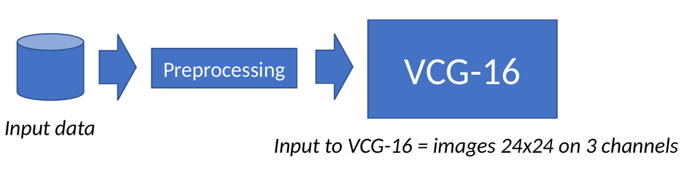
*From the slides. The caption says "24x24": the input images are $224 \times 224$.*

**The Keras constructor** `tf.keras.applications.VGG16(...)` takes these arguments:

| Argument | Meaning |
|---|---|
| `include_top` | whether to include the 3 fully connected layers at the top (the ImageNet classifier) |
| `weights` | `None` (random initialization), `'imagenet'` (pre-trained), or the path of a weights file |
| `input_tensor` | an optional Keras tensor to use as input |
| `input_shape` | only if `include_top=False`; otherwise it must be `(224, 224, 3)`. It must have 3 channels, width and height at least 32 |
| `pooling` | only if `include_top=False`: `None` returns the 4-D output of the last convolutional block; `'avg'` or `'max'` apply global average or max pooling, giving a 2-D output |
| `classes` | number of classes, only with `include_top=True` and no pre-trained weights |
| `classifier_activation` | activation of the top layer (default `'softmax'`; `None` returns the logits) |

### Example: classifying a photo

```python
from tensorflow.keras.applications.vgg16 import VGG16
import numpy as np
import cv2

model = VGG16(weights='imagenet', include_top=True)   # pre-trained on ImageNet
model.compile(optimizer='sgd', loss='categorical_crossentropy')
model.summary()

img = cv2.imread('steam-locomotive.jpg')    # shape (640, 598, 3)
im = cv2.resize(img, (224, 224))            # the size VGG-16 was trained on
im = np.expand_dims(im, axis=0)             # add the batch axis: (1, 224, 224, 3)
im.astype(np.float32)

out = model.predict(im)                     # 1,000 probabilities
index = np.argmax(out)                      # 820
```

The predicted class is **820**, which in the ImageNet list is "steam locomotive": correct.

> [!NOTE]
> **Not in the slides: the structure of VGG-16** (from `model.summary()`). Five blocks of $3 \times 3$ convolutions with `padding='same'`, each followed by a $2 \times 2$ max pooling that halves the size:
>
> | Block | Convolutions | Output |
> |---|---|---|
> | 1 | 2 × 64 filters | $112 \times 112 \times 64$ |
> | 2 | 2 × 128 | $56 \times 56 \times 128$ |
> | 3 | 3 × 256 | $28 \times 28 \times 256$ |
> | 4 | 3 × 512 | $14 \times 14 \times 512$ |
> | 5 | 3 × 512 | $7 \times 7 \times 512$ |
> | top | Flatten (25,088), Dense 4096, Dense 4096, Dense 1000 (softmax) | 1000 |
>
> 13 + 3 = 16 layers with weights, about **138 million parameters**, of which more than 100 million in the first dense layer ($25088 \cdot 4096$). As in section 5.5, the dense layers dominate.

> [!WARNING]
> **Not in the slides: three details of the example code.**
> - `im.astype(np.float32)` returns a new array, which is not assigned, so the line has no effect (write `im = im.astype(np.float32)`).
> - `cv2.imread` loads images in **BGR** order, not RGB. VGG-16 in Keras actually expects BGR with the ImageNet mean subtracted: the proper preprocessing is
>   `from tensorflow.keras.applications.vgg16 import preprocess_input` and `im = preprocess_input(im)`. The example works on this photo anyway, but on other images skipping the
>   preprocessing can lower the accuracy.
> - `compile` is not needed just to predict; it is needed only to train.

## 6.2 Transfer learning

**Transfer learning** reuses the knowledge learned on one task for other tasks. A VGG-16 network can be used for **different classification problems**, but we must focus on the
**first layers**, which extract general features: the deeper layers are too specific to the original application (the 1,000 ImageNet classes).

> [!TIP]
> **Not in the slides: why the first layers are general.** The first convolutions of a trained CNN detect edges, colors and simple textures, useful for almost any image. Deeper layers
> combine them into parts and objects of the training classes (dog faces, wheels). This is the hierarchy of section 5.1: the lower levels transfer well, the top ones don't.

Two ways to use a pre-trained network:

- **Feature extraction:** run the images through VGG-16 up to a given layer, and use its output (the **features**) as the input of a separate, **ad-hoc network** trained for the new problem.
  VGG-16 is used only once per image, as a fixed preprocessing step.
- **Freezing and fine-tuning:** put the ad-hoc network **on top of** VGG-16, in a single model, and **freeze** the weights of the VGG-16 part, so that training updates only the new layers.
  (**Fine-tuning** then means unfreezing some of the top pre-trained layers and training them too, with a small learning rate.)

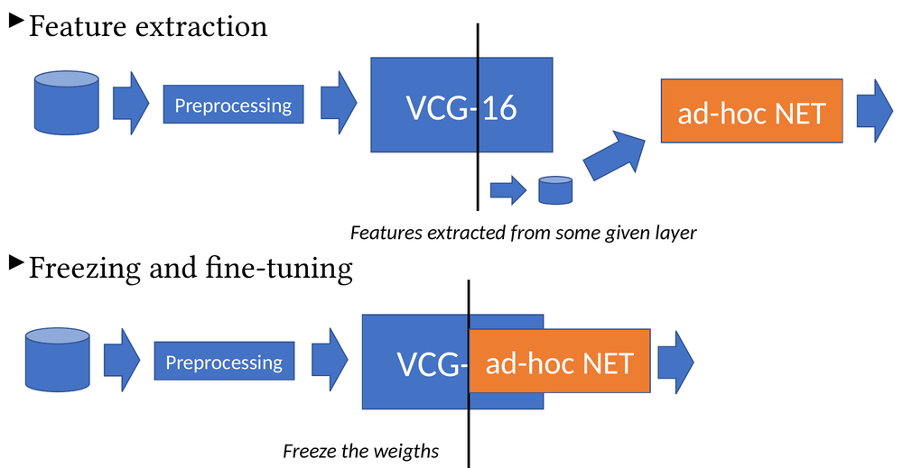
*From the slides.*

> [!NOTE]
> **Not in the slides: the two course notebooks** (`VCG16-features.ipynb`, `VCG16-freezing.ipynb`).
>
> *Feature extraction.* A new model takes VGG-16's input and returns the output of the layer `block4_pool`, of shape $14 \times 14 \times 512$. The notebook resizes some CIFAR-100 images to $224 \times 224$,
> extracts their features, flattens them into vectors of $14 \cdot 14 \cdot 512 = 100{,}352$ values, and trains on them a small classifier (`Dense(256)`, `Dropout(0.5)`, `Dense(100, softmax)`).
>
> ```python
> base_model = VGG16(weights='imagenet', include_top=True)
> extractor = models.Model(inputs=base_model.input,
>                          outputs=base_model.get_layer('block4_pool').output)
> features = extractor.predict(images)            # (n, 14, 14, 512)
> ```
>
> *Freezing.* The same extractor is put inside a `Sequential` model with the classifier on top, and `extracted_model.trainable = False` freezes it:
> the summary shows 7,635,264 non-trainable parameters (the first four VGG blocks) and only 157,028 trainable ones.
>
> Two caveats if you run them: the notebooks train on only 20 images, just to show the mechanics, so the accuracy is meaningless; and the freezing notebook has no `Flatten` between the extractor
> and `Dense(256)`, so the dense layers are applied to each of the $14 \times 14$ positions separately (hence the 157,028 parameters). Add `layers.Flatten()` to get one prediction per image.

## 6.3 Functional API and subclassing

### Limits of sequential models

In many applications information does not just flow from one input to one output through a stack of layers: the `Sequential` model is **not flexible** enough.

- **Multi-input:** the inputs need different kinds of specialized architectures. *Price prediction:* metadata go through a dense module, the text description through an RNN module,
  the picture through a convnet module, and a merging module combines them. *Question answering:* the reference text and the question each go through an embedding and an LSTM, then are concatenated.
- **Multi-output:** we predict heterogeneous kinds of information from the same input. *Novel text classification:* a text-processing module feeds both a genre classifier and a date regressor.
  *Social media analysis:* a 1D convnet on the posts feeds three dense heads predicting age, income and gender.

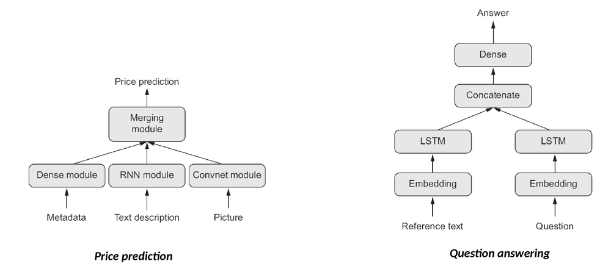
*From the slides.*

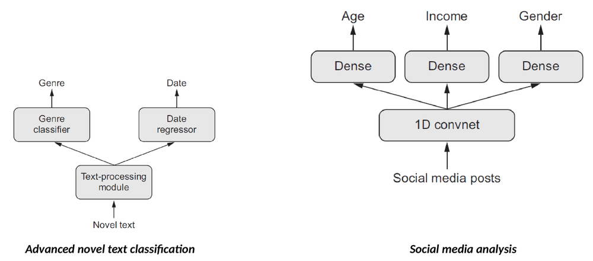
*From the slides.*

- **Advanced architectures** have non-linear topologies. In an **Inception** module, several branches (convolutions of different sizes, pooling) process the same input in parallel and are concatenated.
  In a **residual** connection, the input of a block is **added** to its output, skipping the layers in between.

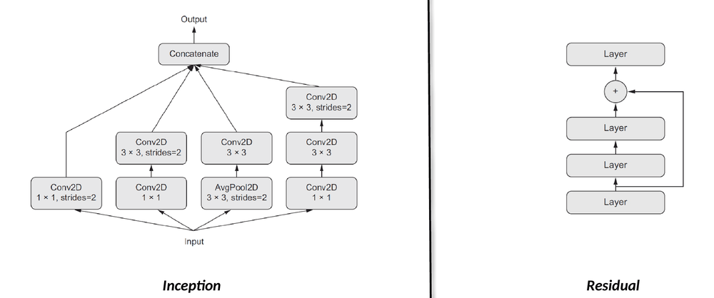
*From the slides.*

> [!TIP]
> **Not in the slides: the functional API** (from the notebook `Functional.ipynb`, the official TensorFlow guide). Layers are called like functions on tensors, and the model is defined by its inputs and outputs,
> so any directed acyclic graph of layers can be built. A two-input model:
>
> ```python
> from tensorflow import keras
> from tensorflow.keras import layers
>
> text_in = keras.Input(shape=(200,), name="text")        # e.g. a vectorized description
> meta_in = keras.Input(shape=(10,), name="metadata")
> t = layers.Dense(64, activation="relu")(text_in)
> m = layers.Dense(16, activation="relu")(meta_in)
> x = layers.concatenate([t, m])                          # merge the two branches
> price = layers.Dense(1, name="price")(x)
> model = keras.Model(inputs=[text_in, meta_in], outputs=price)
> ```
>
> A residual connection is just `y = layers.add([x, block(x)])`, and a multi-output model passes a list to `outputs=[...]` (with one loss per output).

### Subclassing: the object-oriented style

For full control, Keras allows **subclassing**: custom losses, metrics, layers and models written as Python classes.

**Custom loss**, as a function or as a subclass of `keras.losses.Loss`:

```python
def custom_mean_squared_error(y_true, y_pred):
    return tf.math.reduce_mean(tf.square(y_true - y_pred))

model.compile(optimizer=keras.optimizers.Adam(), loss=custom_mean_squared_error)

class CustomMSE(keras.losses.Loss):
    def __init__(self, regularization_factor=0.1, name="custom_mse"):
        super().__init__(name=name)
        self.regularization_factor = regularization_factor

    def call(self, y_true, y_pred):
        mse = tf.math.reduce_mean(tf.square(y_true - y_pred))
        reg = tf.math.reduce_mean(tf.square(0.5 - y_pred))    # penalizes predictions far from 0.5
        return mse + reg * self.regularization_factor

model.compile(optimizer=keras.optimizers.Adam(), loss=CustomMSE())
```

The class version can have parameters (here `regularization_factor`), which a plain function cannot.

**Custom metric**, a subclass of `keras.metrics.Metric` with a **state** kept in weights: `update_state` updates it at each batch, `result` returns the value, `reset_states` clears it
at the start of each epoch. (The slide's example just adds 100 at each batch, to show the mechanics.)

**Custom layer**, a subclass of `layers.Layer` whose `call` method defines the computation. A layer can also add terms to the loss with `self.add_loss(...)` and log metrics with `self.add_metric(...)`:

```python
class ActivityRegularizationLayer(layers.Layer):
    def call(self, inputs):
        self.add_loss(tf.reduce_sum(inputs) * 0.1)   # adds a penalty to the total loss
        return inputs                                 # pass-through layer

inputs = keras.Input(shape=(784,), name="digits")
x = layers.Dense(64, activation="relu")(inputs)
x = ActivityRegularizationLayer()(x)
x = layers.Dense(64, activation="relu")(x)
outputs = layers.Dense(10, name="predictions")(x)
model = keras.Model(inputs=inputs, outputs=outputs)
model.compile(optimizer=keras.optimizers.RMSprop(learning_rate=1e-3),
              loss=keras.losses.SparseCategoricalCrossentropy(from_logits=True))
```

The second example of the slides, `LogisticEndpoint`, is a layer that receives both the targets and the logits, computes the binary cross entropy and the accuracy inside `call`
(`add_loss`, `add_metric`), and returns the softmax of the logits for prediction.

> [!NOTE]
> **Not in the slides: `from_logits=True`.** The last layer above has no activation, so it outputs raw scores (logits, section 3.2). `from_logits=True` tells the loss to apply the softmax itself,
> which is numerically more stable than applying it in the model. Also note: in the custom metric slide, `compile(..., metric=MyMetric())` should be `metrics=[MyMetric()]`.

---

# 7. Autoencoders

*Lesson 6. The part on variational autoencoders uses slides from MIT 6.S191, Introduction to Deep Learning.*

## 7.1 What an autoencoder is

An **autoencoder** is a neural network trained to produce as output ($r$) a **duplicate of its input** ($x$). It has two parts:

- an **encoder** $z = f(x)$, where $z$ is called the **code** of the input; the space of codes is the **latent space**;
- a **decoder** that produces a **reconstruction** $r = g(z)$.

The objective is $x \approx r$, and the loss is $L\big(x, g(f(x))\big)$: how different the reconstruction is from the input.

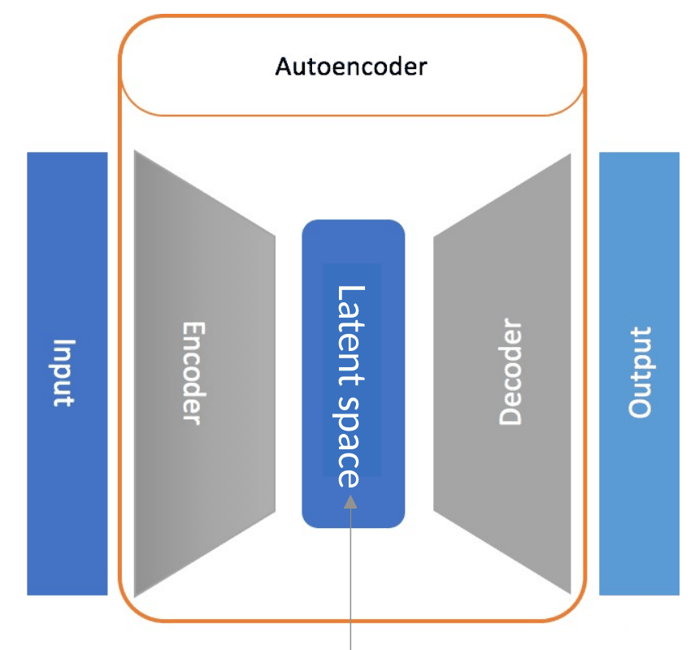
*From the slides.*

**Properties.** A trained autoencoder has **learnt and summarized the main characteristics** of the input data; these characteristics represent the data in a **shorter structure**
(the code), and the statistical properties of the data are summarized in the **latent space** of the network's weights.

> [!NOTE]
> **Not in the slides: why it doesn't just copy.** If the code is smaller than the input (for example 784 pixels squeezed into 64 numbers, a factor of about 12), the network **cannot** copy
> the input: it has to keep only what is most useful to rebuild it. For images of clothes, that means shape and type, not the exact value of every pixel. The code becomes a compressed
> description of the input, learned without any labels: autoencoders are a form of **unsupervised** (or self-supervised) learning.

### Applications

- Forcing $x = r$ exactly carries a **strong risk of overfitting**, but it is useful for **dimensionality reduction** and **feature learning**.
- The real strength of an autoencoder is the ability to **abstract** the data instead of copying it perfectly. Autoencoders are usually restricted to find approximations,
  producing an output that **likely belongs to the input data domain**. This enables: **data generation**, **data completion**, **data reconstruction**, **anomaly detection**.

### Under-complete and over-complete

The code can carry useful information about the input domain.

- An autoencoder whose code is **smaller** than the input is **under-complete**: the code compresses and summarizes the properties of the input.
  When the decoder is linear and $L$ is the mean squared error, the autoencoder learns the same subspace as **PCA**.
- An autoencoder whose code is **bigger** than the input is **over-complete**: the code maps the input into a higher-dimensional domain, acting like a **kernel function** (as in SVMs).

> [!TIP]
> **Not in the slides: PCA and kernels in one line each.** *PCA* (principal component analysis) finds the directions along which the data varies most, and projects the data onto the first few of them:
> a linear compression. A linear autoencoder with MSE loss ends up doing the same thing; with non-linear activations, it can find curved structures that PCA cannot.
> A *kernel* maps the data to a higher-dimensional space where it becomes easier to separate, which is the trick behind SVMs.

## 7.2 Regularized autoencoders

**Issues** of plain autoencoders: the **size of the code**, and an excessive or insufficient fitting capability of encoder and decoder. With too much capacity, an over-complete
autoencoder can learn the identity function and nothing useful.
**Regularized autoencoders** ideally let us choose the code size and the capacity according to the complexity of the data. How? **Change the loss function**, so that it rewards other
properties besides copying the input:

- **sparsity** of the representation;
- **smallness of the derivative** of the representation;
- **robustness** to noise or missing inputs.

**Sparse autoencoders** add a sparsity penalty on the code:

$$L\big(x, g(f(x))\big) + \Omega(z), \qquad \Omega(z) = \lambda \sum_{i \in \lvert h \rvert} \lvert z_i \rvert$$

with $\lambda$ a constant. $\Omega(z)$ penalizes the activation of too many units in the code layer: each unit activates only for a certain type of input, not for all of them
(this is the L1 penalty of section 4.2, applied to activations instead of weights).

**Denoising autoencoders** change the reconstruction term instead:

$$L\big(x, g(f(\tilde{x}))\big)$$

where $\tilde{x}$ is the **input corrupted by some noise**. The network receives the noisy version and must reconstruct the **clean** one, so it must learn the underlying patterns.
The main goal is to **remove corruption** from data.

**Penalizing derivative autoencoders** (also called *contractive*) add a penalty on the gradient of the code with respect to the input:

$$L\big(x, g(f(x))\big) + \Omega(x, z), \qquad \Omega(x, z) = \lambda \sum_{i \in \lvert h \rvert} \lVert \nabla_x z_i \rVert^2$$

The model is forced to learn a function that **does not change much when $x$ changes slightly**.

> [!NOTE]
> **Not in the slides: the denoising example of the notebook `Autoencoder.ipynb`** (from the TensorFlow tutorials). Fashion-MNIST images get Gaussian noise
> (`x + 0.2 * random_normal`, clipped to $[0, 1]$). A convolutional autoencoder is trained with **noisy images as input and clean images as target**:
>
> ```python
> class Denoise(Model):
>     def __init__(self):
>         super().__init__()
>         self.encoder = tf.keras.Sequential([
>             layers.Input(shape=(28, 28, 1)),
>             layers.Conv2D(16, (3, 3), activation='relu', padding='same', strides=2),   # 28 -> 14
>             layers.Conv2D(8, (3, 3), activation='relu', padding='same', strides=2)])   # 14 -> 7
>         self.decoder = tf.keras.Sequential([
>             layers.Conv2DTranspose(8, kernel_size=3, strides=2, activation='relu', padding='same'),   # 7 -> 14
>             layers.Conv2DTranspose(16, kernel_size=3, strides=2, activation='relu', padding='same'),  # 14 -> 28
>             layers.Conv2D(1, kernel_size=(3, 3), activation='sigmoid', padding='same')])
>     def call(self, x):
>         return self.decoder(self.encoder(x))
>
> autoencoder.fit(x_train_noisy, x_train, epochs=10, validation_data=(x_test_noisy, x_test))
> ```
>
> The encoder uses convolutions with stride 2 to shrink the image; the decoder uses **transposed convolutions** (`Conv2DTranspose`) to enlarge it back (see section 8, lesson 7 material).
> The same notebook has a plain dense autoencoder (784 → 64 → 784) and an **anomaly detection** example: an autoencoder trained only on **normal** heartbeats (ECG) reconstructs them well
> and reconstructs abnormal ones badly, so a reconstruction error above a threshold (mean + one standard deviation of the training errors) flags an anomaly.

## 7.3 Variational autoencoders (VAE)

To avoid overfitting and to increase generality, we can add **random sampling** in the middle of the network:

- **sub-net₁** (the encoder, with parameters $\theta$) computes two parameters of a Gaussian distribution, a mean $\mu$ and a variance $\Sigma$;
- the **sampler** uses them to sample the code: $z \sim \mathcal{N}(\mu, \Sigma)$;
- **sub-net₂** (the decoder, with parameters $\phi$) generates the output from $z$.

The encoder samples $z \sim q_\theta(z \mid x)$; the decoder generates $r \approx x$, reconstructing $x \sim p_\phi(x \mid z)$.

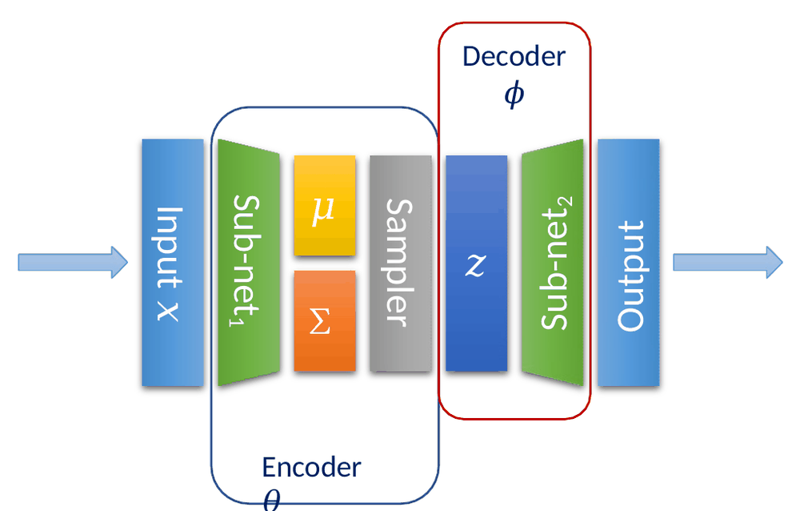
*From the slides.*

> [!WARNING]
> **Not in the slides: a notation clash.** In the lesson's own slides the encoder has parameters $\theta$ and the decoder $\phi$; in the MIT slides that follow it is the opposite
> (encoder $q_\phi(z \mid x)$, decoder $p_\theta(x \mid z)$). The meaning is the same: one set of weights for the encoder, one for the decoder. Below I follow the MIT notation, used in the loss formulas.

> [!TIP]
> **Not in the slides: why sample.** A plain autoencoder maps each input to **one point** of the latent space; the space between those points means nothing, so decoding a random point gives garbage.
> A VAE maps each input to a **small cloud** (a Gaussian), and trains the decoder to rebuild the input from any point of the cloud. Neighboring points must then decode to similar outputs,
> and the whole latent space becomes usable to **generate** new data.

### The VAE loss

$$\mathcal{L}(\phi, \theta, x) = \text{(reconstruction loss)} + \text{(regularization term)}$$

- The **reconstruction loss** measures how well the output matches the input, e.g. $\lVert x - \hat{x} \rVert^2$ (or a log-likelihood).
- The **regularization term** is $D\big(q_\phi(z \mid x) \,\Vert\, p(z)\big)$: a distance between the **inferred latent distribution** produced by the encoder and a **fixed prior** $p(z)$.

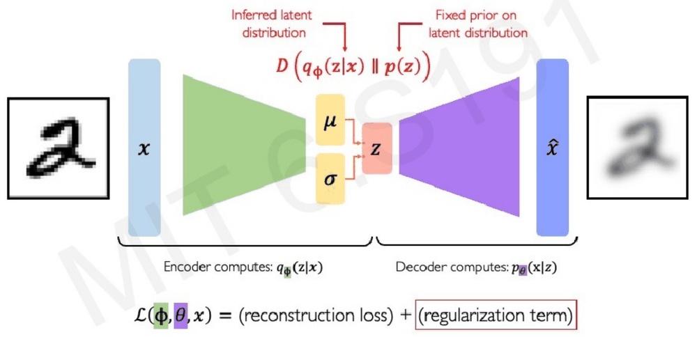
*From the slides (MIT 6.S191).*

**The prior.** The common choice is the standard **normal** $p(z) = \mathcal{N}(\mu = 0, \sigma^2 = 1)$. It encourages the encodings to spread evenly around the center of the latent space,
and penalizes the network when it tries to "cheat" by clustering points in specific regions (i.e. by memorizing the data). The distance used is the **KL divergence** between the two distributions:

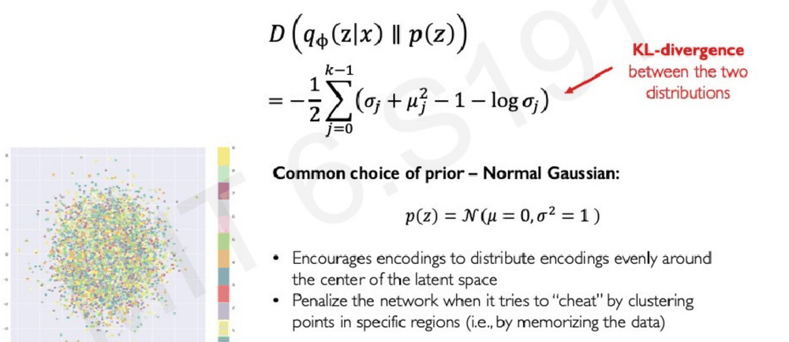
*From the slides (MIT 6.S191).*

> [!WARNING]
> **Not in the slides: check the KL formula.** The slide writes $-\frac{1}{2}\sum_{j}(\sigma_j + \mu_j^2 - 1 - \log\sigma_j)$. For a Gaussian $\mathcal{N}(\mu, \sigma^2)$ against $\mathcal{N}(0, 1)$, the KL divergence is
>
> $$D_{KL} = \frac{1}{2}\sum_{j}\left(\sigma_j^2 + \mu_j^2 - 1 - \log\sigma_j^2\right)$$
>
> with a **plus** sign (a KL divergence is never negative), and with the **variance** $\sigma_j^2$ (the slide's formula is right if its $\sigma_j$ denotes the variance).
> It is 0 exactly when $\mu = 0$ and $\sigma^2 = 1$, i.e. when the encoding already matches the prior. For example, $\mu = 1$, $\sigma^2 = 0.5$ gives $\frac{1}{2}(0.5 + 1 - 1 - \ln 0.5) \approx 0.60$.
> The notebook `VAE.ipynb` computes exactly this, from $\log\sigma^2$: `kl_loss = -0.5 * reduce_mean(z_log_var - square(z_mean) - exp(z_log_var) + 1)`.

**Intuition on regularization.** We want two properties from the latent space:

1. **Continuity:** points close in latent space decode to similar content;
2. **Completeness:** any point sampled from the latent space decodes to "meaningful" content.

Encoding as a distribution does not guarantee them by itself: with very small variances (pointy distributions) or very different means, the encodings become isolated islands with gaps between them.
The normal prior **centers the means and regularizes the variances**, so that the clouds overlap. This enforces an **information gradient** in the latent space: moving smoothly between points
changes the decoded content smoothly.

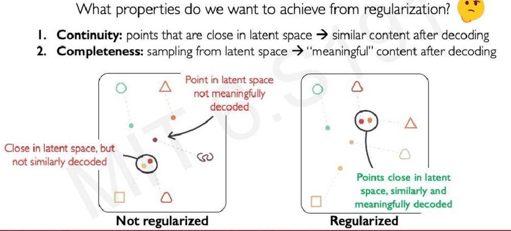
*From the slides (MIT 6.S191).*

### The reparametrization trick

**Problem:** we cannot backpropagate gradients through a **sampling** layer: drawing a random number is not a differentiable function of $\mu$ and $\sigma$.

**Key idea:** instead of sampling $z \sim \mathcal{N}(\mu, \sigma^2)$ directly, write the sampled vector as a **fixed** $\mu$ plus a **fixed** $\sigma$ scaled by random constants drawn from the prior:

$$z = \mu + \sigma \odot \varepsilon, \qquad \varepsilon \sim \mathcal{N}(0, 1)$$

where $\odot$ is the element-wise product. The randomness moves into $\varepsilon$, which is an **input** that needs no gradient, while $z$ becomes a deterministic function of $\mu$, $\sigma$ and $\varepsilon$:
gradients can flow back to $\mu$ and $\sigma$, and through them to the encoder.

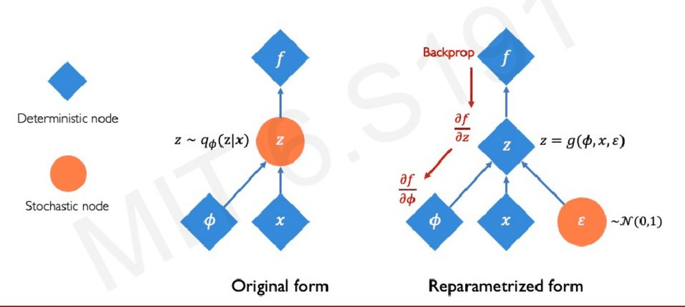
*From the slides (MIT 6.S191): in the original form $z$ is a stochastic node that blocks backpropagation; in the reparametrized form the stochastic node is $\varepsilon$.*

> [!NOTE]
> **Not in the slides: in code** (`VAE.ipynb`, a sampling layer written with subclassing, section 6.3). The encoder outputs the mean and the **log** of the variance, which can be any real number:
>
> ```python
> class Sampling(layers.Layer):
>     def call(self, inputs):
>         z_mean, z_log_var = inputs
>         epsilon = tf.keras.backend.random_normal(shape=tf.shape(z_mean))
>         return z_mean + tf.exp(0.5 * z_log_var) * epsilon      # sigma = exp(0.5 * log(sigma^2))
> ```
>
> *Why $\partial z / \partial \mu = 1$ and $\partial z / \partial \sigma = \varepsilon$:* both are ordinary derivatives of $\mu + \sigma\varepsilon$, so backpropagation works as in section 2.5.
> With $\mu = 2$, $\sigma = 0.5$ and a drawn $\varepsilon = -1.2$: $z = 2 + 0.5 \cdot (-1.2) = 1.4$.

---

# 8. Building blocks: batch normalization, transposed convolution, leaky ReLU

*Lesson 7. This lesson has no slides: the material consists of three readings (two articles on batch normalization and on the transposed convolution, and the Wikipedia page on
the rectifier). They introduce layers used by the architectures of the next lessons (U-Net, GANs).*

## 8.1 Batch normalization

### Why normalize

It is standard practice to normalize input data to **zero mean and unit variance**, feature by feature (as for Boston housing, section 3.3): for each feature, compute the mean and variance
over the dataset and apply $\hat{x} = (x - \mu)/\sigma$.

**Why:** suppose feature $x_1$ ranges from 1 to 5 and $x_2$ from 1,000 to 99,999. The network learns weights on very different scales, and the loss landscape becomes a **narrow ravine**:
steep along one direction, gentle along the other. Gradient descent makes large updates along the steep direction, **bouncing** from one side of the ravine to the other, and small updates
along the gentle one, so it takes many steps to converge. With features on the same scale the landscape looks more like a **bowl**, and gradient descent goes smoothly to the minimum.

### The idea of Batch Norm

From the point of view of layer 2, the activations of layer 1 are just its **inputs**. The same reasoning that makes us normalize the input applies to **every hidden layer**.
A **Batch Norm layer** is inserted between two layers and normalizes the activations of the first before they reach the second.

It has its own parameters:

- two **learnable** parameters, **$\gamma$** (gamma) and **$\beta$** (beta), trained by backpropagation like weights;
- two **non-learnable** parameters, the **moving averages of the mean and the variance**, saved as the layer's state.

Each Batch Norm layer has its own copy of these parameters.

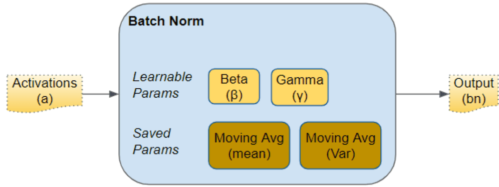
*From the reading (image by the article's author).*

### The computation, on a mini-batch

For each feature $i$ (each column of the activations), over the $M$ samples of the mini-batch:

1. **Activations** $A_i$ arrive from the previous layer.
2. **Mean and standard deviation:** $\mu_i = \frac{1}{M}\sum A_i$, $\ \sigma_i = \sqrt{\frac{1}{M}\sum (A_i - \mu_i)^2}$.
3. **Normalize:** $\hat{A}_i = \dfrac{A_i - \mu_i}{\sigma_i}$, now with zero mean and unit variance.
4. **Scale and shift:** $BN_i = \gamma \odot \hat{A}_i + \beta$ (element-wise). This is the key innovation: the layer can move the values to **a different mean and variance**, and since $\gamma$ and $\beta$
   are learned, each Batch Norm layer finds the best ones for itself.
5. **Moving average:** it keeps an exponential moving average of the mean and variance, $\mu_{mov} = \alpha\,\mu_{mov} + (1 - \alpha)\,\mu_i$ (the same for $\sigma$), with $\alpha$ a "momentum"
   that has nothing to do with the optimizer's momentum. During training it is only computed and stored.

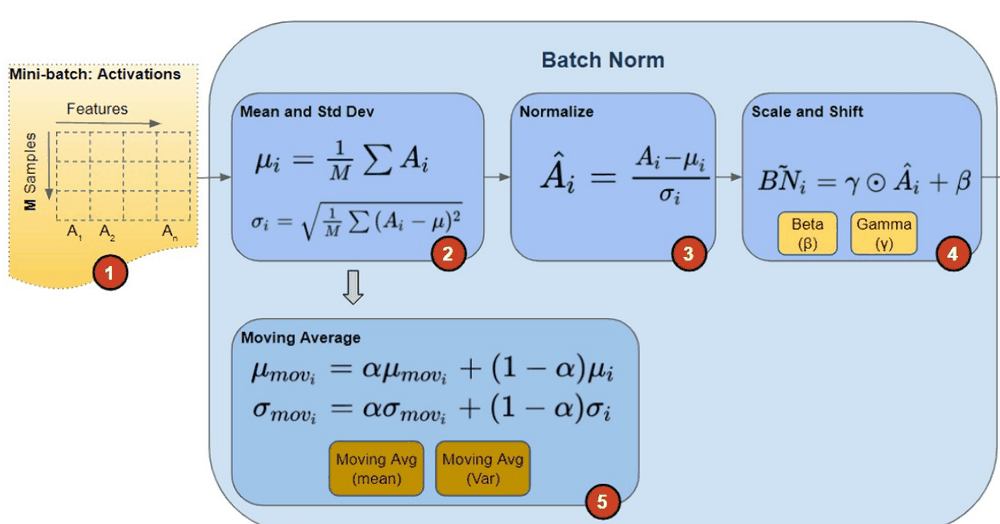
*From the reading.*

> [!NOTE]
> **Not in the reading: a small example.** One feature with values $2, 4, 6, 8$ in a mini-batch of 4. Mean $\mu = 5$, standard deviation $\sigma = \sqrt{(9 + 1 + 1 + 9)/4} = \sqrt{5} \approx 2.24$.
> Normalized: $-1.34, -0.45, 0.45, 1.34$. With learned $\gamma = 2$, $\beta = 1$: $-1.68, 0.11, 1.89, 3.68$, now with mean 1 and standard deviation 2.
> Note that with $\gamma = \sigma$ and $\beta = \mu$ the layer would give back the original values: Batch Norm can always "undo itself" if normalization doesn't help.
> (In practice a tiny $\epsilon$ is added under the square root to avoid dividing by zero.)

**At inference** there is a single sample, not a mini-batch, so there is no batch mean or variance to compute. The layer uses the **moving averages saved during training**, a cheap proxy for the mean
and variance of the whole training data.

**Where to place it:** before or after the activation function. The original paper puts it before; both are common.

> [!TIP]
> **Not in the reading: the link with the U-Net lesson.** Because the mean and variance are estimated on the mini-batch, very small batches give noisy estimates: this is why the U-Net slides
> (section 9) recommend a batch size of at least 4 with Batch Norm. In Keras the layer is `layers.BatchNormalization()`.

## 8.2 Transposed convolution

A convolution without padding maps a $4 \times 4$ input to a $2 \times 2$ output. The **transposed convolution** goes the other way: from a small matrix to a larger one, which is needed
by networks that must **produce an image** (the decoders of autoencoders, U-Net, GANs).

**How it works.** Instead of multiplying a window of the input by the kernel and summing, **multiply each single input value by the whole kernel**, place the resulting matrix at the position
of that value in the output, and **sum where the matrices overlap**.

*Example from the reading:* input $\begin{bmatrix} 55 & 52 \\ 57 & 50 \end{bmatrix}$, kernel $\begin{bmatrix} 1 & 2 & 1 \\ 2 & 1 & 2 \\ 1 & 1 & 2 \end{bmatrix}$. Each value gives a $3 \times 3$ matrix
($55 \times$ kernel, $52 \times$ kernel, …); placed one step apart and summed they give a $4 \times 4$ output whose top row is $55, 162, 159, 52$.

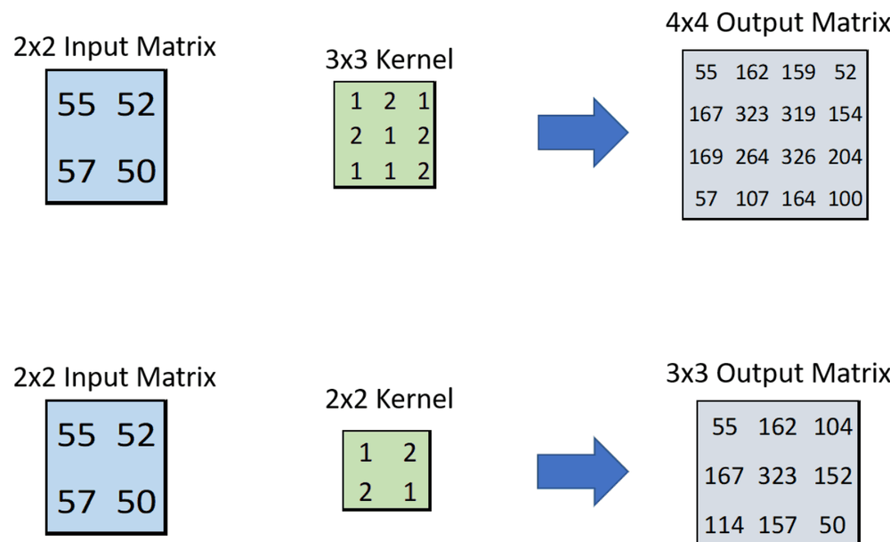
*From the reading: with a $3 \times 3$ kernel the $2 \times 2$ input becomes $4 \times 4$; with a $2 \times 2$ kernel, $3 \times 3$.*

> [!NOTE]
> **Not in the reading: checking two entries.** Top-left: only $55$ reaches it, times the kernel's top-left $1$: $55$. Second entry of the top row: $55 \cdot 2$ (from $55$'s kernel) $+ 52 \cdot 1$
> (from $52$'s kernel, shifted one step) $= 110 + 52 = 162$. The same input $\begin{bmatrix} 55 & 52 \\ 57 & 50 \end{bmatrix}$ is the result of the ordinary convolution of the reading's $4 \times 4$ matrix with the same kernel:
> the transposed convolution restores the **shape**, not the original values. It is not an inverse, and its kernel is learned like any other.

Compared with the normal convolution, the parameters act in the opposite direction:

| Parameter | Convolution | Transposed convolution |
|---|---|---|
| **Kernel size** | larger kernel → **smaller** output | larger kernel → **larger** output (each value is spread over a broader area) |
| **Strides** | how fast the kernel moves on the **input**: larger stride → smaller output | how fast it moves on the **output**: larger stride → larger output |
| **Padding `'valid'`** | no padding, the output shrinks | the output is larger than the input |
| **Padding `'same'`** | output = input size / stride | output = input size × stride (the central part is kept) |

In Keras: `layers.Conv2DTranspose(filters, kernel_size, strides, padding)`. With `strides=2, padding='same'` it doubles the height and width, as in the denoising decoder of section 7.2 ($7 \to 14 \to 28$).

## 8.3 ReLU and its variants

The **rectifier** or **ReLU** is $f(x) = \max(0, x)$: the input itself if positive, 0 otherwise.

- **Advantages:** sparse activation (in a randomly initialized network only about half of the units are active); **fewer vanishing gradients** than sigmoid and tanh, which saturate in both directions (section 2.6);
  very cheap (a comparison); scale-invariant, $\max(0, ax) = a\max(0, x)$ for $a \ge 0$.
- **Problems:** not differentiable at 0 (the derivative there is set by convention to 0 or 1); not zero-centered (outputs are never negative); unbounded; and the **dying ReLU** problem: a neuron can
  be pushed into a state where its input is negative for essentially every example, so its output and its gradient are always 0 and it never learns again. It typically happens with a learning rate that is too high.

**Leaky ReLU** keeps a small slope for negative inputs, so the gradient never vanishes completely:

$$f(x) = \begin{cases} x & \text{if } x > 0 \\ 0.01\,x & \text{otherwise} \end{cases} \qquad f'(x) = \begin{cases} 1 & \text{if } x > 0 \\ 0.01 & \text{otherwise} \end{cases}$$

**Parametric ReLU (PReLU)** makes the slope $a$ a learned parameter: $f(x) = \max(x, ax)$ for $a \le 1$.

Other variants in the reading: **GELU** ($x \cdot \Phi(x)$, with $\Phi$ the normal cumulative distribution; the default in BERT), **SiLU/swish** ($x \cdot \text{sigmoid}(x)$), **softplus** ($\ln(1 + e^x)$,
a smooth ReLU whose derivative is the sigmoid), **ELU** ($a(e^x - 1)$ for negative $x$, pushing the mean activation towards 0).

> [!TIP]
> **Not in the reading: where you'll meet it.** Leaky ReLU is the usual activation in the discriminators of GANs (section 10), where a dead unit would stop useful gradients from reaching the generator.
> In Keras: `layers.LeakyReLU(0.2)` (a slope of 0.2 is common in GANs), placed as a separate layer after a `Dense` or `Conv2D` without activation.

---

# 9. U-Net and image segmentation

*Lesson 8.*

## 9.1 The problem: medical image segmentation

Medical images come in **many modalities**, 2D or 3D (possibly over time), with different physics: MRI, CT scans, PET, echocardiography, fundus examination, dermatology photos.
**Computer-aided diagnosis (CAD)** needs to detect pathologies (present or not, malignant or not) and to measure them (size, area, volume, shape). The processing involved includes reconstruction,
filtering (denoising, deblurring), registration (aligning images), **segmentation** (delineating organs and lesions), feature extraction and analysis.
Many of these tasks need, or reduce to, a **segmentation** problem, which is **hard**. Manual segmentation with tools such as 3D Slicer or GIMIAS is slow.

> [!TIP]
> **Not in the slides: segmentation vs classification.** Classification gives **one label per image** ("this scan shows a tumor"). Segmentation gives **one label per pixel** ("these pixels are the tumor"):
> the output is an image of the same size as the input, a mask. This is why U-Net needs a decoder that brings the resolution back up.

## 9.2 U-Net

**U-Net** was proposed by **Ronneberger et al. in 2015**, and was a revolution: on its benchmark the IoU went from **46% to 77%**. It works in 2D and was extended to 3D; it has many "children":
3D U-Net, V-Net, UNet++, UNet 3+, ResUNet.

> [!NOTE]
> **Not in the slides: IoU.** The *intersection over union* compares the predicted mask $P$ with the true one $T$: $\text{IoU} = \lvert P \cap T \rvert / \lvert P \cup T \rvert$.
> If the true region has 100 pixels, the prediction has 80 pixels and 60 of them are correct, the union has $100 + 80 - 60 = 120$ pixels and $\text{IoU} = 60/120 = 0.5$. 1 is a perfect match, 0 no overlap.

**Architecture.** An **encoder** (left, contracting) and a **decoder** (right, expanding), drawn as a U:

- **encoder:** at each level, two $3 \times 3$ convolutions with ReLU, then a $2 \times 2$ max pooling, which halves the size ($N \times N \to N/2$, i.e. $N^2/4$ pixels) while the number of filters doubles
  (32, 64, 128, 256);
- **decoder:** at each level, an **up-convolution** $2 \times 2$ doubles the size, the result is **concatenated** with the feature maps of the encoder at the same level (the grey **copy** arrows,
  the *skip connections*), then two $3 \times 3$ convolutions with ReLU;
- **output:** a $1 \times 1$ convolution with one channel per class; the **argmax** over the classes is done outside the network (in the loss or metric, or for display).

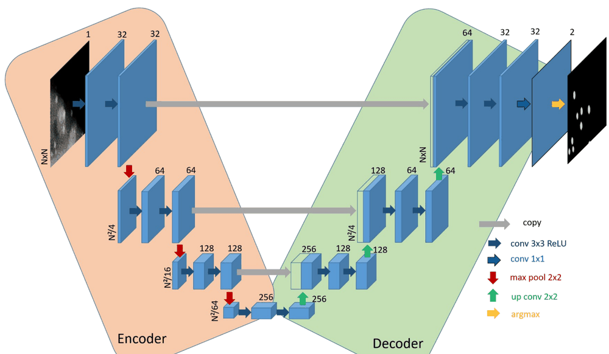
*From the slides.*

> [!TIP]
> **Not in the slides: why the skip connections.** Pooling throws away *where* things are to learn *what* they are: at the bottom of the U the network knows there is a tumor but the map is tiny.
> The decoder must draw precise boundaries at full resolution, and the copied encoder features give it the fine spatial details lost on the way down.

**The operations** (with Keras code from the slides):

- `Conv2D(1, (3,3), strides=(1,1), padding='same')`: a $3 \times 3$ convolution with stride 1 and padding keeps the size;
- `MaxPooling2D((3,3), strides=(1,1), padding='valid')`: the slides' pooling example, a $3 \times 3$ window with stride 1 and no padding;
- upsampling, two ways: `UpSampling2D((2,2), interpolation='nearest')` (or `'bilinear'`) repeats or interpolates values, with no parameters; `Conv2DTranspose(1, (3,3), strides=(2,2), padding='same')`
  is a learned transposed convolution (section 8.2).

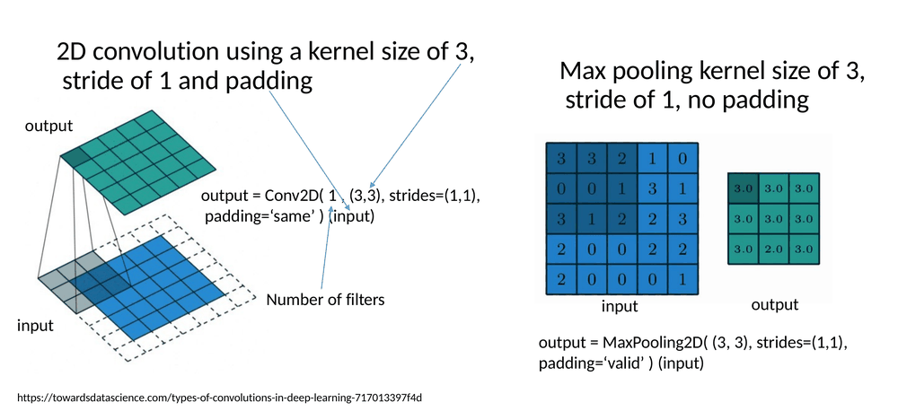
*From the slides.*

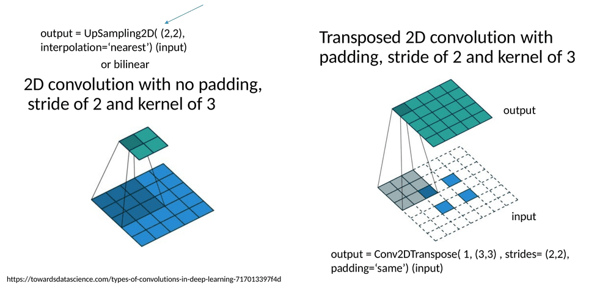
*From the slides.*

**Encoder block** (returns the output for the next level and the features to copy):

```python
c = Conv2D(filters, (3, 3), activation='relu', kernel_initializer=kernel_initializer, padding='same')(inputs)
c = Conv2D(filters, (3, 3), activation='relu', kernel_initializer=kernel_initializer, padding='same')(c)
enc_layer = c                         # copied to the decoder
outputs = MaxPooling2D((2, 2))(c)     # N x N -> N/2 x N/2
```

**Decoder block:**

```python
c = Conv2DTranspose(filters, (2, 2), strides=(2, 2), padding='same')(inputs)   # N/2 -> N
c = Concatenate()([c, enc_layer])                                              # skip connection
c = Conv2D(filters, (3, 3), activation='relu', kernel_initializer=kernel_initializer, padding='same')(c)
outputs = Conv2D(filters, (3, 3), activation='relu', kernel_initializer=kernel_initializer, padding='same')(c)
```

**Output:** `outputs = Conv2D(num_classes, (1, 1), activation='sigmoid')(inputs)`.

> [!NOTE]
> **Not in the slides: two details.** In the slide the third line of the decoder applies the convolution to `inputs`; it must be applied to `c`, the concatenated tensor, as written above
> (otherwise the skip connection is lost). And a $1 \times 1$ convolution is just a dense layer applied to each pixel: it mixes the channels of a pixel into class scores without looking at the neighbors.
> Since U-Net is not a simple stack (it has skip connections), it must be built with the **functional API** of section 6.3.

## 9.3 Regularization and other uses

The slides report experiences on medical data (Nguyen, 2020), with a warning: **"in fact, this is only true for some studies!"**

- **Batch normalization** can produce noisy learning: consider standardizing your medical data instead; with Batch Norm, the batch size should not be under 4.
- **Dropout:** efficiency improvements observed.
- **L1, L2 or ElasticNet** (L1 + L2) regularization seems to help learning and produces more accurate filtering.
- **Post-processing** is often needed, to remove extra regions and to fill holes in regions.

**Other uses of U-Net:** correcting reconstruction artefacts (for example in tomography with noisy data and missing angles), and learning filters (total variation, denoising),
even without clean data (**Noise2Noise**, Lehtinen 2018).

The source of the lesson's code is the Kaggle notebook "U-Net from scratch using Keras and TensorFlow".

---

# 10. Generative adversarial networks: GANs, pix2pix, CycleGAN

*Lesson 9. The second part (conditional GANs, pix2pix, CycleGAN) uses slides from MIT 6.S191.*

## 10.1 Generative modeling

In **generative modeling** we want to train a network that **models a distribution**, for example a distribution over images. One way to judge the quality of the model is to **sample** from it:
the field has progressed very fast, from blurry faces around 2014 to photorealistic ones by 2018. The slides show three examples: predicting the next frames of a video (Lotter et al., 2015),
**super-resolution** where it is hard to tell which image is computer-generated (Ledig et al., 2016), and interactive image editing (iGAN, Berkeley).

### Implicit generative models

**Implicit generative models** define a probability distribution **implicitly**:

1. start by sampling a **code vector** $z$ from a fixed, simple distribution (e.g. Gaussian or uniform);
2. a **generator network** computes a differentiable function $G$ mapping $z$ to a point $x = G(z)$ in data space.

We never write down the probability of an image: we only have a way to **produce** samples.

**1-dimensional example.** The input distribution is a Gaussian; the network computes an S-shaped function; pushing the Gaussian samples through it gives a very different output distribution,
here with two peaks at the extremes. The shape of the function determines the shape of the output distribution.

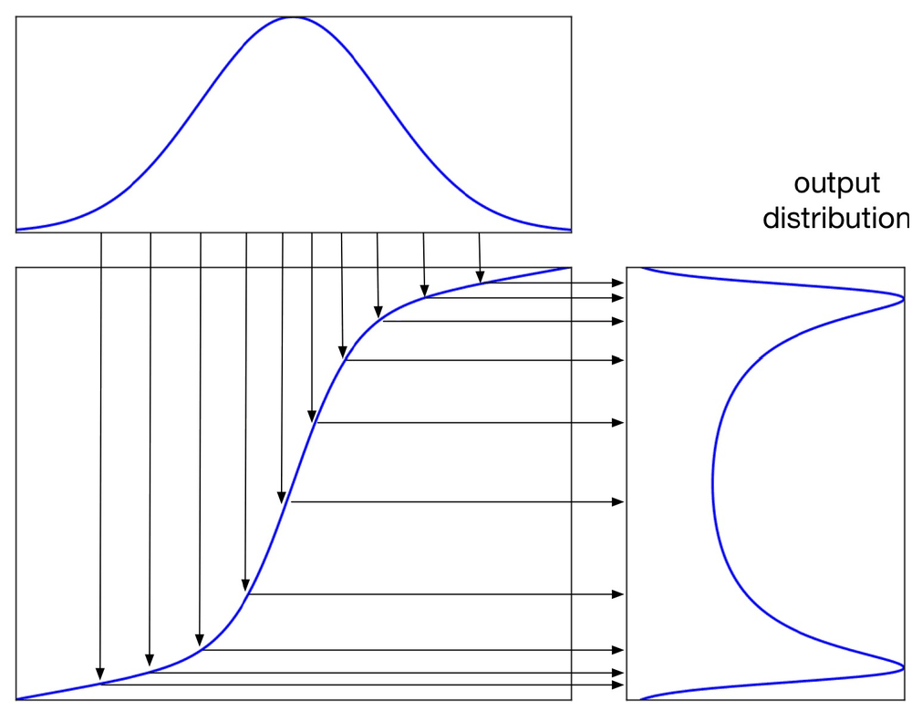
*From the slides.*

**2-dimensional example.** A generative model with parameters $\theta$ maps a unit Gaussian to a generated distribution $\hat{p}(x)$ in image space; training adjusts $\theta$ so that a **loss** between $\hat{p}(x)$
and the true data distribution $p(x)$ decreases.

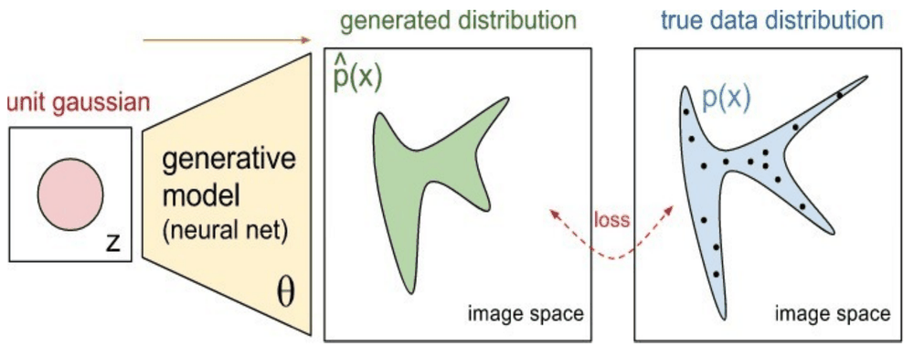
*From the slides (source: OpenAI blog).*

In general: each dimension of the code vector is sampled independently from a simple distribution, fed to a deterministic generator network, and the network outputs an image.

> [!NOTE]
> **Not in the slides: the 1-D example with numbers.** Take $z$ uniform in $[0, 1]$ and $G(z) = -\ln(1 - z)$. Half of the samples ($z < 0.5$) end up below $-\ln 0.5 \approx 0.69$, and the output follows an
> exponential distribution: many small values, few large ones. The same uniform noise, through a different $G$, gives a different distribution. A GAN learns $G$ so that its outputs look like the training data.

## 10.2 GANs

**The advantage of implicit generative models:** if we have **some criterion to evaluate the quality of samples**, we can compute its gradient with respect to the network's parameters and update them
to make the samples a little better. **Generative adversarial networks** (GANs) *learn* this criterion, with two networks:

- the **generator** $G$ tries to produce realistic-looking samples;
- the **discriminator** $D$ tries to tell whether an image comes from the **training set** or from the **generator**;
- the generator tries to **fool** the discriminator.

$z$ is random noise (Gaussian or uniform), and can be thought of as the **latent representation** of the image. $D(x)$ is the probability that $x$ is real; $D(G(z))$ is the probability the discriminator
assigns to a generated image. Both networks are **differentiable**, so the error can be backpropagated through both.

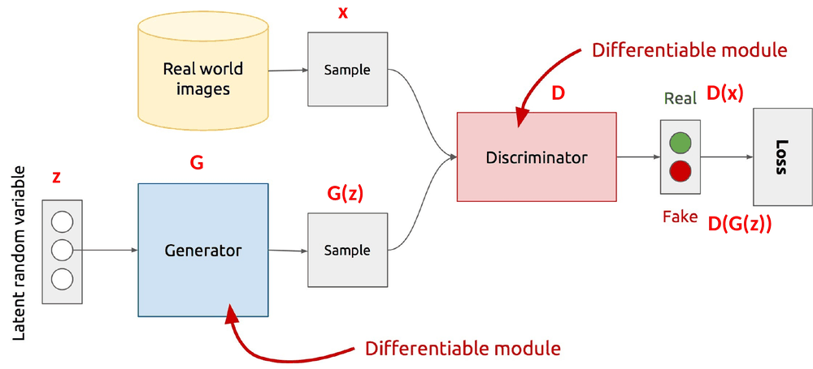
*From the slides.*

> [!TIP]
> **Not in the slides: the counterfeiter analogy.** The generator is a counterfeiter printing fake banknotes, the discriminator a police officer checking them. At first both are bad; each time the officer learns
> to spot a flaw, the counterfeiter learns to fix it. If training goes well, the fakes end up indistinguishable from real banknotes, and the officer is right only half of the time.

### Training

Training alternates two phases.

- **Training the discriminator:** the generator is **frozen**. The discriminator sees a batch of real images (label *real*) and a batch of generated images (label *fake*), and its weights are updated by backpropagating its classification error.
- **Training the generator:** the discriminator is **frozen**. Generated images are passed to the discriminator **labeled as real**, and the error is backpropagated **through the discriminator into the generator**:
  the generator's weights change so that the discriminator becomes more likely to call its images real.

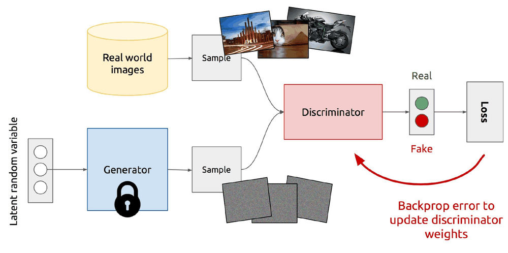
*From the slides.*

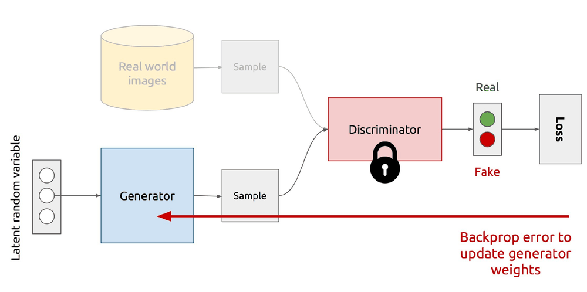
*From the slides.*

**Putting it all together** (the algorithm of Goodfellow et al., 2014). For each training iteration:

- for $k$ steps (**discriminator updates**): sample $m$ noise vectors $z^{(1)}, \dots, z^{(m)}$ and $m$ real examples $x^{(1)}, \dots, x^{(m)}$, and update the discriminator by **ascending** its stochastic gradient

$$\nabla_{\theta_d} \frac{1}{m}\sum_{i=1}^{m}\left[\log D\big(x^{(i)}\big) + \log\Big(1 - D\big(G(z^{(i)})\big)\Big)\right]$$

- then (**generator update**): sample $m$ noise vectors and update the generator by **descending** its stochastic gradient

$$\nabla_{\theta_g} \frac{1}{m}\sum_{i=1}^{m}\log\Big(1 - D\big(G(z^{(i)})\big)\Big)$$

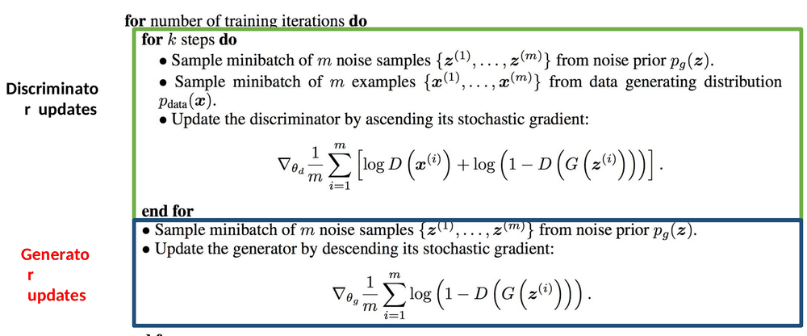
*From the slides.*

> [!NOTE]
> **Not in the slides: reading the two formulas.** The discriminator wants $D(x) \to 1$ on real data ($\log D(x) \to 0$, its maximum) and $D(G(z)) \to 0$ on fakes ($\log(1 - D(G(z))) \to 0$).
> Maximizing their sum is the same as minimizing the binary cross entropy of section 2.3 with labels 1 for real and 0 for fake. The generator does the opposite on the second term: it wants $D(G(z)) \to 1$, which makes
> $\log(1 - D(G(z)))$ go to $-\infty$. Together this is a **minimax game**, $\min_G \max_D$ of the same value.
>
> *Example:* if the discriminator gives a fake image $D(G(z)) = 0.1$, the generator's term is $\log 0.9 \approx -0.105$; if the generator improves until $D(G(z)) = 0.9$, it becomes $\log 0.1 \approx -2.3$: lower, so better for the generator.
>
> *In practice:* at the start the discriminator easily rejects fakes, $D(G(z)) \approx 0$, where $\log(1 - D)$ is almost flat and gives little gradient. So implementations train the generator to **maximize $\log D(G(z))$**
> instead, i.e. they train it with the label "real", as in the picture above and in the notebooks.

**Examples:** celebrity faces and bedrooms generated by progressively growing GANs (Karras et al., 2017).

> [!TIP]
> **Not in the slides: the notebook `GAN.ipynb`** (Keras, MNIST). The discriminator is a small convnet with `LeakyReLU(0.2)` (section 8.3) ending in `Dense(1)`; the generator maps a latent vector of 128 numbers
> to a $7 \times 7 \times 128$ map with a `Dense` layer, then upsamples it twice with `Conv2DTranspose(strides=2)` (section 8.2) to $28 \times 28$. Two separate Adam optimizers are used, one per network.
> In this notebook the labels are **1 for fake and 0 for real** (the opposite of the slides, which is fine as long as it's consistent), and a little random noise is added to the labels, a common trick to stabilize training.

## 10.3 Conditional GANs and pix2pix

**Conditional GANs:** what if we want to control the nature of the output? We **condition** both networks on a label $c$: the generator receives the noise $z$ **and** $c$, and the discriminator judges
whether $x$ is real **given** $c$. For example, on MNIST, $c$ is the digit we want: "generate a 7".

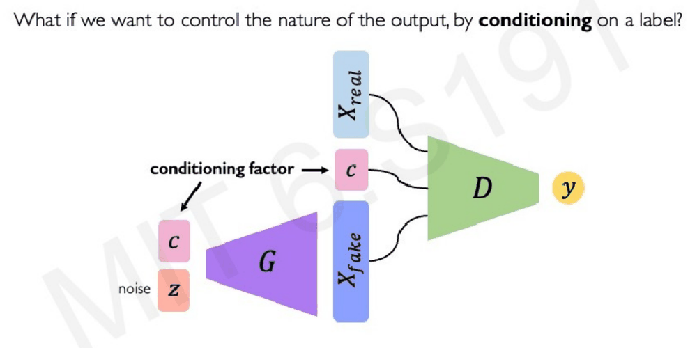
*From the slides (MIT 6.S191).*

**pix2pix: paired translation** (Isola et al., 2017). The condition is an **image** $x$: the generator translates it into $G(x)$ (for example a semantic label map into a street photo), and the discriminator classifies
**pairs**: (input, real output) against (input, generated output). The generator learns to fool it. It needs a dataset of **paired** images.
Applications: labels → street scene, map → aerial photo and back.

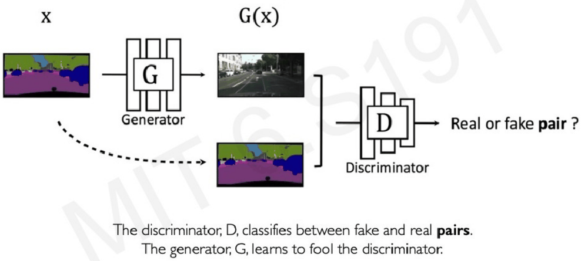
*From the slides (MIT 6.S191).*

> [!NOTE]
> **Not in the slides: pix2pix in the notebook `pix2pix.ipynb`** (TensorFlow tutorial, facades dataset). The **generator is a modified U-Net** (section 9.2) with Batch Norm, Leaky ReLU and dropout;
> the discriminator is a **PatchGAN**: instead of one real/fake answer for the whole image, it outputs a $30 \times 30$ grid, one answer per patch of the image. The generator's loss adds an L1 term:
>
> $$\text{loss}_G = \text{BCE}\big(1, D(x, G(x))\big) + \lambda\,\lVert y - G(x) \rVert_1, \qquad \lambda = 100$$
>
> The adversarial term makes the output look realistic; the L1 term makes it close to the true target $y$. With L1 alone, the output would be a blurry average of the plausible answers.

## 10.4 CycleGAN

**CycleGAN** (Zhu et al., 2017) learns transformations across domains with **unpaired** data: for example horses → zebras, without any photo of the same horse turned into a zebra. It uses two generators,
$G: X \to Y$ and $F: Y \to X$, and two discriminators, $D_X$ and $D_Y$.

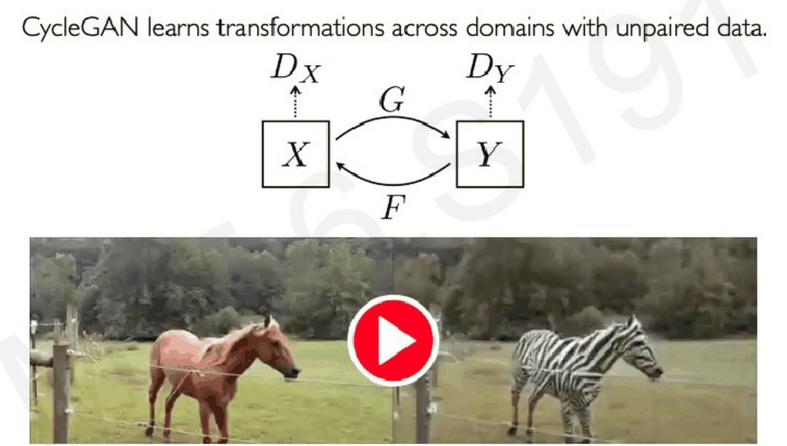
*From the slides (MIT 6.S191).*

**Distribution transformations.** A GAN maps **Gaussian noise** to the target data manifold; a CycleGAN maps **one data manifold** $X$ to another $Y$. It can transform speech too: working on spectrograms
(images of the audio), CycleGAN turns one person's voice into another's (the slides show a video with a synthesized voice).

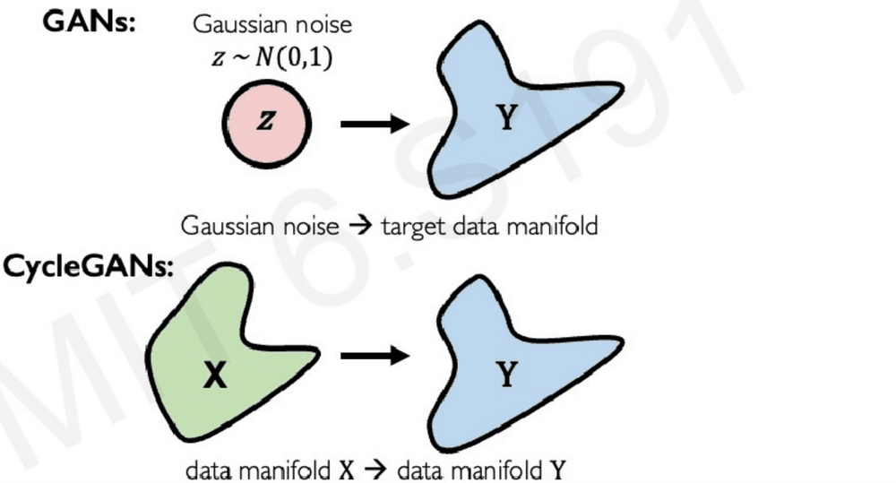
*From the slides (MIT 6.S191).*

> [!NOTE]
> **Not in the slides: the cycle consistency loss** (notebook `cyclegan.ipynb`). Without pairs, nothing forces $G$ to keep the *content* of the image: it could turn every horse into the same zebra and still fool $D_Y$.
> The fix is to require that translating back gives the original: $F(G(x)) \approx x$ and $G(F(y)) \approx y$, like translating a sentence from English to French and back. The loss adds
>
> $$\lambda\left(\lVert F(G(x)) - x \rVert_1 + \lVert G(F(y)) - y \rVert_1\right), \qquad \lambda = 10$$
>
> and an **identity loss**: $G$ applied to an image that is already a zebra should leave it almost unchanged ($G(y) \approx y$). The generators and discriminators are the ones of pix2pix.

---

# 11. Time series and recurrent networks

*Lesson 10.*

## 11.1 Recurrent neural networks

Many problems involve **sequences** where the order matters:

- **stock price prediction:** a correct prediction requires a lot of past information; the price evolution cannot be predicted without its previous trends;
- **text:** text generation, classification, translation, chatbots.

**Feedforward networks don't consider temporal states:** a sequence must be passed to them entirely, not element by element (as with the IMDb reviews of section 3.1, turned into one fixed vector).
A **recurrent neural network (RNN)** processes a sequence by **iterating over its elements** and **maintaining a state** containing information about what it has seen so far.

An RNN is a **graph with cycles**: perceptrons benefit from **feedback loops**, so the output of a unit at time $t$ is part of its input at time $t + 1$. **Unfolding** the loop in time gives a chain of copies
of the same unit, one per time step.

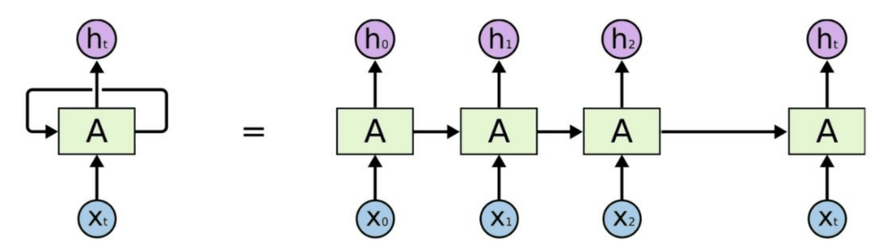
*From the slides: the cell $A$ receives $x_t$ and produces $h_t$, which is fed back at the next step.*

### Equations

**Elman network** (the state is fed back):

$$h_t = \sigma_h\big(W_h x_t + U_h h_{t-1} + b_h\big), \qquad y_t = \sigma_y\big(W_y h_t + b_y\big)$$

**Jordan network** (the **output** is fed back):

$$h_t = \sigma_h\big(W_h x_t + U_h y_{t-1} + b_h\big), \qquad y_t = \sigma_y\big(W_y h_t + b_y\big)$$

where $x_t$ is the input vector, $y_t$ the output vector, $h_t$ the hidden (state) vector, $W, U, b$ the weights and biases, $\sigma_h, \sigma_y$ the activation functions.
**The same $W$, $U$, $b$ are used at every time step.**

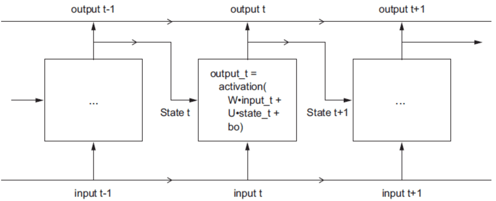
*From the slides.*

**Implementation in NumPy** (from the slides, Chollet's book): the whole RNN is a loop.

```python
timesteps = 100            # number of time steps in the input sequence
input_features = 32        # dimensionality of the input feature space
output_features = 64       # dimensionality of the output feature space

inputs = np.random.random((timesteps, input_features))   # random input, for the example
state_t = np.zeros((output_features,))                   # initial state: all zeros

W = np.random.random((output_features, input_features))
U = np.random.random((output_features, output_features))
b = np.random.random((output_features,))

successive_outputs = []
for input_t in inputs:                                   # input_t has shape (input_features,)
    output_t = np.tanh(np.dot(W, input_t) + np.dot(U, state_t) + b)   # combine input and state
    successive_outputs.append(output_t)
    state_t = output_t                                   # the output becomes the next state
final_output_sequence = np.stack(successive_outputs, axis=0)   # shape (timesteps, output_features)
```

> [!NOTE]
> **Not in the slides: a tiny RNN by hand.** One-dimensional input and state, $h_t = \tanh(w\,x_t + u\,h_{t-1})$, with $w = 1$, $u = 0.5$, $h_0 = 0$, input sequence $1, 0, 0$:
> $h_1 = \tanh(1) \approx 0.76$, $h_2 = \tanh(0.5 \cdot 0.76) \approx 0.36$, $h_3 = \tanh(0.5 \cdot 0.36) \approx 0.18$. The input was 1 only at the first step, but the state still "remembers" it, fading over time.
>
> *A detail:* the slide concatenates the outputs with `np.concatenate(..., axis=0)`, which would give a 1-D vector of $100 \cdot 64$ values; `np.stack` gives the 2-D tensor `(timesteps, output_features)` that the slide's comment describes.

### RNNs in Keras

`SimpleRNN` is Keras' Elman layer. With `return_sequences=True` it returns the output of **every** time step (needed to stack another recurrent layer on top); by default it returns only the **last** output.

```python
model.add(SimpleRNN(32, return_sequences=True))
model.add(SimpleRNN(32, return_sequences=True))   # these layers return the full sequence
model.add(SimpleRNN(32, return_sequences=True))
model.add(SimpleRNN(32))                          # this last layer returns only the last output
```

**Example: IMDb with an RNN.** This time the reviews are kept as **sequences** of word indices: `pad_sequences` cuts or pads each review to exactly 500 words. An `Embedding` layer turns each index into a vector of 32 numbers
(word embeddings are the topic of section 12).

```python
from keras.datasets import imdb
from keras.preprocessing import sequence

max_features = 10000     # number of words to consider as features
maxlen = 500             # cut reviews after 500 words
(input_train, y_train), (input_test, y_test) = imdb.load_data(num_words=max_features)
input_train = sequence.pad_sequences(input_train, maxlen=maxlen)
input_test = sequence.pad_sequences(input_test, maxlen=maxlen)

model = Sequential()
model.add(Embedding(max_features, 32))
model.add(SimpleRNN(16))
model.add(Dense(1, activation='sigmoid'))
model.compile(optimizer='rmsprop', loss='binary_crossentropy', metrics=['acc'])
history = model.fit(input_train, y_train, epochs=10, batch_size=128, validation_split=0.2)
```

## 11.2 Backpropagation through time and the vanishing gradient

RNNs learn their weights by backpropagation, slightly changed because of the feedback loops: **backpropagation through time (BPTT)**. The idea is simple:

1. **unfold** the RNN in time (the unfolded copies **share the same parameters**);
2. **backpropagate** the loss gradient as in a feedforward network.

**The vanishing gradient.** Depending on the number of time steps, the unfolded RNN can be a **very long** chain. Units use activation functions that approximate a step: the sigmoid $\sigma(x) = \frac{1}{1 + e^{-x}}$
and the hyperbolic tangent. In backpropagation (section 2.5), with SGD $w^* = w - \eta \nabla E_j\big(o, f(i, w)\big)$, the gradient of a deep network is

$$\nabla E_j\big(o, f_l(i, w_l)\big) = \nabla E_j\Big(o, f_l\big(f_{l-1}(f_{l-2}(\dots), w_{l-2}), w_{l-1}\big), w_l\Big)$$

For a recurrent unit $f_l = f_{l-1} = \dots = f$, so the gradient is $\nabla E_j\big(o, f(f(f(f(\dots), w), w), w)\big)$, and by the chain rule we must **multiply the same derivative many times**: $\big[f'(i)\big]^T$, where $T$ is the number of time steps.

The derivatives of the usual activations are **at most 1**: $\sigma'(x) = \sigma(x)\,[1 - \sigma(x)] \le 0.25$ and $\tanh'(x) = 1 - \tanh^2(x) \le 1$.
Assuming $f'(i) = 0.99$ and $T = 300$: $0.99^{300} \approx 0.049$. The gradient is close to 0, it is **vanishing**, and the network cannot find the optimal values of the weights that depend on distant steps.

> [!NOTE]
> **Not in the slides: how fast it vanishes.** With the sigmoid's maximum derivative $0.25$, ten steps already give $0.25^{10} \approx 0.000001$. Even $0.9^{50} \approx 0.005$.
> In practice a simple RNN cannot learn dependencies more than a few dozen steps apart: in "The cat, which my neighbor adopted last year after moving from Spain, **was** hungry", the verb must agree with a word far back.
> (If the factors are larger than 1 the opposite happens: the gradient **explodes**.)

**Possible solutions.**

- **Change the activation function:** linear, **ReLU**, **leaky ReLU**, softplus, swish (section 8.3), whose derivative is 1 on a whole region instead of being always smaller than 1.
- But there is still **no control over what to remember**: the long-term dependency problem remains.

## 11.3 LSTM

**Long Short-Term Memory** networks (LSTMs) are a special kind of RNN, capable of learning **long-term dependencies**. They are explicitly designed to **control the vanishing gradient** and avoid the long-term dependency problem:
remembering information for long periods is practically their default behavior, not something they struggle to learn.

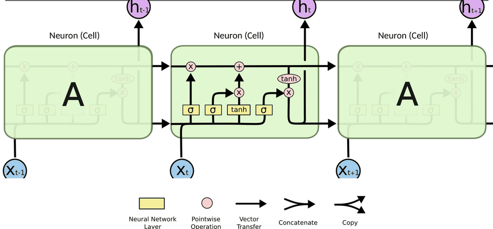
*From the slides (figures by Christopher Olah): yellow boxes are neural network layers, pink circles pointwise operations.*

**The cell state** $C_t$ stores the inner information of the chain (the **inner history**). It runs straight down the entire chain with only minor linear interactions, so information can easily flow along it unchanged.
The LSTM can **remove or add** information to the cell state through **gates**: a sigmoid layer followed by a pointwise multiplication. The sigmoid outputs numbers between 0 (let nothing through) and 1 (let everything through).

Here $[h_{t-1}, x_t]$ is the concatenation of the previous output and the current input, and $*$ is the element-wise product.

**1. Forget gate:** how much of the previous inner history to keep from now on.

$$f_t = \sigma\big(W_f \cdot [h_{t-1}, x_t] + b_f\big)$$

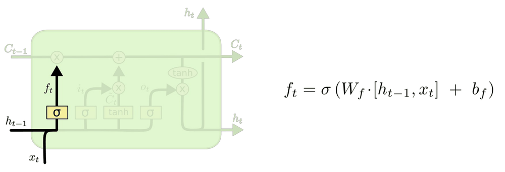
*From the slides.*

**2. Input gate and candidate:** how much the new input can influence the inner history, and what to add.

$$i_t = \sigma\big(W_i \cdot [h_{t-1}, x_t] + b_i\big), \qquad \tilde{C}_t = \tanh\big(W_C \cdot [h_{t-1}, x_t] + b_C\big)$$

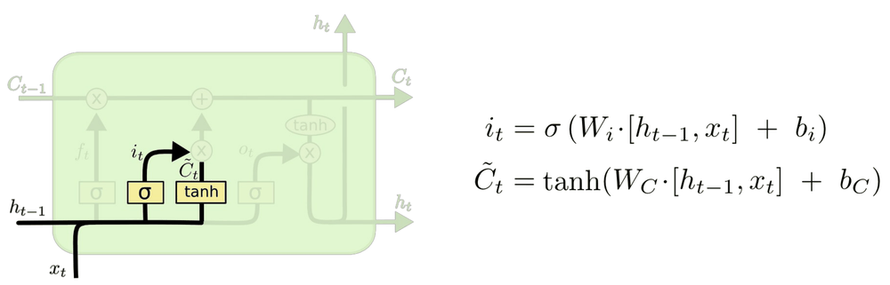
*From the slides.*

**3. Update the cell state:** forget part of the old state, add part of the new candidate. **Here LSTMs tackle the vanishing gradient.**

$$C_t = f_t * C_{t-1} + i_t * \tilde{C}_t$$

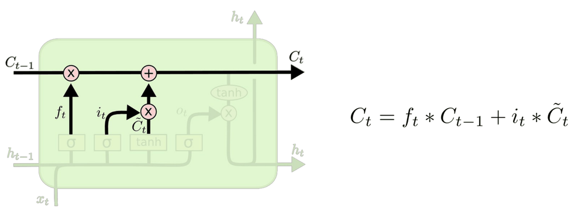
*From the slides.*

**4. Output gate:** the output depends on the cell state, and the LSTM controls how much of the history to use for it.

$$o_t = \sigma\big(W_o \cdot [h_{t-1}, x_t] + b_o\big), \qquad h_t = o_t * \tanh(C_t)$$

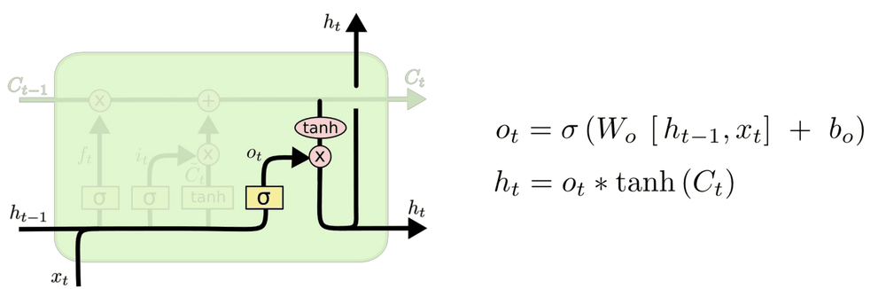
*From the slides.*

> [!NOTE]
> **Not in the slides: why the cell state fixes the vanishing gradient.** Along the cell state, going back one step multiplies the gradient by $\partial C_t / \partial C_{t-1} = f_t$ (plus smaller terms). This is not the derivative of a
> squashing function but the **forget gate itself**, which the network learns: if it needs to remember, it keeps $f_t$ close to 1, and the gradient flows back through many steps almost unchanged.
> The update is a **sum**, not a repeated multiplication by a weight matrix and a saturating derivative. (The same idea is behind the residual connections of section 6.3.)
>
> *With numbers:* one-dimensional cell, $C_{t-1} = 2$, $f_t = 0.9$, $i_t = 0.5$, $\tilde{C}_t = -0.4$: $C_t = 0.9 \cdot 2 + 0.5 \cdot (-0.4) = 1.6$. With $o_t = 0.8$: $h_t = 0.8 \cdot \tanh(1.6) \approx 0.8 \cdot 0.92 = 0.74$.
> If instead $f_t = 0$, the cell forgets everything and $C_t = -0.2$.

**How it works on a sentence.** For "I am studying LSTMs", trained to predict the next word: the input at each step is a word ("I", "am", "studying", "LSTMs") and the output is the next one ("am", "studying", "LSTMs", `<END>`).
After reading "I", the LSTM holds two vectors: the cell state $C_t$, a **representation of what it knows** so far (its inner history), and the output $h_t$, a representation of the **predicted word** "am".

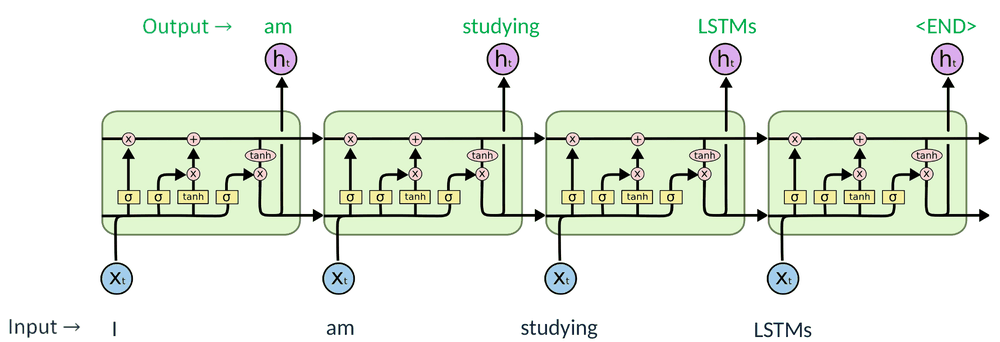
*From the slides.*

**In Keras**, just replace `SimpleRNN` with `LSTM`:

```python
from keras.layers import LSTM
model = Sequential()
model.add(Embedding(max_features, 32))
model.add(LSTM(32))
model.add(Dense(1, activation='sigmoid'))
model.compile(optimizer='rmsprop', loss='binary_crossentropy', metrics=['acc'])
history = model.fit(input_train, y_train, epochs=10, batch_size=128, validation_split=0.2)
```

> [!TIP]
> **Not in the slides: parameters.** An LSTM layer has **four** sets of weights (forget, input, candidate, output), each acting on $[h_{t-1}, x_t]$. With 32 inputs and 32 units:
> $4 \cdot \big((32 + 32) \cdot 32 + 32\big) = 8{,}320$ parameters, four times a `SimpleRNN` of the same size.

## 11.4 GRU

The **gated recurrent unit** (Cho et al., 2014) is a simpler variant: it **combines the forget and input gates into a single update gate** $z_t$, adds a reset gate $r_t$, and merges the cell state with the output.

$$z_t = \sigma\big(W_z \cdot [h_{t-1}, x_t]\big), \quad r_t = \sigma\big(W_r \cdot [h_{t-1}, x_t]\big), \quad \tilde{h}_t = \tanh\big(W \cdot [r_t * h_{t-1}, x_t]\big), \quad h_t = (1 - z_t) * h_{t-1} + z_t * \tilde{h}_t$$

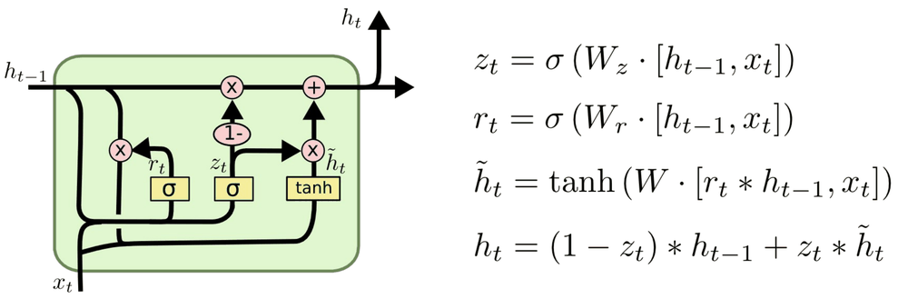
*From the slides.*

> [!TIP]
> **Not in the slides: reading the last formula.** $h_t$ is a weighted average of the old state and the new candidate: with $z_t = 0$ the state is copied unchanged (perfect memory), with $z_t = 1$ it is replaced.
> One gate decides both how much to forget and how much to add, which is why the GRU has fewer parameters than the LSTM and often works about as well.

## 11.5 Example: stock price prediction

The last example predicts the **opening price of Apple stock** (data from Yahoo Finance, files `AAPL.csv` and `AAPL-Test.csv` in the course sources).

**Preprocessing:** scale the prices to $[0, 1]$ with `MinMaxScaler`, then build training examples with a **sliding window**: each input is the sequence of the **60 previous days**, and the label is the price of the next day.

```python
from sklearn.preprocessing import MinMaxScaler
scaler = MinMaxScaler(feature_range=(0, 1))
apple_training_scaled = scaler.fit_transform(apple_training_processed)

features_set, labels = [], []
for i in range(60, 1259):
    features_set.append(apple_training_scaled[i-60:i, 0])   # days i-60 ... i-1
    labels.append(apple_training_scaled[i, 0])              # day i
features_set, labels = np.array(features_set), np.array(labels)
features_set = np.reshape(features_set, (features_set.shape[0], features_set.shape[1], 1))   # (samples, 60, 1)
```

**The network:** four stacked LSTM layers of 50 units with dropout, and a `Dense(1)` output for regression, trained with the MSE for 100 epochs.

```python
model = Sequential()
model.add(LSTM(units=50, return_sequences=True, input_shape=(features_set.shape[1], 1)))
model.add(Dropout(0.2))
model.add(LSTM(units=50, return_sequences=True))
model.add(Dropout(0.2))
model.add(LSTM(units=50, return_sequences=True))
model.add(Dropout(0.2))
model.add(LSTM(units=50))
model.add(Dropout(0.2))
model.add(Dense(units=1))
model.compile(optimizer='adam', loss='mean_squared_error')
model.fit(features_set, labels, epochs=100, batch_size=32)
```

**Prediction:** to predict the 20 test days, each needs the 60 days before it, so the inputs are taken from the concatenation of training and test prices, starting 60 days before the test period; they are scaled with the **same** scaler
(`transform`, not `fit_transform`, as for the normalization of section 3.3), and cut into windows as before. The predictions are then brought back to dollars with `scaler.inverse_transform`.

> [!NOTE]
> **Not in the slides: a detail and a warning.** The slides select the data with `iloc[:, 1:1]`, which is an **empty** slice; the "Open" column is `iloc[:, 1:2]` (as used later with `apple_total['Open']`).
> And a model like this mostly learns that tomorrow's price is close to today's: a good-looking curve does not mean it could predict the market. Compare it with the trivial baseline "tomorrow = today" before trusting it.

## 11.6 Recurrent architectures

Depending on the problem, inputs and outputs can be single items or sequences:

| Architecture | Example |
|---|---|
| one to one | a plain network (image classification) |
| one to many | image captioning (one image, a sequence of words) |
| many to one | sentiment analysis (a review, one label), stock prediction (60 days, one price) |
| many to many (shifted) | translation (read the whole sentence, then write the translation) |
| many to many (aligned) | labeling each frame of a video, predicting the next word at every step |

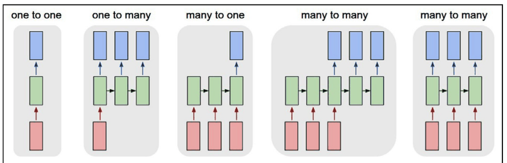
*From the slides (figure by Andrej Karpathy). The examples in the table are not in the slides.*

---

# 12. Word embeddings

*Lesson 11. The material is the lecture "Word Embeddings" by Lena Voita (Yandex School of Data Analysis, NLP Course For You) and the lecturer's slides "Word embeddings (continued)" on word2vec.*

## 12.1 Why word representations

A model cannot read text: the text "I saw a cat." is split into a **sequence of tokens** ("I", "saw", "a", "cat", "."), and each token must become a **vector**, the input of the algorithm (e.g. a neural network).

**How it works: a look-up table.** The vocabulary is chosen in advance, and each token has an **index** in it ("I" → 39, "saw" → 1592, "a" → 10, "cat" → 2548, "." → 5). An **embedding matrix** of size
(vocabulary size) × (embedding dimension) holds one row per token: the embedding of a token is just **its row**. Tokens outside the vocabulary are replaced by a special **UNK** (unknown) token.

> [!TIP]
> **Not in the slides: this is the Keras `Embedding` layer.** `Embedding(10000, 32)` in sections 11.1 and 11.3 is exactly this table: 10,000 rows of 32 numbers, i.e. $320{,}000$ trainable parameters.
> Given the index 2548 it returns row 2548. There, the rows were learned from scratch for the IMDb task; this lesson is about learning good rows in general.

## 12.2 One-hot vectors and distributional semantics

**One-hot vectors** represent each word as a discrete symbol: a vector as long as the vocabulary, all zeros except a 1 in the word's position (as the labels of section 3.2). Problems:

- the **vector size is too large** (the embedding dimension equals the vocabulary size);
- the vectors **know nothing about meaning**: "cat" is as close to "dog" as it is to "table" (all one-hot vectors are equally far apart).

**What is meaning?** Do you know what *tezgüino* means? Look at how it is used: "A bottle of tezgüino is on the table", "Everyone likes tezgüino", "Tezgüino makes you drunk", "We make tezgüino out of corn".
From the contexts, you can tell it is an alcoholic drink made from corn. Which other words fit the same contexts?

| | (1) a bottle of __ | (2) everyone likes __ | (3) __ makes you drunk | (4) we make __ out of corn |
|---|---|---|---|---|
| tezgüino | 1 | 1 | 1 | 1 |
| loud | 0 | 0 | 0 | 0 |
| motor oil | 1 | 0 | 0 | 1 |
| tortillas | 0 | 1 | 0 | 1 |
| wine | 1 | 1 | 1 | 0 |

The rows of "tezgüino" and "wine" are similar, and so are their meanings. This is the **distributional hypothesis** (Harris 1954, Firth 1957):
**words which frequently appear in similar contexts have similar meaning.**
The main idea of all the methods that follow: **put information about contexts into word vectors.**

## 12.3 Count-based methods

Count-based methods take the idea literally: they fill a matrix **manually, from global corpus statistics**, with one row per word and one column per context; each element says how strongly a word is associated with a context.
We need to define **what a context is** and **how to compute the elements**.

- **Co-occurrence counts:** the context is the set of surrounding words in a window of size $L$ ("… I saw a **cute grey** cat **playing in** the garden …" with $L = 2$); the element $N(w, c)$ is the number of times word $w$ appears in context $c$.
- **Positive pointwise mutual information (PPMI):** $\text{PPMI}(w, c) = \max(0, \text{PMI}(w, c))$, with

$$\text{PMI}(w, c) = \log\frac{P(w, c)}{P(w)\,P(c)} = \log\frac{N(w, c)\,\lvert (w, c) \rvert}{N(w)\,N(c)}$$

  It measures how much one variable tells about the other: how much more often $w$ and $c$ appear together than they would by chance.
- **Latent semantic analysis (LSA):** the context is a **document** $d$ of a collection $D$, and the element is **tf-idf**: $\text{tf-idf}(w, d, D) = N(w, d) \cdot \log\frac{\lvert D \rvert}{\lvert \lbrace d \in D : w \in d \rbrace \rvert}$
  (term frequency times inverse document frequency).

The rows of the matrix, usually after reducing their dimension, are the word vectors.

> [!NOTE]
> **Not in the slides: why PMI and tf-idf instead of raw counts.** Raw counts are dominated by frequent words: "the" co-occurs with everything. PMI compares with chance: if $P(w, c) = 0.01$ while $P(w)P(c) = 0.001$,
> the pair appears 10 times more than chance and $\text{PMI} = \log 10 \approx 2.3$; for "the", $P(w,c) \approx P(w)P(c)$ and $\text{PMI} \approx 0$.
> Likewise, the idf of a word appearing in all documents is $\log 1 = 0$: it tells nothing about a document.

## 12.4 Word2Vec

**Word2Vec** puts context information into vectors differently: it **learns word vectors by teaching them to predict contexts**. The learned parameters are the word vectors; the goal is that each vector "knows" the contexts of its word.

**Pipeline:**

1. take a huge text corpus;
2. go over it with a **sliding window**, one word at a time: at each step there is a **central word** $w_t$ and **context words** $w_{t-m}, \dots, w_{t+m}$;
3. for the central word, compute the **probabilities of the context words**;
4. **adjust the vectors** to increase these probabilities.

### Objective function

Word2Vec maximizes the **likelihood** of the data (we want the model to think the training data is "likely"), with $\theta$ all the parameters:

$$L(\theta) = \prod_{t=1}^{T}\ \prod_{-m \le j \le m,\ j \ne 0} P(w_{t+j} \mid w_t, \theta)$$

Equivalently, it minimizes the **negative log-likelihood**, averaged over the text:

$$J(\theta) = -\frac{1}{T}\log L(\theta) = -\frac{1}{T}\sum_{t=1}^{T}\ \sum_{-m \le j \le m,\ j \ne 0} \log P(w_{t+j} \mid w_t, \theta)$$

i.e. go over the text, with a sliding window, and compute the probability of each context word given the central one.

**How to compute $P(w_{t+j} \mid w_t)$.** Each word $w$ has **two vectors**: $v_w$ when it is a **central** word, $u_w$ when it is a **context** word. For a central word $c$ and a context ("outside") word $o$:

$$P(o \mid c) = \frac{\exp(u_o^T v_c)}{\sum_{w \in V}\exp(u_w^T v_c)}$$

This is the **softmax** of section 3.2 applied to the dot products $u_w^T v_c$: a large dot product (similar vectors) gives a high probability.

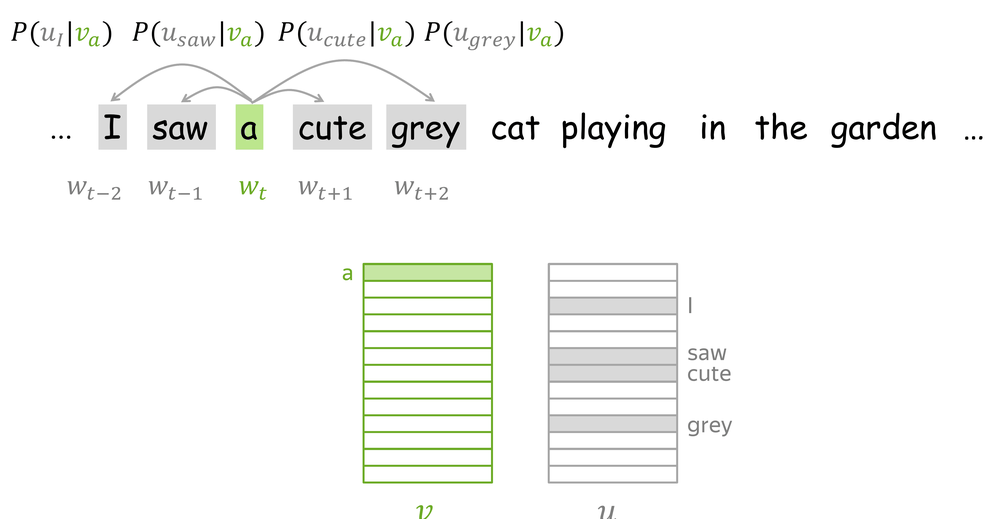
*From the slides (Lena Voita): with central word "a", its $v$ vector is compared with the $u$ vectors of "I", "saw", "cute", "grey".*

### One training step

For the pair (central "cat", context "cute"), the loss is

$$-\log P(\text{cute} \mid \text{cat}) = -u_{cute}^T v_{cat} + \log\sum_{w \in V}\exp(u_w^T v_{cat})$$

Gradient descent on it **increases** the dot product of $v_{cat}$ with $u_{cute}$ (first term) and **decreases** it with **all other** $u_w$ (second term).

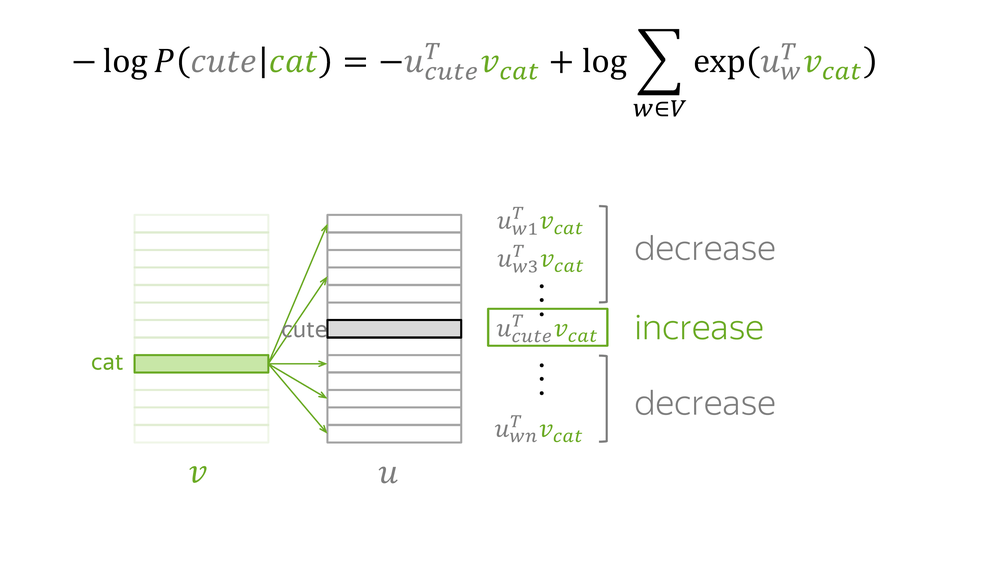
*From the slides (Lena Voita).*

> [!NOTE]
> **Not in the slides: a softmax with numbers.** A toy vocabulary of three words with dot products $u^T v_{cat}$ equal to 2 (cute), 1 (grey), 0.5 (table). The softmax gives $P = 0.63, 0.23, 0.14$,
> and the loss for the pair (cat, cute) is $-\ln 0.63 \approx 0.46$. An update raises $u_{cute}^T v_{cat}$ and lowers the other two, so next time $P(\text{cute} \mid \text{cat})$ is higher.

### Negative sampling

With the full softmax, each step updates $v_{cat}$ and **$u_w$ for every word of the vocabulary**: $\lvert V \rvert + 1$ vectors, slow. **Negative sampling** increases the dot product with $u_{cute}$ as before, but decreases it only with
a **random subset of $K$ "negative" words**: $K + 2$ vectors per step. The loss uses the **sigmoid** $\sigma(x) = \frac{1}{1 + e^{-x}}$ instead of the softmax:

$$J = -\log\sigma\big(u_{cute}^T v_{cat}\big) - \sum_{w \in \lbrace w_1, \dots, w_K \rbrace}\log\sigma\big(-u_w^T v_{cat}\big)$$

using $\sigma(-x) = 1 - \sigma(x)$: the first term pushes $\sigma(u_{cute}^T v_{cat})$ towards 1, the others push $\sigma(u_w^T v_{cat})$ towards 0 for the negative words.

> [!TIP]
> **Not in the slides: the saving.** With a vocabulary of 10,000 words and $K = 5$, a softmax step touches 10,001 context vectors, a negative-sampling step 7: more than a thousand times fewer.
> Negative words are drawn more often if they are frequent (in the original paper, with probability proportional to frequency raised to 3/4).

### Skip-gram and CBOW

- **Skip-gram:** from the **central** word, predict the **context** words, one at a time (what we did so far).
- **CBOW** (continuous bag of words): from the **sum of the context** vectors, predict the **central** word.

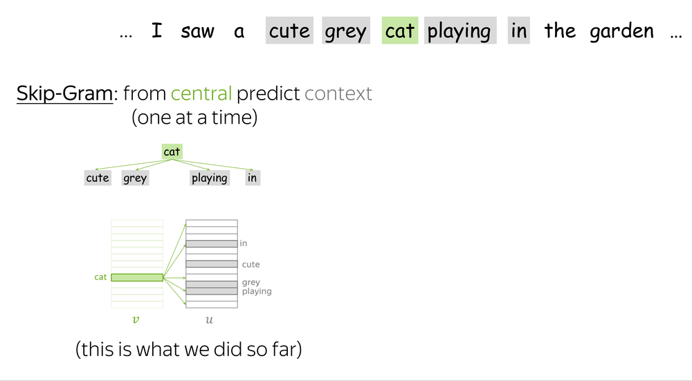
*From the slides (Lena Voita).*

**CBOW as a network** (lecturer's slides, example "The cat sat on floor", window size 2): the context words enter as one-hot vectors of size $V$; each is multiplied by the same matrix $W_{V \times N}$, which just **selects its row**;
the rows are summed (or averaged) into the hidden layer of size $N$ (the size of the word vectors); the matrix $W'_{N \times V}$ and a softmax give a probability for each word of the vocabulary, and the target is the one-hot vector of "sat".
We must learn $W$ and $W'$, and either of them (or their average) can be used as the word representation. **Bag of words** means the order of the context words is lost, but the sum is meaningful enough to deduce the missing word.

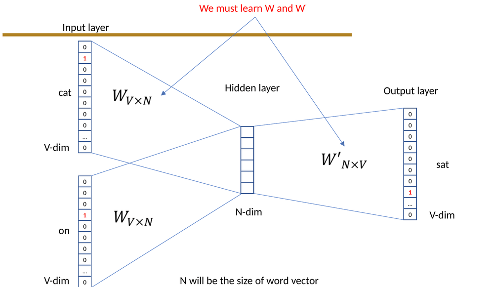
*From the lecturer's slides.*

**Skip-gram example** (lecturer's slides): with a vocabulary of 10,000 words and embeddings of 300 features, the hidden layer is a weight matrix of 10,000 rows × 300 columns. Multiplying a one-hot vector by it
**selects a row**: that row is the word vector, so the hidden weight matrix **is** the look-up table. There is no activation on the hidden layer; the output layer uses a softmax.

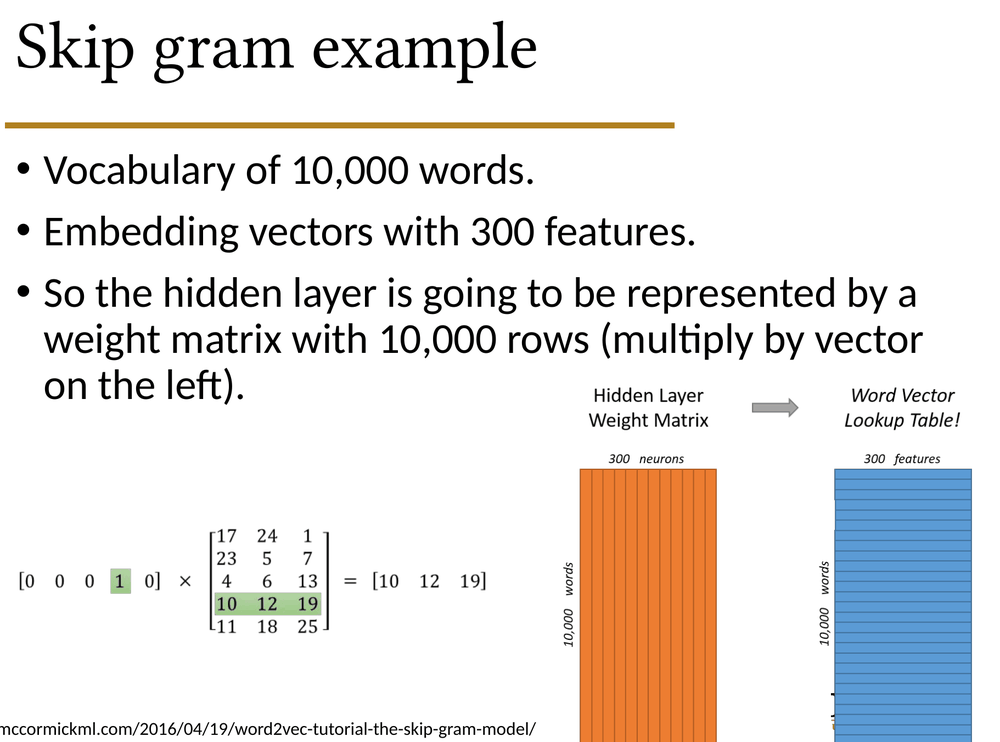
*From the lecturer's slides: $[0\ 0\ 0\ 1\ 0]$ times a $5 \times 3$ matrix gives its fourth row $[10\ 12\ 19]$.*

**Intuition:** words with similar contexts (similar words likely to appear around them) should give similar context predictions, and the easiest way for the network to do so is to give them **similar vectors**.
So words with similar contexts end up with similar embeddings, which is the distributional hypothesis again.

**An earlier attempt** (Collobert et al., 2011): take sets of 5 words from real sentences ("one of the best places") and corrupt half of them by replacing the middle word ("one of function best places");
map each word to a 50-dimensional vector with a learned table $W$, and train a module $R$ to tell valid from invalid sequences. Word2Vec's prediction task is simpler and faster.

### Hyperparameters, shortcomings and improvements

**(Somewhat) standard hyperparameters:** skip-gram with negative sampling; 15 to 20 negative examples for smaller datasets, 2 to 5 for huge ones; embedding dimension 300 (100 or 50 also used); window size 5 to 10.

**Effect of the window size:** **larger** windows give more **topical** similarities (dog, bark, leash grouped together; walking, walked, run); **smaller** windows give more **functional and syntactic** similarities
(Poodle, Pitbull, Rottweiler; walking, running, approaching).

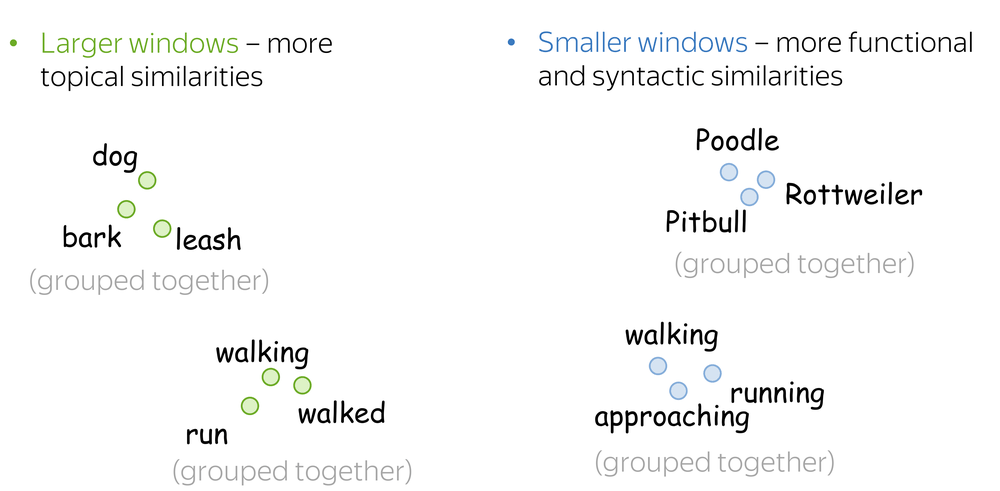
*From the slides (Lena Voita).*

**Shortcomings** (lecturer's slides): 10,000 words × 300 dimensions is a large parameter space (3 million weights per matrix), and 10,000 words is minimal for real applications; training is slow and needs lots of data,
especially to learn uncommon words. **Improvements:**

- **word pairs and phrases:** treat common phrases as single words ("Boston Globe", a newspaper, is not "Boston" + "Globe"). Phrases are made of words that occur together often relative to their individual frequency,
  preferring infrequent words, to avoid phrases like "and the". It increases the vocabulary but decreases training cost: 3 million "words" trained on 100 billion words of Google News;
- **subsampling frequent words:** cut each occurrence of a word with a probability related to its frequency ("the" is removed often; words below 0.26% of the total are kept). With a window of 10, a removed "the"
  no longer appears in the context windows of the remaining words;
- **selective updates:** negative sampling, as above (the lecturer's slides use 5 negative words).

## 12.5 GloVe

**GloVe** (Global Vectors) is a bit of both families:

| | Count-based | **GloVe** | Prediction-based (Word2Vec) |
|---|---|---|---|
| information comes from | global corpus statistics | **global corpus statistics** | "reading" text corpora |
| vectors are | obtained via dimensionality reduction | **learned by gradient descent** | learned by gradient descent |

$$J(\theta) = \sum_{w, c \in V} f\big(N(w, c)\big)\,\Big(u_c^T v_w + b_c + \bar{b}_w - \log N(w, c)\Big)^2$$

It trains the dot product of the vectors (plus two learned bias terms) to match the **logarithm of the co-occurrence count**. The weighting function $f(x) = (x / x_{max})^{\alpha}$ if $x < x_{max}$, and 1 otherwise
(with $\alpha = 0.75$, $x_{max} = 100$), penalizes rare events and avoids over-weighting frequent ones.

## 12.6 Evaluation and analysis

- **Intrinsic evaluation:** based on internal properties, i.e. how well embeddings capture meaning (word similarity, word analogy). Usually fast, but doesn't tell what is better in practice.
- **Extrinsic evaluation:** on a real task: train the same model several times, one for each set of embeddings, and see which performs better. Tells directly what is better, but training several models is expensive.

**Nearest neighbors.** The closest words to "frog" in GloVe: frogs, toad, litoria, leptodactylidae, rana, lizard, eleutherodactylus (several are frog species).

**Word similarity benchmarks** contain word pairs with similarity scores given by humans (e.g. vulgarism/profanity 9.62, subdividing/separate 8.67, radiators/beginning 0); the quality of the embeddings is the **correlation**
between human scores and embedding similarities.

**Linear structure.** Many semantic and syntactic relationships are (almost) **linear** in the embedding space:

$$v(\text{king}) - v(\text{man}) + v(\text{woman}) \approx v(\text{queen}), \qquad v(\text{kings}) - v(\text{king}) + v(\text{queen}) \approx v(\text{queens})$$

**Analogy task:** "$a$ is to $a^*$ as $b$ is to ___": compute $v(a^*) - v(a) + v(b)$, find the closest vector, and check whether it is the correct word. In the lecturer's example (Mikolov et al.), with 2-D vectors
king $[0.30, 0.70]$, man $[0.20, 0.20]$, woman $[0.60, 0.30]$: king − man + woman $= [0.70, 0.80]$, the vector of queen. Projected with PCA, countries and their capitals are connected by roughly parallel arrows.

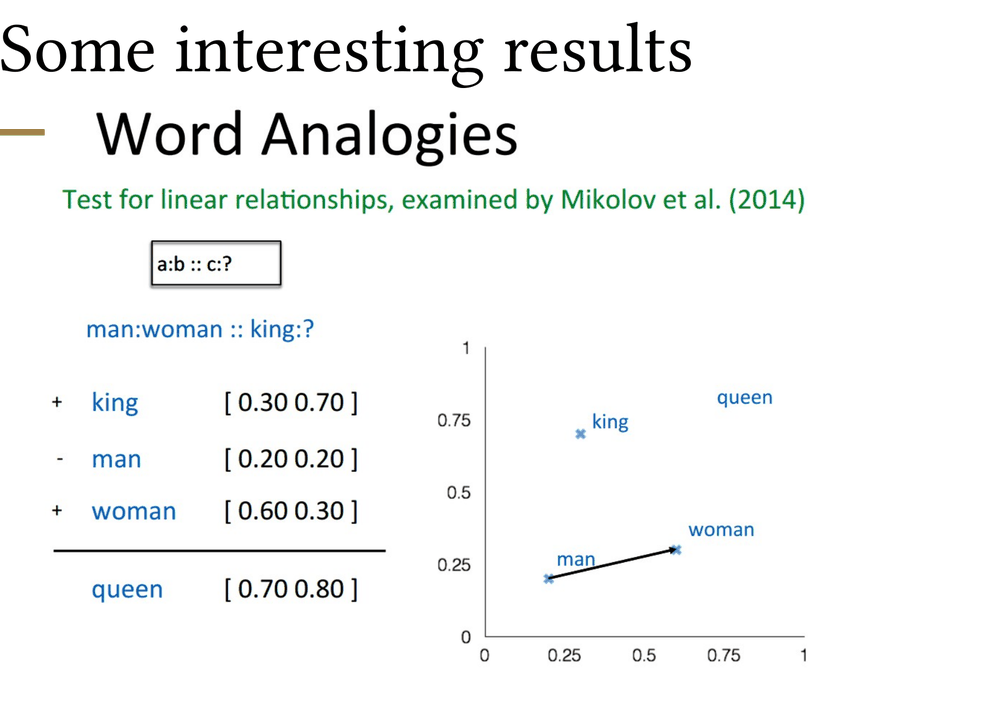
*From the lecturer's slides.*

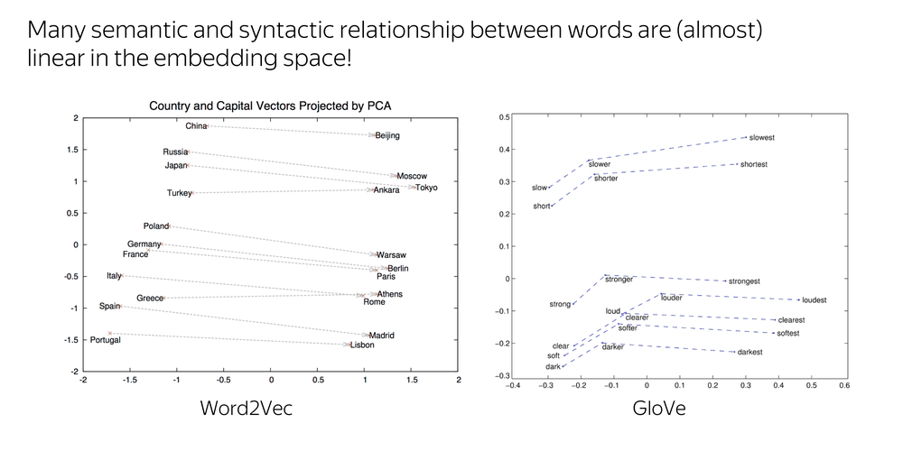
*From the slides (Lena Voita).*

> [!NOTE]
> **Not in the slides: how "closest" is measured.** Usually with the **cosine similarity** $\cos(a, b) = \frac{a \cdot b}{\lVert a \rVert\,\lVert b \rVert}$ (section 1.8), which ignores the length of the vectors.
> In practice the three input words are excluded from the search, otherwise the closest vector to king − man + woman is often "king" itself.

**Similarities across languages.** A recipe for building large dictionaries from small ones: train embeddings on a corpus in each language (e.g. English and Spanish); using a very small dictionary (cat ↔ gato, dog ↔ perro, …),
learn a **linear map** from one space to the other that matches the known pairs; then words that end up close after the mapping are **new translations**.

**Applications** (lecturer's slides). Word representations have become a key "secret sauce" of NLP systems (named entity recognition, part-of-speech tagging, parsing, semantic role labeling).
Learning a representation on task A and using it on task B (pretraining, transfer learning, multi-task learning) is one of the major tricks of deep learning, as with VGG-16 in section 6.2.
Embeddings can map several kinds of data into one space: bilingual English-Mandarin embeddings where known translations are close (and unknown translations end up close too),
or joint embeddings of words and images, where images of a class never seen in training map near similar known classes (an unknown "cat" image lands near "dog").

> [!TIP]
> **Not in the slides: using pre-trained embeddings in Keras** (notebook `Using-word-embeddings.ipynb`, Chollet chapter 6). Load pre-computed vectors such as GloVe into the weight matrix of an `Embedding` layer
> and freeze it (`trainable = False`), exactly like the frozen VGG-16 of section 6.2: useful when the training set is too small to learn good embeddings from scratch.

---

# 13. Language modeling

*Lesson 12. The material is the lecture "Language Modeling" by Lena Voita (Yandex School of Data Analysis, NLP Course For You).*

## 13.1 What a language model is

A model of a train looks like a train and behaves like one in some respects; a model of the physical world tells which events are more likely than others. A **language model** does the same for a language:
the "events" are **sentences**, and the model estimates **how likely a sentence is to appear in the language**. We use language models every day: autocomplete on the phone, search suggestions, machine translation, speech recognition.

**Decomposing the probability.** Read "I saw a cat on a mat" word by word, updating the probability at each new token. By the chain rule of probability:

$$P(y_1, y_2, \dots, y_n) = P(y_1)\,P(y_2 \mid y_1)\,P(y_3 \mid y_1, y_2) \cdots P(y_n \mid y_1, \dots, y_{n-1}) = \prod_{t=1}^{n} P(y_t \mid y_{<t})$$

P(I saw a cat on a mat) = P(I) · P(saw | I) · P(a | I saw) · P(cat | I saw a) · P(on | I saw a cat) · P(a | I saw a cat on) · P(mat | I saw a cat on a).

This is the standard **left-to-right** framework: models differ in how they evaluate the conditional probabilities $P(y_t \mid y_{<t})$. (Other kinds exist, e.g. masked language models.)

**Generating text.** Start from a prefix ("I ___"), compute the distribution of the next token, **sample** a token from it, append it, and repeat until an end-of-sentence token. Alternatively, **greedy decoding** always picks the most probable token.

## 13.2 N-gram language models

**The straightforward way** to estimate a conditional probability is counting:

$$P(y_t \mid y_1, \dots, y_{t-1}) = \frac{N(y_1, \dots, y_t)}{N(y_1, \dots, y_{t-1})}$$

where $N(\cdot)$ is the number of times the sequence appears in the training corpus. But long sequences almost never appear exactly: most counts would be 0.

**Markov assumption:** the probability of a word depends only on the **$n - 1$ previous tokens**, not on all of them:

$$P(y_t \mid y_1, \dots, y_{t-1}) \approx P(y_t \mid y_{t-n+1}, \dots, y_{t-1})$$

With a trigram model ($n = 3$): P(I saw a cat on a mat) ≈ P(I) · P(saw | I) · P(a | I saw) · P(cat | saw a) · P(on | a cat) · P(a | cat on) · P(mat | on a).

**Houston, we have a problem:** with a 4-gram model, $P(\text{mat} \mid \text{cat on a}) = N(\text{cat on a mat}) / N(\text{cat on a})$, and if "cat on a" never appears the fraction is $0/0$; if "cat on a mat" never appears it is 0, and the whole sentence gets probability 0.

- **Backoff** ("stupid backoff"): use less context when we don't know much about it: if possible use the trigram, if not the bigram, if not the unigram. If $N(\text{cat on a}) = 0$, use $P(\text{mat} \mid \text{on a})$.
- **Linear interpolation:** mix all of them, $P(\text{mat} \mid \text{cat on a}) \approx \lambda_3 P(\text{mat} \mid \text{cat on a}) + \lambda_2 P(\text{mat} \mid \text{on a}) + \lambda_1 P(\text{mat} \mid \text{a}) + \lambda_0 P(\text{mat})$, with $\sum_i \lambda_i = 1$.
- **Laplace (add-one) smoothing:** pretend every n-gram was seen at least once (or $\delta$ times):

$$P(\text{mat} \mid \text{cat on a}) = \frac{\delta + N(\text{cat on a mat})}{\delta \cdot \lvert V \rvert + N(\text{cat on a})}$$

> [!NOTE]
> **Not in the slides: add-one with numbers.** Vocabulary of 10,000 words, "cat on a" seen 20 times, "cat on a mat" 3 times. Without smoothing $P = 3/20 = 0.15$; with $\delta = 1$: $(1 + 3)/(10{,}000 + 20) \approx 0.0004$.
> An unseen continuation now gets $1/10{,}020$ instead of 0. The example also shows the weakness of add-one: with a large vocabulary it takes too much probability away from what was actually seen, which is why "more clever" smoothings exist.

**Generated texts are incoherent.** A 3-gram model produces text that is locally fluent but makes no sense ("when this option may be the worst day of amnesty international delegations visited israel, and felt that his sisters…"):
**fixed contexts are bad**, because the model forgets everything more than two words back.

## 13.3 Neural language models

A neural language model has two parts:

- **process the context** (model-specific): a neural network reads the previous tokens (their input embeddings) and produces a vector $h$, the representation of the context;
- **evaluate probabilities** (model-agnostic): predict the probability distribution of the next token, which is **classification into $\lvert V \rvert$ classes**: a linear layer from $h$ to $\lvert V \rvert$ scores, then a softmax.

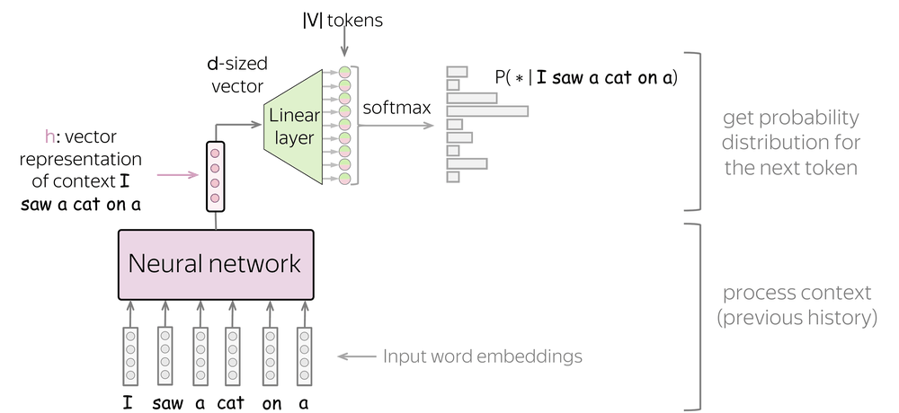
*From the slides (Lena Voita).*

**Output embeddings view.** The rows of the final linear layer can be seen as **output word embeddings** $e_w$: the score of each word is the dot product $h^T e_w$, and

$$p(y_t \mid y_{<t}) = \frac{\exp(h_t^T e_{y_t})}{\sum_{w \in V}\exp(h_t^T e_w)}$$

the same softmax over dot products as in Word2Vec (section 12.4).

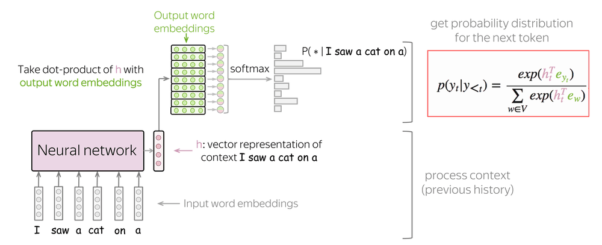
*From the slides (Lena Voita).*

**Training: cross-entropy.** For the training example "I saw a cat on a mat <eos>", at the step after "I saw a" the model predicts $p(\ast \mid \text{I saw a})$ and the target is the one-hot vector of "cat". The loss is the categorical cross entropy of section 2.3,
which with a one-hot target reduces to $-\log p(\text{cat} \mid \text{I saw a})$; the total loss sums it over all the steps.

**Recurrent models for language modeling:**

- **simple:** read the text and, at each step, predict the next token, conditioning on all the previous tokens through the RNN state (a "many to many" architecture, section 11.6);
- **multi-layer:** feed the states of one RNN to the next (stacked LSTMs, as in section 11.5).

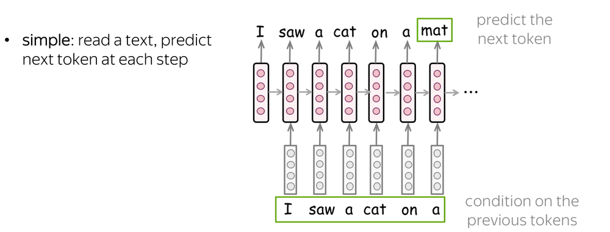
*From the slides (Lena Voita).*

## 13.4 Generation strategies

We want generated texts to be **coherent** (they must make sense) and **diverse** (the model must be able to produce very different samples). Plain sampling and greedy decoding each sacrifice one of the two.

**Sampling with temperature.** Divide the scores by a temperature $\tau$ before the softmax:

$$p_i = \frac{\exp(s_i / \tau)}{\sum_j \exp(s_j / \tau)}$$

$\tau = 1$ is standard sampling; $\tau \to 0$ approaches greedy decoding (more coherent, less diverse); $\tau > 1$ flattens the distribution (more diverse, less coherent: at temperature 2 the texts become strange).
Temperature helps a bit, but it is not ideal: both increasing and decreasing it improve one of coherence and diversity and hurt the other.

> [!NOTE]
> **Not in the slides: temperature with numbers.** Scores 2.0, 1.0, 0.1 (the softmax example of section 3.2): at $\tau = 1$ the probabilities are 0.66, 0.24, 0.10; at $\tau = 0.5$ they become 0.86, 0.12, 0.02 (sharper);
> at $\tau = 2$ they become 0.50, 0.30, 0.19 (flatter).

**Top-K sampling:** always sample from the $K$ most probable tokens (usually $K$ between 10 and 50), after renormalizing their probabilities. **Problem: a fixed $K$ is not good.** For "The dress color was ___", many colors
are almost equally likely (red 0.03, white 0.03, black 0.02, …), and $K = 4$ cuts off perfectly good ones; for "The light was ___", only "on" (0.45) and "off" (0.44) make sense, and $K = 10$ would also allow nonsense.

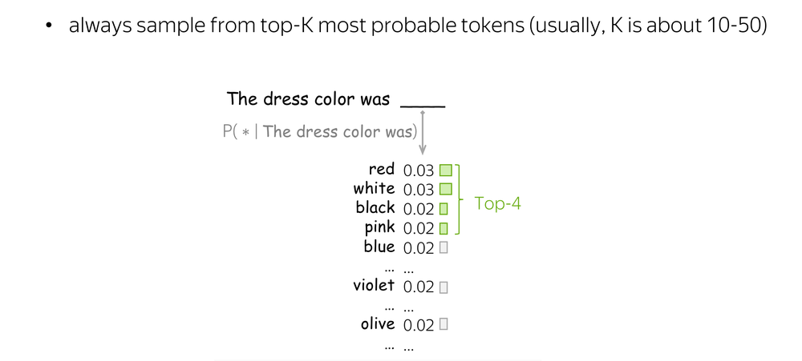
*From the slides (Lena Voita).*

**Top-p (nucleus) sampling:** at each step, take as many top tokens as needed to cover **p% of the probability mass**. With $p = 80\%$: for the dress, many colors; for the light, just "on" and "off". The set adapts to the shape of the distribution.

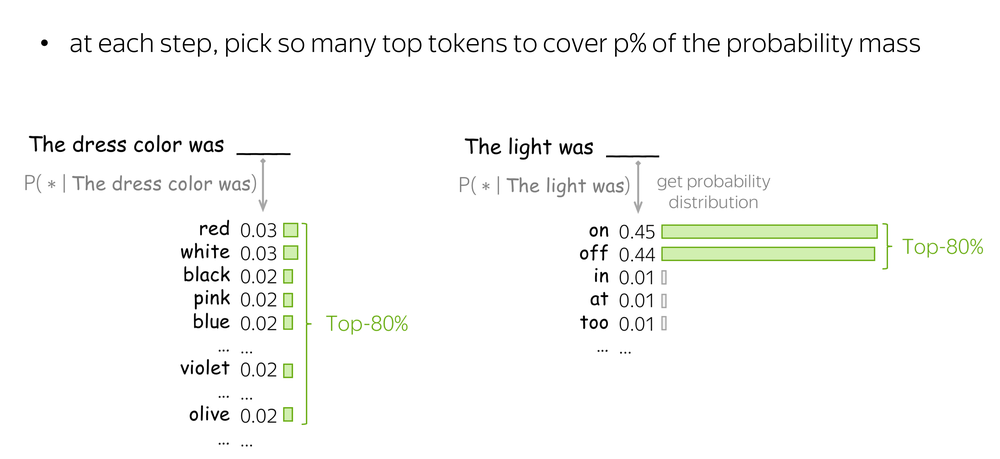
*From the slides (Lena Voita).*

## 13.5 Evaluation: perplexity

The **log-likelihood** of a text $y_{1:M}$ measures how probable the model thinks it is:

$$L(y_{1:M}) = \sum_{t=1}^{M}\log_2 p(y_t \mid y_{<t})$$

and our training loss, the cross entropy, is exactly the **negative** log-likelihood. **Perplexity** normalizes it by the length:

$$\text{Perplexity}(y_{1:M}) = 2^{-\frac{1}{M}L(y_{1:M})}$$

**The best perplexity is 1:** if the model assigns probability 1 to every correct token, all log-probabilities are 0. The **worst** is the vocabulary size $\lvert V \rvert$, obtained when the model assigns the same probability $1/\lvert V \rvert$ to every token (it knows nothing).
Lower is better.

> [!NOTE]
> **Not in the slides: perplexity as a number of choices.** If a model assigns probability $1/4$ to each correct token of a text, $\frac{1}{M}L = \log_2\frac{1}{4} = -2$ and the perplexity is $2^2 = 4$: the model is as uncertain as if it were choosing
> uniformly among 4 words at every step. A perplexity of 50 means "as confused as picking among 50 equally likely words".

## 13.6 Practical tricks and analysis

**Weight tying** (parameter sharing): a large part of the parameters is in the input and output embedding matrices, both of size $\lvert V \rvert \times d$. Using **the same matrix** for both reduces the model size a lot.

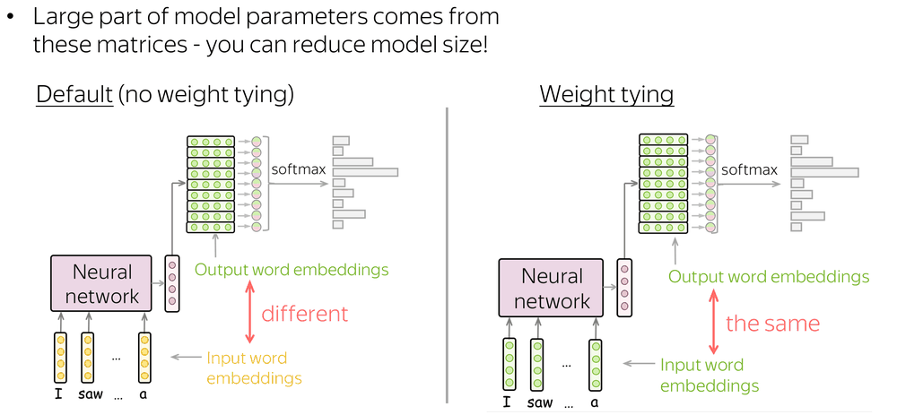
*From the slides (Lena Voita).*

**Examples of generated text:** a character-level LSTM trained on a LaTeX book on algebraic geometry produces text that looks like LaTeX (with plausible but meaningless math); trained on the Linux kernel, code that looks like C.

**Interpretable neurons.** Some neurons of character-level LSTMs have a clear meaning: in models trained on the Linux kernel and on *War and Peace*, one cell tracks the **position in the line**, another turns on **inside quotes**
(Karpathy et al., *Visualizing and Understanding Recurrent Networks*). OpenAI found a **sentiment neuron** in a character-level LSTM trained on Amazon reviews: its value follows the sentiment of the text, and **fixing it** to a positive
or negative value makes the model generate positive or negative reviews from the same prefix ("I couldn't figure out…").

**Contrastive evaluation** tests specific phenomena. For "The roses in the vase by the door ___", with competing answers "is" and "are": is the correct one ranked higher, $P(\dots\text{are}) > P(\dots\text{is})$? The verb must agree with
"roses", far back, not with the nearby "door": a test of long-distance dependencies (section 11.2).

> [!TIP]
> **Not in the slides: from here to chatbots.** Modern large language models are exactly this framework, left-to-right next-token prediction trained with cross entropy, with a Transformer in place of the RNN to process the context,
> and generated with temperature and top-p sampling.

---

# 14. Sequence to sequence, attention and the Transformer

*Lesson 13. The material is the lecture "Seq2seq and Attention" by Lena Voita (Yandex School of Data Analysis, NLP Course For You), a short note on teacher forcing,
and the notebook `Seq2Seq.ipynb` (TensorFlow tutorial "Neural machine translation with attention").*

## 14.1 Sequence to sequence

A **sequence to sequence** task maps an input sequence to an output sequence, possibly of a different length: translation between natural languages, but more generally between any sequences
(summarization, question answering, speech to text, code generation).

**Translation as probability.** A human translator picks, among all possible target sentences $y$, the "best" translation of the source $x$: $y^* = \arg\max_y p(y \mid x)$, with an intuitive notion of probability.
**Machine translation** learns a function $p(y \mid x, \theta)$ with parameters $\theta$ and looks for $y' = \arg\max_y p(y \mid x, \theta)$. We need to decide how to **model** $p$, how to **learn** $\theta$, and how to **search** for the argmax.

### Encoder-decoder

The standard paradigm:

- the **encoder** reads the source sentence and produces its representation;
- the **decoder** uses that representation to generate the target sentence.

**Conditional language models.** A language model (section 13.1) computes $P(y_1, \dots, y_n) = \prod_t p(y_t \mid y_{<t})$. A seq2seq model is a **conditional** language model: the same thing, also conditioned on the source $x$:

$$P(y_1, \dots, y_n \mid x) = \prod_{t=1}^{n} p(y_t \mid y_{<t}, x)$$

The pipeline is the one of section 13.3: get a vector representation $h$ of the source and of the previous target tokens (model-specific), then predict the distribution of the next token with a linear layer and a softmax (model-agnostic).

**The simplest model: RNN encoder and RNN decoder.** The encoder RNN reads the source ("Я видел котю на мате <eos>", Russian for "I saw a cat on a mat") starting from an initial state (e.g. a zero vector).
Its **final state** is passed to the decoder RNN as its initial state; the decoder then generates the target like a language model, starting from `<bos>`: "I", "saw", "a", "cat", …

> [!TIP]
> **Not in the slides: in Keras terms.** This is two LSTMs (section 11.3): the encoder's final state is the `initial_state` of the decoder. The whole meaning of the source sentence has to fit into that single state vector:
> this will be the problem that attention solves.

### Training: cross-entropy and teacher forcing

For one training example (source "Я видел котю на мате <eos>", target "I saw a cat on a mat <eos>"), at each decoder step the model predicts $p(\ast \mid y_{<t}, x)$, and the loss is the cross entropy with the one-hot vector of the correct next token.
The loss of the example is the sum over the steps:

$$\text{Loss} = -\sum_{t=1}^{n}\log p(y_t \mid y_{<t}, x)$$

**Teacher forcing** (from the lesson's note, in Italian in the original): during training, the input of each decoder step is **not** the token predicted at the previous step, but the **correct** token from the reference translation.
This considerably helps the model converge. At inference time there is no reference, so the model feeds its own predictions back.

> [!NOTE]
> **Not in the slides: why teacher forcing helps.** Early in training the predictions are mostly wrong. If the decoder fed its own mistakes back, after one wrong word the rest of the sentence would be conditioned on garbage,
> and the loss on later steps would teach nothing useful. With teacher forcing every step learns from a correct prefix, and all steps can be computed in parallel.
> The price is a mismatch between training and inference (the model never practiced recovering from its own errors), known as *exposure bias*.

### Inference: greedy decoding and beam search

We want $y' = \arg\max_y \prod_t p(y_t \mid y_{<t}, x)$, but trying all sequences is impossible.

- **Greedy decoding:** at each step, pick the most probable token. Straightforward, but the best token at one step is not necessarily part of the best sequence.
- **Beam search:** at each step, keep **several best hypotheses** (the *beam size*, e.g. 4 to 10), extend each of them with every possible next token, and keep again the best ones by total probability.

> [!NOTE]
> **Not in the slides: why greedy can fail.** Suppose the first word is "A" with probability 0.5 or "The" with 0.4. Greedy takes "A". But if after "A" the best continuation has probability 0.3, while after "The" there is one with 0.9,
> the sequence "The …" has probability $0.4 \cdot 0.9 = 0.36$, higher than $0.5 \cdot 0.3 = 0.15$. A beam of size 2 keeps both first words and finds the better sequence.

## 14.2 Attention

**The problem of a fixed encoder representation.** The encoder compresses the whole source into **one vector**: a **bottleneck**. For the encoder it is hard to compress a whole sentence; for the decoder,
**different information may be needed at different steps** (to translate "cat", it needs the source word "котю", not the whole sentence).

**Attention** lets the decoder, at each step, **look at all the encoder states** and focus on the relevant ones.

**Computation pipeline**, at decoder step $t$:

1. **attention input:** all the encoder states $s_1, \dots, s_m$ and one decoder state $h_t$;
2. **attention scores:** $\text{score}(h_t, s_k)$ for $k = 1, \dots, m$: "how relevant is source token $k$ for target step $t$?";
3. **attention weights** (softmax over the scores): $a_k^{(t)} = \dfrac{\exp(\text{score}(h_t, s_k))}{\sum_{i=1}^{m}\exp(\text{score}(h_t, s_i))}$, the attention weight of source token $k$ at decoder step $t$;
4. **attention output** (weighted sum): $c^{(t)} = a_1^{(t)} s_1 + a_2^{(t)} s_2 + \dots + a_m^{(t)} s_m = \sum_{k=1}^{m} a_k^{(t)} s_k$, the **source context** for step $t$.

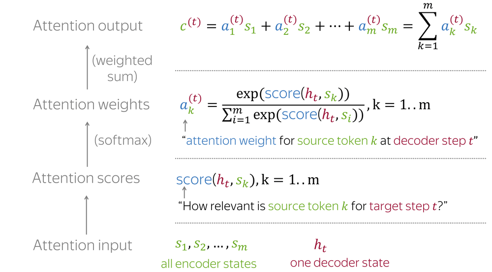
*From the slides (Lena Voita).*

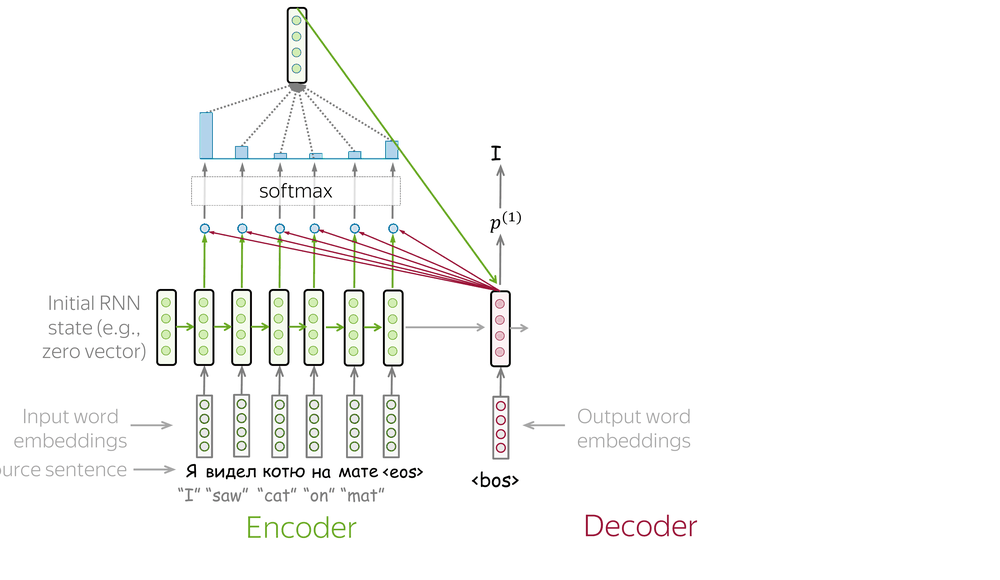
*From the slides (Lena Voita): at each step the decoder looks at all encoder states and the model learns to pick the relevant tokens.*

> [!NOTE]
> **Not in the slides: attention with numbers.** Three source tokens with scores 4.0, 1.0, 0.5 for the current decoder step. The softmax gives weights 0.93, 0.05, 0.03: the context vector is almost exactly $s_1$.
> At the next step the scores change, and the decoder may focus on another token. Everything is differentiable, so the model learns *where* to look from the translation loss alone, with no alignment labels.

**Score functions:**

- **dot product:** $\text{score}(h_t, s_k) = h_t^T s_k$;
- **bilinear:** $\text{score}(h_t, s_k) = h_t^T W s_k$, with a learned matrix $W$;
- **multi-layer perceptron:** $\text{score}(h_t, s_k) = w_2^T \tanh(W_1[h_t, s_k])$.

**Two classic models.**

- **Bahdanau** (the original attention model, 2015): a **bidirectional** encoder (the states of a forward and a backward RNN are concatenated, so each state knows both left and right context); the score is an MLP;
  attention is computed from the **previous** decoder state $h_{t-1}$, and the context is fed into the decoder step.
- **Luong** (2015): the score is simpler (bilinear or dot product); attention is computed from the **current** decoder state $h_t$, and the source context $c^{(t)}$ is combined with $h_t$ to make the prediction.
  This is the model of the notebook `Seq2Seq.ipynb` (Spanish to English).

**Attention learns an (almost) alignment.** Plotting the weights for an English-French translation shows a near-diagonal matrix, with the expected exceptions: "European Economic Area" ↔ "zone économique européenne" is aligned in reverse order,
because in French the adjectives come after the noun.

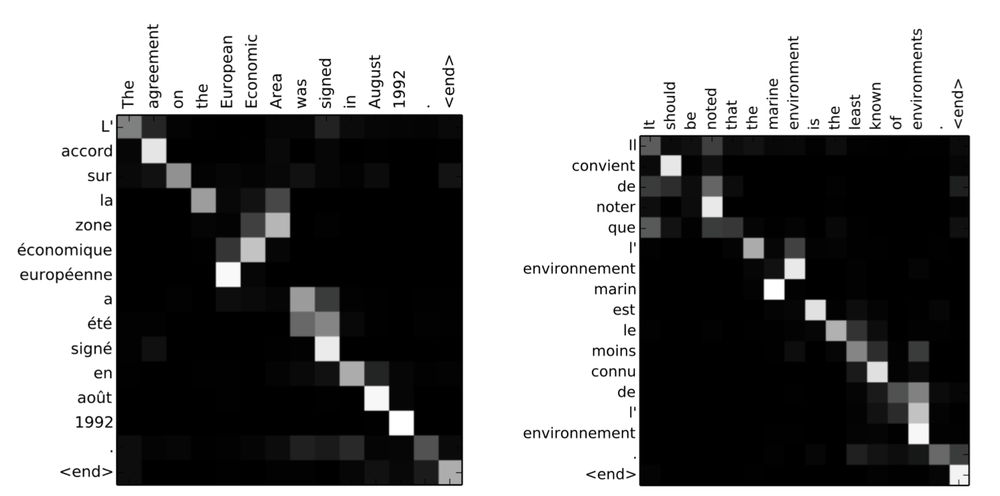
*From the slides (Bahdanau et al., Neural Machine Translation by Jointly Learning to Align and Translate).*

## 14.3 The Transformer

**Idea: attention is all you need** (Vaswani et al., 2017). If attention can look at all the source tokens, why keep the RNN at all? The **Transformer** uses only attention (plus feed-forward layers), both in the encoder and in the decoder.

**Why this can be better than RNNs.** In "I arrived at the bank after crossing the …", what does "bank" mean? It depends on a word that comes later ("…street?" or "…river?"). An RNN must carry the information through every step in between,
and processes tokens one at a time; with attention, every token can look at every other token directly, and all tokens are processed **in parallel**.

### Self-attention and query, key, value

Decoder-encoder attention looks **from** one decoder state **at** all encoder states. **Self-attention** looks from each state **at all the states of the same sequence**: tokens look at each other.

Each vector receives **three representations** ("roles"), obtained by multiplying it by three learned matrices $W_Q$, $W_K$, $W_V$:

- **query:** the vector **from** which attention is looking ("Hey there, do you have this information?");
- **key:** the vector **at** which the query looks to compute the weights ("Hi, I have this information: give me a large weight!");
- **value:** the vectors whose **weighted sum** is the attention output ("Here's the information I have!").

$$\text{Attention}(q, k, v) = \text{softmax}\left(\frac{q\,k^T}{\sqrt{d_k}}\right) v$$

where $d_k$ is the dimensionality of the keys and values.

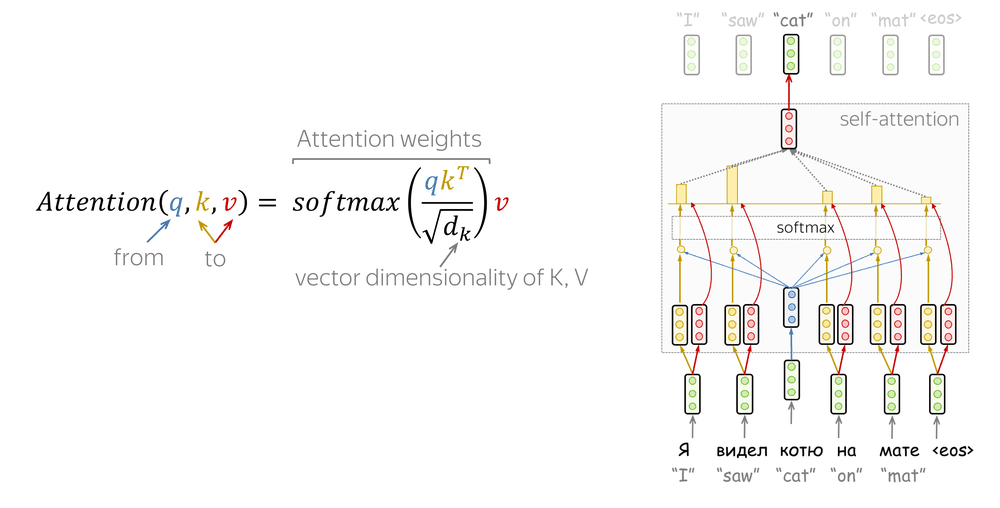
*From the slides (Lena Voita).*

> [!TIP]
> **Not in the slides: why divide by $\sqrt{d_k}$.** A dot product of two random vectors with $d_k$ components grows like $\sqrt{d_k}$. With large dot products the softmax becomes almost one-hot, and its gradients almost vanish (as the saturated sigmoid of section 2.6).
> Dividing by $\sqrt{d_k}$ keeps the scores in a reasonable range. With $d_k = 64$, scores are divided by 8.

**Masked self-attention: "don't look ahead".** In the decoder, a token must not look at **future** tokens, which are unknown at generation time. During training the decoder processes all target tokens at once, so without a mask it would see the future:
the attention weights towards future positions are set to zero (their scores to $-\infty$ before the softmax).

**Multi-head attention.** We need to track many different things at once (who does what, to whom, which word a pronoun refers to…). Several attention **heads** work independently, each with its own $W_Q$, $W_K$, $W_V$; their outputs are concatenated and
combined linearly.

### The architecture

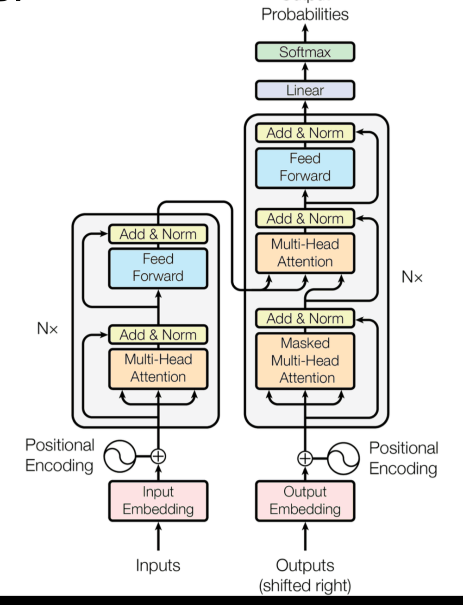
*From the slides (Vaswani et al., 2017).*

- **Encoder** (left, repeated $N$ times): **self-attention** (tokens look at each other; queries, keys and values come from the encoder states), then a **feed-forward** network ("after taking information from other tokens, take a moment to think and process it"),
  applied to each token separately.
- **Decoder** (right, repeated $N$ times): **masked** self-attention, then **decoder-encoder attention** (queries from the decoder, keys and values from the encoder output), then a feed-forward network; finally a linear layer and a softmax give the next token.
- Every block has a **residual connection** and **layer normalization** ("Add & Norm"): the input of a block is added to its output (as in the residual architectures of section 6.3), and the result is normalized.

> [!TIP]
> **Not in the slides: layer norm vs batch norm.** Layer normalization normalizes the features **of each token** (over the vector's components), while Batch Norm (section 8.1) normalizes each feature **over the batch**.
> Layer norm doesn't depend on the batch size or on the other sentences, which suits sequences of variable length.

### Positional encoding

**Problem:** without recurrence or convolution, the model knows nothing about **position**: "cat sat on mat" and "mat sat on cat" would look the same. **Solution:** encode the position explicitly and **add** it to the token embedding:
the input is the sum of two embeddings, one for the token and one for its position. The original Transformer uses **fixed** encodings, with $pos$ the position and $i$ the dimension:

$$PE_{pos, 2i} = \sin\left(\frac{pos}{10000^{2i/d_{model}}}\right), \qquad PE_{pos, 2i+1} = \cos\left(\frac{pos}{10000^{2i/d_{model}}}\right)$$

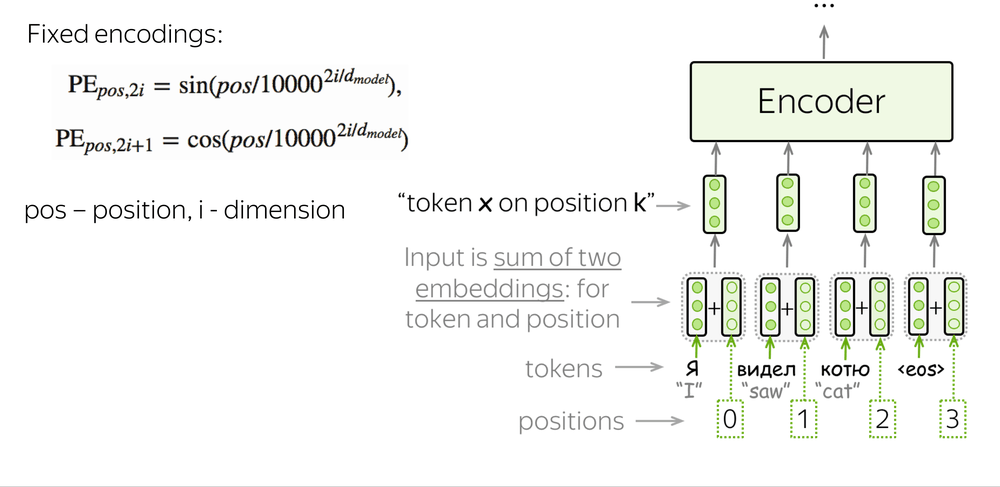
*From the slides (Lena Voita).*

> [!NOTE]
> **Not in the slides: what the formula does.** Each pair of dimensions is a sine and a cosine of the position, at a different frequency: the first pair oscillates fast (for $i = 0$ the angle is just $pos$: $\sin 1 \approx 0.84$, $\cos 1 \approx 0.54$ at position 1),
> the last ones very slowly. Like the hands of a clock, the combination of fast and slow components gives each position a unique pattern, and nearby positions get similar ones.

## 14.4 Analysis

**What are the heads doing?** Studying which heads contribute most to translations (Voita et al., 2019), a few specialized heads do the heavy lifting and the rest can often be pruned:

- **positional heads** attend to the previous or next token (the neighbors);
- **syntactic heads** track dependencies, e.g. from a verb to its subject or object;
- **rare-token heads** attend to the least frequent tokens of the sentence.

**Probing.** To understand whether a model captures a linguistic property (part of speech, morphology, syntax), take the representations of a pretrained model, **freeze** them, and train a small classifier (a *probing classifier*) to predict the property;
its accuracy tells how much of the property is encoded. For example, the encoder layers of NMT models for different language pairs turn out to encode a lot about morphology.

> [!TIP]
> **Not in the slides: where the Transformer went next.** The encoder alone, pretrained as a masked language model, is BERT; the decoder alone, pretrained as a left-to-right language model (section 13), is GPT and today's chatbots.

---

# 15. Machine learning with graphs

*Lesson 14. The material is five lectures of Stanford CS224W, "Machine Learning with Graphs" (Jure Leskovec): introduction, node embeddings, and three lectures on graph neural networks.*

## 15.1 Why graphs

**Graphs are a general language for describing and analyzing entities with relations or interactions**: social networks, computer networks, disease pathways, food webs, molecules, knowledge graphs,
road networks, transactions between users and products. Explicitly modeling the relations often gives better predictions.

But the modern deep learning toolbox is designed for **sequences** (text, speech, section 11) and **grids** (images, section 5). Networks are more complex: **arbitrary size**, **complex topology**
(no spatial locality as in grids), **no fixed node ordering** or reference point, often dynamic, with multimodal features. Graphs are a frontier of deep learning.

**Vocabulary.**

- A graph has **nodes** (vertices) and **links** (edges). Links can be **undirected** (symmetric: friendship) or **directed** (following someone); they can have weights, types, attributes.
- A **heterogeneous graph** $G = (V, E, R, T)$ has nodes with **types** $T(v_i)$ and edges with **relation types** $(v_i, r, v_j)$, $r \in R$ (e.g. a biomedical knowledge graph: drug *treats* disease).
- A **bipartite graph** has two sets of nodes $U$ and $V$, and every link connects a node in $U$ to a node in $V$ (e.g. users and the items they buy).
- Building a graph means choosing **what the nodes are** and **what the edges are**: the choice of representation determines what we can learn.

**Tasks** come at different levels:

| Level | Example task | Example application |
|---|---|---|
| **Node** | predict a property of a node | node classification, protein structure (AlphaFold: amino acids as nodes, proximity as edges) |
| **Link (edge)** | predict whether two nodes are (or should be) linked | recommender systems (users-items, Pinterest), side effects of drug pairs |
| **Graph** | classify or generate a whole graph | antibiotic discovery (molecules as graphs), travel time in Google Maps (road segments), physics and weather simulation |
| **Community (subgraph)** | find or classify groups of nodes | |

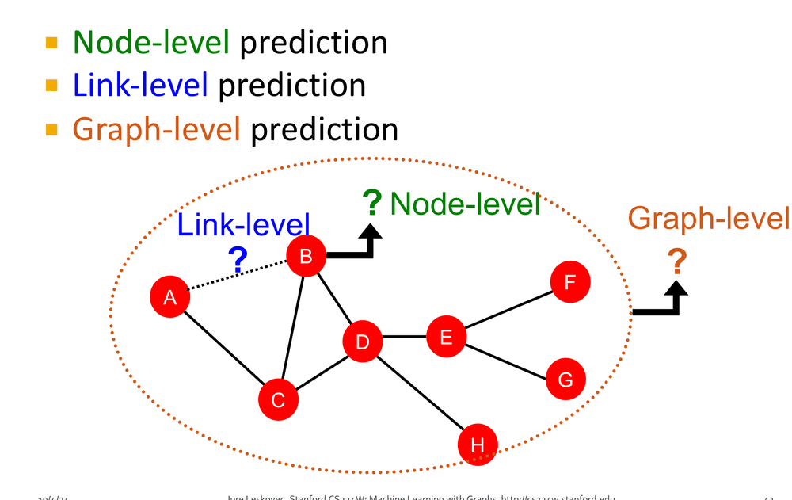
*From the slides (CS224W).*

## 15.2 Node embeddings

The traditional approach extracts **hand-crafted features** (degree, importance, local structures) and feeds them to a model. **Graph representation learning** instead learns the features:
**map each node to a vector** of $d$ numbers, an embedding, such that **similar nodes in the network are close in the embedding space**. The embeddings encode network information and can be used for many downstream tasks
(node classification, link prediction, graph classification, anomaly detection, clustering).

**Setting:** a graph $G$ with vertex set $V$ and binary adjacency matrix $A$ (no node features for now).

**Two key components:**

- an **encoder** that maps each node to a $d$-dimensional embedding: $\text{ENC}(v) = z_v$;
- a **decoder** (a similarity in the embedding space), usually the dot product, such that $\text{similarity}(u, v) \approx z_v^T z_u$, where the left side is a similarity **in the original network**, which we must define.

**Shallow encoding:** the encoder is just an **embedding look-up**, $\text{ENC}(v) = Z \cdot v$, where $Z \in \mathbb{R}^{d \times \lvert V \rvert}$ has one column per node (what we learn) and $v$ is a one-hot indicator vector.
It is the same look-up table as word embeddings (section 12.1), with nodes instead of words.

The key choice is **how to define node similarity**: linked nodes, nodes sharing neighbors, nodes with similar structural roles? This is **unsupervised** (self-supervised): no node labels or features are used.

### Random walk embeddings (DeepWalk, node2vec)

A **random walk**: given a graph and a starting node, select a neighbor at random and move to it, then a random neighbor of that one, and so on. The sequence of visited nodes is a random walk.

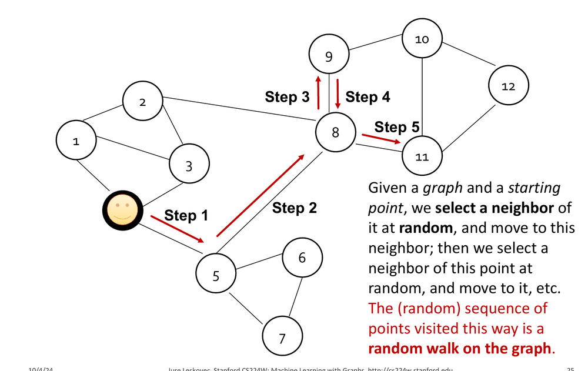
*From the slides (CS224W).*

**Idea:** $z_u^T z_v \approx$ the probability that $u$ and $v$ co-occur on a random walk. Random walks give a flexible, stochastic notion of similarity that includes both local and higher-order neighborhood information,
and they are efficient, since training only needs pairs that co-occur on walks.

**Optimization:**

1. run **short fixed-length random walks** from each node $u$ with some strategy $R$;
2. for each node $u$, collect $N_R(u)$, the **multiset** of nodes visited on the walks from $u$ (repetitions allowed);
3. optimize the embeddings so that, given node $u$, they **predict its neighbors** $N_R(u)$:

$$\mathcal{L} = \sum_{u \in V}\ \sum_{v \in N_R(u)} -\log\left(\frac{\exp(z_u^T z_v)}{\sum_{n \in V}\exp(z_u^T z_n)}\right)$$

This is exactly **skip-gram** (section 12.4): walks play the role of sentences and nodes the role of words. And, as there, the nested sum over all nodes in the denominator is too expensive, so it is replaced by **negative sampling**:

$$\log\left(\frac{\exp(z_u^T z_v)}{\sum_{n \in V}\exp(z_u^T z_n)}\right) \approx \log\sigma(z_u^T z_v) - \sum_{i=1}^{k}\log\sigma(z_u^T z_{n_i}), \qquad n_i \sim \text{random distribution over nodes}$$

The loss is minimized with **stochastic gradient descent** (section 2.4).

> [!WARNING]
> **Not in the slides: a sign to check.** The standard negative-sampling term is $+\sum_i \log\sigma(-z_u^T z_{n_i})$, as in section 12.4: the negative nodes should get a **low** $\sigma(z_u^T z_{n_i})$.
> Written with $\sigma(z_u^T z_{n_i})$ it needs a minus sign, as above; both forms push the negative nodes away. Check the exact form used by the lecturer.

**DeepWalk** uses plain unbiased random walks. **node2vec** uses **biased** walks that trade off between two classic strategies to define the neighborhood $N_R(u)$:

- **BFS** (breadth-first): stay close to $u$, a **local, microscopic** view of the neighborhood ($N_{BFS}(u) = \lbrace s_1, s_2, s_3 \rbrace$);
- **DFS** (depth-first): move far from $u$, a **global, macroscopic** view ($N_{DFS}(u) = \lbrace s_4, s_5, s_6 \rbrace$).

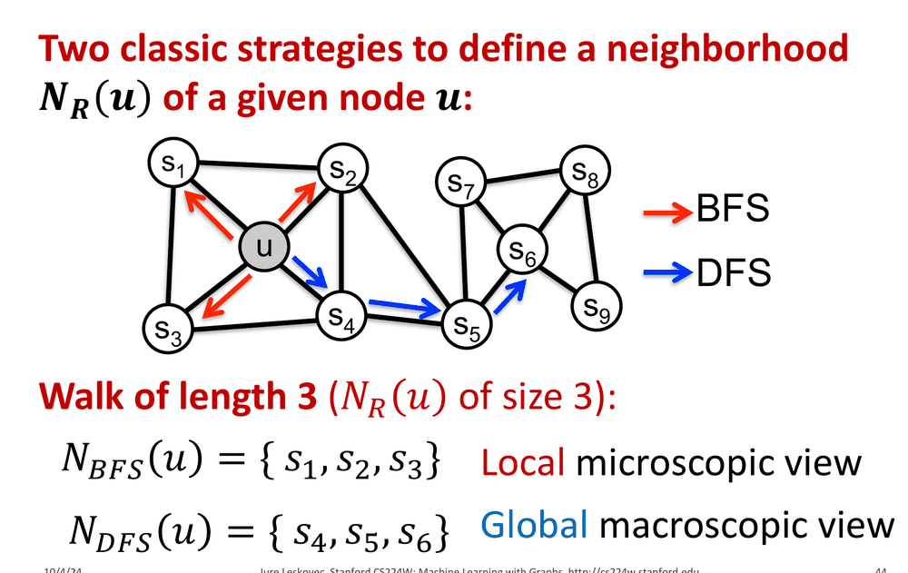
*From the slides (CS224W).*

The biased walk has two parameters: the **return parameter** $p$ (go back to the previous node) and the **in-out parameter** $q$ (move outwards, DFS, or inwards, BFS; intuitively the "ratio" of BFS vs DFS).
The walker that came over edge $(t, w)$ and is now at $w$ chooses the next node with **unnormalized probabilities**: $1/p$ to go back to $t$, $1$ to a neighbor of $w$ that is also a neighbor of $t$ (same distance from $t$), $1/q$ to a node farther from $t$.

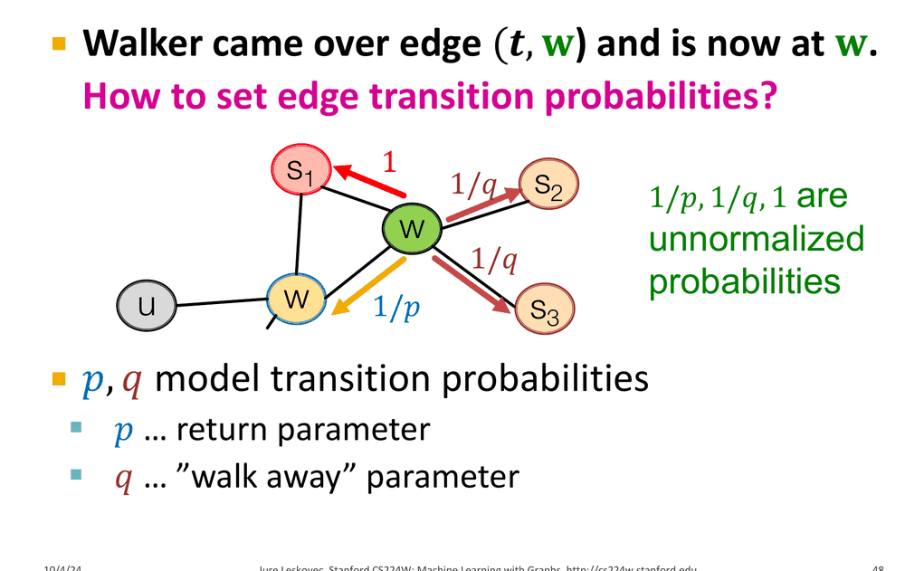
*From the slides (CS224W).*

> [!NOTE]
> **Not in the slides: the step with numbers.** In the figure, from $w$ the walker can go back to $u$ (weight $1/p$), to $s_1$ (weight 1, same distance from $u$) or to $s_2$, $s_3$ (weight $1/q$ each). With $p = 1$, $q = 2$:
> weights $1, 1, 0.5, 0.5$, total 3, so probabilities $1/3, 1/3, 1/6, 1/6$: the walk tends to stay near $u$ (BFS-like). With $q = 0.5$ the far nodes get weight 2 each and the walk moves away (DFS-like).

No single method wins in all cases (node2vec tends to do better on node classification, other methods on link prediction): choose the similarity that matches the application.

**Embedding a whole graph:** sum or average the node embeddings; or add a **virtual node** connected to the (sub)graph and embed it; or cluster nodes hierarchically and aggregate by cluster (**DiffPool**).

**Connection to matrix factorization.** With the simplest similarity (nodes are similar if linked), $z_v^T z_u = A_{u,v}$, i.e. $Z^T Z = A$. Since $d \ll \lvert V \rvert$ an exact factorization is impossible, so we minimize $\min_Z \lVert A - Z^T Z \rVert_2$.
DeepWalk and node2vec are equivalent to factorizing a more complex matrix derived from random-walk statistics.

**Limitations of shallow embeddings:**

- **transductive**, not inductive: no embedding for nodes not seen in training (a new user must trigger a full recomputation), and no way to apply to new graphs;
- they cannot capture **structural similarity**: two nodes each in a triangle, far apart in the graph, get very different embeddings, because a random walk rarely goes from one to the other;
- they cannot use **node, edge or graph features**;
- $O(\lvert V \rvert d)$ parameters, with no sharing between nodes.

## 15.3 Graph neural networks

GNNs are **deep encoders**: $\text{ENC}(v)$ is computed by multiple layers of non-linear transformations based on the graph structure, and can use node features. They can solve node classification, link prediction, community detection, network similarity.

**Setting:** a graph with vertex set $V$, adjacency matrix $A$ and a node feature matrix $X \in \mathbb{R}^{\lvert V \rvert \times m}$.

**A naive approach:** join the adjacency matrix and the features and feed them to a deep network. Problems: $O(\lvert V \rvert)$ parameters, not applicable to graphs of different sizes, **sensitive to node ordering**.

### Permutation invariance and equivariance

A graph has **no canonical ordering** of its nodes: the same graph can be described by different orderings (a permutation $P$ changes $A$ into $PAP^T$ and $X$ into $PX$), and the output must not depend on the ordering.

- **Permutation-invariant** (graph → vector): $f(A, X) = f(PAP^T, PX)$. Example: $f(A, X) = \mathbf{1}^T X$ (sum of the node features), since $\mathbf{1}^T P X = \mathbf{1}^T X$.
- **Permutation-equivariant** (graph → one vector per node): $P f(A, X) = f(PAP^T, PX)$: permuting the input permutes the output the same way. Examples: $f(A, X) = X$ and $f(A, X) = AX$.

GNNs consist of multiple permutation-equivariant or invariant functions. An MLP is neither: switching the order of its inputs changes the output.

### Aggregating neighbors (GCN)

**Idea** (Kipf and Welling, ICLR 2017): **a node's neighborhood defines a computation graph**. Each node aggregates information from its neighbors with neural networks, which aggregate information from **their** neighbors, and so on.

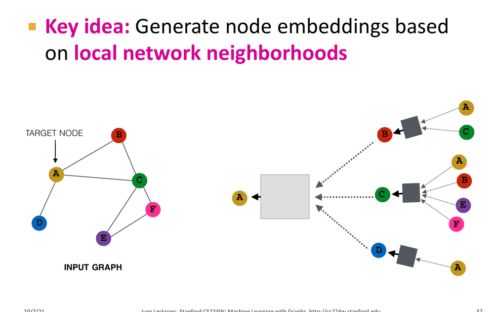
*From the slides (CS224W).*

The model can have **arbitrary depth**: nodes have an embedding at each layer; the layer-0 embedding of $v$ is its input feature $x_v$; the layer-$k$ embedding gets information from nodes **$k$ hops away**.

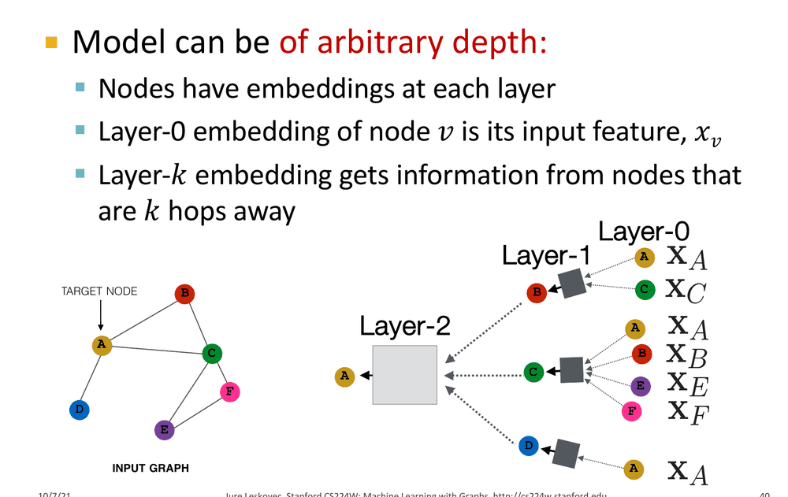
*From the slides (CS224W).*

**Basic approach:** average the messages from the neighbors and apply a neural network:

$$h_v^{(0)} = x_v, \qquad h_v^{(k+1)} = \sigma\left(W_k \sum_{u \in N(v)}\frac{h_u^{(k)}}{\lvert N(v) \rvert} + B_k h_v^{(k)}\right), \quad k = 0, \dots, K - 1, \qquad z_v = h_v^{(K)}$$

where $W_k$ (neighborhood aggregation) and $B_k$ (transformation of the node itself) are the **trainable weight matrices**. Given a node, the GCN computation is permutation-invariant (the average of the neighbors doesn't depend on their order);
over all nodes, it is permutation-equivariant.

**Matrix form.** With $H^{(k)} = [h_1^{(k)} \dots h_{\lvert V \rvert}^{(k)}]^T$ and $\tilde{A} = D^{-1}A$ ($D$ the diagonal matrix of degrees):

$$H^{(k+1)} = \sigma\left(\tilde{A} H^{(k)} W_k^T + H^{(k)} B_k^T\right)$$

(red: neighborhood aggregation; blue: self transformation). Since $\tilde{A}$ is sparse, efficient sparse matrix multiplication can be used.

> [!NOTE]
> **Not in the slides: one GCN step by hand.** One-dimensional features, $W = 1$, $B = 1$, no activation. Node $v$ has feature 2 and two neighbors with features 4 and 0.
> The neighbor average is $(4 + 0)/2 = 2$, so $h_v^{(1)} = 1 \cdot 2 + 1 \cdot 2 = 4$. After this layer, $v$'s embedding mixes its own feature with its neighbors'; after two layers, also with its neighbors' neighbors.

**Training.** The embeddings $z_v$ can feed any loss:

- **unsupervised**: similar nodes (by random walks, matrix factorization, node proximity) should have similar embeddings, e.g. with a cross entropy on $\text{DEC}(z_u, z_v)$;
- **supervised**: train directly for the task, e.g. node classification with the cross entropy $\sum_v y_v \log\sigma(z_v^T\theta) + (1 - y_v)\log(1 - \sigma(z_v^T\theta))$ ("is this drug safe or toxic?").

**Inductive capability.** The same aggregation parameters are **shared by all nodes**, so the number of parameters is sublinear in $\lvert V \rvert$, and the model generalizes to **unseen nodes** (a new node's computation graph uses the same weights)
and even to **entirely new graphs** (train on the protein network of one organism, apply to another).

**GNNs subsume CNNs.** A CNN layer with a $3 \times 3$ filter is $h_v^{(l+1)} = \sigma\left(\sum_{u \in N(v) \cup \lbrace v \rbrace} W_l^u h_u^{(l)}\right)$, where $N(v)$ are the 8 neighbor pixels: a GNN on a grid graph, with a different weight for each relative position
(possible because pixels have a fixed order, unlike graph nodes). And a **Transformer layer** is a special GNN on a **fully connected "word" graph**: each word attends to all the others (section 14.3).

## 15.4 A general GNN layer

A GNN layer compresses a set of vectors (the node itself and its neighbors) into a single vector, in two steps.

1. **Message:** each node computes a message, $m_u^{(l)} = \text{MSG}^{(l)}\big(h_u^{(l-1)}\big)$, e.g. a linear layer $m_u^{(l)} = W^{(l)} h_u^{(l-1)}$.
2. **Aggregation:** node $v$ aggregates the messages of its neighbors, $h_v^{(l)} = \text{AGG}^{(l)}\big(\lbrace m_u^{(l)}, u \in N(v) \rbrace\big)$, e.g. with Sum, Mean or Max.

**Issue:** information from $v$ itself could get lost, so its own message is included too: $h_v^{(l)} = \text{AGG}^{(l)}\big(\lbrace m_u^{(l)}, u \in N(v) \rbrace, m_v^{(l)}\big)$. A **non-linearity** $\sigma$ (ReLU, sigmoid…) adds expressiveness, in the message or in the aggregation.

### Classical layers

**GCN:**

$$h_v^{(l)} = \sigma\left(\sum_{u \in N(v)} W^{(l)}\frac{h_u^{(l-1)}}{\lvert N(v) \rvert}\right)$$

Message: each neighbor sends $m_u^{(l)} = \frac{1}{\lvert N(v) \rvert}W^{(l)} h_u^{(l-1)}$, normalized by the node degree. Aggregation: sum the messages, then apply the activation. (The input graph is assumed to have self-edges, included in the sum.)

**GraphSAGE** (Hamilton et al., 2017):

$$h_v^{(l)} = \sigma\left(W^{(l)} \cdot \text{CONCAT}\Big(h_v^{(l-1)},\ \text{AGG}\big(\lbrace h_u^{(l-1)}, \forall u \in N(v) \rbrace\big)\Big)\right)$$

A two-stage aggregation: first aggregate the neighbors, then aggregate that with the node itself by **concatenation**. The aggregation can be **mean**, **pool** (transform each neighbor with an MLP, then mean or max), or even an **LSTM** over a shuffled list of neighbors.
Optionally, embeddings are **$\ell_2$-normalized** at every layer, $h_v \leftarrow h_v / \lVert h_v \rVert_2$.

**Graph attention networks (GAT)** (Veličković et al., 2018):

$$h_v^{(l)} = \sigma\left(\sum_{u \in N(v)} \alpha_{vu} W^{(l)} h_u^{(l-1)}\right)$$

In GCN and GraphSAGE the weighting factor is $\alpha_{vu} = 1/\lvert N(v) \rvert$: defined explicitly by the graph structure, so **all neighbors are equally important**. GAT **learns** the importance of each neighbor with an **attention mechanism** $a$:

1. attention coefficients: $e_{vu} = a\big(W^{(l)} h_u^{(l-1)}, W^{(l)} h_v^{(l-1)}\big)$, the importance of $u$'s message to $v$ (e.g. $a$ is a single-layer network on the concatenation of the two vectors);
2. normalize with a **softmax** over the neighbors: $\alpha_{vu} = \dfrac{\exp(e_{vu})}{\sum_{k \in N(v)}\exp(e_{vk})}$;
3. weighted sum: e.g. $h_A^{(l)} = \sigma\big(\alpha_{AB} W^{(l)} h_B^{(l-1)} + \alpha_{AC} W^{(l)} h_C^{(l-1)} + \alpha_{AD} W^{(l)} h_D^{(l-1)}\big)$.

**Multi-head attention** stabilizes learning: several independent attention mechanisms, whose outputs are concatenated or summed. This is the same score → softmax → weighted sum pipeline of section 14.2, applied to the neighbors of a node.

**Other modern modules** can be put in a GNN layer: **Batch Normalization** (section 8.1) to stabilize training, **Dropout** (section 4.3) applied to the linear layer of the message function, and different activations.

## 15.5 Stacking layers: over-smoothing and skip connections

The standard way is to stack GNN layers sequentially. But GNNs suffer from **over-smoothing**: **all node embeddings converge to the same value**, which is bad because we want embeddings that **differentiate** nodes.

**Why:** the **receptive field** of a node is the set of nodes that determine its embedding; in a $K$-layer GNN it is the **$K$-hop neighborhood**. The shared neighbors of two nodes grow very quickly with the number of hops:
with many layers, nodes have highly overlapping receptive fields, hence highly similar embeddings.

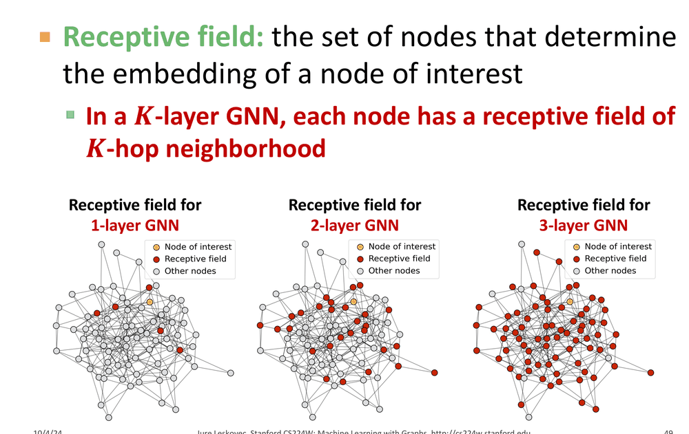
*From the slides (CS224W).*

**Lessons:**

1. **Be cautious when adding GNN layers:** unlike CNNs, more layers don't always help. Analyze the necessary receptive field (e.g. the diameter of the graph) and set the number of layers just above it.
   To keep a shallow GNN expressive, make each layer more powerful (e.g. a deep network inside the message or aggregation) or add non-GNN layers (MLPs) before and after the GNN layers for pre- and post-processing.
2. **Add skip connections:** embeddings of earlier layers sometimes differentiate nodes better, so add **shortcuts** that increase their impact on the final embedding: $F(x)$ becomes $F(x) + x$, as in ResNets (section 6.3).
   A GCN layer with a skip connection: $h_v^{(l)} = \sigma\left(\sum_{u \in N(v)} W^{(l)}\frac{h_u^{(l-1)}}{\lvert N(v) \rvert} + h_v^{(l-1)}\right)$. With $N$ skip connections there are $2^N$ possible paths, so the model is like a mixture of shallow and deep models.
   Another option is to connect **all** layers directly to the final one (jumping knowledge).

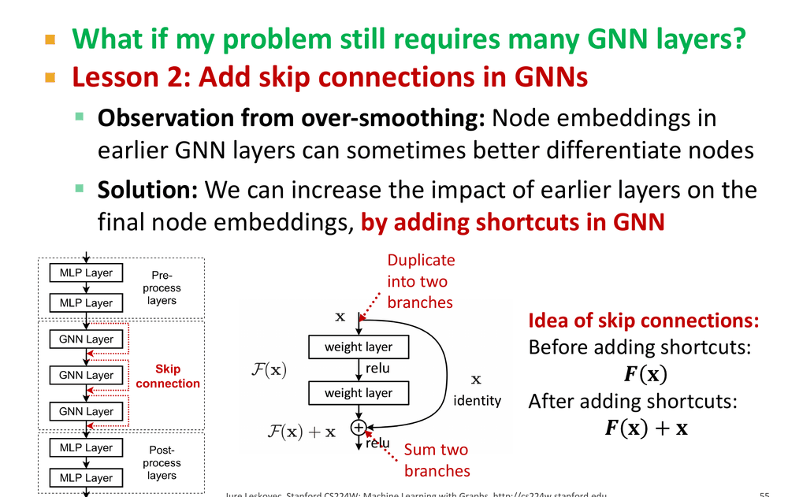
*From the slides (CS224W).*

**Graph augmentation.** The raw input graph need not be the computational graph:

- if the graph **lacks features**, add some (feature augmentation);
- if it is **too sparse**, add virtual edges (e.g. connect 2-hop neighbors) or a **virtual node** connected to all nodes, so that messages travel further;
- if it is **too dense**, **sample neighbors** when passing messages (e.g. only 2 random neighbors of $A$ send messages, a different pair each time): in expectation we get embeddings similar to using all neighbors, at a much lower cost (used by PinSage at Pinterest);
- if it is **too large**, sample subgraphs to compute embeddings.

## 15.6 Prediction heads, training and evaluation

After the GNN computes node embeddings $h_v^{(L)}$, a **prediction head** depends on the task level.

- **Node-level:** directly from the node embedding, e.g. $\hat{y}_v = W^{(H)} h_v^{(L)}$ for a $k$-way prediction.
- **Edge-level:** from pairs of embeddings, $\hat{y}_{uv} = \text{Head}_{edge}(h_u^{(L)}, h_v^{(L)})$: either **concatenation + linear**, $\text{Linear}(\text{Concat}(h_u, h_v))$, or **dot product** $\hat{y}_{uv} = (h_u^{(L)})^T h_v^{(L)}$, which gives one number
  (1-way prediction, e.g. does the edge exist); for $k$-way prediction use $k$ trainable matrices, $\hat{y}_{uv}^{(i)} = (h_u^{(L)})^T W^{(i)} h_v^{(L)}$, and concatenate the results, as in multi-head attention.
- **Graph-level:** from all the node embeddings: **global mean**, **max** or **sum pooling**. These work well for small graphs, but on large graphs global pooling **loses information**.

> [!NOTE]
> **The slides' toy example of the pooling issue.** With 1-dimensional embeddings, $G_1$ has $\lbrace -1, -2, 0, 1, 2 \rbrace$ and $G_2$ has $\lbrace -10, -20, 0, 10, 20 \rbrace$: clearly different graphs, but global sum pooling gives 0 for both.
> **Hierarchical pooling** fixes it: aggregate the first two nodes and the last three separately with $\text{ReLU}(\text{Sum}(\cdot))$, then aggregate again. For $G_1$: $\text{ReLU}(-3) = 0$ and $\text{ReLU}(3) = 3$, then $\text{ReLU}(0 + 3) = 3$.
> For $G_2$: 0 and 30, then 30. Now the two graphs are distinguished. **DiffPool** learns such a hierarchy: one GNN computes embeddings, another computes the cluster assignments used to pool them, level by level.

**Where the labels come from.**

- **Supervised:** labels from external sources: node labels (the subject area of a paper in a citation network), edge labels (whether a transaction is fraudulent), graph labels (drug-likeness of a molecule).
- **Unsupervised / self-supervised:** when we only have a graph, find signals inside it: node statistics (clustering coefficient, PageRank), hidden edges to predict, graph statistics.

**Loss:** cross entropy for classification (section 2.3), MSE for regression. **Metrics:** accuracy, precision, recall, F1, and ROC AUC for binary classification (section 1.5), e.g. computed with scikit-learn.

### Splitting a graph dataset

Splitting into training, validation and test is special for graphs: in node classification **data points are not independent**. Node 5 in the test set affects the prediction on node 1 in the training set, because it takes part in message passing.

- **Transductive setting:** the input graph is visible in all splits; only the **labels** are split. At training time, embeddings are computed on the entire graph and trained with the labels of nodes 1 and 2; at validation time, the embeddings are computed on the entire graph and evaluated on nodes 3 and 4.
- **Inductive setting:** break the edges between the splits, obtaining several independent graphs; train on one, evaluate on the others. The only option for graph classification, where we must test on **unseen graphs**.

**Link prediction** is trickier: we must hide edges and let the model predict them. The edges are split twice.

1. **Assign two types of edges:** **message edges**, used for GNN message passing, and **supervision edges**, used to compute the objective. Only message edges remain in the graph; supervision edges are **not** fed to the GNN.
2. **Split the edges into train, validation and test.** *Inductive:* several graphs, each with its own message and supervision edges. *Transductive* (the default when people talk about link prediction): one graph, with training message edges,
   training supervision edges, validation edges and test edges, where each later split can use the earlier edges as message edges.

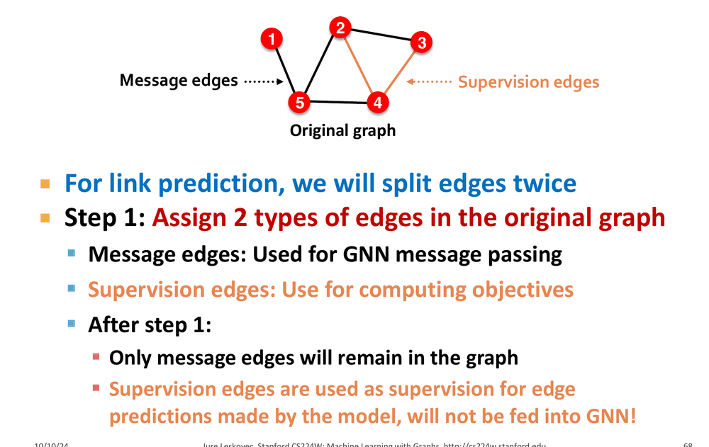
*From the slides (CS224W).*

> [!TIP]
> **Not in the slides: libraries.** CS224W uses **PyTorch Geometric (PyG)**, where the layers above are ready-made (`GCNConv`, `SAGEConv`, `GATConv`). The course's other notebooks use Keras; the concepts are the same.

---

# 16. Diffusion models and generative inverse design

*Lesson 15. The material is a lecture on diffusion models (Pascal Poupart, University of Waterloo, CS480/680) and the presentation of GIDnets (Carlo Adornetto and Gianluigi Greco, IJCAI 2023),
research by the lecturers of this course.*

## 16.1 Diffusion models

**Recap of generative models.** A **GAN** (section 10) trains a generator against a discriminator; a **VAE** (section 7.3) encodes into a latent distribution and decodes, maximizing a lower bound on the likelihood;
**flow-based models** use an **invertible** transformation $f$ and its inverse $f^{-1}$.

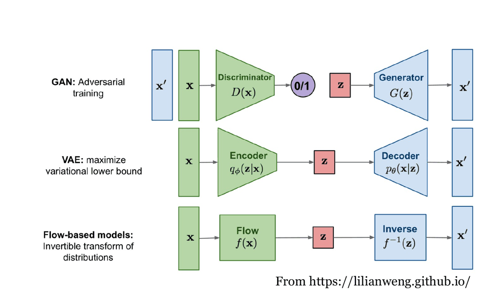
*From the slides (figure from lilianweng.github.io).*

A **diffusion model** is a **stochastic autoencoder**: the encoder **adds noise** step by step, the decoder **removes** it. Compared with the others:

- it generates **better data than VAEs**;
- it is **easier to train than GANs** and does not suffer from **mode collapse**;
- it is a special kind of stochastic flow, **not restricted to invertible transformations**.

> [!TIP]
> **Not in the slides: mode collapse.** A GAN's generator can find a few outputs that fool the discriminator and produce only those (e.g. only one kind of face), ignoring the rest of the data distribution.
> A diffusion model is trained with a plain regression loss on noise (below), with no adversarial game, so this cannot happen.

### Forward diffusion process

Start from a real image $x_0$ and, for $t = 1, \dots, T$, add a little Gaussian noise at each step:

$$q(x_t \mid x_{t-1}) = \mathcal{N}\big(x_t;\ \sqrt{1 - \beta_t}\,x_{t-1},\ \beta_t I\big)$$

where $\beta_t$ is the **variance schedule** ($0 \le \beta_t \le 1$, small at the beginning, larger at the end) and $I$ the identity matrix. After many steps the image is pure noise.

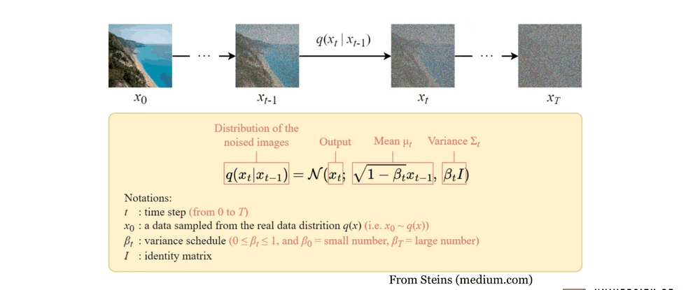
*From the slides (figure from Steins, medium.com).*

**Stochastic transformation.** With the **reparametrization trick** (section 7.3), if $x \sim \mathcal{N}(\mu, \sigma^2)$ then $x = \sigma\varepsilon + \mu$ with $\varepsilon \sim \mathcal{N}(0, 1)$. So one step is

$$x_t = \sqrt{1 - \beta_t}\,x_{t-1} + \sqrt{\beta_t}\,\varepsilon, \qquad \varepsilon \sim \mathcal{N}(0, I)$$

**Speed-up:** $x_t$ can be computed from $x_0$ **in one step**. With $\alpha_t = 1 - \beta_t$ and $\bar{\alpha}_t = \prod_{i=1}^{t}\alpha_i$:

$$x_t = \sqrt{\bar{\alpha}_t}\,x_0 + \sqrt{1 - \bar{\alpha}_t}\,\varepsilon, \qquad \varepsilon \sim \mathcal{N}(0, I)$$

In the limit, $\bar{\alpha}_t \to 0$, so $x_\infty = \varepsilon$: a random vector from an isotropic Gaussian.

> [!NOTE]
> **Not in the slides: the one-step formula with numbers.** With a constant $\beta_t = 0.02$, $\alpha_t = 0.98$. After 10 steps $\bar{\alpha}_{10} = 0.98^{10} \approx 0.82$: $x_{10} \approx 0.905\,x_0 + 0.43\,\varepsilon$, still mostly image.
> After 200 steps $\bar{\alpha}_{200} \approx 0.018$: $x_{200} \approx 0.13\,x_0 + 0.99\,\varepsilon$, almost only noise. The two coefficients always satisfy $\bar{\alpha}_t + (1 - \bar{\alpha}_t) = 1$, so the variance stays about the same while the image fades into noise.

### Reverse denoising process

The forward process factorizes as $q(x_0, \dots, x_T) = q(x_0)\prod_{t=1}^{T} q(x_t \mid x_{t-1})$; the reverse one as $q(x_0, \dots, x_T) = \prod_{t=1}^{T} q(x_{t-1} \mid x_t)\,q(x_T)$.
Since the joint distribution is Gaussian, $q(x_{t-1} \mid x_t)$ is Gaussian too, $\mathcal{N}(x_{t-1} \mid \tilde{\mu}_t(x_t, t), \sigma_t I)$, but it has no closed form. Ho, Jain and Abbeel (2020) derived the approximation

$$\tilde{\mu}_t(x_t, t) \approx \frac{1}{\sqrt{\alpha_t}}\left(x_t - \frac{1 - \alpha_t}{\sqrt{1 - \bar{\alpha}_t}}\,\varepsilon_t\right)$$

where $\varepsilon_t$ is the noise introduced at step $t$. We don't know $\varepsilon_t$, but we can **train a neural network $\varepsilon_\theta(x_t, t)$ to predict it**, minimizing $L(\theta) = \lVert \varepsilon_t - \varepsilon_\theta(x_t, t) \rVert^2$.

### Training

Repeat until convergence:

1. take a real image $x_0$;
2. pick a random time step $t \sim \text{Uniform}(1, \dots, T)$;
3. sample noise $\varepsilon \sim \mathcal{N}(0, I)$;
4. build the noisy image $x_t = \sqrt{\bar{\alpha}_t}\,x_0 + \sqrt{1 - \bar{\alpha}_t}\,\varepsilon$;
5. take a gradient step on $\lVert \varepsilon - \varepsilon_\theta(x_t, t) \rVert^2$.

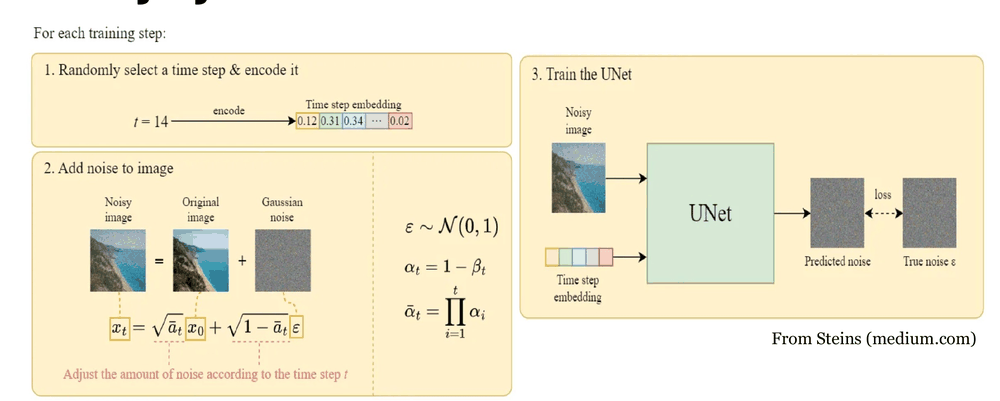
*From the slides (figure from Steins, medium.com): the time step is encoded as an embedding and fed to a U-Net together with the noisy image; the loss compares predicted and true noise.*

The network $\varepsilon_\theta$ is a **U-Net** (section 9.2), a special fully convolutional network: its output has the same size as its input, as needed to predict a noise image.

> [!TIP]
> **Not in the slides: why predicting noise is enough.** Once the network can say "this part of $x_t$ is noise", subtracting it gives a slightly cleaner image. The training is just regression with the MSE (section 2.3)
> on a very large number of (noisy image, noise) pairs, which can be generated for free from any image dataset.

### Generation

1. Sample $x_T \sim \mathcal{N}(0, I)$ (e.g. $T = 1000$).
2. For $t = T, \dots, 1$: sample $z \sim \mathcal{N}(0, I)$ if $t > 1$, else $z = 0$, and denoise one step:

$$x_{t-1} = \frac{1}{\sqrt{\alpha_t}}\left(x_t - \frac{1 - \alpha_t}{\sqrt{1 - \bar{\alpha}_t}}\,\varepsilon_\theta(x_t, t)\right) + \sigma_t z$$

3. Return $x_0$.

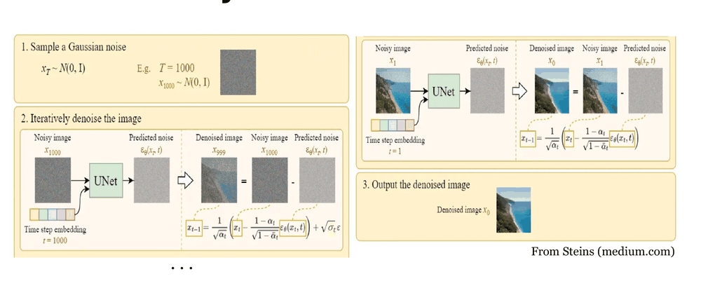
*From the slides (figure from Steins, medium.com).*

> [!NOTE]
> **Not in the slides: generation is slow.** Training uses the one-step formula, but generation must undo the noise **one step at a time**: 1,000 passes of the U-Net for one image, against a single pass for a GAN or VAE decoder.
> The latent diffusion model below, and later faster samplers, address this.

### Latent diffusion (Stable Diffusion)

**Latent diffusion** (Rombach, Blattmann et al., 2022), known as **Stable Diffusion**:

- **speed-up:** run the diffusion in a **low-dimensional latent space**: an encoder $E$ compresses the image $x_0$ into a small latent $z_0$, the diffusion works on $z$, and a decoder $D$ turns the result back into an image;
- **conditional generation:** the denoising U-Net is **conditioned** on text, images, semantic maps, etc., through an encoder $\tau_\theta$ of the condition and cross-attention layers (queries from the image, keys and values from the condition, section 14.3).

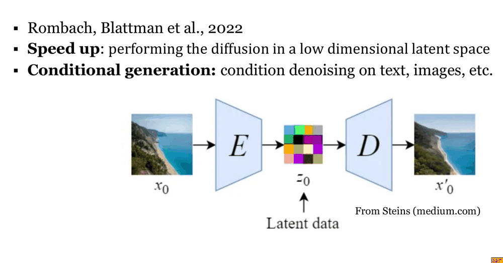
*From the slides (figure from Steins, medium.com).*

## 16.2 GIDnets: generative inverse design

**Inverse design.** In engineering, chemistry and physics, the design of devices, materials and molecules is increasingly supported by deep learning. The conventional approach goes **forward**: from a design to its properties
(e.g. a simulation). **Inverse design** goes backwards: **design a material, device or tool based on the properties it should exhibit**.

**Problems:**

- **non-uniqueness of the solution:** the inverse $x = f^{-1}(y)$ is not a function; **drastically different devices can produce very similar responses**;
- **high dimensionality** of the design space;
- **feasibility constraints** on the design (e.g. each layer of a device must be made of exactly one material).

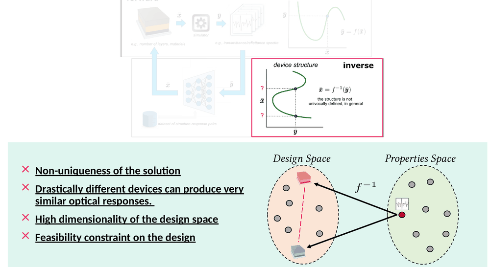
*From the slides (Adornetto and Greco, IJCAI 2023).*

**State of the art.** Existing approaches are either **output-independent** (trained once on (design, property) pairs, no fine-tuning on the desired property: feed-forward, tandem networks, conditional GANs and VAEs) or **output-dependent**
(fine-tuned on the desired property: adjoint methods, GLOnets). Their limits: most work in the original, high-dimensional design space; they don't consider feasibility constraints; they start the exploration from a random initialization.

**GIDnet: key ideas.**

1. **Embed the design space into a latent space** (with an encoder-decoder, section 7), which can handle representations beyond plain numbers, such as one-hot encodings of physical structures. A **reconstruction loss** and a **softmax** on the categorical parts
   enforce the one-hot encoding, so the latent space can be restricted to the **feasible regions**.
2. Rather than a "blind" generator starting from a random point, **start the exploration of the latent space from educated guesses called seeds**, taken from the dataset: designs whose properties are close to the desired one.
   A **selection layer** lets the network choose the starting point as one of the seeds, or a linear combination of them; a regularization term pushes it towards a single choice, so the most influential seed can be identified.

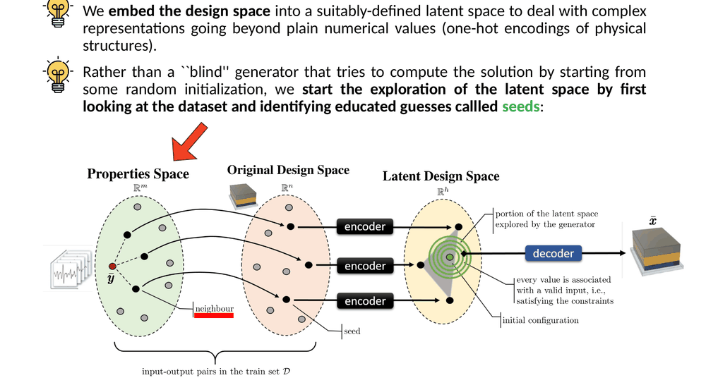
*From the slides (Adornetto and Greco, IJCAI 2023).*

**Architecture.** A **generator** explores the feasible region of the latent space starting from the seeds; the **decoder** turns the latent point into a design; a **forward neural simulator** (a network trained to predict the properties of a design) computes its properties;
the loss $\mathcal{L}$ compares the generated property with the desired one, and its gradient drives the exploration.

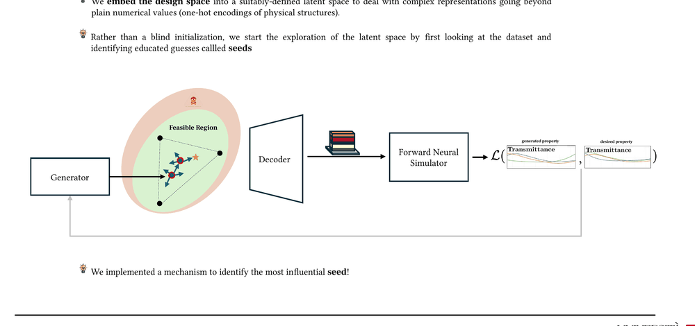
*From the slides.*

**Photonics scenario.** Thin-film metamaterials with 5 layers; each layer has a thickness between 1 and 60 nm and a material among Ag, Al₂O₃, ITO, Ni, TiO₂, represented as a one-hot vector plus the thickness. Each structure has reflectance and transmittance spectra
(computed with the transfer matrix method, for two polarizations, at 25°, 45° and 65°, at 200 wavelengths between 450 and 950 nm). The task is inverse: given the desired spectra, find the layers.
Results are measured with two metrics: the **spectral RMSE** of the designs checked with the **real** simulator, and a **one-hot** score for the feasibility of the materials. GIDnet was also compared on real-valued benchmarks (e.g. ballistics, a robotic arm, sine waves, multilayer graphene stacks).

**Conclusions** of the paper: GIDnet improves on existing methods, including state-of-the-art ones specific to photonics, through a guided exploration of the latent space. Future directions: coupling it with a genetic algorithm for narrow design spaces,
and adapting it to the related problem of **sampling new designs** from a distribution conditioned on the properties (as a conditional VAE would, but with feasibility constraints).

> [!TIP]
> **Not in the slides: how the course comes together here.** GIDnet combines an autoencoder and its latent space (section 7), a softmax for categorical choices (section 3.2), a neural network used as a differentiable simulator (sections 2 and 3.3),
> and gradient descent used not to train weights but to **search** the latent space for a good design (section 2.4): the same backpropagation machinery, applied to the input instead of the parameters.

---

# Cheat sheet

- $Y = f(X) + \varepsilon$: learn $f$ from data to predict $Y$. Regression if $Y$ is a number, classification if $Y$ is a class, clustering if there is no $Y$.
- Least squares: minimize $\sum (y_i - \hat{y}_i)^2$. MAE is robust to outliers, MSE punishes large errors and is differentiable, RMSE is MSE in the original unit.
- Low training error does not mean low test error. More flexibility: less bias, more variance. Test error is U-shaped: its rising part is overfitting.
- Confusion matrix: TP, FN, FP, TN. Precision = $TP/(TP+FP)$ (among predicted positives), recall = $TP/(TP+FN)$ (among real positives), F1 = their harmonic mean. Accuracy misleads with imbalanced classes.
- ROC: TPR against FPR for all thresholds; AUC 0.5 = random, 1 = perfect.
- k-NN: majority class of the $k$ nearest points; smaller $k$ = more flexible. Trees: readable but unstable, pruning against overfitting. Random forest: bootstrap samples + random attributes + majority vote.
- k-means: choose $K$ centroids, assign each point to the nearest, move each centroid to the mean, repeat until nothing changes.
- Perceptron: $\text{sign}(w^T x)$, a linear classifier, cannot learn XOR. Adding layers gives non-linear boundaries.
- Neuron: $a_i = b_i + \sum_j w_{ji} z_j$, $z_i = f_i(a_i)$. Layer: $\vec{z}_k = f_k(\vec{b}_k + W_k \vec{z}_h)$.
- Losses: MAE, MSE, SAE for regression; binary and categorical cross entropy for classification.
- Gradient descent: $w \leftarrow w - \eta \nabla \text{loss}$. On $\frac{1}{2}Cw^2$: $\eta = 1/C$ one step, $\eta < 1/C$ slow, up to $2/C$ oscillating, above $2/C$ divergent. SGD updates per example or batch. AdaGrad, RMSprop, Adam adapt the learning rate per weight.
- Backpropagation: chain rule; $\delta_{k-1} = f'_{k-1}(\dots) \cdot W_k^* \cdot \delta_k$, computed from the output backwards.
- Initialization: never zero or constant (symmetry); scale random weights with the layer size (He: $\sqrt{2/\text{fan-in}}$, Xavier: $\sqrt{2/(\lvert h \rvert + \lvert k \rvert)}$).
- Keras recipe: vectorize inputs, Dense + ReLU hidden layers, output sigmoid + binary cross entropy (2 classes) or softmax + categorical cross entropy (many classes), watch the validation curves, stop at the best epoch.
- Regression: normalize with the **training** mean and std, one linear output unit, MSE loss, MAE metric; with little data use K-fold validation.
- Against overfitting: smaller network, L2 (all weights small) or L1 (sparse) regularization, dropout (scale by $1-p$ at test time), early stopping.
- Convolution: a small kernel slid over the input; sparse interactions, parameter sharing, equivariance. Output size $\lfloor (n + 2p - k)/s \rfloor + 1$. Max pooling halves the size with no parameters.
- Transfer learning: reuse the first layers of a pre-trained net (VGG-16) as feature extractor, or freeze them and train a new head. Functional API for multi-input/output and non-sequential graphs.
- Autoencoder: encoder $z = f(x)$, decoder $r = g(z)$, loss $L(x, g(f(x)))$; sparse, denoising, contractive variants. VAE: encode $\mu, \sigma$, sample $z = \mu + \sigma\varepsilon$, loss = reconstruction + KL to $\mathcal{N}(0, 1)$.
- Batch Norm: normalize per feature over the mini-batch, then $\gamma\hat{x} + \beta$; moving averages at inference. Transposed convolution upsamples. Leaky ReLU avoids dead units.
- U-Net: encoder-decoder for segmentation with skip connections (concatenation) at each level; $1 \times 1$ conv output.
- GAN: generator vs discriminator, alternate their updates; conditional GAN, pix2pix (paired, U-Net + PatchGAN + L1), CycleGAN (unpaired, cycle consistency loss).
- RNN: $h_t = \sigma(W x_t + U h_{t-1} + b)$, trained with BPTT; vanishing gradient ($0.99^{300} \approx 0.05$). LSTM: forget, input, output gates and a cell state updated by addition; GRU: update and reset gates.
- Word embeddings: distributional hypothesis; count-based (PPMI, LSA), Word2Vec (skip-gram or CBOW, softmax over $u^T v$, negative sampling), GloVe; analogies king − man + woman ≈ queen.
- Language models: $P(y) = \prod_t p(y_t \mid y_{<t})$; n-grams with backoff, interpolation, smoothing; neural LMs with cross entropy; temperature, top-k, top-p sampling; perplexity $2^{-L/M}$ (1 is perfect).
- Seq2seq: encoder-decoder, teacher forcing, beam search. Attention: scores, softmax, weighted sum of encoder states. Transformer: self-attention $\text{softmax}(qk^T/\sqrt{d_k})v$, masking, multi-head, residual + layer norm, positional encoding.
- Graphs: node embeddings by random walks (DeepWalk, node2vec with $p$, $q$) = skip-gram on walks. GNN layer = message + aggregation (GCN mean, GraphSAGE concat, GAT attention). Beware over-smoothing; use skip connections. Heads at node, edge and graph level; split carefully (transductive vs inductive).
- Diffusion: add noise $x_t = \sqrt{\bar{\alpha}_t}x_0 + \sqrt{1 - \bar{\alpha}_t}\varepsilon$, train a U-Net to predict $\varepsilon$, generate by denoising step by step; latent diffusion works in a latent space and is conditioned on text.
