# Deep Learning: summary

Based on the course slides: the introductory lecture on machine learning (with the notebook `ML_metrics.ipynb`),
and the lessons "Introduction to Neural Networks" and "Binary / Multi Class Classification" by Gianluigi Greco.
The sections follow the order of the lectures.

Explanations and examples that are not in the slides are marked **Not in the slides**. Figures marked
*From the slides* are taken from the lecturer's material.

**Progress:** the first three lectures are covered.

## Contents

1. [Introduction to machine learning](#1-introduction-to-machine-learning)
   - [1.1 What is machine learning](#11-what-is-machine-learning)
   - [1.2 Data and types of problems](#12-data-and-types-of-problems)
   - [1.3 Regression](#13-regression)
   - [1.4 Training error, test error and the bias-variance tradeoff](#14-training-error-test-error-and-the-bias-variance-tradeoff)
   - [1.5 Classification and evaluation metrics](#15-classification-and-evaluation-metrics)
   - [1.6 k-Nearest Neighbors](#16-k-nearest-neighbors)
   - [1.7 Classification trees and random forest](#17-classification-trees-and-random-forest)
   - [1.8 Unsupervised learning and k-means](#18-unsupervised-learning-and-k-means)
2. [Neural networks: the basic ingredients](#2-neural-networks-the-basic-ingredients)
   - [2.1 From biological neurons to the perceptron](#21-from-biological-neurons-to-the-perceptron)
   - [2.2 The graph](#22-the-graph)
   - [2.3 The loss function](#23-the-loss-function)
   - [2.4 The optimizer](#24-the-optimizer)
   - [2.5 Backpropagation](#25-backpropagation)
   - [2.6 Initialization](#26-initialization)
3. [Classification with Keras](#3-classification-with-keras)
   - [3.1 Binary classification: IMDb reviews](#31-binary-classification-imdb-reviews)
   - [3.2 Multi-class classification: Reuters newswires](#32-multi-class-classification-reuters-newswires)
4. [Cheat sheet](#cheat-sheet)

---

# 1. Introduction to machine learning

## 1.1 What is machine learning

The lecture follows one running example: a dataset of 30 people with their **education** (years of study),
**work experience**, **sex** and current **income** (gross annual salary, "RAL", in thousands of euros).

*The question:* can we predict a person's income from their education? In other words, is there an association
between education and income? Plotting income against years of education, the points roughly follow an increasing line.


*From the slides.*

We model the association between an input variable $X$ and an output variable $Y$ as

$$Y = f(X) + \varepsilon$$

where $f$ is an **unknown function** and $\varepsilon$ is a **random error**. Once we have an estimate of $f$, we use it to
**predict** $Y$ for new values of $X$. With the line estimated in the slides, 16 years of education give a predicted income
of about 60.2 (thousand euros), 19 years give about 79.4.

> [!NOTE]
> **Not in the slides: why the error term.** Two people with the same education do not earn the same: income also depends
> on things we did not measure (job, city, luck). $\varepsilon$ collects all of this. So even the true $f$ cannot predict $Y$ exactly:
> it predicts the *average* income for a given education.

**Two definitions of machine learning.**

- *Task, performance, experience* (Mitchell): a program **learns** from experience $E$, with respect to a class of tasks $T$ and a
  performance measure $P$, if its performance on $T$, measured by $P$, improves with experience $E$.
  Example, learning to play chess: $T$ = playing chess, $P$ = percentage of games won, $E$ = practice games against itself.
- *Wikipedia*: machine learning is a set of AI techniques for developing algorithms that **learn from data**, **generalize** to unseen data,
  and perform tasks **without explicit instructions**.

The difference from traditional programming, with the pizza picture of the slides: in traditional programming you give the computer
the ingredients **and the recipe**, and it makes the pizza. In machine learning you give it the ingredients **and the pizza**,
and it **figures out the recipe**.

**Applications:** medical diagnosis and prognosis, market trend forecasting, credit risk assessment, failure prediction, spam detection,
product and content recommendations, traffic forecasting. The slides also list many uses in public administration across Europe
(for example document sorting, border control, chatbots, cybersecurity).

**Why machine learning?**

- **Flexible modeling:** no need for strong assumptions such as linearity; nonparametric models capture complex nonlinear relationships.
- **Big data:** very large datasets with many variables.
- **Unstructured data:** images, text, audio.
- **Continuous adaptation:** models can be updated with new data without redesigning them.
- **Better predictive performance** in many tasks.

**Hierarchy:** Artificial Intelligence ⊃ Machine Learning ⊃ Neural Networks ⊃ Deep Learning. Inside machine learning,
**supervised** methods include linear/logistic regression, SVM, XGBoost, k-nearest neighbors, random forest and decision trees;
**unsupervised** methods include PCA, k-means and hierarchical clustering.

## 1.2 Data and types of problems

**Types of data.**

- **Qualitative** (categorical) variables: on a **nominal** scale (categories with no order, e.g. sex) or an **ordinal** scale (ordered categories).
- **Quantitative** (numeric) variables: on an **interval** scale or a **ratio** scale.

> [!TIP]
> **Not in the slides: examples of the four scales.**
> Nominal: blood type, sex. Ordinal: education level (primary < high school < degree), a 1 to 5 star rating.
> Interval: temperature in °C (differences make sense, but 20 °C is not "twice as hot" as 10 °C, because 0 is not "no temperature").
> Ratio: income, weight, years of experience (there is a true zero, so 40k is twice 20k).

**Naming the variables.** In the income dataset:

- $X_1, X_2, X_3$ (education, experience, sex) are the **predictors**: also called features, independent variables, **input**;
- $Y$ (income) is the **response**: also called label, target, dependent variable, **output**.

**Three kinds of problems.**

| Problem | When | Family |
|---|---|---|
| **Regression** | $Y$ is **quantitative** (e.g. income in euros) | supervised |
| **Classification** | $Y$ is **qualitative** (e.g. income class: below or above 50k) | supervised |
| **Clustering** | there is **no $Y$**, and we look for homogeneous groups of observations | unsupervised |


*From the slides.*

**Supervised learning** trains an algorithm on a **labeled** dataset (each example comes with the correct output) to learn the relationship
between inputs and output, with the goal of **predicting the output for unseen data**.

## 1.3 Regression

### Simple linear regression

The simplest way to predict a quantitative $Y$ from a single predictor $X$ is to assume an approximately **linear** relationship:

$$y = \beta_0 + \beta_1 x$$

- $\beta_0$ is the **intercept**: where the line crosses the $y$ axis;
- $\beta_1$ is the **slope**: how much $y$ changes when $x$ increases by 1.

The estimated line is written $\hat{y} = \hat{\beta}_0 + \hat{\beta}_1 x$ (the hat means "estimated from data").
Many lines are possible: which one is best?

### The least squares method

Choose the line that **minimizes the sum of the squared vertical distances** between the points and the line:

$$\min \sum_{i=1}^{n} (y_i - \hat{y}_i)^2$$

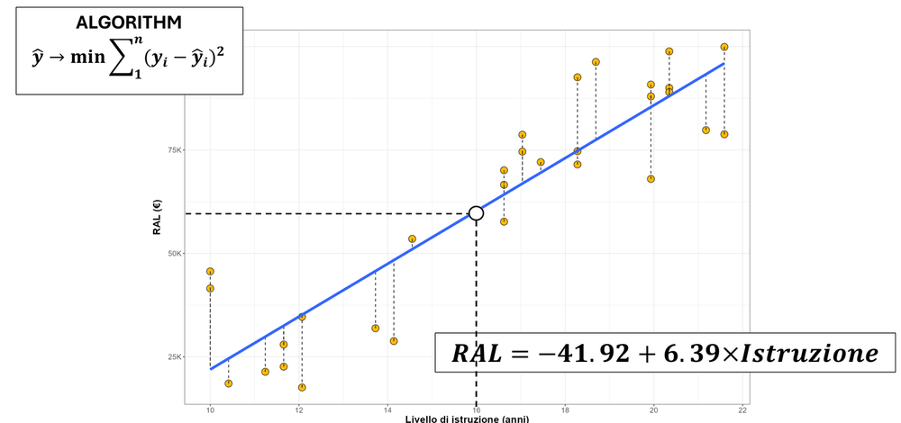
*From the slides: each dashed segment is a residual $y_i - \hat{y}_i$.*

On the income data this gives

$$\text{RAL} = -41.92 + 6.39 \times \text{Education}$$

> [!NOTE]
> **Not in the slides: reading the result.** Each extra year of education is associated with about **6.39 thousand euros** more income.
> For 16 years: $-41.92 + 6.39 \cdot 16 = 60.32$, close to the 60.2 shown on the prediction slide (the difference is rounding of the coefficients).
> The intercept $-41.92$ would be the income with 0 years of education: it has no real meaning, because no one in the data is near 0.
> *Why squares?* Squaring makes all distances positive, so errors above and below the line do not cancel out, and it penalizes large errors more.

### Performance measures for regression

$$\text{MAE} = \frac{1}{n}\sum_{i=1}^{n} \lvert y_i - \hat{y}_i \rvert \qquad \text{MSE} = \frac{1}{n}\sum_{i=1}^{n} (y_i - \hat{y}_i)^2 \qquad \text{RMSE} = \sqrt{\text{MSE}}$$

The notebook `ML_metrics.ipynb` compares them:

| Metric | Penalizes large errors | Sensitive to outliers | Unit | Use it when |
|---|---|---|---|---|
| **MAE** | no | low | same as the target | all errors matter equally |
| **MSE** | yes, strongly | high | squared | large deviations are critical; also smooth, so good for optimization |
| **RMSE** | yes | high | same as the target | large errors matter, but you want an interpretable number |

*Example from the notebook:* true house prices 200k, 250k, 300k; predictions 210k, 245k, 280k. Errors: 10, 5, 20.

$$\text{MAE} = \frac{10 + 5 + 20}{3} \approx 11.7\text{k} \qquad \text{MSE} = \frac{100 + 25 + 400}{3} = 175 \qquad \text{RMSE} = \sqrt{175} \approx 13.23\text{k}$$

Note how the single error of 20 contributes 400 out of 525 to the MSE: squaring makes large errors dominate.

### Multiple linear regression

Adding work experience as a second predictor, the model becomes a **plane** instead of a line:

$$\text{RAL} = -50.1 + 5.9 \times \text{Education} + 0.17 \times \text{Experience}$$

> [!NOTE]
> **Not in the slides.** With two predictors, each coefficient is the effect of one variable **keeping the other fixed**.
> The education coefficient drops from 6.39 to 5.9: part of what looked like the effect of education was actually due to experience.

## 1.4 Training error, test error and the bias-variance tradeoff

### The problem

- Least squares is designed to reduce the MSE **on the training data**, the data we are looking at.
- What we really care about is how the model performs on **new data**, the **test set**.
- The method with the lowest **training** MSE is **not guaranteed** to have the lowest **test** MSE.

### Train/test approach

To find the model (for example, the set of variables) with the lowest test error:

1. randomly **split** the data into a **training set** and a **validation set** (called test set in the pictures);
2. build the candidate models on the training set;
3. compute each model's error on the validation set, and **pick the one with the lowest error**.

- **Advantages:** simple and easy to implement.
- **Disadvantages:** the validation error can **vary a lot** depending on which observations end up in which set; and only part of the data is used
  to fit the model, while statistical methods tend to perform worse with fewer observations.

### Flexibility

- The **more flexible** a method is, the **lower its training error**: it can follow the training points very closely.
- Flexible methods can produce a wider range of shapes for $f$ than restrictive methods like linear regression.
- **Less flexible methods are easier to interpret**: we must balance flexibility and interpretability.
- But a flexible method can have a **higher test error** than a simple one.


*From the slides: the dashed line is linear (low flexibility), the red curve is moderately flexible, the blue curve is very flexible.
On the right, the training MSE keeps decreasing with flexibility, while the test MSE decreases and then grows again.*

> [!NOTE]
> **Not in the slides: reading the picture.** The blue curve passes almost through every training point, so its training error is tiny.
> But it wiggles to chase individual points, including their random error $\varepsilon$: on new people it will predict badly.
> The red curve captures the general shape without chasing the noise, and has the lowest test error.

### Bias and variance

Two competing forces govern the choice of the method.

- **Bias** is the error introduced by representing a very complex real phenomenon with a much **simpler model**.
  Linear regression assumes a linear relationship; a real relationship is unlikely to be exactly linear, so some bias is present.
  **A more flexible method generally has less bias.**
- **Variance** describes how much the estimate of $f$ would **change with a different training set**: it relates to the model's ability to generalize.
  **A more flexible method generally has higher variance.**


*From the slides: low bias = shots centered on the bullseye (accurate); low variance = shots close together (precise).*

**The key illustration.** As model complexity grows, the training error keeps decreasing; the test error first decreases (bias falls),
then increases again (variance grows). When the test error rises while the training error keeps falling, the model is **overfitting**.

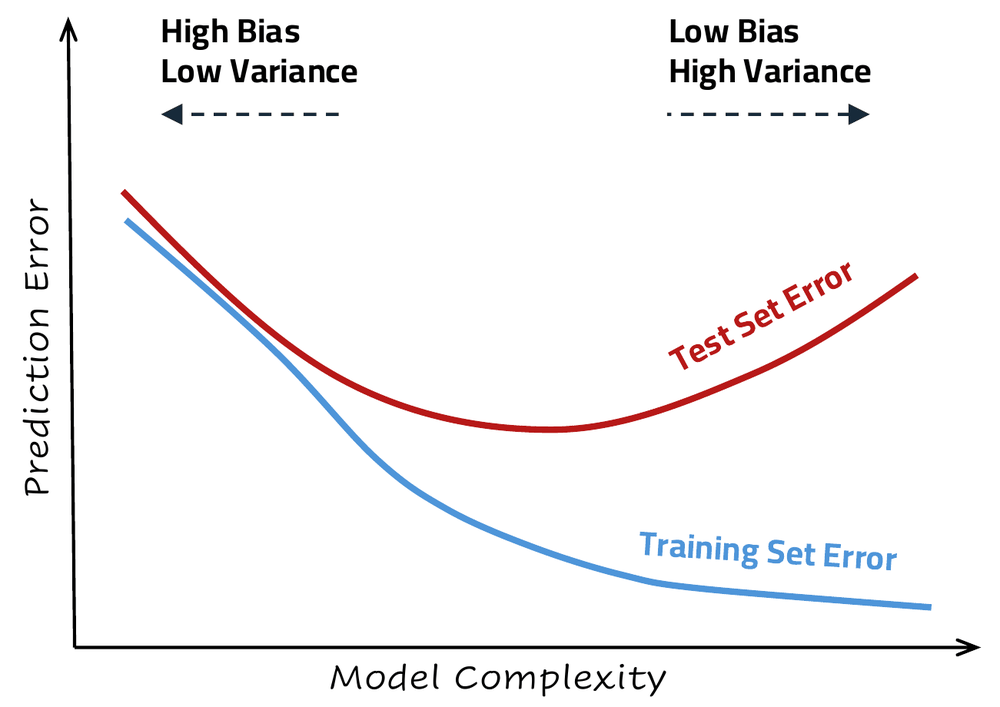
*From the slides.*

> [!TIP]
> **Not in the slides: overfitting and underfitting in one sentence each.**
> **Underfitting** (left side, high bias): the model is too simple and is wrong on training and test data alike.
> **Overfitting** (right side, high variance): the model has memorized the training data, noise included, and does not generalize.

## 1.5 Classification and evaluation metrics

### Error rate

For a classification problem, the simplest measure is the **error rate** on $m$ items:

$$\text{Error rate} = \frac{1}{m}\sum_{i=1}^{m} I(y_i \neq \hat{y}_i)$$

where $I(\cdot)$ is 1 if the condition is true and 0 otherwise. So the error rate is the **fraction of misclassified items**.

Evaluating a classifier means checking how well it **generalizes**: this requires examining the problem and the factors that affect evaluation,
and choosing **suitable metrics**, with a justification.

### Confusion matrix

Applying the classifier to the test set lets us compare **predicted** and **actual** classes. For binary classification there are four cases:

- **TP** (true positives): actually positive, predicted positive;
- **TN** (true negatives): actually negative, predicted negative;
- **FP** (false positives): actually negative, predicted positive, a *false alarm*;
- **FN** (false negatives): actually positive, predicted negative, a *miss*.

|  | **Predicted positive** | **Predicted negative** |
|---|---|---|
| **Actually positive** | TP | FN |
| **Actually negative** | FP | TN |

> [!WARNING]
> **Not in the slides: check the confusion matrix slide.** In the slide, the cell "actual positive, predicted negative" is labeled
> *False Positives* and the cell "actual negative, predicted positive" is labeled *False Negatives*. With the usual definitions they are swapped:
> a positive predicted as negative is a **false negative**. The table above uses the usual definitions, which are also the ones of the notebook.

### Metrics

$$\text{Accuracy} = \frac{TP + TN}{TP + TN + FP + FN} \qquad \text{Error rate} = 1 - \text{Accuracy}$$

$$\text{Precision} = \frac{TP}{TP + FP} \qquad \text{Recall} = \frac{TP}{TP + FN} \qquad F_1 = 2 \cdot \frac{\text{Precision} \cdot \text{Recall}}{\text{Precision} + \text{Recall}}$$

- **Accuracy:** fraction of correct predictions among all observations.
- **Precision:** of all the items **predicted** positive, how many really are. It focuses on avoiding false alarms.
- **Recall** (sensitivity): of all the items that **really are** positive, how many we found. It focuses on catching every positive.
- **F1:** the harmonic mean of precision and recall; it is low if either of the two is low.

> [!WARNING]
> **Not in the slides: check the precision slide.** Its formula $TP/(TP+FP)$ is correct, but the sentence below it
> ("among all actual positive observations") describes **recall**. Precision is computed among the **predicted** positives.

**Why accuracy can mislead** (notebook): with 95 normal emails and 5 spam, a model that always answers "not spam" has 95% accuracy,
but catches no spam at all. With **imbalanced classes**, look at precision, recall and F1.

| Metric | Focus | Ignores | Best for |
|---|---|---|---|
| Accuracy | overall correctness | class imbalance | balanced datasets |
| Precision | quality of positive predictions | false negatives | when false positives are costly |
| Recall | capturing the positives | false positives | when false negatives are costly |
| F1 | balance of precision and recall | true negatives | imbalanced datasets |

The notebook's rule of thumb: prioritize **precision** when false alarms are costly (e.g. spam filtering: don't lose good emails),
**recall** when missing a positive is costly (e.g. disease screening: catch every sick person).

**More than two classes.** Precision, recall and F1 can be averaged in three ways:

- **macro**: compute the metric for each class, then take the plain average (all classes count the same);
- **weighted**: average weighted by the number of samples in each class;
- **micro**: sum TP, FP and FN over all classes, then compute the metric once.

**ROC curve and AUC** (notebook). A classifier often outputs a probability, and a **threshold** decides the class. For every threshold we get a point with

$$\text{FPR} = \frac{FP}{FP + TN} \ \text{(x axis)} \qquad \text{TPR} = \text{Recall} = \frac{TP}{TP + FN} \ \text{(y axis)}$$

and joining the points gives the **ROC curve**. A perfect classifier reaches the top-left corner (TPR = 1, FPR = 0); a random one lies on the diagonal.
The **AUC** (area under the curve) summarizes it: 0.5 = random, 1 = perfect. It does not depend on the threshold and it compares models even with
imbalanced classes, but it does not tell you what happens at the specific threshold you will use. For highly imbalanced data, the notebook suggests
the **precision-recall curve** instead.

> [!NOTE]
> **Not in the notebook text, but in its code.** In the last cell, the scores are generated at random (`np.random.rand`), while the realistic
> scores are commented out under `#CORRECT ONE`. With random scores the ROC curve stays close to the diagonal, with AUC around 0.5:
> a practical demonstration of what a useless classifier looks like. Switching to the commented scores gives a curve close to the top-left corner.

### Bayes error rate

The **Bayes error rate** is the lowest error rate achievable if the true probability distribution of the data were known exactly.
No classifier can do better on test data. In real problems it cannot be computed exactly.

> [!TIP]
> **Not in the slides: why it is not zero.** Two people with the same education and experience can fall in different income classes.
> For such inputs, even knowing the exact probabilities, the best possible guess is sometimes wrong. The Bayes error is this unavoidable part.

## 1.6 k-Nearest Neighbors

**k-NN** is a flexible way to approximate the Bayes classifier. To classify a point $x$:

1. find the $k$ **nearest** points to $x$ in the training data;
2. look at their classes $Y$: predict the **majority** class among them.


*From the slides: with $k = 3$, the cross has 2 blue and 1 orange neighbors, so it is classified blue.*

**The parameter $k$** is a **hyperparameter**: it is not learned from the data, we choose it, and it controls the flexibility.
**The smaller $k$, the more flexible the method.** With $k = 65$ on the income data, the boundary between the classes is almost a straight line.


*From the slides: moving right, $1/k$ grows, so $k$ decreases and flexibility increases. The training error keeps decreasing (with $k = 1$ it is 0);
the test error first decreases and then rises again.*

> [!NOTE]
> **Not in the slides: why $k = 1$ has zero training error.** Each training point's nearest neighbor is itself, so it is always "predicted" correctly.
> This is the extreme case of overfitting: the boundary goes around every single point, noise included.

## 1.7 Classification trees and random forest

### Classification trees

A tree has a **root node** (the only node with no parent), **internal nodes** (subgroups that are split further),
branches labeled with a **threshold on a variable** used to split the parent node, and **leaf nodes**, each giving a **predicted class**.

**CART** (Classification And Regression Trees) represents classification rules as a **hierarchical, sequential structure**.
The rules divide the items into subgroups, each labeled with the predicted class. The algorithm **repeatedly splits** the observations
to get subgroups **as homogeneous as possible** with respect to the response variable.

*Example from the slides:* income in three classes (0 to 39.9k, 40 to 60k, over 60k) from education and experience.

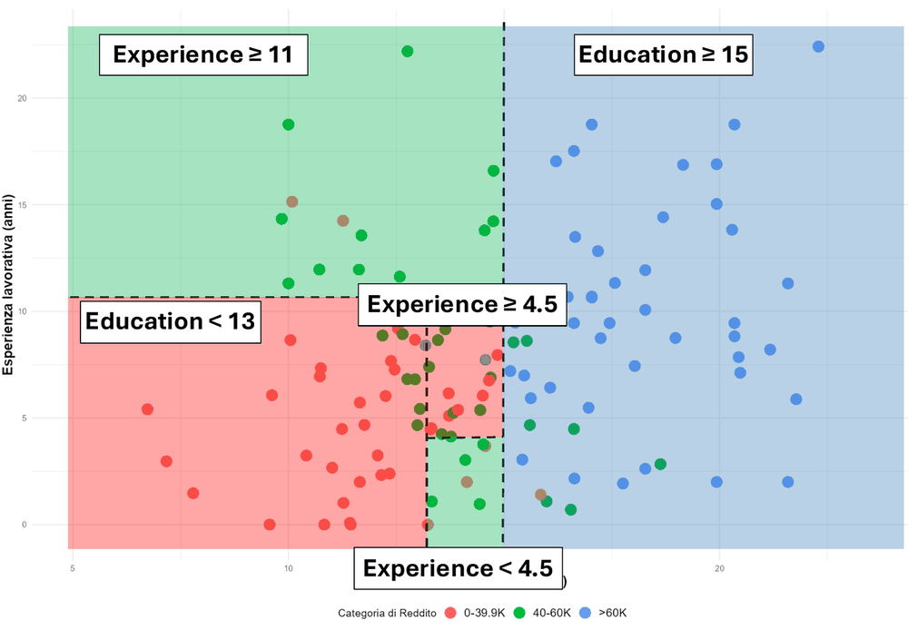
*From the slides.*

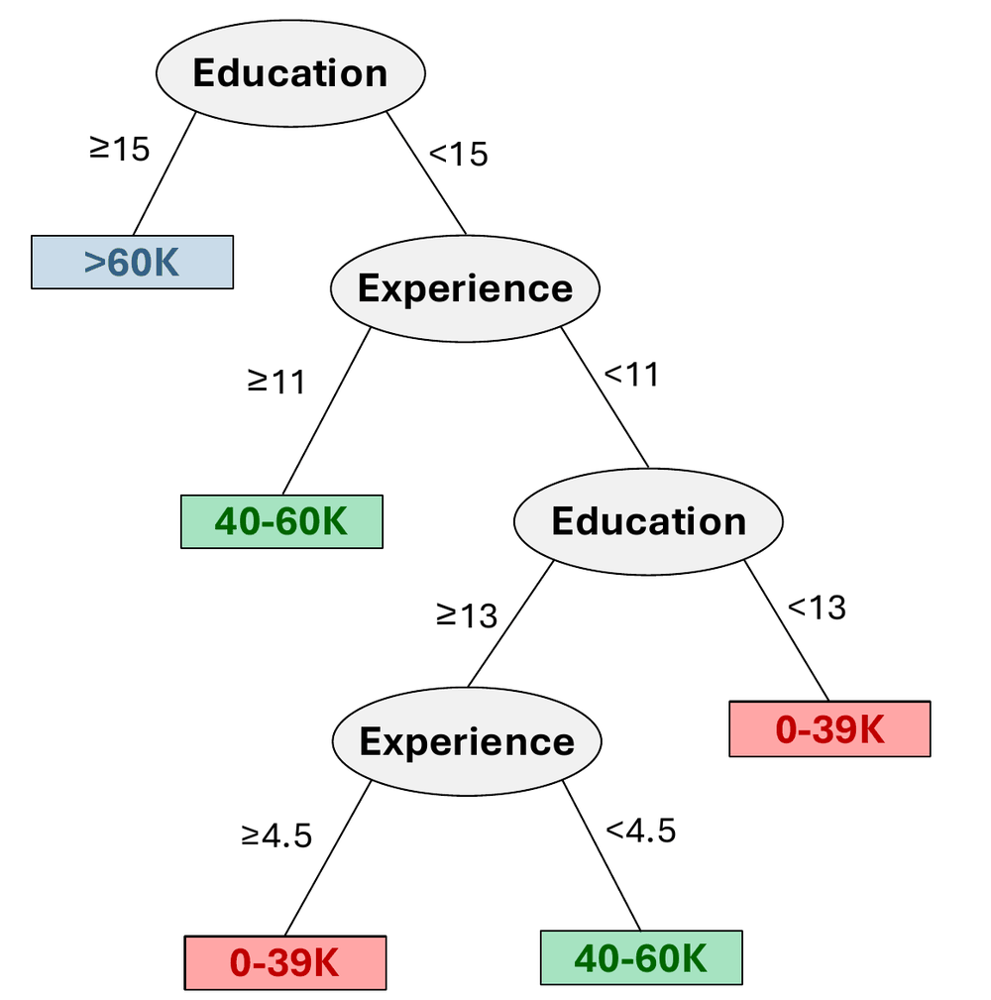
*From the slides.*

Reading the tree as rules:

- IF Education ≥ 15 THEN income > 60k;
- IF Education < 15 AND Experience ≥ 11 THEN 40 to 60k;
- IF Education < 13 AND Experience < 11 THEN 0 to 39k;
- IF 13 ≤ Education < 15 AND Experience < 11: 0 to 39k if Experience ≥ 4.5, 40 to 60k if Experience < 4.5.

> [!NOTE]
> **Not in the slides: the last rule.** The branch with less experience predicts the *higher* class. The tree does not "know" what makes sense:
> it just follows the data in that region. This is also a hint of how a deep tree can fit peculiarities of the training data.

**Tree complexity.** Splitting until every subgroup is pure predicts well on the training set but **overfits**: the tree becomes too large or deep.
**Pruning** algorithms reduce a deep tree to a smaller subtree; how much to prune is set by a **cost hyperparameter** $C$.

| Pros | Cons |
|---|---|
| Very easy to explain, even easier than linear regression | Generally lower predictive accuracy than other methods |
| Some consider them closer to human decision making | **Unstable**: a small change in the data can produce a very different tree |
| Easy to visualize and interpret for non-experts, especially when small | |
| Handle qualitative predictors easily | |

### Random forest

**Step 1**, repeated $n$ times:

- draw a **bootstrap sample** $D_j$ from the original dataset, and a random **subset of $i$ attributes**, with $i < n$ (typically $i \approx \sqrt{n}$, where $n$ is the number of attributes);
- build a classification tree on this sample and record it.

Each tree may be the same as or different from the others, and for each observation each tree predicts a class.

**Step 2**: for each observation, the forest predicts the class chosen **most often** by the trees (**majority vote**).


*From the slides: two trees vote A, one B, one C, so the forest predicts A.*

> [!TIP]
> **Not in the slides.** A **bootstrap sample** is obtained by drawing observations from the dataset **with replacement**, as many as the original size:
> some observations appear twice or more, others not at all. Different samples and different attribute subsets make the trees different from each other,
> and averaging many different trees reduces the instability of a single tree. Note that the slides use the letter $n$ both for the number of attributes
> and for the number of trees.

| Pros | Cons |
|---|---|
| Generally high accuracy | Requires more computing power |
| Efficient on large datasets | Less interpretable than a single tree |
| Estimates which variables matter for classification | |
| Unlike some models, it does not overfit as the number of features grows | |

## 1.8 Unsupervised learning and k-means

**Unsupervised learning** analyzes and groups **unlabeled** data: the algorithms find hidden patterns or groups without human intervention.
It is useful for exploratory analysis, cross-selling and customer segmentation.

We only have features $X_1, \dots, X_p$ measured on $n$ observations, and **no response $Y$**: we are not trying to predict, but to discover interesting patterns.
Can we visualize the data informatively? Are there groups among variables or observations? Are there outliers?

**Clustering** covers the techniques that find **subgroups (clusters)** in a dataset: observations in the same group should be **similar**, observations in different
groups **different**. In other words, distances **within** clusters are minimized and distances **between** clusters are maximized.
This requires defining what "similar" means, which often depends on knowledge of the data and its domain (customers, voters, documents, films).

**Distance metrics.** The slides show several: Euclidean, Manhattan, Chebyshev, Minkowski, cosine, Haversine, Hamming, Jaccard, Sørensen-Dice, Dynamic Time Warping.


*From the slides.*

> [!TIP]
> **Not in the slides: the most common ones, for points $x = (1, 2)$ and $y = (4, 6)$.**
> **Euclidean** (straight line): $\sqrt{(4-1)^2 + (6-2)^2} = \sqrt{9 + 16} = 5$.
> **Manhattan** (moving only along the axes, like city blocks): $\lvert 4-1 \rvert + \lvert 6-2 \rvert = 7$.
> **Chebyshev** (the largest difference along one axis): $\max(3, 4) = 4$.
> **Minkowski** generalizes them: $\left(\sum \lvert x_i - y_i \rvert^p\right)^{1/p}$ is Manhattan for $p = 1$, Euclidean for $p = 2$, Chebyshev for $p \to \infty$.
> **Hamming** counts the positions where two strings differ: 10011 and 11010 differ in 2 positions.

### k-means

**k-means** divides the observations into a **predetermined number $K$** of clusters, so that each observation belongs to exactly one cluster
and clusters do not overlap. The algorithm:

1. **Initialization:** randomly choose $k$ initial **centroids** (cluster centers).
2. **Assignment:** for each point, compute its distance (usually Euclidean) from each centroid, and assign it to the **nearest** one.
3. **Update:** recompute each centroid as the **mean** of the points assigned to it.
4. **Iteration:** repeat assignment and update until the assignments stop changing.


*From the slides: the result depends on the chosen $K$.*

On the income data, k-means with 3 clusters finds groups based on education and experience. Comparing them with the real income classes,
they are similar but not identical: clustering never saw the income, it only grouped people who look alike.

> [!NOTE]
> **Not in the slides: a tiny example in one dimension.** Points 1, 2, 3, 10, 11, 12 with $K = 2$ and initial centroids 1 and 2.
> *Assignment:* 1 goes to centroid 1; all the others are closer to 2. *Update:* centroids become 1 and $(2+3+10+11+12)/5 = 7.6$.
> *Assignment:* 1, 2, 3 are closer to 1 than to 7.6 (3 is at distance 2 from 1 and 4.6 from 7.6); 10, 11, 12 go to 7.6.
> *Update:* centroids become 2 and 11. *Assignment:* nothing changes, so the algorithm stops with clusters {1, 2, 3} and {10, 11, 12}.
> Since the start is random, different initial centroids can lead to different final clusters.

**Conclusions of the lecture.** Machine learning offers flexible modeling (nonlinear relationships), handles large volumes of unstructured data,
and gives better predictions with continuous adaptation. The challenges are managing the bias-variance tradeoff, the risk of overfitting (hence the importance
of training and test validation), and the difficulty of interpreting sophisticated models.

---

# 2. Neural networks: the basic ingredients

## 2.1 From biological neurons to the perceptron

A **biological neuron** receives signals through its **dendrites** (inputs $x_1, \dots, x_n$), processes them in the **cell body**, and sends a signal along the
**axon** to the **axon terminals**, which pass it to other neurons (outputs $y_1, \dots, y_m$).

**McCulloch and Pitts (1943)** proposed the first mathematical model: binary inputs $x_i \in \lbrace 0, 1 \rbrace$, a function $g$ that aggregates them,
a function $f$ that decides the output $y \in \lbrace 0, 1 \rbrace$. It works with **Boolean logic**.

**Rosenblatt's perceptron (1957)** adds a **weight** $w_i$ to each input and a **bias** $b$:

$$h(x \mid w, b) = h\left(\sum_{i=1}^{I} w_i x_i - b\right) = h\left(\sum_{i=0}^{I} w_i x_i\right) = \text{sign}(w^T x)$$

The second form hides the bias inside the weights: add a fake input $x_0 = 1$ with weight $w_0 = -b$.

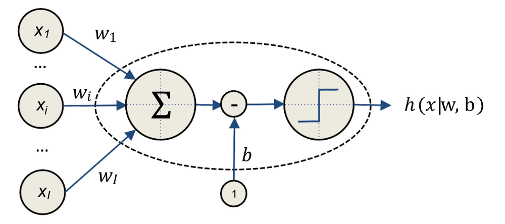
*From the slides.*

**Geometric meaning.** $h(x) = \text{sign}(w_0 + w_1 x_1 + \dots + w_I x_I)$. The points where the argument is zero, $w_0 + w^T x = 0$, form a **line** in 2D
(a hyperplane in general): the perceptron answers +1 on one side and -1 on the other. So **a perceptron is a linear classifier**.


*From the slides.*

> [!NOTE]
> **Not in the slides: a numeric example.** With $w_0 = -1$, $w_1 = 1$, $w_2 = 1$: the point $(0, 0)$ gives $\text{sign}(-1) = -1$,
> the point $(1, 1)$ gives $\text{sign}(1) = +1$. The boundary is the line $x_1 + x_2 = 1$.

### Activation functions beyond "sign"

| Name | Formula | Output range |
|---|---|---|
| Linear | $g(a) = a$ | any real number |
| Sigmoid (logistic) | $g(a) = \dfrac{1}{1 + e^{-a}}$ | from 0 to 1 |
| Tanh | $g(a) = \dfrac{e^{a} - e^{-a}}{e^{a} + e^{-a}}$ | from -1 to 1 |


*From the slides.*

> [!TIP]
> **Not in the slides: why sigmoid instead of sign.** Sign jumps from -1 to +1, so its derivative is 0 everywhere (and undefined at 0):
> gradient descent (section 2.4) would get no information on how to change the weights. The sigmoid is a smooth version of the step:
> close to 0 for very negative inputs, close to 1 for very positive ones, and 0.5 at 0. For example $g(0) = 0.5$, $g(10) \approx 0.99995$, $g(-10) \approx 0.00005$.

> [!TIP]
> **Not in the slides: why the activation must be non-linear.** With the linear activation $g(a) = a$, a layer computes $W_1 x + b_1$, and a second layer on top
> computes $W_2(W_1 x + b_1) + b_2 = (W_2 W_1)\,x + (W_2 b_1 + b_2)$: again a single linear function. However many linear layers we stack,
> the network stays equivalent to one layer, so it can only draw straight boundaries. Non-linear activations are what make depth useful,
> as the XOR example below shows.

### Representing Boolean functions

**AND** with a sigmoid neuron: $h(x) = g(-30 + 20 x_1 + 20 x_2)$.

| $x_1$ | $x_2$ | $h(x)$ |
|---|---|---|
| 0 | 0 | $g(-30) \approx 0$ |
| 0 | 1 | $g(-10) \approx 0$ |
| 1 | 0 | $g(-10) \approx 0$ |
| 1 | 1 | $g(10) \approx 1$ |

The bias $-30$ is so negative that only both inputs together (20 + 20 = 40) can push the sum above 0.

Other functions, with the weights written as (bias; weight of $x_1$; weight of $x_2$):

| Function | Weights | Why it works (not in the slides) |
|---|---|---|
| **OR** | (-10; +20; +20) | one active input is enough: $-10 + 20 = 10 > 0$ |
| **NOT** $x_1$ | (+10; -20) | input 0 gives $g(10) \approx 1$, input 1 gives $g(-10) \approx 0$ |
| **(NOT $x_1$) AND (NOT $x_2$)** | (+10; -20; -20) | only $(0, 0)$ keeps the sum positive |

### The XOR problem

**The perceptron cannot learn regions that do not have linear boundaries** (Minsky and Papert, *Perceptrons*, 1969).
XOR is +1 when exactly one input is 1: the points $(0, 1)$ and $(1, 0)$ are in one class, $(0, 0)$ and $(1, 1)$ in the other.
No single line separates them.

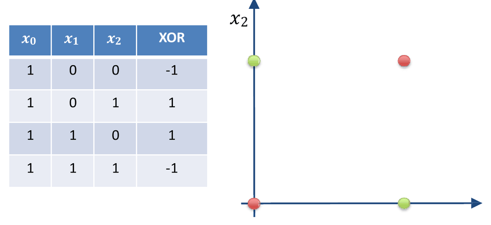
*From the slides.*

> [!NOTE]
> **Not in the slides: why no line works.** Suppose $w_0 + w_1 x_1 + w_2 x_2$ is positive on $(0,1)$ and $(1,0)$ and negative on $(0,0)$ and $(1,1)$.
> From the first two: $w_0 + w_2 > 0$ and $w_0 + w_1 > 0$; adding them, $2w_0 + w_1 + w_2 > 0$.
> From the other two: $w_0 < 0$ and $w_0 + w_1 + w_2 < 0$; adding them, $2w_0 + w_1 + w_2 < 0$. Contradiction.

### Non-linearity by adding layers

The solution is to **combine neurons in layers**. The slides use the identity

$$\text{NOT}(A \text{ XOR } B) = (A \text{ AND } B) \text{ OR } \big((\text{NOT } A) \text{ AND } (\text{NOT } B)\big)$$

A first layer computes AND (red) and (NOT $x_1$) AND (NOT $x_2$) (green); a second layer computes the OR (blue) of the two.

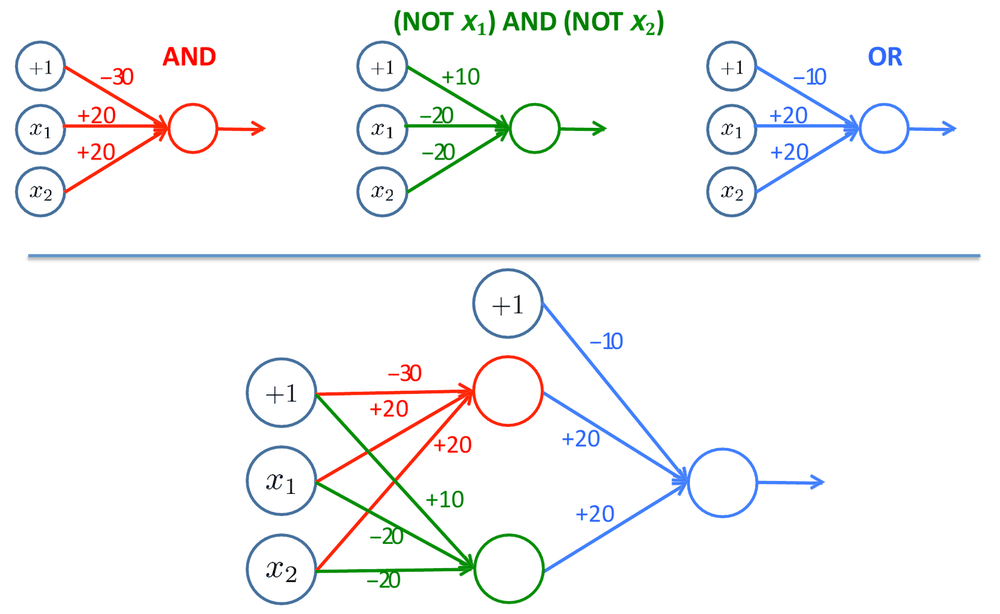
*From the slides.*

> [!NOTE]
> **Not in the slides: checking the network.** Call $a_1$ the AND neuron and $a_2$ the NOT/AND neuron; the output is $g(-10 + 20 a_1 + 20 a_2)$.
>
> | $x_1$ | $x_2$ | $a_1$ | $a_2$ | output |
> |---|---|---|---|---|
> | 0 | 0 | 0 | 1 | $g(10) \approx 1$ |
> | 0 | 1 | 0 | 0 | $g(-10) \approx 0$ |
> | 1 | 0 | 0 | 0 | $g(-10) \approx 0$ |
> | 1 | 1 | 1 | 0 | $g(10) \approx 1$ |
>
> The output is 1 exactly when the inputs are equal: it is NOT XOR. Flipping it (or swapping the classes) gives XOR itself.

**Representation power.** One neuron draws one line (a half-plane); a layer of neurons combines several lines into a convex region;
more layers can build arbitrary regions, even with holes or several separate pieces. Many internal layers: **deep learning**.

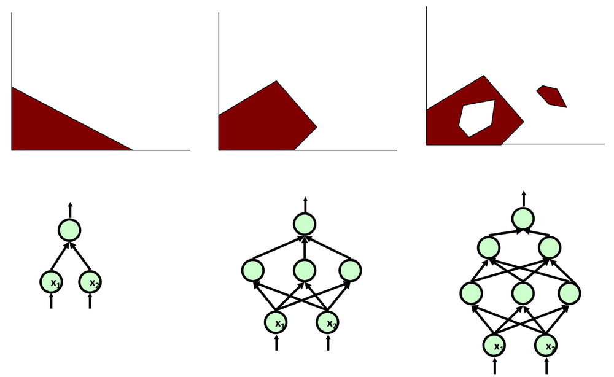
*From the slides.*

## 2.2 The graph

The lesson describes a neural network through **basic ingredients**: the graph, the loss function, the optimizer and the initialization.

$g = \lbrace N, E \rbrace$ is a **weighted, labeled, directed graph**.

- Each node $i \in N$ is a **neuron** (or perceptron), with two labels: a value $a_i$ called **activation**, and an **activation function** $f_i$,
  which applied to the activation gives the **output** $z_i$.
- Each edge $j \to i$ has a **weight** $w_{ji}$.
- Each node $i$ also has a special edge from a "ghost" node, whose weight is the **bias** $b_i$.

Each neuron is a **calculus unit**:

$$a_i = b_i + \sum_{j : j \to i \in E} w_{ji} z_j \qquad z_i = f_i(a_i)$$

Nodes come in three categories:

- **input nodes**: their value is set from outside;
- **hidden nodes**: they compute;
- **output nodes**: their value is given to the outside.

Connected neurons build the graph; nodes that share the same input are grouped into **layers**. The whole network computes one big expression of all the parameters:
this gives **very large flexibility**, and the network can be used to **approximate a given function F**.

*Example from the slides:* 2 inputs (nodes 1, 2), a hidden layer with nodes 3, 4, 5, and output node 6:

$$z_1 = x_1, \quad z_2 = x_2, \quad z_k = f_k\Big(b_k + \sum_j w_{jk} z_j\Big) \ (k = 3, 4, 5), \quad y = z_6 = f_6\Big(b_6 + \sum_j w_{j6} z_j\Big)$$

which, expanded, is

$$y = f_6\Big(b_6 + w_{5,6} f_5(b_5 + w_{1,5}x_1 + w_{2,5}x_2) + w_{4,6} f_4(b_4 + w_{1,4}x_1 + w_{2,4}x_2) + w_{3,6} f_3(b_3 + w_{1,3}x_1 + w_{2,3}x_2)\Big)$$


*From the slides.*

> [!NOTE]
> **Not in the slides: counting the parameters.** Nodes 3, 4, 5 have 2 weights and 1 bias each: 9 parameters. Node 6 has 3 weights and 1 bias: 4 parameters.
> The network has **13 parameters**, and learning means finding good values for all of them.

**Feedforward networks, compact notation.** For two consecutive layers $h$ (before) and $k$ (after), assuming all nodes of $k$ share the activation function $f_k$:

$$\vec{z}_k = f_k\big(\vec{b}_k + W_k \vec{z}_h\big)$$

where $\vec{b}_k$ holds the biases of layer $k$, $W_k$ is the matrix of the weights $w_{hk}$, and $\vec{z}_t$ holds the values of the nodes of layer $t$.

> [!TIP]
> **Not in the slides: shapes.** If $h$ has 2 nodes and $k$ has 3, then $\vec{z}_h$ has 2 entries, $W_k$ is a $3 \times 2$ matrix (one row per node of $k$),
> $W_k \vec{z}_h$ and $\vec{b}_k$ have 3 entries, and $f_k$ is applied to each entry.

## 2.3 The loss function

In neural networks the objective function is called **loss function**: it measures the error between the output produced by the network $g$ and the desired one.
The objective is

$$\underset{W, B}{\arg\min} \ \frac{1}{n} \sum_{i=1}^{n} \text{loss}\big[\vec{y}_i, g(\vec{x}_i \mid W, B)\big]$$

The weights $W$ and biases $B$ are **unknown a priori**; the **learning phase** looks for the "best" $W$ and $B$. "Best" is defined by an objective that expresses
the goals of the analysis: what is the network for, what is the input, what is the desired output, and **how far is the produced output from the desired one**.
In short: find $W$ and $B$ such that the network approximates the unknown function $F$.

**Losses for regression** (with $m$ outputs per example):

$$\text{MAE} = \frac{1}{n}\sum_{i=1}^{n} \lVert \vec{y}_i - g(\vec{x}_i \mid W, B) \rVert_1 = \frac{1}{n}\sum_{i=1}^{n}\sum_{j=1}^{m} \big\lvert y_{i,j} - g(\vec{x}_i \mid W, B)_j \big\rvert$$

$$\text{MSE} = \frac{1}{n}\sum_{i=1}^{n}\sum_{j=1}^{m} \big[y_{i,j} - g(\vec{x}_i \mid W, B)_j\big]^2$$

- **MAE** considers all errors equally, and **is not differentiable** (the absolute value has a corner at 0).
- **MSE** strongly penalizes big errors, is cautious with small ones, **suffers from outliers**, and is **smooth and differentiable**.

> [!NOTE]
> **Not in the slides: a notation detail.** The slide writes the MSE with the norm $\lVert \cdot \rVert_2$, but the double sum on the right is the **squared** norm
> $\lVert \cdot \rVert_2^2$ (no square root). The double sum is the one to remember.

**Smooth Absolute Error (SAE)** tries to merge the two: it behaves like the MSE for small errors (below 1) and like the MAE for large ones:

$$\text{SAE} = \begin{cases} \dfrac{1}{2n}\displaystyle\sum_{i=1}^{n} \lVert \vec{y}_i - g(\vec{x}_i \mid W, B) \rVert_2 & \text{if } \lVert \vec{y}_i - g(\vec{x}_i \mid W, B) \rVert_1 < 1 \\ -\dfrac{1}{2} + \dfrac{1}{n}\displaystyle\sum_{i=1}^{n} \lVert \vec{y}_i - g(\vec{x}_i \mid W, B) \rVert_1 & \text{otherwise} \end{cases}$$

> [!TIP]
> **Not in the slides: the idea, for one error $e$.** SAE is $e^2 / 2$ when $\lvert e \rvert < 1$ and $\lvert e \rvert - 1/2$ otherwise.
> At $\lvert e \rvert = 1$ both give $1/2$, so the two pieces join smoothly. Small errors are treated gently (quadratic), large errors do not explode (linear),
> so outliers weigh less than with the MSE. The same idea is known as Huber loss or Smooth L1 loss.

**Losses for classification.**

*Binary Cross Entropy*, for $y_i \in \lbrace 0, 1 \rbrace$ and an output $g(\vec{x}_i \mid W, B) \in [0, 1]$:

$$\text{BCE} = -\frac{1}{n}\sum_{i=1}^{n} \Big( y_i \ln g(\vec{x}_i \mid W, B) + (1 - y_i) \ln\big[1 - g(\vec{x}_i \mid W, B)\big] \Big)$$

*Categorical Cross Entropy*, for $K$ classes, with $y_{i,k} \in \lbrace 0, 1 \rbrace$ (1 only for the correct class) and outputs in $[0, 1]$:

$$\text{CCE} = -\frac{1}{n}\sum_{i=1}^{n}\sum_{k=1}^{K} y_{i,k} \ln g(\vec{x}_i \mid W, B)_k$$

> [!NOTE]
> **Not in the slides: how BCE behaves.** Only one of the two terms is active for each example. If $y = 1$ the loss is $-\ln p$, where $p$ is the predicted probability:
> $p = 0.9$ gives $0.105$, $p = 0.5$ gives $0.693$, $p = 0.01$ gives $4.6$. A confident wrong answer is punished very hard.
> If $y = 0$ the loss is $-\ln(1 - p)$, symmetric.
>
> *A detail:* the slide's BCE formula has a minus sign in front of the second term inside the sum. The usual formula, used above, has
> $-\big(y \ln p + (1-y) \ln(1-p)\big)$: both terms are negative logarithms, so both are losses.

> [!TIP]
> **Not in the slides: why not use the MSE for classification?** Two reasons.
> 1. **Confident mistakes.** With outputs in $[0, 1]$, the MSE of a single example is at most $(1 - 0)^2 = 1$, even when the network is 99.9% sure of the wrong answer.
>    The cross entropy grows without limit ($-\ln 0.001 \approx 6.9$), so an "arrogant" mistake pushes the weights much harder.
> 2. **Gradients.** A sigmoid output is flat near 0 and 1, so its derivative is tiny there. With the MSE, that small derivative multiplies the gradient
>    and learning stalls exactly when the network is badly wrong; the logarithm of the cross entropy cancels this flattening and keeps the gradient large.

## 2.4 The optimizer

**How do we solve the minimization problem?** In principle: compute the gradient of the loss, set it to zero, and check whether the solutions are minima, maxima or saddle points.
But with a lot of (noisy) data and parameters, an **analytical solution is hard** to find: we need an approximation, a heuristic, and typically we must be
**happy with a local minimum**.

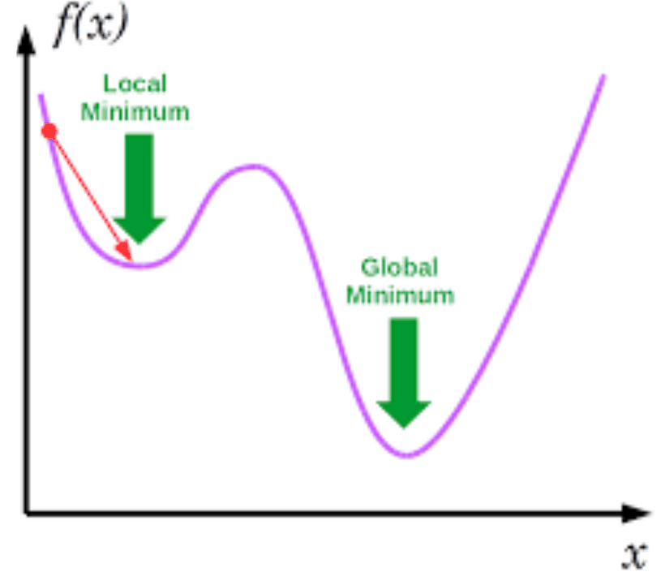
*From the slides: starting from the red point and going downhill, we reach the local minimum, not the global one.*

### Gradient descent

Let $F(\bar{x})$ be a function of several variables, differentiable around a point $\bar{a}$. $F$ **decreases fastest** if, from $\bar{a}$, we move in the direction of the
**negative gradient**. The algorithm updates $\bar{a}$ until convergence:

$$\bar{a}^{\text{new}} = \bar{a}^{\text{old}} - \eta \nabla F(\bar{a}^{\text{old}})$$

The parameter $\eta$ is the **learning rate** and determines the behavior of the optimization. It is a **fixed point procedure**:

1. start from a random point;
2. compute the gradient at that point;
3. follow it to a point closer to the optimum;
4. repeat until convergence.

> [!NOTE]
> **Not in the slides: one step by hand.** $F(x) = x^2$, so $F'(x) = 2x$. Start at $x = 3$ with $\eta = 0.1$:
> $x \leftarrow 3 - 0.1 \cdot 6 = 2.4$, then $2.4 - 0.1 \cdot 4.8 = 1.92$, then $1.536$, and so on towards the minimum at 0.
> Each step multiplies $x$ by $1 - 2\eta = 0.8$.

**How the learning rate changes the behavior.** Take the loss $e(w) = \frac{1}{2} C w^2$, with $C$ a constant:

| Learning rate | Behavior |
|---|---|
| $\eta = 1/C$ | optimal: the minimum is reached in **one step** |
| $\eta < 1/C$ | slow, steady convergence |
| $1/C < \eta < 2/C$ | converges while **oscillating** around the minimum |
| $\eta > 2/C$ | **diverges**: each step goes farther away |


*From the slides.*

> [!TIP]
> **Not in the slides: where the thresholds come from.** $e'(w) = C w$, so one step gives $w \leftarrow w - \eta C w = (1 - \eta C)\, w$.
> Everything depends on the factor $1 - \eta C$:
> if $\eta = 1/C$ it is 0, so $w$ jumps to 0 at once; if $\eta < 1/C$ it is between 0 and 1, so $w$ shrinks keeping its sign;
> if $1/C < \eta < 2/C$ it is between -1 and 0, so $w$ flips sign each time while shrinking; if $\eta > 2/C$ its absolute value exceeds 1, so $w$ grows.

**Applied to a network.** With $[W, B]$ the concatenation of all unknown parameters and $t$ the current step:

$$[W, B]_{t+1} = [W, B]_t - \eta \frac{1}{n}\sum_{i=1}^{n} \nabla_{W,B} \text{loss}\big[\vec{y}_i, g(\vec{x}_i \mid W, B)\big]$$

**A typical rewriting** puts biases and weights in a single matrix: with $W_k^* = [\vec{b}_k \ W_k]$ and $\vec{z}_h^*$ equal to $\vec{z}_h$ with a 1 added on top,
we get $W_k^* \vec{z}_h^* = \vec{b}_k + W_k \vec{z}_h$ (the same trick as $x_0 = 1$ in the perceptron). The update becomes

$$W_{t+1}^* = W_t^* - \eta \frac{1}{n}\sum_{i=1}^{n} \nabla \text{loss}\big[\vec{y}_i, g(\vec{x}_i \mid W^*)\big]$$

**Computing derivatives.** Some losses are **singular** (not differentiable at some points, like the MAE at 0), but singularities are very few and the probability
of landing exactly on one is practically zero. In any case, the derivative can be **approximated numerically**:

$$\frac{d}{dx} f(x) = \lim_{h \to 0} \frac{f(x + h) - f(x)}{h} = \lim_{h \to 0} \frac{f(x + h) - f(x - h)}{2h}$$

### Stochastic gradient descent (SGD)

The update above averages the gradient over **all** $n$ examples before moving: slow. **SGD** speeds up convergence by updating the weights
**for each example** (or for each small **batch** of examples):

$$\forall i \in \lbrace 1, \dots, n \rbrace: \quad W_{t+1}^* = W_t^* - \eta \nabla l_i \qquad \text{with } l_i = \text{loss}\big[\vec{y}_i, g(\vec{x}_i \mid W^*)\big]$$

> [!TIP]
> **Not in the slides: epochs and batches.** An **epoch** is one full pass over the training set. With 15,000 examples and batches of 512,
> one epoch makes $\lceil 15000 / 512 \rceil = 30$ updates, instead of the single update of plain gradient descent.
>
> An analogy: to prepare an exam on a 1,000-page book, you can read the whole book before checking what you understood (plain gradient descent: slow, one correction),
> quiz yourself after every single line (SGD on one example: fast but chaotic, you keep changing direction), or quiz yourself after each chapter of 30 to 60 pages
> (**mini-batch**: frequent corrections based on an average, so more stable). Mini-batches are the usual choice, also because GPUs process a batch in parallel.

**Choosing the learning rate:** with a very high rate the loss explodes; with a high rate it drops fast and then stalls at a poor value;
with a low rate it decreases too slowly; a good rate decreases quickly and keeps improving.


*From the slides (source: Stanford CS231n, image by Alec Radford).*

### Variants of SGD

**AdaGrad**

$$W_{t+1}^* = W_t^* - \frac{\eta}{\sqrt{\epsilon \cdot I + \text{diag}(\nabla l_i \cdot \nabla l_i^T)}} \nabla l_i$$

Weights that receive **large gradients** get their effective learning rate **reduced**; weights with **small or infrequent** updates get it **increased**.

> [!TIP]
> **Not in the slides.** $\text{diag}(\nabla l_i \cdot \nabla l_i^T)$ contains the square of each component of the gradient, so each weight gets its own
> learning rate, divided by the size of its gradient. $\epsilon$ is a tiny number that avoids dividing by zero. In the original algorithm,
> the squares are **accumulated over all past steps**, which is why the learning rate keeps shrinking over time.

**RMSprop**

$$\zeta_{t+1} = \alpha \cdot \zeta_t + (1 - \alpha) \cdot (\nabla l_i)^2 \qquad W_{t+1}^* = W_t^* - \frac{\eta}{\sqrt{\epsilon \cdot I + \zeta_{t+1}}} \nabla l_i$$

It adjusts AdaGrad via a decreasing learning rate: $\zeta$ is a **moving average** of the squared gradients.

> [!TIP]
> **Not in the slides: what a moving average does.** With $\alpha = 0.9$, the new $\zeta$ is 90% the old one and 10% the latest squared gradient.
> Recent gradients count more and old ones fade away, so, unlike AdaGrad's ever-growing sum, the learning rate does not shrink forever.

**Adam**

$$\zeta_{t+1} = \alpha \cdot \zeta_t + (1 - \alpha) \cdot (\nabla l_i)^2 \ \rightarrow \ \zeta_{t+1}^* = \frac{\zeta_{t+1}}{1 - \alpha^{t+1}}$$

$$m_{t+1} = \beta \cdot m_t + (1 - \beta) \cdot \nabla l_i \ \rightarrow \ m_{t+1}^* = \frac{m_{t+1}}{1 - \beta^{t+1}}$$

$$W_{t+1}^* = W_t^* - \frac{\eta \cdot m_{t+1}}{\sqrt{\epsilon \cdot I + \zeta_{t+1}}} \nabla l_i$$

It is **RMSprop with smoothing**: $m$ is a moving average of the gradients themselves. The update depends on the iteration as well as on the other parameters.

> [!NOTE]
> **Not in the slides: comparing with the original paper.** In Adam as published (Kingma and Ba, 2014), the update uses the corrected values
> and no extra gradient factor: $W_{t+1} = W_t - \eta \, m^*_{t+1} / \big(\sqrt{\zeta^*_{t+1}} + \epsilon\big)$. The moving average $m$ already plays the role of the gradient.
> The corrections $1/(1 - \alpha^{t+1})$ and $1/(1 - \beta^{t+1})$ fix the fact that $m$ and $\zeta$ start at 0: in the first steps they would be too small.
> Check with the lecturer which form is expected at the exam.

## 2.5 Backpropagation

Each layer $k \in \lbrace 1, \dots, K \rbrace$ has a weight matrix (biases included) $W_k^*$. The loss is a **composition** of functions, layer after layer:

$$\nabla \text{loss}\big(\vec{y}_i, g(\vec{x}_i \mid W^*)\big) = \nabla \text{loss}\Big(\vec{y}_i, f_K\big(W_K^* \cdot f_{K-1}\big(W_{K-1}^* \cdot f_{K-2}(W_{K-2}^* \cdot f_{K-3}(\dots))\big)\big)\Big)$$

By the **chain rule**, $\frac{d}{dx} f_1(f_2(x)) = f_1'(f_2(x)) \cdot f_2'(x)$, so the gradient is a **product** of derivatives, one per layer:

$$\nabla \text{loss} = \text{loss}'\big(\vec{y}_i, f_K(\dots)\big) \cdot f_K'\big(W_K^* \cdot f_{K-1}(\dots)\big) \cdot W_K^* \cdot f_{K-1}'\big(W_{K-1}^* \cdot f_{K-2}(\dots)\big) \cdot W_{K-1}^* \cdot f_{K-2}'(\dots) \cdots$$

**Distributing the gradient on the layers.** Each layer $k$ contributes to the gradient with

$$\delta_k \stackrel{\text{def}}{=} f_k'(\dots) \cdot W_{k+1}^* \cdot f_{k+1}'(\dots) \cdots W_K^* \cdot f_K'(\dots) \cdot \text{loss}'\big(\vec{y}_i, f_K(\dots)\big)$$

and the key observation is that each $\delta$ can be computed from the next one:

$$\delta_{k-1} = f_{k-1}'(\dots) \cdot W_k^* \cdot \delta_k$$

So each layer can be **updated backwards**, from the output to the input:

$$W_{k;t+1}^* = W_{k;t}^* - \eta \, \delta_k \cdot W_k^* \cdot f_{k-1}'(\dots)$$

> [!NOTE]
> **Not in the slides: why "back" propagation, with a tiny example.** Take a chain of two neurons with one weight each and no biases:
> $z_1 = f(w_1 x)$, $\hat{y} = f(w_2 z_1)$, and loss $L = (\hat{y} - y)^2$. By the chain rule:
>
> $$\frac{\partial L}{\partial w_2} = \underbrace{2(\hat{y} - y) \cdot f'(w_2 z_1)}_{\delta_2} \cdot z_1 \qquad \frac{\partial L}{\partial w_1} = \underbrace{\delta_2 \cdot w_2 \cdot f'(w_1 x)}_{\delta_1} \cdot x$$
>
> $\delta_1$ reuses $\delta_2$, already computed: $\delta_1 = f'(\dots) \cdot w_2 \cdot \delta_2$, exactly the recursion above. So we compute $\delta$ at the output first,
> then walk back one layer at a time, and every layer's gradient costs one multiplication more instead of redoing the whole chain.
> In this common textbook form, the gradient of a layer's weights is its $\delta$ times the **output of the previous layer** ($z_1$ for $w_2$, $x$ for $w_1$).

## 2.6 Initialization

Gradient descent needs an **initial value** for all weights and biases. Since it is a fixed point procedure that searches for an optimum, the **starting point is crucial**:
the initialization strategy can strongly change the network's behavior.

- **Zero initialization: a bad solution.** All nodes get the same initial gradient, so there is no diversification: the hidden nodes become **symmetric**.
- **Constant initialization** has the same problem.

> [!NOTE]
> **Not in the slides: why symmetry is a problem.** If two hidden neurons start with the same weights, they compute the same output, receive the same gradient,
> and get the same update, forever. They stay identical copies, so the network behaves as if it had a single neuron in that position.
> Random initialization "breaks the symmetry".

**Rationale for the scale of the weights:** with **very large** weights, activation functions with asymptotes (sigmoid, tanh) saturate and their gradient is practically 0,
so learning takes a very long time. With **very small** weights, the gradient also goes to 0, with the same result.

> [!TIP]
> **Not in the slides: saturation in numbers.** The derivative of the sigmoid is $g'(a) = g(a)\,(1 - g(a))$: at $a = 0$ it is $0.25$, at $a = 10$ it is about $0.00005$.
> Large weights produce large $a$, so the gradient that flows back through the neuron almost vanishes.

**Strategies.**

- **Simplest:** random weights, $W_k \sim \text{Uniform}$ or $W_k \sim N(0, I)$.
- **He et al. (2015):** $W_k = \epsilon \cdot \sqrt{2 / \lvert \to k \rvert}$ with $\epsilon \sim N(0, I)$, where $\lvert \to k \rvert$ is the number of incoming connections (**fan-in**).
- **Xavier (Glorot):** similar, using both the previous layer $h$ and the layer $k$:
  $W_k = \epsilon \cdot \sqrt{2 / (\lvert h \rvert + \lvert k \rvert)}$ with $\epsilon \sim N(0, I)$, or the variant $W_k = \epsilon \cdot \sqrt{6 / (\lvert h \rvert + \lvert k \rvert)}$ with $\epsilon \sim \text{Uniform}$.

> [!TIP]
> **Not in the slides: the idea behind the scaling.** A neuron sums its inputs times the weights: with more inputs, the sum grows. Dividing the weights by the square root
> of the number of inputs keeps the activations at a similar scale in every layer, far from both saturation and zero.
> Example: a layer with 100 inputs under He initialization uses standard deviation $\sqrt{2/100} \approx 0.14$.

---

# 3. Classification with Keras

Both examples come from François Chollet, *Deep Learning with Python*, chapter 3.

## 3.1 Binary classification: IMDb reviews

**The dataset.** 50,000 highly polarized movie reviews from the Internet Movie Database, 50% positive and 50% negative;
25,000 for training and 25,000 for testing, again half and half. It comes with Keras, already preprocessed: each review (a sequence of words)
is a sequence of integers, each integer standing for a word in a dictionary. **Goal:** predict whether a review is positive or negative.

**Loading.** `num_words=10000` keeps only the 10,000 most frequent words.

```python
from keras.datasets import imdb
(train_data, train_labels), (test_data, test_labels) = imdb.load_data(num_words=10000)
# train_data[0] -> [1, 14, 22, 16, ...]    train_labels[0] -> 1 (positive)
```

**Preprocessing.** A network needs inputs of fixed size, but reviews have different lengths. Each review becomes a vector of 10,000 zeros,
with a 1 at the position of every word it contains:

```python
import numpy as np

def vectorize_sequences(sequences, dimension=10000):
    results = np.zeros((len(sequences), dimension))  # all-zero matrix
    for i, sequence in enumerate(sequences):
        results[i, sequence] = 1.                    # 1 at the indices of the words
    return results

x_train = vectorize_sequences(train_data)
x_test = vectorize_sequences(test_data)
y_train = np.asarray(train_labels).astype('float32')
y_test = np.asarray(test_labels).astype('float32')
```

> [!TIP]
> **Not in the slides: an example of the encoding.** With a vocabulary of 6 words, the review $[1, 3, 3, 5]$ becomes $[0, 1, 0, 1, 0, 1]$.
> The vector says *which* words appear, not how many times nor in which order (this is often called multi-hot encoding).

**The network.** Two hidden layers of 16 units with ReLU, and one output unit with sigmoid, which gives a probability between 0 and 1:

```python
from keras import models, layers

model = models.Sequential()
model.add(layers.Dense(16, activation='relu', input_shape=(10000,)))
model.add(layers.Dense(16, activation='relu'))
model.add(layers.Dense(1, activation='sigmoid'))

model.compile(optimizer='rmsprop',
              loss='binary_crossentropy',
              metrics=['accuracy'])
```

`plot_model(model, show_shapes=True, show_layer_names=True)` draws the layers with their input and output shapes: (None, 10000) → (None, 16) → (None, 16) → (None, 1),
where `None` stands for the batch size, not fixed in advance.

> [!TIP]
> **Not in the slides.** **ReLU** is $\text{relu}(a) = \max(0, a)$: 0 for negative inputs, the input itself for positive ones. It does not saturate for positive values,
> unlike sigmoid and tanh (see section 2.6). A **Dense** layer connects each of its units to all units of the previous layer: it is the $\vec{z}_k = f_k(\vec{b}_k + W_k\vec{z}_h)$ of section 2.2.
> The first layer alone has $10000 \cdot 16 + 16 = 160{,}016$ parameters.

The strings `'rmsprop'`, `'binary_crossentropy'` and `'accuracy'` are shortcuts. To set parameters, for example the learning rate, pass objects instead:

```python
from keras import optimizers, losses, metrics

model.compile(optimizer=optimizers.RMSprop(lr=0.001),
              loss=losses.binary_crossentropy,
              metrics=[metrics.binary_accuracy])
```

**Validation set.** To **monitor** the network during training, set aside 10,000 of the 25,000 training reviews; the remaining 15,000 are used for training.
The test set is not touched.

```python
x_val, partial_x_train = x_train[:10000], x_train[10000:]
y_val, partial_y_train = y_train[:10000], y_train[10000:]

history = model.fit(partial_x_train, partial_y_train,
                    epochs=20, batch_size=512,
                    validation_data=(x_val, y_val))
```

`history.history` contains, for each epoch, the loss and the accuracy on the training and validation data, which are then plotted with matplotlib.

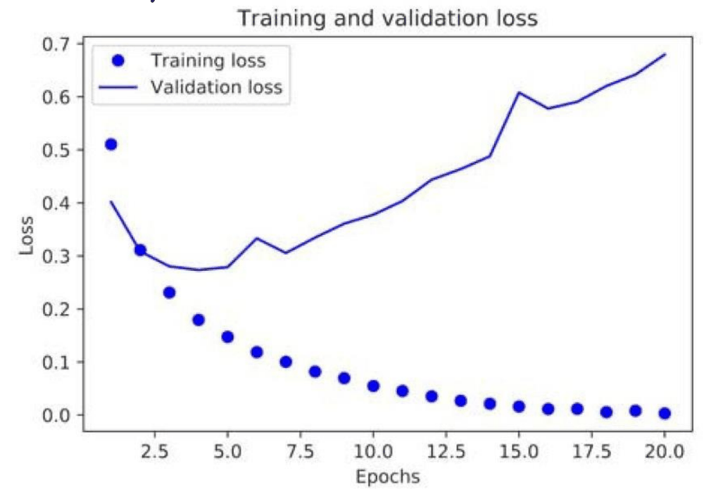
*From the slides.*

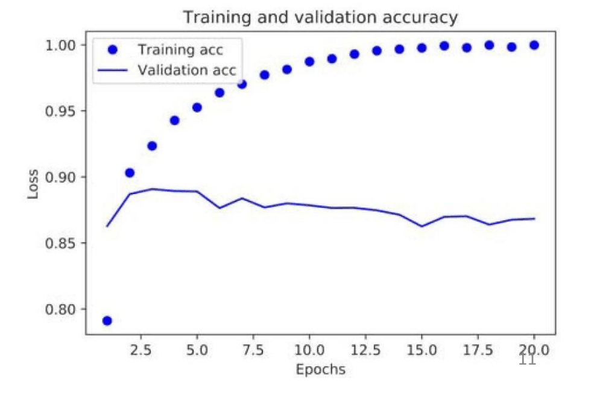
*From the slides.*

**Overfitting.** The training loss keeps decreasing and the training accuracy approaches 100%, but the validation loss is lowest around epoch 4 and then grows,
while the validation accuracy stops improving at about 88%. After a few epochs the network is learning the training reviews by heart.

> [!NOTE]
> **Not in the slides: the link with section 1.4.** This is the same picture as the training and test error against flexibility:
> here the "complexity" grows with the number of epochs, because the longer the network trains, the more closely it fits the training data.

**Early stopping.** Train a new network from scratch, on the whole training set, for only **4 epochs**, and evaluate it on the test set:

```python
model.fit(x_train, y_train, epochs=4, batch_size=512)
results = model.evaluate(x_test, y_test)   # [0.2918..., 0.8849...]
```

The result is a test loss of about 0.29 and a **test accuracy of about 88.5%**.

**Prediction.** `model.predict(x_test)` returns, for each review, the probability of being positive, for example 0.92, 0.87, 0.999, …, 0.46, 0.004, 0.80.
Values close to 1 or 0 are confident; values like 0.46 are uncertain.

## 3.2 Multi-class classification: Reuters newswires

**The dataset.** Short newswires published by Reuters in 1986, each with its topic: a simple, widely used toy dataset for text classification.
There are **46 topics**; some are more represented than others, but each has at least 10 training examples.

```python
from keras.datasets import reuters
(train_data, train_labels), (test_data, test_labels) = reuters.load_data(num_words=10000)
```

**Preprocessing.** The inputs are vectorized exactly as for IMDb. The labels are now integers from 0 to 45, turned into **one-hot** vectors of length 46:

```python
def to_one_hot(labels, dimension=46):
    results = np.zeros((len(labels), dimension))
    for i, label in enumerate(labels):
        results[i, label] = 1.
    return results

one_hot_train_labels = to_one_hot(train_labels)
one_hot_test_labels = to_one_hot(test_labels)

# Equivalent, with the Keras helper:
from keras.utils.np_utils import to_categorical
one_hot_train_labels = to_categorical(train_labels)
```

> [!TIP]
> **Not in the slides.** One-hot means "all zeros except a single 1": topic 3 becomes a vector of 46 entries with a 1 in position 3.
> It is the $y_{i,k}$ of the categorical cross entropy in section 2.3.

**Softmax.** The output layer must give a **probability for each of the 46 topics**, all adding up to 1. **Softmax** turns the raw scores (**logits**) $y_i$ into probabilities:

$$S(y_i) = \frac{e^{y_i}}{\sum_j e^{y_j}}$$

In the slides' example, the scores 2.0, 1.0, 0.1 become the probabilities 0.7, 0.2, 0.1.

> [!NOTE]
> **Not in the slides: the computation.** $e^{2} \approx 7.389$, $e^{1} \approx 2.718$, $e^{0.1} \approx 1.105$, with sum $11.212$.
> Dividing: $0.659$, $0.242$, $0.099$, which the slide rounds to 0.7, 0.2, 0.1. The exponential makes every value positive and amplifies the differences:
> the highest score takes most of the probability.

**The network.** Hidden layers of 64 units, larger than for IMDb. The output has 46 units with softmax, and the loss is the categorical cross entropy.

```python
model = models.Sequential()
model.add(layers.Dense(64, activation='relu', input_shape=(10000,)))
model.add(layers.Dense(64, activation='relu'))
model.add(layers.Dense(46, activation='softmax'))

model.compile(optimizer='rmsprop',
              loss='categorical_crossentropy',
              metrics=['accuracy'])
```

> [!TIP]
> **Not in the slides: why 64 units.** This is Chollet's motivation in the book. The last hidden layer must carry enough information to tell 46 classes apart;
> a 16-unit layer would be a bottleneck that loses information before reaching the output.

**Validation and training.** 1,000 examples are set aside for validation, then the network is trained for 20 epochs with batches of 512.


*From the slides.*


*From the slides.*

**Dealing with overfitting.** The validation loss is lowest around epoch 8 and the validation accuracy stops at about 80%, so the network is retrained for **8 epochs** and then evaluated on the test set.

**Different encoding of the labels.** Instead of one-hot vectors, keep the labels as **integers** and use `sparse_categorical_crossentropy`, which is the same loss written for integer labels:

```python
y_train = np.array(train_labels)
y_test = np.array(test_labels)
model.compile(optimizer='rmsprop',
              loss='sparse_categorical_crossentropy',
              metrics=['acc'])
```

> [!NOTE]
> **Not in the slides: current Keras.** The code of the slides uses an older Keras API. In recent versions, `lr=` is `learning_rate=`,
> `keras.utils.np_utils.to_categorical` is `keras.utils.to_categorical`, `keras.utils.vis_utils.plot_model` is `keras.utils.plot_model`,
> and the history keys are `'accuracy'` and `'val_accuracy'` instead of `'acc'` or `'binary_accuracy'`. If the code from the slides fails, start from these.

---

# Cheat sheet

- $Y = f(X) + \varepsilon$: learn $f$ from data to predict $Y$. Regression if $Y$ is a number, classification if $Y$ is a class, clustering if there is no $Y$.
- Least squares: minimize $\sum (y_i - \hat{y}_i)^2$. MAE is robust to outliers, MSE punishes large errors and is differentiable, RMSE is MSE in the original unit.
- Low training error does not mean low test error. More flexibility: less bias, more variance. Test error is U-shaped: its rising part is overfitting.
- Confusion matrix: TP, FN, FP, TN. Precision = $TP/(TP+FP)$ (among predicted positives), recall = $TP/(TP+FN)$ (among real positives), F1 = their harmonic mean. Accuracy misleads with imbalanced classes.
- ROC: TPR against FPR for all thresholds; AUC 0.5 = random, 1 = perfect.
- k-NN: majority class of the $k$ nearest points; smaller $k$ = more flexible. Trees: readable but unstable, pruning against overfitting. Random forest: bootstrap samples + random attributes + majority vote.
- k-means: choose $K$ centroids, assign each point to the nearest, move each centroid to the mean, repeat until nothing changes.
- Perceptron: $\text{sign}(w^T x)$, a linear classifier, cannot learn XOR. Adding layers gives non-linear boundaries.
- Neuron: $a_i = b_i + \sum_j w_{ji} z_j$, $z_i = f_i(a_i)$. Layer: $\vec{z}_k = f_k(\vec{b}_k + W_k \vec{z}_h)$.
- Losses: MAE, MSE, SAE for regression; binary and categorical cross entropy for classification.
- Gradient descent: $w \leftarrow w - \eta \nabla \text{loss}$. On $\frac{1}{2}Cw^2$: $\eta = 1/C$ one step, $\eta < 1/C$ slow, up to $2/C$ oscillating, above $2/C$ divergent. SGD updates per example or batch. AdaGrad, RMSprop, Adam adapt the learning rate per weight.
- Backpropagation: chain rule; $\delta_{k-1} = f'_{k-1}(\dots) \cdot W_k^* \cdot \delta_k$, computed from the output backwards.
- Initialization: never zero or constant (symmetry); scale random weights with the layer size (He: $\sqrt{2/\text{fan-in}}$, Xavier: $\sqrt{2/(\lvert h \rvert + \lvert k \rvert)}$).
- Keras recipe: vectorize inputs, Dense + ReLU hidden layers, output sigmoid + binary cross entropy (2 classes) or softmax + categorical cross entropy (many classes), watch the validation curves, stop at the best epoch.
