# Agile Software Development: summary

Module of [Research and Development Methodologies](../README.md). Based on the lecturer's slides, which follow
Kenneth S. Rubin, *Essential Scrum: A Practical Guide to the Most Popular Agile Process* (Addison-Wesley).
The sections follow the order of the lectures.

Explanations and examples that are not in the slides are marked **Not in the slides**. Figures marked
*From the slides* are taken from the lecturer's material.

**Progress:** all the Scrum slides are covered.
The lectures on CI/CD, test-driven development, JIRA and test doubles have no slides yet; enterprise applications and the Java notions
are summarized at the end as supporting material.

## Contents

1. [Introduction to Scrum](#1-introduction-to-scrum)
2. [Agile principles of Scrum](#2-agile-principles-of-scrum)
3. [The Scrum framework](#3-the-scrum-framework)
4. [Sprints](#4-sprints)
5. [Requirements and user stories](#5-requirements-and-user-stories)
6. [The product backlog](#6-the-product-backlog)
7. [Estimation and velocity](#7-estimation-and-velocity)
8. [Technical debt](#8-technical-debt)
9. [Planning](#9-planning)
10. [Sprint planning](#10-sprint-planning)
11. [Sprint execution](#11-sprint-execution)
12. [Sprint review](#12-sprint-review)
13. [Sprint retrospective](#13-sprint-retrospective)
14. [Supporting material: enterprise applications](#14-supporting-material-enterprise-applications)
15. [Supporting material: Java annotations, reflection and design patterns](#15-supporting-material-java-annotations-reflection-and-design-patterns)
16. [Cheat sheet](#cheat-sheet)

---

## 1. Introduction to Scrum

**What Scrum is.** Scrum is **not an acronym**: the word comes from rugby, where a scrum is the way the game restarts after an infringement or when the ball goes out of play.
Its roots are in a 1986 *Harvard Business Review* article, "The New New Product Development Game" (Takeuchi and Nonaka), which showed how Honda, Canon and Fuji-Xerox
got world-class results with a **team-based, all-at-once** approach to product development.

The article contrasts two approaches:

- the **relay race**: each group finishes its phase and passes the baton to the next one, which may conflict with speed and flexibility;
- the **rugby** (holistic) approach: the team goes the distance **as a unit**, passing the ball back and forth, which better serves today's competitive requirements.

In 1993 Jeff Sutherland and his team at Easel Corporation created the Scrum process for software development; in 1995 Ken Schwaber published the first paper on Scrum at OOPSLA.
Scrum is mostly used for software, but its values and principles work for other kinds of products too.

> **Scrum is an agile approach for developing innovative products and services.**

### Scrum in a nutshell

1. Start by creating a **product backlog**: a **prioritized list** of the features needed for a successful product. Work on the highest-priority items first,
   so anything left unfinished is less important than what was done.
2. Work in **short, timeboxed iterations** (sprints), from one week to one calendar month.
3. A **self-organizing, cross-functional team** does all the work.
4. At the end of each iteration, the team **reviews the completed features with the stakeholders** and gets feedback, which can change both *what* to do next and *how* to do it.
   The team should have a **potentially shippable** product increment.
5. The process starts again with the planning of the next iteration.

### Why Scrum?

In a complex domain, where more is unknown than known, a waterfall approach does not work, and a big up-front architecture design is a disaster.
You need to combine some up-front design with **emergent, just-in-time design**, explore ideas quickly, learn fast which solutions are viable,
and show working results every few weeks to get feedback. Teams must be cross-functional, synchronize often (daily) and discuss important issues early.

### Can Scrum help you?

The slides answer with the **Cynefin** framework, which classifies situations into domains. Scrum's benefits are delighted customers, better return on investment,
reduced costs, fast results, confidence to succeed in a complex world, and more joy.

| Domain | Scrum fits? | Why |
|---|---|---|
| **Complex** | **particularly well suited** | the ability to probe (explore), sense (inspect) and respond (adapt) is critical |
| **Complicated** | not discussed in the slides | *not in the slides:* experts can analyze these problems, so Scrum works but is not the only option |
| **Simple** | **may not be the most efficient** | a well-defined, repeatable set of steps known to solve the problem would fit better |
| **Chaotic** | **not suited** | a crisis needs a rapid response to stop further harm and restore order |
| **Highly interrupt-driven work** | **not well suited** | for example software maintenance and support: an alternative agile approach called **Kanban** fits better |

> [!TIP]
> **Not in the slides: the Cynefin domains in one line each.** *Simple:* cause and effect are obvious (sense, categorize, respond: follow the manual).
> *Complicated:* cause and effect exist but need analysis by experts. *Complex:* cause and effect are clear only in hindsight, so you must experiment.
> *Chaotic:* no visible cause and effect, act first to stabilize. Developing a new product is typically complex, which is why Scrum's short feedback loops help.

**The bottom line.** The Scrum framework is **simple, but not easy** to apply. It empowers teams and **makes dysfunctions and waste visible**, but it is not a cookbook for
all organizational problems. Scrum is **not a standardized process** with sequential steps that guarantee a product on time and on budget:
it is a **framework for organizing and managing work**, people-centric, based on values (honesty, openness, courage, respect, focus, trust, empowerment, collaboration).
Each organization adds its own practices, and ends up with a version of Scrum that is uniquely its own.

---

## 2. Agile principles of Scrum

### Plan-driven development

Also called traditional, sequential, anticipatory, predictive or prescriptive development. It tries to **plan and anticipate up front** all the features a user might want,
and how to build them. The main prototype is the **waterfall** model: a complete requirements analysis, then a complete design, then coding and testing, in sequence.

- It works well for problems that are **well defined, predictable and unlikely to change**.
- When it doesn't work, the prevailing attitude is "we must have done something wrong". But the problem is in its **assumptions**: little or no variability in the output,
  a well-defined set of steps, and only small amounts of feedback, **late** in the process. The idea is "anticipate and plan up front, like in a manufacturing process".

Scrum fits problems with **enough uncertainty to make high predictability difficult**. Its principles come from the **Agile Manifesto** (Beck et al., 2001) and from
**lean product development**, grouped in six areas:

| Area | Principles |
|---|---|
| **Variability and uncertainty** | embrace helpful variability; employ iterative and incremental development; leverage variability through inspection, adaptation and transparency; reduce all forms of uncertainty simultaneously |
| **Prediction and adaptation** | keep options open; accept that you can't get it right up front; favor an adaptive, exploratory approach; embrace change in an economically sensible way; balance predictive up-front work with adaptive just-in-time work |
| **Validated learning** | validate important assumptions fast; leverage multiple concurrent learning loops; organize workflow for fast feedback |
| **Work in progress (WIP)** | use economically sensible batch sizes; recognize inventory and manage it for good flow; focus on idle work, not idle workers; consider cost of delay |
| **Progress** | adapt to real-time information and replan; measure progress by validating working assets; focus on value-centric delivery |
| **Performance** | go fast but never hurry; build in quality; employ minimally sufficient ceremony |

> [!TIP]
> **Not in the slides: the four values of the Agile Manifesto (2001).** Individuals and interactions over processes and tools; working software over comprehensive documentation;
> customer collaboration over contract negotiation; responding to change over following a plan. "Over" means both sides have value, but the left side has more.

### Variability and uncertainty

**Embrace helpful variability.** Plan-driven processes treat development like manufacturing: no variability, conformance to a defined process.
But product development is **not** manufacturing: some variability is needed to produce something different each time. Using the same recipe twice is a waste of money;
we create a unique recipe for a new product.

**Employ iterative and incremental development.**

- **Iterative** development: "we will probably get things wrong before we get them right, and do things poorly before we do them well". Several passes improve the result
  until it converges on a good solution. *Drawback:* with uncertainty, it is hard to plan how many passes will be needed.
- **Incremental** development: "build some of it before you build all of it". Break the product into pieces, avoid a big-bang event at the end, and learn from each piece.
  *Drawback:* building in pieces risks missing the big picture ("we see the trees but not the forest").

Scrum takes the benefits of both and cancels their drawbacks, with an adaptive series of **timeboxed iterations called sprints**.

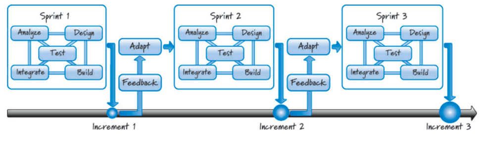
*From the slides: each sprint does analysis, design, build, integration and test, then adapts using feedback, producing an increment.*

**All phases are done together.** In Scrum we don't work on one phase at a time but on **one feature at a time**: by the end of a sprint we have a valuable **product increment**,
integrated and tested with the previous features (otherwise it is not done). Feedback guides how many iterations make economic sense.

> [!WARNING]
> **Scrum misuse: "WaterScrum" or "Scrummerfall".** Laying Scrum over a waterfall breakdown, with sprint 1 for analysis, sprint 2 for design, sprint 3 for coding and sprint 4 for testing,
> is wrong: it keeps all the problems of the waterfall and just renames the phases.

**Leverage variability through inspection, adaptation and transparency.** Scrum assumes that building the product is complex and cannot be fully defined up front, so it generates
early and frequent feedback to make sure **the right product is built, and built right**. Everyone involved can observe what is being built and how, which increases communication and trust.

**Reduce all forms of uncertainty simultaneously** (Laufer, 1996):

- **end uncertainty** (*what*): the features of the final product;
- **means uncertainty** (*how*): the process and technologies to build it;
- **customer uncertainty** (*who*): who the actual customers will be.

Traditional processes first eliminate all end uncertainty by designing everything, and only then address the means. Scrum reduces **all of them together**,
probing the environment to learn about the "unknown unknowns".

### Prediction and adaptation

- **Keep options open.** In plan-driven development, decisions are made, reviewed and approved within each phase, before moving to the next.
  In Scrum, decisions are made at the **last responsible moment (LRM)**: when *not* deciding costs more than deciding.
  "Never make a premature decision just because a generic process would dictate that now is the appointed time to make one."
- **Accept that you can't get it right up front.** Requirements change, important knowledge is missing, and trying to write everything up front produces a large quantity of
  low-quality requirements. Scrum produces **just enough** requirements and plans up front, fills in details later, and learns where it was wrong as soon as it delivers.
- **Favor an adaptive, exploratory approach.** Exploration used to be expensive, so software favored getting it right up front. Today it is cheap:
  when facing uncertainty, **buy information by exploring**, and use the feedback to decide whether to explore further.
- **Embrace change in an economically sensible way.** In sequential development a change is much more expensive late than early, so teams try to predict better.
  This often backfires: they produce a large inventory of documents based on assumptions that will be corrected or discarded, a **self-fulfilling prophecy**.
  Scrum assumes change is the norm and keeps the **cost-of-change curve flat** as long as possible: a small change in requirements should cause a proportionally small change
  in implementation and cost. It produces detailed requirements, designs and tests **just in time**, so fewer artifacts are thrown away when things change.
- **Balance predictive up-front work with adaptive just-in-time work.** Neither extreme works: enough prediction avoids sliding into chaos, enough adaptation avoids waste.
  The right balance depends on the product and its constraints.

### Validated learning

**Validated learning** is knowledge that confirms or refutes an assumption.

- **Validate important assumptions fast.** An assumption is a guess taken as true without validated learning, and it is a significant risk. Plan-driven development tolerates long-lived
  assumptions and may discover a bad one when it is too late. Scrum doesn't let important assumptions stay unvalidated for long, so a bad one is discovered quickly.
- **Leverage multiple concurrent learning loops.** In plan-driven development, learning happens late (after building, integrating and testing), when there may be no time or money left to use it.
  Scrum uses several feedback loops: daily scrum, sprint review, and also pair programming and test-driven development.
- **Organize workflow for fast feedback.** Feedback today is worth more than the same feedback tomorrow: it corrects a problem before it compounds, and stops bad paths sooner.
  In plan-driven development, activities can end with no feedback at all, and integration becomes a test-and-fix phase.

### Work in progress (WIP)

**WIP** is the work started but not yet finished. It must be recognized and managed.

- **Use economically sensible batch sizes.** Plan-driven development works "all before any": a batch size of 100%, applying the manufacturing principle of economies of scale.
  Scrum works in **smaller batches**, which has many benefits; but a batch size of exactly one may be suboptimal too.
- **Recognize inventory and manage it for good flow.** No competent manufacturer sits on a large inventory: what happens if you buy a truckload of parts and then change the design?
  Traditional development piles up inventory (documents, designs, untested code). Scrum keeps just enough of it.
- **Focus on idle work, not idle workers.** *Idle work* is work we want to do but can't, because something blocks it (for example, waiting for another team).
  *Idle workers* are people not 100% busy. Many organizations try to keep everyone busy, and get a lot of idle work; but idle work usually costs much more than an idle worker.
  "Watch the baton, not the runners."
- **Consider cost of delay.** The cost of delay is the financial cost of delaying work or a milestone. It lets us compare which waste is worse. For example: should a documenter join
  the team on the first day or at the end?

> [!TIP]
> **Not in the slides: the "thrashing" analogy the slides mention.** When a computer runs too many programs for its memory, it spends most of its time swapping between them and
> gets almost nothing done. Teams do the same: if everyone is 100% busy on many parallel tasks, work waits in queues, switching costs grow, and the flow of finished features slows down.
> A relay race is won by the baton arriving fast, not by keeping every runner busy.

### Progress

- **Adapt to real-time information and replan.** In plan-driven development the plan is authoritative, and the goal is to follow it. Scrum does some up-front prediction but
  believes the plan may be wrong, and **replans quickly** as information arrives. As the slides say elsewhere: when lost in the woods and the map disagrees with the terrain, believe the terrain.
- **Measure progress by validating working assets.** Plan-driven progress is "we finished a phase". But can we claim success if we finish on time and on budget and the customer is unhappy?
  Scrum measures progress by **working, validated assets that deliver value**: what matters is not how much work we start, but how much customer-valuable work we finish.
- **Focus on value-centric delivery.** Plan-driven development delivers at the end, and may run out of resources before delivering everything. Scrum delivers a **continuous flow**
  of high-value features, validates assumptions and acquires knowledge; artifacts that provide no customer value are only a means to an end.

### Performance

- **Go fast but never hurry.** Going fast means fast delivery, fast feedback, value sooner. But extreme speed violates the **sustainable pace** (a pace people can keep for a long time),
  and hurrying costs quality.
- **Build in quality.** Plan-driven development believes careful sequential work gives quality, and checks it at the end in a costly test-and-fix phase. In Scrum quality is kept and
  verified **every sprint**: each increment could be shipped.
- **Employ minimally sufficient ceremony.** Plan-driven processes tend to be heavy and document-centric: process for the sake of process ("I write this document because now is the
  prescribed time"). Scrum keeps the ceremony low. **Scrum is not anti-documentation**: it decides which documents to create on economic grounds (for example, a user's guide that is part of the product).

**Wrap-up.** Scrum is ideal for new products in a complex, evolving context: it embraces change, uses timeboxed adaptive iterations and many feedback loops.
Plan-driven development is good in predictable environments, for well-understood problems with repeatable solutions.

---

## 3. The Scrum framework

Scrum is not a standardized process with sequential steps: it is a **framework** whose practices are embodied in **roles, activities, artifacts** and their rules.

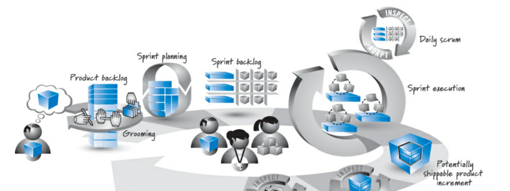
*From the slides: from the product backlog (with grooming) through sprint planning, sprint backlog, sprint execution and daily scrum, to the potentially shippable increment, sprint review and retrospective.*

### Roles

A Scrum team has **three mandatory roles** (others may exist); a project can have one or more Scrum teams.

| Role | Responsibility |
|---|---|
| **Product owner** | "the central point of product leadership": decides **what** will be developed and **in what order**, sets the goals, is responsible for the product's success |
| **ScrumMaster** | "a leader, not a manager": guides the team in creating and following its own Scrum; coach and facilitator; **protects the team from outside interference**; leads in **removing impediments** |
| **Development team** | decides **how** to deliver what the product owner asks; **self-organizes**; usually **five to nine people**, who collectively have all the needed skills |

### Activities and artifacts

**Product backlog.** A prioritized (ordered) list of the work to be done, constantly evolving. The **product owner** creates and manages it, with input from the team and stakeholders.
Always do the most valuable work first. **Grooming** means creating, refining, estimating and prioritizing backlog items. Items must be sized before being ordered, because
**size equals cost**, and cost affects priority. Scrum doesn't impose a unit: typically **relative** sizes, in **story points** or **ideal days** (see [section 7](#7-estimation-and-velocity)).

**Sprints.** Timeboxed iterations of **up to a calendar month**, all of the **same duration**, which create something of tangible value. No goal-altering changes in scope or people
during a sprint, with few exceptions (see [section 4](#4-sprints)).

**Sprint planning.** The backlog contains weeks or months of work; sprint planning chooses the most important subset for the next sprint. The product owner, development team and
ScrumMaster agree on a **sprint goal** (what the sprint should achieve) and select the high-priority items the team can realistically finish at a sustainable pace.
The team breaks each item into **tasks**, estimated in **hours**; tasks and items together form the **sprint backlog**. Time needed: four to eight hours for sprints of two weeks
to a month; a one-week sprint should take a couple of hours at most.

**Forecast or commitment?** The result of sprint planning can be seen as a *forecast* (the team's best estimate at that time) or as a *commitment* (which builds mutual trust between
product owner and team, and supports short-term planning). Either way, the aim is confidence that the team has made a reasonable commitment.

**Sprint execution.** The team, coached by the ScrumMaster, does all the task-level work to get the features **done**: nobody tells the team in what order or how to work;
it self-organizes to reach the sprint goal.

**Daily scrum.** Every day, ideally at the same time, a **timeboxed meeting of 15 minutes or less**, also called **daily stand-up** (standing keeps it short). Each member answers:

1. What did I accomplish since the last daily scrum?
2. What do I plan to work on until the next one?
3. What obstacles or impediments are preventing me from making progress?

Scrum distinguishes those who are only **involved** (the "chickens") from those **committed** to the sprint goal (the "pigs"): only pigs speak, and the development team is made of pigs.

> [!TIP]
> **Not in the slides: where chickens and pigs come from.** A chicken and a pig plan to open a restaurant called "Ham and Eggs". The chicken would be *involved* (it gives eggs),
> the pig would be *committed* (it gives itself). Note that the daily scrum is a planning meeting for the team, not a status report to a manager.

**Done.** A sprint should produce a **potentially shippable product increment**: there is no materially important undone work, and the result could be shipped if the business wanted.
The team defines a **definition of done**; for software, a minimum one gives a complete slice of functionality that is designed, built, integrated, tested and documented.

**Sprint review.** Inspect and adapt the **product**. The Scrum team, stakeholders, sponsors, customers and interested members of other teams discuss the just-completed features in
the context of the whole effort. A successful review has **information flowing in both directions**.

**Sprint retrospective.** Inspect and adapt the **process**. Development team, ScrumMaster and product owner discuss what is and isn't working with Scrum and the technical practices,
and commit to a practical number of improvements: **continuous process improvement**, "a good Scrum team becomes great".

---

## 4. Sprints

A **sprint** is the skeleton of the Scrum framework: an iteration of up to a calendar month that is **timeboxed**, **short**, of **consistent duration**, has a **goal that must not change**
once started, and must reach the end state defined by the **definition of done**.

### Timeboxed

A fixed start and end date. **Timeboxing** is a time-management technique that organizes work and manages scope. Why it helps:

- the team plans only items it believes it can **start and finish** within the sprint;
- it **forces prioritization** of the small amount of work that matters most, getting value done quickly;
- it demonstrates relevant progress, and helps stakeholders and team learn;
- it **ends potentially unbounded work** with a fixed end date: things get done when there is a known deadline;
- it is reasonable to predict what can be done in a short sprint.

### Short duration

- A few weeks of work are easier to plan than six months.
- Each sprint creates working software that can be inspected: how wrong can we be in a two-week sprint?
- Revenue arrives sooner, improving the return on investment.
- Interest and excitement fade the longer we wait for results.
- Each sprint ends with a review, so there are more chances to inspect and adapt.

### Consistent duration

"A team should pick a consistent duration for its sprints and not change it unless there is a compelling reason." Most teams choose **two weeks** (ten working days).

- **Compelling reasons:** moving from four-week to two-week sprints to get more feedback; the annual holidays make a three-week sprint more practical; the release is in one week,
  so a two-week sprint would be wasteful.
- **Not a compelling reason:** the team cannot get all the work done in the current sprint length.

A fixed length gives **cadence**, a predictable rhythm or heartbeat: less coordination overhead, meetings easier to schedule, multiple teams synchronized.
It also **simplifies planning**: the team learns how much it can do in a typical sprint (its **velocity**, for example 20 points per sprint), and computing the number of sprints to a release
becomes simple. With variable lengths, velocities are no longer comparable.

### No goal-altering changes

"Once the sprint goal has been established and sprint execution has begun, no change is permitted that can materially affect the sprint goal."
The **sprint goal** describes the business purpose and value of the sprint (for example "support initial report generation", "demonstrate the ability to send a text message").
It is a **mutual commitment**: the team commits to meeting the goal, the product owner commits to not altering it, so the team can stay focused on a well-defined target.

**Change vs clarification.** The goal cannot be materially *changed*, but it can be *clarified*.

- *Change* (not allowed): "When I said we need to search the police database for a juvenile offender, I didn't just mean by name. I also meant by a picture of the suspect's tattoos!"
- *Clarification* (allowed): "When you said the matches should be displayed in a list, did you have a preference for how the list is ordered?"

**Why no changes**, even though Scrum embraces change: a change after sprint planning wastes the planning investment, costs extra replanning, turns started work into waste,
lowers motivation and reduces trust. But it is **a rule, not a law**: if business conditions change so that altering the goal is really warranted (for example, a critical production
system has failed), the team must be pragmatic.

**Abnormal termination.** If the sprint goal becomes completely invalid and continuing makes no sense, the team advises the product owner, who **decides** to terminate the sprint.
It is a **last resort**, with many drawbacks: first try adjustments. After a termination, the length of the next sprint can be the original length, just long enough to reach the end date of
the terminated sprint, or longer to cover the remaining time plus a full sprint. The goal is to keep the team **synchronized to its original cadence**.

### Definition of done

**Potentially shippable** means confidence that what was built is really done. This requires a well-defined, agreed-upon **definition of done**, which depends on the nature of the product,
the technologies, the organization, and the current impediments.

- A robust definition of done gives high confidence that the work is of high quality and could be shipped; anything less leads to **technical debt**.
- If a significant defect remains on the last day, the item is **not done**: it goes back into the product backlog.
- The definition can **evolve**: start with a weaker one and strengthen it as organizational impediments are removed.

**Acceptance criteria.** Each backlog item also has its own **conditions of satisfaction**, set by the product owner and checked by **acceptance tests**.
An item is done only when **both** are met: its acceptance criteria (e.g. "works with all of the credit cards") and the sprint-level definition of done (e.g. "live on the production server").
The goal is **done-done**: not "I did as much work as I was prepared to do", but "done to the point where the customer would think you are done".

---

## 5. Requirements and user stories

### Requirements in Scrum

In sequential development, requirements are **non-negotiable, detailed up front** and meant to stand alone. In Scrum, we never invest much time and money in detailing a requirement up front:
details are **negotiated through continuous conversations**, just in time and just enough to start building.

We create **placeholders** for requirements: the **product backlog items (PBIs)**. Each represents desirable business value. They start **large** and are refined into smaller, crisper items.

- **Conversations** are the vehicle for a shared understanding of what to build. They don't replace all documents.
- **Progressive refinement:** not all requirements need the same level of detail at the same time. What we will work on soon is small and detailed; what is far away is large and "foggy".
  Large items are **split just in time**.

### User stories

Scrum has no standard format for PBIs, but they are often written as **user stories**: understandable by both business and technical people, structurally simple, a good placeholder for
a conversation, writable at different granularities. Ron Jeffries describes them with the **three Cs**:

- **Card:** a few sentences capturing the essence, not all the details. The common template names the **user role**, the **goal** and the **benefit**:
  *"As a <user role>, I want <goal> so that <benefit>."*
  Example: *"As a typical user I want to see unbiased reviews of a restaurant near an address so that I can decide where to go for dinner."*
- **Conversation:** the card is a **promise to have a conversation**.
- **Confirmation:** the **conditions of satisfaction** (acceptance criteria, as in acceptance-test-driven development, ATDD), written from the product owner's perspective,
  to check that the story is implemented correctly. Example for *"As a wiki user I want to upload a file to the wiki so that I can share it with my colleagues"*:
  verify with .txt and .doc files; with .jpg, .gif and .png files; with .mp4 files up to 1 GB; verify that DRM-restricted files are not accepted.

### Levels of detail

If all stories were small, we would have to define every requirement in detail long before we should, losing the benefit of progressive refinement.

| Label | Size |
|---|---|
| **Epic** | a few to many months; may span an entire release or several |
| **Feature** | on the order of weeks; too big for a single sprint |
| **Sprintable story** | on the order of days; fits into a sprint |
| **Task** | what to build, in hours |
| **Theme** | a collection of related stories |

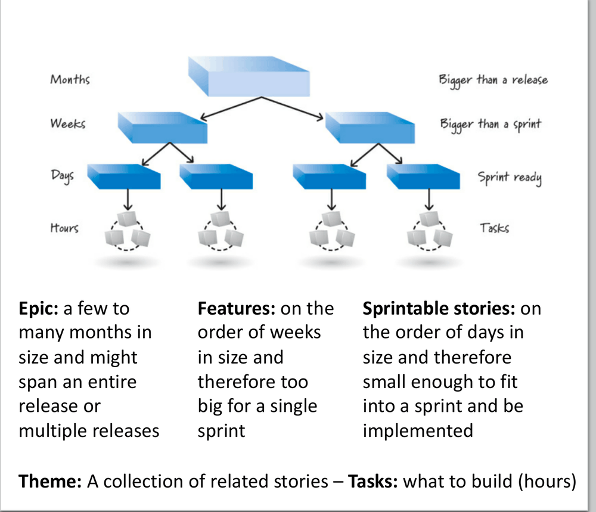
*From the slides.*

These are **labels of convenience**, not formal types.

### INVEST: good stories

| Letter | Meaning |
|---|---|
| **I**ndependent | loosely coupled with each other, which minimizes dependencies and simplifies estimation |
| **N**egotiable | placeholders for conversations, whose details can be negotiated |
| **V**aluable | valuable for the customer (technical stories can be too) |
| **E**stimatable | the team can give them a size, so they can be planned |
| **S**mall | sized appropriately: a few days, to fit in a sprint |
| **T**estable | they either pass or fail their tests |

### Non-functional requirements and knowledge acquisition

**Non-functional requirements** are system-level constraints (performance, security, usability…) that affect the design and testing of most stories, and whose violation may mean failure.
Waiting to test them defers feedback on critical properties. They can be written as cards (maybe not the best choice) but must be included in the **definition of done**.

**Knowledge-acquisition stories** are items whose goal is learning: prototypes, proofs of concept, experiments, studies, **spikes**. No good product owner authorizes unbounded exploration:
they must be justified in terms of value ("what if we go on without exploring?").

> [!TIP]
> **Not in the slides: examples.** A non-functional requirement: "every page loads in under 2 seconds on a 4G connection", added to the definition of done so that every story is checked against it.
> A spike: "spend at most 2 days building a prototype with two candidate payment libraries, to decide which one to adopt". The timebox is what keeps exploration bounded.

### How stories come into existence

Asking users "what do you want?" often fails: they may not know, or: "Yep, you gave me exactly what I asked for, and now that I see it, I want something different."
Better to involve users in the team and review what is being built continuously. Two techniques:

- **User-story-writing workshop:** a few hours to a few days, with product owner, ScrumMaster, team, and internal and external stakeholders, to brainstorm business value and create story placeholders.
  Never try to write a complete set up front: focus on a candidate set for the upcoming release. Identify **user roles** and **personas**, then write cards.
  Example: the persona "Lilly", a young female player: *"As Lilly, I want to select from among many different dresses so that I can customize my avatar to my liking."*
- **Story mapping:** a user-centric, **two-dimensional** view of the backlog. Stories are arranged along the flow of user activities, with themes that happen earlier on the left;
  it complements the workshops and visualizes the prioritization.

---

## 6. The product backlog

The **product backlog** is a prioritized list of desired product functionality: a shared understanding of **what** to build and **in what order**.
As long as a product is being built, enhanced or supported, there is a product backlog. It is at the heart of Scrum and accessible to everyone.

**Product backlog items (PBIs)** are items with tangible value for the user or customer, often user stories, but also defects, technical improvements, knowledge-acquisition work,
and any other valuable work. Examples from the slides:

| PBI type | Example |
|---|---|
| Feature | As a customer service representative I want to create a ticket for a customer support issue so that I can record and manage a customer's request for support |
| Change | As a customer service representative I want the default ordering of search results to be by last name instead of ticket number so that it's easier to find a ticket |
| Defect | Fix defect #256 so that special characters in search terms won't make customer searches crash |
| Technical improvement | Move to the latest version of the Oracle DBMS |
| Knowledge acquisition | Create a prototype or proof of concept of two architectures and run three tests to determine which would be a better approach |

### DEEP backlogs

A good backlog is **DEEP**:

- **Detailed appropriately:** high-priority items near the top are small and detailed, low-priority items at the bottom are large and vague;
- **Emergent:** it keeps changing as we learn;
- **Estimated:** items have a size (story points or ideal days); very large items at the bottom may only have a T-shirt size;
- **Prioritized:** at least the items near the top are ordered.

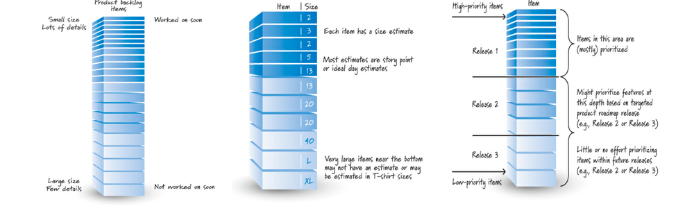
*From the slides: small detailed items on top, large ones below; the top is estimated in points, the bottom only roughly; items are prioritized into releases.*

### Grooming

**Grooming** keeps the backlog DEEP, with three activities: **creating and refining** items (adding details, splitting), **estimating** them, and **prioritizing** them.

- **Who:** a collaborative effort **led by the product owner** (the decision maker), with stakeholders, ScrumMaster and development team.
  The development team should spend **up to 10% of its time each sprint** on grooming: refining large items, estimating, and helping to prioritize based on technical dependencies and constraints.
- **When:** the product owner meets stakeholders as often as useful; initial grooming happens during release planning; then a weekly or once-per-sprint workshop, a little every day,
  or during the sprint review. Whenever it happens, it must be integrated into the development.

**Definition of ready.** A checklist of what must be true before an item at the top of the backlog can enter a sprint. Example checklist from the slides:
business value clearly articulated; details understood enough by the team to decide whether it can complete the item; dependencies identified and none blocking; team staffed appropriately;
item estimated and small enough to fit in one sprint; acceptance criteria clear and testable; performance criteria (if any) defined and testable; team knows how to demonstrate it at the sprint review.

### Flow management

- **Release flow:** grooming supports release planning by dividing the backlog into **must have** (without these, no viable release), **nice to have** (targeted for this release if possible)
  and **won't have** (not in this release).
- **Sprint flow:** the backlog is a **pipeline** of requirements flowing into sprints, from large and vague to refined and ready. Keep an inventory of about **two to three sprints' worth** of ready stories
  (e.g. 10 to 15 items).

### How many backlogs?

Rule of thumb: **one product, one product backlog** (a product being "whatever has its own unique product ID"). A team can work on several products, so several backlogs.
Large projects may have many teams and use a **hierarchical backlog**, multiple teams on one backlog, or multiple backlogs for one team.

---

## 7. Estimation and velocity

Two important questions: **how many features will be completed?** and **how much will it cost?** They can be answered with an **estimate of the size of the PBIs** and the **rate at which the team works**.

**Velocity** is how much work the team gets done each sprint: the **sum of the sizes of the items completed** in the sprint. Partially done items **do not count**.
After a few sprints you get an average velocity and, better, a **range** [min, max].

*Example from the slides:* if release 1 is 200 points and the team completes on average 20 points per sprint, it will take about **10 sprints**.

### What and when we estimate

| Level | Item | Unit | When |
|---|---|---|---|
| Portfolio backlog | products, projects | T-shirt sizes | portfolio planning |
| Product backlog | PBIs | story points or ideal days | product backlog grooming (estimation meetings, the first during initial release planning) |
| Sprint backlog | tasks | ideal hours (effort hours) | sprint planning |

Some practitioners prefer not to estimate PBIs and just make them small and of similar size; but a major value of estimating is the **learning that happens during the conversation**.

### PBI estimation concepts

- **Estimate as a team.** The people who will do the work estimate it, collectively. The product owner describes items and answers questions but must not guide or **anchor** the team;
  the ScrumMaster coaches and facilitates.
- **Estimates are not commitments.** "Imagine sizing this story with your hands… Oh, I forgot: your entire bonus next year depends on your estimate being correct. Would you like to re-estimate?"
  Estimates must be realistic measures of size, free from external pressure.
- **Accuracy, not precision.** Estimates should be roughly right, not precisely wrong: "10,275 man-hours" or "$132,865.87" is wasteful false precision.
- **Relative, not absolute sizes.** People are bad at absolute estimates ("how much beer is in this glass?") and good at relative ones ("which glass is bigger?").

**Units.** There is no standard unit; about 70% of organizations use **story points**, 30% **ideal days**.

- **Story points** measure the **bigness** of an item, influenced by complexity and physical size, from the team's perspective.
- **Ideal days** are the person-days needed to complete an item, but **ideal time is not elapsed time** ("please don't map my ideal days onto a calendar").
  If people might misread ideal days as calendar days, use story points.

> [!TIP]
> **Not in the slides: why ideal days are not calendar days.** An ideal day assumes focused work with no meetings, emails or interruptions. If a developer estimates 3 ideal days,
> but only gets about 5 focused hours a day, the work takes about 5 calendar days. Story points avoid the confusion by not being tied to time at all.

### Planning poker

A **consensus-based** technique for sizing PBIs (described by James Grenning, popularized by Mike Cohn). Its benefit: a consensus estimate better than any individual's.

**Scale:** a modified Fibonacci sequence **1, 2, 3, 5, 8, 13, 20, 40, 100**, or powers of 2 (1, 2, 4, 8, 16, 32…). Estimating is like sorting packages into bins: find the best fit.

| Card | Meaning |
|---|---|
| 0 | already done, or too small to deserve a number |
| 1/2 | tiny items |
| 1, 2, 3 | small items |
| 5, 8, 13 | medium items; for many teams 13 is the largest they would put in a sprint |
| 20, 40 | large items (feature- or theme-level stories) |
| 100 | a very large feature or an epic |
| ∞ | so large that a number makes no sense |
| ? | "I don't understand the item": ask the product owner for clarification (not estimating is acceptable, not participating is not) |
| π (or a coffee cup) | "I'm tired and hungry and want some pie!": the team needs a break |

> [!TIP]
> **Not in the slides: why the gaps grow.** The bigger an item, the less precise any estimate of it can be. Between 20 and 40 there is nothing, because telling a 25 from a 30 would be false precision.

**Roles.** The whole Scrum team takes part. The product owner presents and clarifies items. The ScrumMaster watches for people who seem to disagree (body language, silence) and helps them engage.
Each developer has a set of cards. **Never compromise: reach consensus.**

**How to play:**

1. The product owner reads the item to be estimated.
2. The team discusses it and asks clarifying questions.
3. Each estimator privately chooses a card.
4. All cards are revealed **at the same time** (so nobody anchors the others).
5. If everyone chose the same card, that is the estimate.
6. Otherwise, discuss: typically the **highest and lowest** estimators explain their reasons, exposing assumptions and misunderstandings.
7. Go back to step 3 until consensus is reached.

> [!NOTE]
> **Not in the slides: a round.** Five developers estimate "export the report as PDF". Cards: 3, 3, 5, 5, 13. The one who played 13 explains that the PDF library in use doesn't support tables,
> so it must be replaced. The one who played 3 didn't know. Second round: 8, 8, 8, 8, 13. After a short discussion the last one agrees: 8. The estimate improved because hidden knowledge came out,
> not because the numbers were averaged.

### Velocity

**Velocity measures output, not outcome**: the size of what was delivered, not its value. Completing an 8-point item doesn't necessarily deliver more value than a 3-point one.
Use velocity to compute the number of sprints to a release, to decide what fits in a sprint, and as a **diagnostic** of how the team works.

- **Use a range:** "the team typically completes between 25 and 30 points each sprint", accurate without being overly precise. Run at least two sprints to have one.
- **What affects it:** velocity doesn't grow forever; improving your Scrum raises it until it reaches a plateau. New tools or training can help. **Overtime** may raise it temporarily,
  but you will pay later: the short-term gain is outweighed by the long-term consequences.
- **Velocity is not a performance measure.** It is a planning tool and a team diagnostic. Used to judge productivity, it causes wasteful and dangerous behavior such as **point inflation**
  (estimating everything bigger so that velocity "grows").

> [!NOTE]
> **Not in the slides: computing velocity.** A sprint had items of 5, 3, 8 and 5 points; the last 5-point item is 90% done. Velocity = 5 + 3 + 8 = **16**, not 20 and not 20.5:
> partially done items count zero, and go back to the backlog. With velocities 16, 22, 19 over three sprints, the range is roughly 16 to 22, average 19.

---

## 8. Technical debt

> "Shipping first time code is like going into debt. A little debt speeds development so long as it is paid back promptly with a rewrite… The danger occurs when the debt is not repaid.
> Every minute spent on not-quite-right code counts as interest on that debt." (Ward Cunningham)

Cunningham used the metaphor to explain why **creating software fast to get feedback** was a good thing. Today **technical debt** refers both to the **shortcuts we take on purpose** and to
**the many bad things that plague software**:

- **unfit design:** a design that once made sense but no longer does;
- **defects:** known problems we haven't fixed yet;
- **insufficient test coverage:** areas we know we should test more;
- **excessive manual testing:** testing by hand what should be automated;
- **poor integration and release management:** slow and error-prone;
- **lack of platform experience:** e.g. an application in COBOL with few COBOL programmers left;
- and more: the term is a placeholder for a multidimensional problem.

### Three kinds of debt

| Kind | Origin | Example |
|---|---|---|
| **Naive** | immaturity of team members, organization or process: sloppy design, poor engineering practices, no tests | can be fixed by improving skills and process |
| **Unavoidable** | usually unpredictable and unpreventable | our understanding of a good design emerges while building, so early decisions need to change; a third-party component's interface evolves and our product accrues debt through no fault of ours |
| **Strategic** | a deliberate choice, when the benefits exceed the cost | taking shortcuts to reach the market in time; for a company about to run out of money, releasing early to self-fund further development may be the only way to survive |

### Consequences

- **Unpredictable tipping point:** debt grows in a **nonlinear** way; at some point the product reaches a critical mass and becomes unmanageable, and even small changes become major uncertainties.
  We don't know which straw will break the camel's back.
- **Increased time to delivery:** debt is a loan against future work time; the more debt today, the **lower the velocity tomorrow**.
- **Many defects:** complex, debt-ridden products make it hard to do things right; failures disrupt the flow of work, and managing defects eats the time for new features.
- **Rising development and support costs:** what used to be simple and cheap becomes complicated and expensive; even small changes cost a lot.
- **Product atrophy:** without new features or fixes, the product loses customers.
- **Decreased predictability:** with high debt, estimates become almost impossible, so commitments can't be trusted.
- **Underperformance and universal frustration:** people lower their expectations, work becomes painful, joy disappears, the best developers leave.
- **Decreased customer satisfaction.**

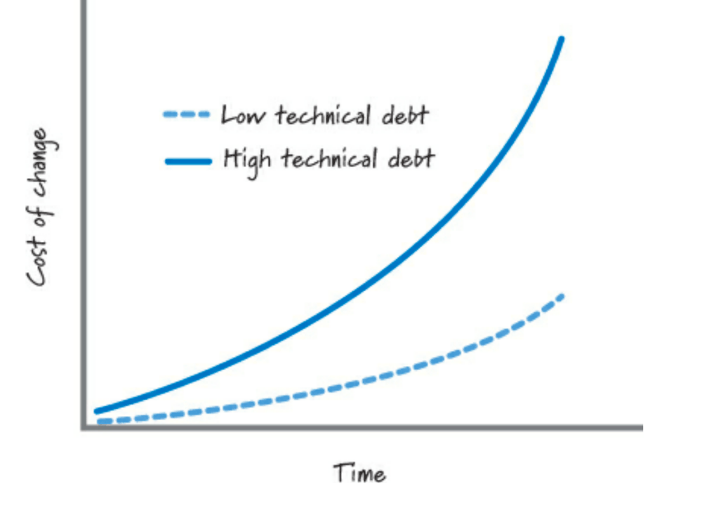
*From the slides.*

### Causes

- **Pressure to meet a deadline**, which causes both strategic and naive debt.
- **Attempting to accelerate velocity** to hit a release date.
- **The myth that less testing accelerates velocity**: testing is seen as overhead, but cutting it increases debt and **slows us down**.
- **Debt builds on debt:** with high debt, you can do nothing (it gets worse), invest ever more in reducing it (consuming development resources), or **declare technical bankruptcy** and replace
  the product with a new one.

### Managing technical debt

Three activities: **managing the accrual** of debt, **making it visible**, and **servicing (repaying)** it.

**Managing the accrual.**

- **Use good technical practices:** there is no formal list, but the most common are **test-driven development, continuous integration, automated testing and refactoring**.
  Cunningham describes "just-in-time refactoring": a customer wants a feature that doesn't fit in the code, so you first reorganize the code to make a place for it, then the feature is easy to add.
- **Use a strong definition of done:** the more it includes, the less debt is acquired.
- **Understand the economics of debt:** decide whether taking on more debt makes economic sense.

> [!NOTE]
> **The economics example from the slides, read step by step.** A product costs $100K per month to develop; each month of delay in releasing it costs $150K in lost profit.
>
> | | Avoid debt | Take on debt |
> |---|---|---|
> | Development months | 13 | 10 |
> | Development cost | $1.3M | $1M |
> | Delay (months, to release) | 3 | 0 |
> | Delay cost | 3 × $150K = $450K | 0 |
> | Months to service the debt later | 0 | 4 |
> | Debt-servicing cost | 0 | 4 × $100K = $400K |
> | Total cost in lifecycle profits | $1.75M | $1.4M + X + Y + Z |
>
> Taking on debt looks cheaper ($1.4M against $1.75M), but it has hidden terms: **X**, the delay cost of the extra time to repay the debt; **Y**, the lifetime interest paid on the debt
> (slower work until it is repaid); **Z**, other debt-related costs. *Not in the slides:* the shortcut pays off only if X + Y + Z is below $350K, and these are exactly the costs that are hardest to estimate.

**Making debt visible.** The metaphor helps communicate with business people: ask a business person about the company's financial debt and they will know it precisely.
Technical people sense technical debt but often keep it as tacit knowledge. To make it visible: track it in the **defect-tracking system**, add it as items in the **product backlog**,
or keep a separate **technical debt backlog**.

**Servicing debt.** Three categories:

- **happened-upon** debt: unknown to the team until found during normal work;
- **known** debt: known and made visible;
- **targeted** debt: selected for servicing.

The process: (1) decide whether the known debt should be serviced; (2) if you are in the code and happen upon debt, **clean it up**, up to a reasonable threshold, and classify the rest as known debt;
(3) every sprint, consider **targeting** some known debt, favoring **high-interest** debt aligned with customer-valuable work.

**Approaches:**

- **Not all technical debt must be repaid:** a product near the end of its life (retire it if low value, re-engineer it if high value); a **throwaway prototype**, built only to learn;
  a product built for a **short life**, where low quality is tolerable if revenue is immediate.
- **Apply the boy scout rule:** "Always leave the campground cleaner than you found it". Improve the code each time you touch it, up to a reasonable threshold:
  inflate item sizes to include the repayment, or budget a percentage of each sprint (5 to 30%).
- **Repay incrementally**, avoiding large late payments.
- **Repay the high-interest debt first**: not all debt matters equally.
- **Repay while doing customer-valuable work:** it aligns debt reduction with work the product owner can prioritize, makes debt a shared responsibility, keeps everyone practicing,
  shows where the high-interest areas are, and avoids repaying debt where it doesn't matter.

> [!TIP]
> **Not in the slides: "interest" in code.** A function copied in five places is debt: every bug fix must be made five times, and one copy is always forgotten. The extra time spent at each change
> is the interest. If that code changes every week, the interest is high and it should be repaid (by extracting one shared function) soon; if nobody touches it, the interest is near zero and it can wait.

---

## 9. Planning

### Scrum planning principles

- Prepare some artifacts early, **balancing up-front prediction with just-in-time adaptation**.
- The **downhill skier** metaphor: a skier doesn't plan every turn at the top; they plan roughly and adjust continuously.
- "When lost in the woods, if the map does not agree with the terrain, **believe in the terrain**."
- Avoid excessive **planning inventory**: effort wasted producing plans, updating them, and not investing in productive work.
- **Pivoting:** a structured course correction designed to test a new fundamental hypothesis about the product.
- **Keep planning options open until the last responsible moment.**
- **Favor smaller, more frequent releases.**

**Why smaller releases.** The slides compare one release after 12 months, semiannual releases and quarterly releases of the same product:

| | Single release (12 months) | Semiannual | Quarterly |
|---|---|---|---|
| Total cost | $1.3M | $1.4M | $1.6M |
| Total two-year return | $3.6M | $4.8M | $5.25M |
| Net two-year return | $2.3M | $3.4M | $3.65M |
| Cash investment | $1.3M | $0.7M | $0.45M |
| Internal rate of return | 9.1% | 15.7% | 19.5% |

More releases cost more (each release has a cost of $100K), but revenue starts earlier, so the return is higher and less cash is needed up front.
**Limit:** "we can't just keep making the initial release smaller, because eventually it becomes so small as to not be marketable".

> [!TIP]
> **Not in the slides: reading the table.** The quarterly plan needs only $0.45M of cash because revenue from the first release starts paying for the later work.
> The internal rate of return is the yearly interest rate that would give the same gain: 19.5% against 9.1% means the money invested works more than twice as well.

### Multilevel planning

Formally Scrum defines **sprint planning** and **daily planning** (the daily scrum), but most organizations also benefit from portfolio, product and release planning.

| Level | Horizon | Who | Focus | Deliverables |
|---|---|---|---|---|
| **Portfolio** | a year or more | stakeholders and product owners | managing a portfolio of products | portfolio backlog |
| **Product** (envisioning) | many months or longer | product owner, stakeholders | vision and evolution of the product | product vision, roadmap, high-level features |
| **Release** | three to nine months | Scrum team, stakeholders | balancing customer value and quality against scope, schedule and budget | release plan |
| **Sprint** | every sprint (one week to a month) | entire Scrum team | what features to deliver in the next sprint | sprint goal and sprint backlog |
| **Daily** | every day | ScrumMaster, development team | how to complete the committed features | inspection of progress and adaptation of the day's work |

Whatever the product, you should have a **product vision**, a **high-level product backlog**, optionally a **product roadmap**, and any other artifact that gives enough confidence to build it.

### Portfolio planning

Decides **which** portfolio items (products, product releases, or projects) to work on, **in which order** and **for how long**. It is not only for new products:
it runs periodically to review products already in progress. The slides list its strategies: **marginal economics** (keep investing only while it makes economic sense:
preserve, deliver, pivot or terminate a product), an **economic filter** for new ideas, **balancing the arrival and departure rates** of products, and **planning for smaller, more frequent releases**.

### Product planning (envisioning)

Envisioning starts from an idea, which first passes the organization's **strategic filter** (is it worth deeper investigation and investment?). Then:

- **Vision:** a clear description of where stakeholders get value. Example from the slides: "For people worldwide who are interested in Scrum, the new Scrum Alliance website will be
  their trusted source of Scrum knowledge…".
- **High-level product backlog:** epic-level stories, e.g. "As a Certified Scrum Trainer I want to post my public Scrum class on the website so that the community knows where and when I'm offering it."
- **Product roadmap:** communicates the incremental nature of how the product will be built and delivered over time, and what drives each release. Releases can be **fixed-scope** or **fixed-date**.

### Release planning

Product planning envisions **what** the product should be; release planning determines **the next logical step** toward the product goal, making **scope, date and budget trade-offs** for
incremental deliveries. It happens after envisioning and before the first sprint of the release. The initial plan is neither complete nor precise; it is improved with validated learning
and revised at each sprint review and each sprint.

To plan: create and estimate enough backlog items, and **draw a line** through the backlog to separate what fits in the release; the line moves as understanding grows.
**Mapping items to sprints:** guessing the content of the first couple of sprints is useful; guessing further ahead is almost always unnecessary.

**Fixed date vs fixed scope.**

- **Fixed date:** the date doesn't move, so the scope must adapt. Constraining the amount of work **forces the difficult prioritization decisions** to be made.
- **Fixed scope:** the scope doesn't move, so the date adapts. Appropriate when the scope truly matters more than the date.

**Planning a fixed-date release:**

1. Determine how many sprints fit before the date (easy if all sprints have the same length).
2. Groom the backlog deeply enough (create, estimate, prioritize) to see which items can be done by that date.
3. Measure or estimate the team's velocity **as a range** (a slower and a faster average).
4. Multiply the **slower** velocity by the number of sprints, count down that many points in the backlog, and draw a line: the **will-have** line.
5. Multiply the **faster** velocity by the number of sprints, count down, and draw a second line: the **might-have** line.

Items above the first line will be delivered, those between the lines might be, those below won't. Then compare with the **must-have** items: if they are all above the will-have line,
good news; if they fall between the lines, maybe OK; if some are below the might-have line, bad news.

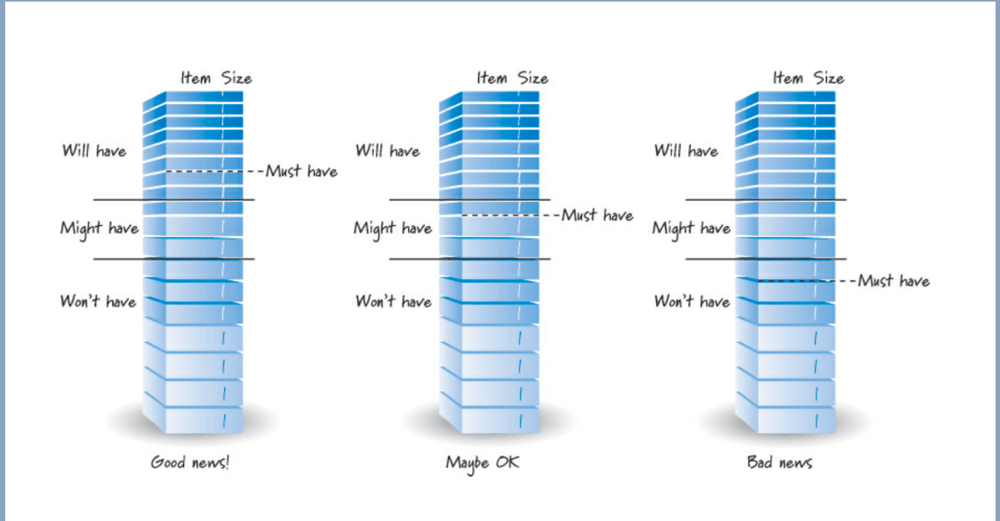
*From the slides.*

**Planning a fixed-scope release:**

1. Groom the backlog to include at least the items wanted in the release.
2. Sum the sizes of those items.
3. Measure or estimate the velocity as a range.
4. Divide the total size by the **faster** velocity, rounding up: the **fewest** sprints needed.
5. Divide the total size by the **slower** velocity, rounding up: the **most** sprints needed.

*Example from the slides:* 150 points with velocity between 18 and 22: $150 / 22 \approx 6.8$, so **7 sprints**; $150 / 18 \approx 8.3$, so **9 sprints**. The release needs 7 to 9 sprints.

> [!NOTE]
> **Not in the slides: the same velocities for a fixed date.** With 8 sprints before the date and velocity between 18 and 22: the will-have line is at $8 \times 18 = 144$ points from the top
> of the backlog, the might-have line at $8 \times 22 = 176$. If the must-have items add up to 130 points, they are all safely above the will-have line: good news.

### Communicating progress

- **Fixed-scope burndown chart:** each sprint, the total amount of work **remaining** in the release; the drop in each sprint is that sprint's velocity.
- **Fixed-scope burnup chart:** the total scope is a **target line**, and the chart shows the work completed climbing toward it. Prefer it when the scope changes: you just move the target line up.
- **Fixed-date burnup chart:** traditional burndown and burnup charts assume a known total scope, so they don't work for fixed-date releases. Instead, show the narrowing range of scope that can be
  delivered by the date, and how progress compares with the will-have, might-have and must-have lines (the backlog is drawn upside down, so completed work climbs toward the items).

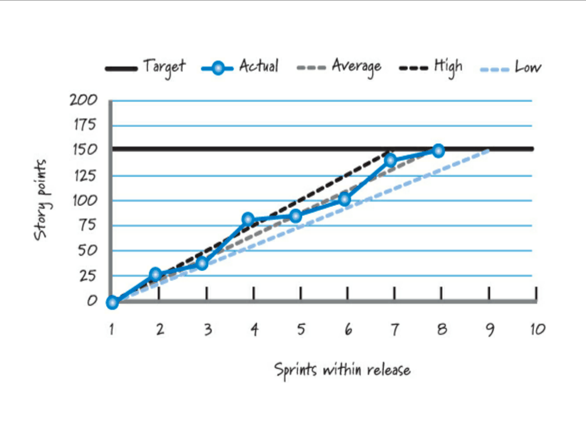
*From the slides: target 150 points; the actual line is compared with the high, average and low velocity projections.*

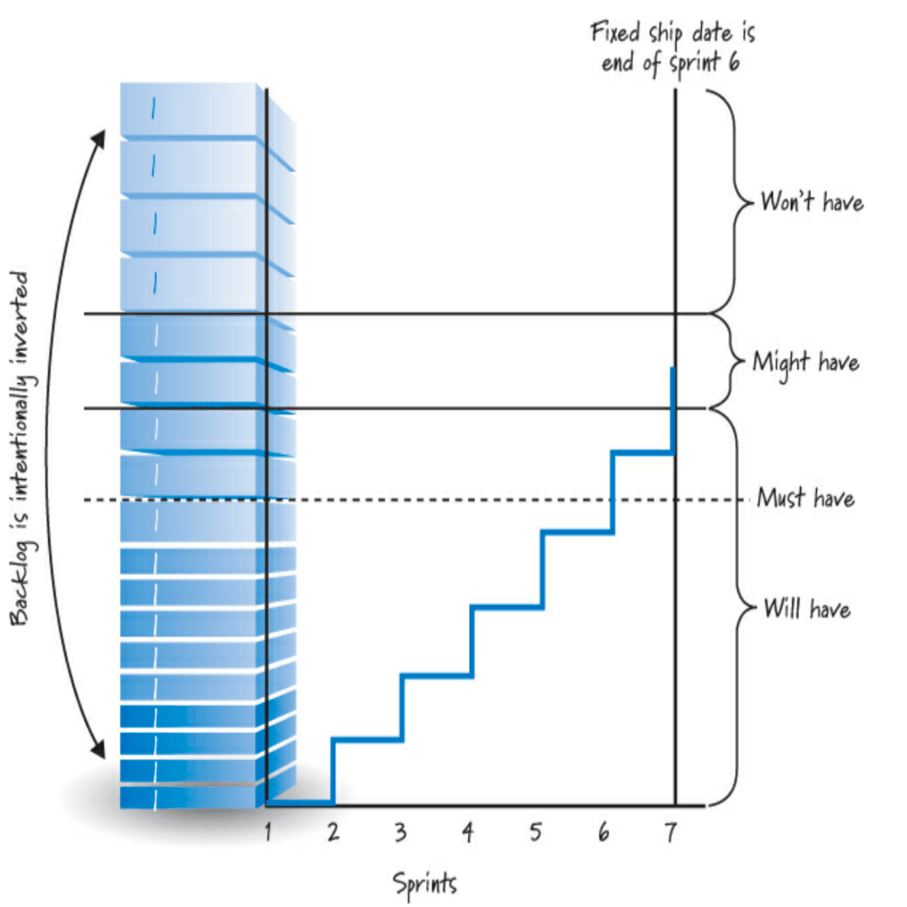
*From the slides: the ship date is the end of sprint 6; completed work climbs through the will-have and must-have lines.*

### Sprint and daily planning

- **Sprint planning** happens at the start of each sprint: the team agrees on the backlog items for the sprint and produces the **sprint backlog**, a description of the task-level work (next section).
- **Daily planning** is the most detailed level, during the daily scrum: team members describe the big-picture plan for the day, identify potential blockages and enable a better flow.
  Example: "Today I am going to work on the stored procedure task and I should have it done by lunch. Whoever works on the business logic task, remember it's on the critical path: be ready to start right after lunch."

---

## 10. Sprint planning

At the beginning of each sprint, the Scrum team **agrees on a sprint goal** (committing to produce value and gaining confidence), and the development team **creates a plan**: it takes the items
aligned with the goal and checks the plan is realistic. The result is the **sprint backlog**, which contains the items and the plan.

**Roles.**

- The **product owner** shares the initial goal, presents the prioritized backlog and answers questions. They come with a clear idea ("I'd really like the top five items done this sprint",
  "at the end of this sprint a typical user should be able to submit a simple keyword query"), but must **not influence the commitment**: the team may not be able to deliver it.
  They collaborate and negotiate alternatives with the team.
- The **development team** determines what it can deliver and makes a realistic commitment.
- The **ScrumMaster** observes, asks probing questions, facilitates, and challenges the commitment to make sure it is realistic, but **cannot decide it**.

**Inputs:**

| Input | Description |
|---|---|
| Product backlog | before sprint planning, the top items have been groomed into a **ready** state |
| Team velocity | historical velocity indicates how much work is practical in a sprint |
| Constraints | business or technical constraints that could affect what the team can deliver |
| Team capabilities | who will be available, what skills they have |
| Initial sprint goal | the business goal the product owner would like to achieve |

### Two approaches

The essence is always the same: **define and commit to a goal**, select items, and break each into estimated tasks, which together form the plan.

- **Two-part planning:** (1) the "what": select items from the backlog to match the team's capacity; (2) the "how": acquire confidence by breaking them into tasks, check it is feasible, refine the plan.
- **One-part planning:** interleave the two, selecting one item and acquiring confidence that it can be delivered before taking the next.

### Determine capacity

Capacity is the time the team can really dedicate to backlog items in this sprint: remove time for other Scrum activities, for work outside the sprint and for personal time off,
and keep a **buffer**, because things may not go as planned. Measure it in story points or in effort-hours.

*Example from the slides (effort-hours):*

| Person | Days available (less personal time) | Days for other Scrum activities | Hours per day | Available effort-hours |
|---|---|---|---|---|
| Jorge | 10 | 2 | 4 to 7 | 32 to 56 |
| Betty | 8 | 2 | 5 to 6 | 30 to 36 |
| Rajesh | 8 | 2 | 4 to 6 | 24 to 36 |
| Simon | 9 | 2 | 2 to 3 | 14 to 21 |
| Heidi | 10 | 2 | 5 to 6 | 40 to 48 |
| **Total** | | | | **140 to 197** |

Each value is (days available − days for Scrum activities) × hours per day: for Jorge, $(10 - 2) \times 4 = 32$ and $(10 - 2) \times 7 = 56$.

### Select items and acquire confidence

- Select items that **align with the sprint goal** or, without a formal goal, take items **from the top** of the backlog, one after another, as long as they can be done; possibly split them (preserving value).
- **Don't start what you can't finish:** limit WIP; unfinished items may mean there is no potentially shippable increment at the end.
- Use the (predicted) velocity to check the commitment, and gain confidence by **breaking items into tasks** needed to meet the definition of done. This is a form of design and just-in-time planning.

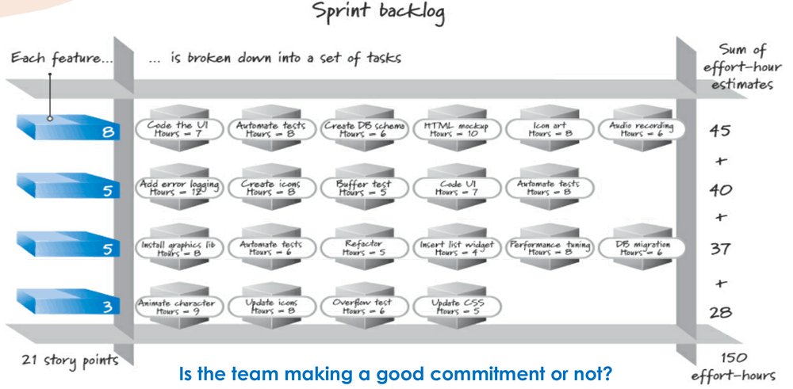
*From the slides: four items (8 + 5 + 5 + 3 = 21 story points) broken into tasks that add up to 45 + 40 + 37 + 28 = 150 effort-hours.*

> [!NOTE]
> **Not in the slides: "is the team making a good commitment?"** The tasks need **150 effort-hours**, and the team's capacity from the table is **140 to 197**.
> 150 is inside the range but near the low end: realistic if things go well, with little buffer if the team only works at its minimum capacity. A second check is velocity: 21 points should be
> consistent with the points the team usually completes.

**Finalize.** The sprint goal summarizes the business purpose of the sprint; the product owner's initial goal can be refined. At the end, the team finalizes its commitment: **the sprint goal and
the selected items embody it**.

---

## 11. Sprint execution

Sprint execution is the work of meeting the sprint goal: in a two-week sprint, about **eight of the ten days**.

- The **development team** self-organizes and decides the best way to meet the goal.
- The **ScrumMaster** coaches, facilitates and removes impediments; does **not** assign work nor tell the team how to do it.
- The **product owner** must be available to answer questions, can review intermediate work and give feedback, discusses adjustments to the goal if needed, and verifies that acceptance criteria are met.

**The process** involves planning, managing, performing and communicating the work, to create **working, tested features**.

- Plan how to achieve the goal: parallel work and **swarming** (several people working together on the same item to finish it). **Avoid mini-waterfalls** inside the sprint.
- **Apply multitasking smartly:** work on a number of items that uses the team's skills without overburdening anyone; reduce the time to complete each item; maximize the total value delivered
  (the number of items **completed**).

> [!TIP]
> **Not in the slides: why fewer items at once.** A team of four has four items. If each person takes one, all four are 75% done by the last day, and if one hits a problem, several
> items can end up unfinished and worth nothing. If the team swarms on items in order, the first three are surely done and only the last is at risk. Same effort, more value delivered.

**Good technical practices** that improve performance: test-driven development, refactoring, simple design, pair programming, continuous integration, collective code ownership,
coding standards, and a shared metaphor.

**Organize the board and communicate.** A **task board** shows the items and their tasks in columns: to do, in progress, completed.

**Keep track of the work to be done** with a **sprint burndown chart**: each day, the estimated effort-hours remaining for the sprint's tasks.

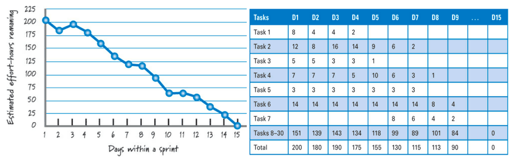
*From the slides: from 200 hours on day 1 down to 0 on day 15, with the table of remaining hours per task.*

**How to read it:** compare the actual line with the line from the starting total to zero on the last day. Below the line, the team is **early**; above it, **late**.
It can go **up**, when new tasks are discovered or estimates grow (in the example, from day 2 to day 3 the total rises from 180 to 190).

**Visualize progress with a burnup chart:** the story points of the **completed** items, day by day, against the target. The slides compare a good flow, where items are completed steadily
from the first days, with a **bad flow**, where nothing is completed for ten days because **too many items were in progress at the same time**, and the target is missed.

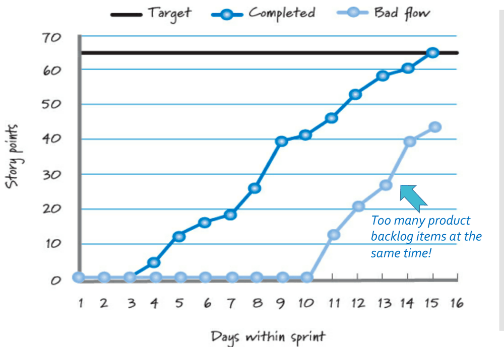
*From the slides.*

---

## 12. Sprint review

**Inspect (and adapt) the result of the work.**

- **What:** inspect and adapt the potentially shippable increment. It gives a transparent look at the current state of the product, **inconvenient truths included**:
  participants ask questions, make observations and suggestions, and discuss how to move forward given current realities.
- **When:** just after sprint execution, just **before** the sprint retrospective.
- **Why:** to make sure we are building a successful product, with frequent course corrections. It is one of the most important learning loops in Scrum.

**Participants:**

| Source | Who and why |
|---|---|
| Scrum team | product owner, ScrumMaster and development team: all hear the same feedback and can answer questions about the sprint and the increment |
| Internal stakeholders | business owners, executives and managers see progress firsthand and suggest course corrections; for internal products, the business experts too |
| Other internal teams | sales, marketing, support, legal, compliance, other development teams: area-specific feedback and synchronization |
| External stakeholders | customers, users and partners give valuable feedback |

**Prework.**

- Cast a broad net: interested people will come. Occasionally attendance must be restricted (you can't invite a client's competitors).
- It is the hardest meeting to schedule, because many participants are outside the team. Timebox: **one hour per week of sprint**, at most four hours.
- The **product owner** usually decides whether each item is done.
- It should be **informal, low ceremony, high value**: prepare 30 minutes to an hour per week of sprint, showing only artifacts produced for the sprint goal.
- The **ScrumMaster** usually facilitates; **team members** (rotating) demonstrate the work.

**Activities.**

1. **Overview:** usually the product owner summarizes the goal, the items and what has and hasn't been done. If the result doesn't match the goal, the team explains why.
2. **Demonstrate:** a demo of the increment. Useful, but not the aim of the review; the definition of ready can include how each item will be demonstrated (for example, with some tests).
3. **Discuss:** participants ask questions, understand the state of the product and help guide its direction. It is **not** the place for deep problem solving.
4. **Adapt:** do stakeholders like what they see? Do they want changes? Is the product still a good idea for the market or internal customers? Are we missing an important feature?
   Are we over-investing in a feature? The answers feed the **product backlog and the release plan**.

The review is **blame-free**: don't look for culprits, decide the best way forward.

**Issues.**

- **Sign-offs:** formal approval should not happen during the review; the product owner approves, and the review collects feedback and synchronizes with stakeholders.
- **Sporadic attendance:** may happen with people new to Scrum who don't believe something useful can be done in a few weeks; it may reveal a problem of priorities.
- **Large development efforts:** multiple teams may hold a single joint review.

**Bottom line:** an informal activity with a diverse set of participants; minimal preparation, a synopsis and a demo, and a **vigorous discussion** after which the backlog is groomed and the release plan updated.

---

## 13. Sprint retrospective

> "Here is Edward Bear, coming downstairs now, bump, bump, bump, on the back of his head, behind Christopher Robin. It is, as far as he knows, the only way of coming downstairs,
> but sometimes he feels that there is another way, if only he could stop bumping for a moment and think of it." (*Winnie the Pooh*)

The retrospective is the team's chance to **stop bumping for a moment and think**: examine how it works, find ways to improve, and plan them. Anything that affects how the product is created
is open to discussion: processes, practices, communication, environment, artifacts, tools. It is one of the most important and **least appreciated** practices in Scrum.

**In a nutshell**, it discusses:

- What worked well this sprint that we want to **continue** doing?
- What didn't work well that we should **stop** doing?
- What should we **start** doing or improve?

**Participants:** the full Scrum team. The ScrumMaster is the **process authority**; the product owner takes part but **must not create fear**; stakeholders and managers outside the team
come **only if invited** by the team.

**Prework.**

- **Focus:** review all relevant aspects of the process, or address a specific issue.
- **Exercises:** choose activities that help people engage, think, explore and decide together.
- **Collect data:** **hard data, not opinions**: which events happened and when, how many items were started but not finished, the burnup chart of the sprint.
- **Structure:** about **1.5 hours for a two-week sprint**, the right location, a facilitator (usually the ScrumMaster).

**Activities.**

1. **Set the atmosphere:** people must feel **safe** to speak without fear. The focus is on the system and process, **not on individuals**.
2. **Share context:** get everyone on the same page, aligning individual perspectives into a shared one. Two exercises:
   - **event timeline:** a timeline on a wall or online whiteboard, where participants add cards with meaningful events in chronological order, which also recovers forgotten events;
   - **emotions seismograph:** a graph of the team's emotional ups and downs during the sprint, to include how people felt, not only what happened.
3. **Identify insights:** group the observations, by **free clustering** or into **predetermined classes** (e.g. "things to keep doing", "things to stop", "things to try").
4. **Determine actions:** decide which insights to act on now and which to defer, typically by **voting**.
5. **Close:** recap each committed action and **who** will work on it; appreciate people's participation; do a retrospective of the retrospective.

**Actions.** No actions, no value from the retrospective. Actions can be:

- **specific tasks:** "It takes too long to find out when the build breaks" → "Have the build server send an email when the build breaks";
- **not tasks:** "Be respectful and show up to the daily scrum on time" → "People should make the effort to show up on time";
- **impediments:** "We can't finish items because we need the latest version of a vendor's software" → "Nina will work with procurement to get the latest vendor update".

**Insight backlog.** Insights that can't be addressed now go into an **insight (or improvement) backlog**, to help focus the next retrospectives. It must be groomed; if an insight is truly important,
it will come up again at the next retrospective anyway.

**Follow-through.** What happens in the retrospective must not stay in the retrospective: add the tasks to the sprint backlog and the impediments to the ScrumMaster's list.

**Common issues:** not doing the retrospective or low attendance; all fluff, no substance; ignoring the "elephant in the room"; a poor facilitator; depressing and energy-draining sessions;
a **blame game**; a complaint session; replacing it with ad hoc improvements; being too ambitious; **no follow-through**.

---

## 14. Supporting material: enterprise applications

*This lecture is in the shared folder but not among the scheduled lectures: it introduces the kind of software the course project is about.*

**Enterprise applications** are software for businesses: they are about the **display, manipulation and storage of large amounts of often complex data**, and the **support or automation
of business processes**. Examples: reservation, financial and supply chain systems; payroll, patient records, shipping tracking, credit scoring, insurance, accounting, customer service.
Also called **information systems** or **data processing**. They are *not* embedded systems, controllers, telephone switches, operating systems, compilers, word processors or games.

They involve persistent data, **a lot** of data, **concurrent access**, many user interface screens, integration with other enterprise applications, complex business ("il")logic,
and performance issues. They are **not necessarily large** systems.

**Performance vocabulary:**

| Term | Meaning |
|---|---|
| Response time | time to process a request from outside |
| Responsiveness | how quickly the system **acknowledges** a request |
| Latency | the minimum time to get any response |
| Throughput | how much work in a given time (e.g. transactions per second) |
| Load | how many users are connected |
| Load sensitivity | how response time varies with load |
| Efficiency | performance divided by resources |
| Capacity | maximum effective throughput or load |
| Scalability | how adding resources affects performance: **scaling up** (a faster processor) vs **scaling out** (more processors) |

**Architecture.** Enterprise applications are described by a **multi-layer architecture** ("layer" and "tier" are near synonyms, but a tier often implies physical separation):

- **presentation:** services and display of information (windows, HTML, HTTP requests, command line, batch API);
- **domain (business) logic:** the work the application does for its domain: calculations, validation of input, dispatching to the data source;
- **data source:** communication with databases, messaging systems, transaction managers, other packages.

The slides add detail with four layers: presentation → business logic → persistence → database.

**Persistence.** Almost every application needs data that survives when it is switched off ("data lives longer than any application does"), almost always in a **relational database**.
The relational model (Codd, 1970) is flexible, robust, theoretically sound, and protects data integrity; it is the common representation of business entities across systems and technologies
(**data independence**). SQL databases are a "weak implementation" of the relational model: close to it but different in theory.

**Persistent vs transient objects:** persistent objects outlive the process that created them and can be recreated later; transient objects live only as long as the process.

**The object-relational paradigm mismatch.** Object-oriented applications use a **network of interconnected objects**; relational databases give **tables**. They are fundamentally different models:

- **granularity:** objects can be fine-grained (an `Address` class inside `User`), while tables are in first normal form;
- **subtypes:** databases generally don't support inheritance;
- **identity:** objects have identity and equality, databases have primary keys, which are not equivalent (hence surrogate keys);
- **associations:** object references are directional, foreign keys are not; many-to-many relationships need link tables;
- **navigation:** `aUser.getBillingDetails().getAccountNumber()` may need several joins; minimizing requests without loading unneeded data is hard (the **N+1 selects problem** is the single most common source of performance problems);
- **API:** JDBC is statement-oriented, so developers bend the domain model to match the schema and lose the advantages of object orientation.

"Underestimating the object-relational mismatch is a major reason for many failed software projects."

> [!TIP]
> **Not in the slides: the N+1 selects problem.** To show 100 users with their billing details, a naive program runs 1 query for the users and then 1 query per user for the details: 101 queries.
> A single query with a join would do. ORM frameworks make this easy to do by accident, because `user.getBillingDetails()` looks like a simple method call but may hide a database query.

**Options to build enterprise applications:** hand-coding a persistence layer; serialization; object-oriented databases; **object/relational mapping (ORM)**. Implementation types range from
**pure relational** (everything around the relational model, heavy use of stored procedures), through **light** and **medium** object mapping, to **full object mapping** (composition, inheritance,
polymorphism, transparent persistence through a specialized ORM framework).

**ORM** is "the automated (and transparent) persistence of objects in an application to the tables in a relational database". It uses **metadata** describing the mapping, transforms data
reversibly between the two representations, and is usually middleware. It provides an API for **CRUD** operations, a query language referring to classes and properties, a way to specify mapping metadata,
and techniques for transactions and optimization. **Why:** productivity, maintainability (less code), performance optimizations and **vendor independence**.

---

## 15. Supporting material: Java annotations, reflection and design patterns

*Also in the shared folder ("Useful notions"): background for the course labs.*

**Annotations** are **meta-information**, "data about the containers of data": tags on packages, classes, methods, fields and variables, to add information about classes,
to build processing tools, and to inspect properties at run time. Comments are not enough, because tools can't rely on them.
Before Java 5 there were tricks: javadoc to mark deprecated methods, **marker interfaces** such as `Serializable`, naming conventions (old JUnit test methods had to start with `test`).

- **Use:** wherever a modifier is allowed: `@AnnotationName(elementName = value, ...)`.
- **Define:** `public @interface AddComment { String comment() default ""; }`. Annotations are interfaces extending `java.lang.annotation.Annotation`; their elements can be primitive types,
  `String`, `Class`, enums, other annotations, or arrays of these (no recursive definitions).
- **Standard annotations:** `@Deprecated`, `@Override` (the compiler checks the method really overrides one), `@SuppressWarnings`; and meta-annotations for writing annotations:
  `@Target` (what can be annotated), `@Retention` (whether the annotation is kept in source only, in the class file, or at run time), `@Documented`, `@Inherited`.

**Reflection** lets a program **analyze itself at run time**: inspect the capabilities of its classes and the properties of objects, and manipulate code dynamically (load classes, create instances,
call methods). Classes, fields, methods and constructors are themselves Java objects (`java.lang.Class`, and `Constructor`, `Field`, `Method`, `Modifier`, `Array` in `java.lang.reflect`).
Key methods: `getClass()`, `Class.forName(name)`, `getName()`, `getFields()`, `getDeclaredMethods()`, `getModifiers()`, `Method.invoke(...)`, `Field.get(...)`, `getSuperclass()`,
`getInterfaces()`, `getAnnotations()`. With `setAccessible(true)` even private members can be accessed and invoked.

> [!TIP]
> **Not in the slides: why annotations and reflection come together.** A test framework like JUnit uses both: it loads your test class by reflection, looks for methods annotated with `@Test`
> (which needs `@Retention(RUNTIME)`), and invokes them. ORM frameworks do the same with annotations such as `@Entity` or `@Column` to learn how to map a class to a table.

**Design patterns.** "Each pattern describes a problem which occurs over and over again in our environment, and then describes the core of the solution to that problem, in such a way that you can use
this solution a million times over, without ever doing it the same way twice" (Christopher Alexander). They are **recorded experience**, rooted in practice, never to be applied blindly,
and they form a **common vocabulary** for developers. Catalogs: Gamma, Helm, Johnson, Vlissides, *Design Patterns* (the "Gang of Four"); Fowler, *Patterns of Enterprise Application Architecture*.
Patterns you will meet again: **Singleton, Prototype, Abstract Factory, Proxy, Command**.

---

## Cheat sheet

- Scrum: an agile **framework** (not a process) for complex products; a prioritized backlog, timeboxed sprints, a self-organizing cross-functional team, a potentially shippable increment each sprint.
- Cynefin: great for complex, fine for complicated, inefficient for simple, unsuited for chaotic and interrupt-driven work (use Kanban).
- Principles: embrace variability, iterate and increment, inspect-adapt-transparency, last responsible moment, validated learning, fast feedback, small batches, idle work over idle workers, cost of delay, measure working assets, sustainable pace, build in quality, minimal ceremony.
- Roles: product owner (what and order), ScrumMaster (process, impediments, not a manager), development team (how, 5 to 9 people).
- Events: sprint planning, daily scrum (15 minutes, 3 questions), sprint execution, sprint review (product), sprint retrospective (process).
- Sprints: timeboxed, short, consistent length (usually 2 weeks), no goal-altering changes (clarifications OK), abnormal termination only by the product owner as a last resort.
- Done = definition of done + acceptance criteria. Otherwise the item goes back to the backlog.
- User stories: "As a <role>, I want <goal> so that <benefit>"; card, conversation, confirmation; INVEST; epic > feature > story > task.
- Backlog: DEEP; grooming (refine, estimate, prioritize, up to 10% of team time); definition of ready; 2 to 3 sprints of ready items.
- Estimation: as a team, not commitments, accurate not precise, relative sizes; story points or ideal days; planning poker 1, 2, 3, 5, 8, 13, 20, 40, 100.
- Velocity: points of completed items per sprint, as a range; output not outcome; never a performance measure.
- Technical debt: naive, unavoidable, strategic; nonlinear consequences; make it visible; boy scout rule; repay high interest first, incrementally, alongside valuable work.
- Planning levels: portfolio, product (vision, roadmap), release, sprint, daily. Fixed date: will-have = slow velocity × sprints, might-have = fast velocity × sprints. Fixed scope: size / fast velocity to size / slow velocity sprints.
- Charts: burndown (work remaining), burnup (work completed toward a target, better when scope changes).
- Sprint planning: goal, capacity (minus Scrum activities, time off, buffer), select items, break into tasks, check against capacity and velocity.
- Retrospective: safe atmosphere, shared context (timeline, seismograph), insights, voted actions with owners, follow-through.
